# 第10章 基础API与常见算法

## 学习目标

* [ ] 了解数学相关API
* [ ] 了解日期时间API
* [ ] 了解系统类API
* [ ] 掌握数组基础算法
* [ ] 掌握数组工具类的使用
* [ ] 熟练掌握String类的API
* [ ] 熟练掌握StringBuilder和StringBuffer类的API
* [ ] 能够处理字符串相关的算法处理

# 第十章 基础API与常见算法

## 10.1 和数学相关的类

### 10.1.1 java.lang.Math

`java.lang.Math` 类包含用于执行基本数学运算的方法，如初等指数、对数、平方根和三角函数。类似这样的工具类，其所有方法均为静态方法，并且不会创建对象，调用起来非常简单。

* `public static double abs(double a) ` ：返回 double 值的绝对值。 

```java
double d1 = Math.abs(-5); //d1的值为5
double d2 = Math.abs(5); //d2的值为5
```

* `public static double ceil(double a)` ：返回大于等于参数的最小的整数。

```java
double d1 = Math.ceil(3.3); //d1的值为 4.0
double d2 = Math.ceil(-3.3); //d2的值为 -3.0
double d3 = Math.ceil(5.1); //d3的值为 6.0
```

* `public static double floor(double a) ` ：返回小于等于参数最大的整数。

```java
double d1 = Math.floor(3.3); //d1的值为3.0
double d2 = Math.floor(-3.3); //d2的值为-4.0
double d3 = Math.floor(5.1); //d3的值为 5.0
```

* `public static long round(double a)` ：返回最接近参数的 long。(相当于四舍五入方法)  

```java
long d1 = Math.round(5.5); //d1的值为6.0
long d2 = Math.round(5.4); //d2的值为5.0
```

* public static double pow(double a,double b)：返回a的b幂次方法
* public static double sqrt(double a)：返回a的平方根
* public static double random()：返回[0,1)的随机值
* public static final double PI：返回圆周率
* public static double max(double x, double y)：返回x,y中的最大值
* public static double min(double x, double y)：返回x,y中的最小值

```java
double result = Math.pow(2,31);
double sqrt = Math.sqrt(256);
double rand = Math.random();
double pi = Math.PI;
```

##### 练习 

请使用`Math` 相关的API，计算在 `-10.8`  到`5.9`  之间，绝对值大于`6`  或者小于`2.1` 的整数有多少个？

```java
public class MathTest {
  public static void main(String[] args) {
    // 定义最小值
    double min = -10.8;
    // 定义最大值
    double max = 5.9;
    // 定义变量计数
    int count = 0;
    // 范围内循环
    for (double i = Math.ceil(min); i <= max; i++) {
      // 获取绝对值并判断
      if (Math.abs(i) > 6 || Math.abs(i) < 2.1) {
        // 计数
        count++;
      }
    }
    System.out.println("个数为: " + count + " 个");
  }
}
```

### 10.1.2 java.math包

#### （1）BigInteger

不可变的任意精度的整数。

* BigInteger(String val) 
* BigInteger add(BigInteger val)  
* BigInteger subtract(BigInteger val)
* BigInteger multiply(BigInteger val) 
* BigInteger divide(BigInteger val) 
* BigInteger remainder(BigInteger val)
* ....

```java
	@Test
	public void test01(){
//		long bigNum = 123456789123456789123456789L;
		
		BigInteger b1 = new BigInteger("123456789123456789123456789");
		BigInteger b2 = new BigInteger("78923456789123456789123456789");
		
//		System.out.println("和：" + (b1+b2));//错误的，无法直接使用+进行求和
		
		System.out.println("和：" + b1.add(b2));
		System.out.println("减：" + b1.subtract(b2));
		System.out.println("乘：" + b1.multiply(b2));
		System.out.println("除：" + b2.divide(b1));
		System.out.println("余：" + b2.remainder(b1));
	}
```

#### （2）RoundingMode枚举类

CEILING ：向正无限大方向舍入的舍入模式。 
DOWN ：向零方向舍入的舍入模式。 
FLOOR：向负无限大方向舍入的舍入模式。 
HALF_DOWN ：向最接近数字方向舍入的舍入模式，如果与两个相邻数字的距离相等，则向下舍入。 
HALF_EVEN：向最接近数字方向舍入的舍入模式，如果与两个相邻数字的距离相等，则向相邻的偶数舍入。 
HALF_UP：向最接近数字方向舍入的舍入模式，如果与两个相邻数字的距离相等，则向上舍入。 
UNNECESSARY：用于断言请求的操作具有精确结果的舍入模式，因此不需要舍入。 
UP：远离零方向舍入的舍入模式。 


#### （3）BigDecimal

不可变的、任意精度的有符号十进制数。

* BigDecimal(String val) 
* BigDecimal add(BigDecimal val) 
* BigDecimal subtract(BigDecimal val)
* BigDecimal multiply(BigDecimal val) 
* BigDecimal divide(BigDecimal val) 
* BigDecimal divide(BigDecimal divisor, int roundingMode) 
* BigDecimal divide(BigDecimal divisor, int scale, RoundingMode roundingMode) 
* BigDecimal remainder(BigDecimal val) 
* ....

```java
	@Test
	public void test02(){
		/*double big = 12.123456789123456789123456789;
		System.out.println("big = " + big);*/
		
		BigDecimal b1 = new BigDecimal("123.45678912345678912345678912345678");
		BigDecimal b2 = new BigDecimal("7.8923456789123456789123456789998898888");
		
//		System.out.println("和：" + (b1+b2));//错误的，无法直接使用+进行求和
		
		System.out.println("和：" + b1.add(b2));
		System.out.println("减：" + b1.subtract(b2));
		System.out.println("乘：" + b1.multiply(b2));
		System.out.println("除：" + b1.divide(b2,20,RoundingMode.UP));//divide(BigDecimal divisor, int scale, int roundingMode)
		System.out.println("除：" + b1.divide(b2,20,RoundingMode.DOWN));//divide(BigDecimal divisor, int scale, int roundingMode)
		System.out.println("余：" + b1.remainder(b2));
	}
```

### 10.1.3 java.util.Random

用于产生随机数

* boolean nextBoolean():返回下一个伪随机数，它是取自此随机数生成器序列的均匀分布的 boolean 值。 

* void nextBytes(byte[] bytes):生成随机字节并将其置于用户提供的 byte 数组中。 

* double nextDouble():返回下一个伪随机数，它是取自此随机数生成器序列的、在 0.0 和 1.0 之间均匀分布的 double 值。 

* float nextFloat():返回下一个伪随机数，它是取自此随机数生成器序列的、在 0.0 和 1.0 之间均匀分布的 float 值。 

* double nextGaussian():返回下一个伪随机数，它是取自此随机数生成器序列的、呈高斯（“正态”）分布的 double 值，其平均值是 0.0，标准差是 1.0。 

* int nextInt():返回下一个伪随机数，它是此随机数生成器的序列中均匀分布的 int 值。 

* int nextInt(int n):返回一个伪随机数，它是取自此随机数生成器序列的、在 0（包括）和指定值（不包括）之间均匀分布的 int 值。 

* long nextLong():返回下一个伪随机数，它是取自此随机数生成器序列的均匀分布的 long 值。 

```java
	@Test
	public void test03(){
		Random r = new Random();
		System.out.println("随机整数：" + r.nextInt());
		System.out.println("随机小数：" + r.nextDouble());
		System.out.println("随机布尔值：" + r.nextBoolean());
	}
```

## 10.2 日期时间API

### 10.2.1 JDK1.8之前

#### 1、java.util.Date

new  Date()：当前系统时间

long  getTime()：返回该日期时间对象距离1970-1-1 0.0.0 0毫秒之间的毫秒值

new Date(long 毫秒)：把该毫秒值换算成日期时间对象

```java
	@Test
	public void test5(){
		long time = Long.MAX_VALUE;
		Date d = new Date(time);
		System.out.println(d);
	}
	
	@Test
	public void test4(){
		long time = 1559807047979L;
		Date d = new Date(time);
		System.out.println(d);
	}
	@Test
	public void test3(){
		Date d = new Date();
		long time = d.getTime();
		System.out.println(time);//1559807047979
	}
	
	@Test
	public void test2(){
		long time = System.currentTimeMillis();
		System.out.println(time);//1559806982971
		//当前系统时间距离1970-1-1 0:0:0 0毫秒的时间差，毫秒为单位
	}
	
	@Test
	public void test1(){
		Date d = new Date();
		System.out.println(d);
	}
```

#### 2、java.util.TimeZone

通常，使用 `getDefault` 获取 `TimeZone`，`getDefault`  基于程序运行所在的时区创建 `TimeZone`。

也可以用 `getTimeZone` 及时区 ID 获取 `TimeZone` 。例如美国太平洋时区的时区 ID 是  "America/Los_Angeles"。

```java
	@Test
	public void test8(){
		String[] all = TimeZone.getAvailableIDs();
		for (int i = 0; i < all.length; i++) {
			System.out.println(all[i]);
		}
	}
	
	@Test
	public void test7(){
		TimeZone t = TimeZone.getTimeZone("America/Los_Angeles");
	}
```

常见时区ID：

```java
Asia/Shanghai
UTC
America/New_York
```


#### 3、java.util.Calendar

`Calendar` 类是一个抽象类，它为特定瞬间与一组诸如  `YEAR`、`MONTH`、`DAY_OF_MONTH`、`HOUR`  等 [`日历字段`](../../java/util/Calendar.html#fields)之间的转换提供了一些方法，并为操作日历字段（例如获得下星期的日期）提供了一些方法。瞬间可用毫秒值来表示，它是距*历元*（即格林威治标准时间 1970 年 1 月 1 日的 00:00:00.000，格里高利历）的偏移量。与其他语言环境敏感类一样，`Calendar` 提供了一个类方法  `getInstance`，以获得此类型的一个通用的对象。

（1）getInstance()：得到Calendar的对象

（2）get(常量)

```java
	@Test
	public void test6(){
		Calendar c = Calendar.getInstance();
		System.out.println(c);
		
		int year = c.get(Calendar.YEAR);
		System.out.println(year);
		
		int month = c.get(Calendar.MONTH)+1;
		System.out.println(month);
		
		//...
	}

	@Test
	public void test7(){
		TimeZone t = TimeZone.getTimeZone("America/Los_Angeles");
		
		//getInstance(TimeZone zone)
		Calendar c = Calendar.getInstance(t);
		System.out.println(c);
	}
```

#### 4、java.text.SimpleDateFormat

SimpleDateFormat用于日期时间的格式化。


```java
	@Test
	public void test10() throws ParseException{
		String str = "2019年06月06日 16时03分14秒 545毫秒  星期四 +0800";
		SimpleDateFormat sf = new SimpleDateFormat("yyyy年MM月dd日 HH时mm分ss秒 SSS毫秒  E Z");
		Date d = sf.parse(str);
		System.out.println(d);
	}
	
	@Test
	public void test9(){
		Date d = new Date();

		SimpleDateFormat sf = new SimpleDateFormat("yyyy年MM月dd日 HH时mm分ss秒 SSS毫秒  E Z");
		//把Date日期转成字符串，按照指定的格式转
		String str = sf.format(d);
		System.out.println(str);
	}
```

### 10.2.2 JDK1.8之后

Java1.0中包含了一个Date类，但是它的大多数方法已经在Java 1.1引入Calendar类之后被弃用了。而Calendar并不比Date好多少。它们面临的问题是：

* 可变性：象日期和时间这样的类对象应该是不可变的。Calendar类中可以使用三种方法更改日历字段：set()、add() 和 roll()。
* 偏移性：Date中的年份是从1900开始的，而月份都是从0开始的。
* 格式化：格式化只对Date有用，Calendar则不行。
* 此外，它们也不是线程安全的，不能处理闰秒等。

可以说，对日期和时间的操作一直是Java程序员最痛苦的地方之一。第三次引入的API是成功的，并且java 8中引入的java.time API 已经纠正了过去的缺陷，将来很长一段时间内它都会为我们服务。

Java 8 吸收了 Joda-Time 的精华，以一个新的开始为 Java 创建优秀的 API。

* java.time – 包含值对象的基础包
* java.time.chrono – 提供对不同的日历系统的访问。
* java.time.format – 格式化和解析时间和日期
* java.time.temporal – 包括底层框架和扩展特性
* java.time.zone – 包含时区支持的类

Java 8 吸收了 Joda-Time 的精华，以一个新的开始为 Java 创建优秀的 API。新的 java.time 中包含了所有关于时钟（Clock），本地日期（LocalDate）、本地时间（LocalTime）、本地日期时间（LocalDateTime）、时区（ZonedDateTime）和持续时间（Duration）的类。

#### 1、本地日期时间：LocalDate、LocalTime、LocalDateTime

| 方法                                                         | **描述**                                                     |
| ------------------------------------------------------------ | ------------------------------------------------------------ |
| now() / now(ZoneId zone)                                     | 静态方法，根据当前时间创建对象/指定时区的对象                |
| of()                                                         | 静态方法，根据指定日期/时间创建对象                          |
| getDayOfMonth()/getDayOfYear()                               | 获得月份天数(1-31) /获得年份天数(1-366)                      |
| getDayOfWeek()                                               | 获得星期几(返回一个 DayOfWeek 枚举值)                        |
| getMonth()                                                   | 获得月份, 返回一个 Month 枚举值                              |
| getMonthValue() / getYear()                                  | 获得月份(1-12) /获得年份                                     |
| getHours()/getMinute()/getSecond()                           | 获得当前对象对应的小时、分钟、秒                             |
| withDayOfMonth()/withDayOfYear()/withMonth()/withYear()      | 将月份天数、年份天数、月份、年份修改为指定的值并返回新的对象 |
| with(TemporalAdjuster  t)                                    | 将当前日期时间设置为校对器指定的日期时间                     |
| plusDays(), plusWeeks(), plusMonths(), plusYears(),plusHours() | 向当前对象添加几天、几周、几个月、几年、几小时               |
| minusMonths() / minusWeeks()/minusDays()/minusYears()/minusHours() | 从当前对象减去几月、几周、几天、几年、几小时                 |
| plus(TemporalAmount t)/minus(TemporalAmount t)               | 添加或减少一个 Duration 或 Period                            |
| isBefore()/isAfter()                                         | 比较两个 LocalDate                                           |
| isLeapYear()                                                 | 判断是否是闰年（在LocalDate类中声明）                        |
| format(DateTimeFormatter  t)                                 | 格式化本地日期、时间，返回一个字符串                         |
| parse(Charsequence text)                                     | 将指定格式的字符串解析为日期、时间                           |

```java
	@Test
	public void test7(){
		LocalDate now = LocalDate.now();
		LocalDate before = now.minusDays(100);
		System.out.println(before);//2019-02-26
	}
	
	@Test
	public void test06(){
		LocalDate lai = LocalDate.of(2019, 5, 13);
		LocalDate go = lai.plusDays(160);
		System.out.println(go);//2019-10-20
	}
	
	@Test
	public void test05(){
		LocalDate lai = LocalDate.of(2019, 5, 13);
		System.out.println(lai.getDayOfYear());
	}
	
	
	@Test
	public void test04(){
		LocalDate lai = LocalDate.of(2019, 5, 13);
		System.out.println(lai);
	}
	
	@Test
	public void test03(){
		LocalDateTime now = LocalDateTime.now();
		System.out.println(now);
	}
	
	@Test
	public void test02(){
		LocalTime now = LocalTime.now();
		System.out.println(now);
	}
	
	@Test
	public void test01(){
		LocalDate now = LocalDate.now();
		System.out.println(now);
	}
```

#### 2、指定时区日期时间：ZonedDateTime

常见时区ID：

```java
Asia/Shanghai
UTC
America/New_York
```


```java
import java.time.ZoneId;
import java.time.ZonedDateTime;

public class TestZonedDateTime {
	public static void main(String[] args) {
		ZonedDateTime t = ZonedDateTime.now();
		System.out.println(t);
		
		ZonedDateTime t1 = ZonedDateTime.now(ZoneId.of("America/New_York"));
		System.out.println(t1);
	}
}
```

#### 3、持续日期/时间：Period和Duration

Period:用于计算两个“日期”间隔

```java
public static void main(String[] args) {
		LocalDate t1 = LocalDate.now();
		LocalDate t2 = LocalDate.of(2018, 12, 31);
		Period between = Period.between(t1, t2);
		System.out.println(between);
		
		System.out.println("相差的年数："+between.getYears());//1年
		System.out.println("相差的月数："+between.getMonths());//又7个月
		System.out.println("相差的天数："+between.getDays());//零25天
		System.out.println("相差的总数："+between.toTotalMonths());//总共19个月
	}
```

Duration:用于计算两个“时间”间隔

```java
	public static void main(String[] args) {
		LocalDateTime t1 = LocalDateTime.now();
		LocalDateTime t2 = LocalDateTime.of(2017, 8, 29, 0, 0, 0, 0);
		Duration between = Duration.between(t1, t2);
		System.out.println(between);
		
		System.out.println("相差的总天数："+between.toDays());
		System.out.println("相差的总小时数："+between.toHours());
		System.out.println("相差的总分钟数："+between.toMinutes());
		System.out.println("相差的总秒数："+between.getSeconds());
		System.out.println("相差的总毫秒数："+between.toMillis());
		System.out.println("相差的总纳秒数："+between.toNanos());
		System.out.println("不够一秒的纳秒数："+between.getNano());
	}
```

#### 4、DateTimeFormatter：日期时间格式化

该类提供了三种格式化方法：

预定义的标准格式。如：ISO_DATE_TIME;ISO_DATE

本地化相关的格式。如：ofLocalizedDate(FormatStyle.MEDIUM)

自定义的格式。如：ofPattern(“yyyy-MM-dd hh:mm:ss”)

```java
	@Test
	public void test10(){
		LocalDateTime now = LocalDateTime.now();
		
//		DateTimeFormatter df = DateTimeFormatter.ofLocalizedDateTime(FormatStyle.LONG);//2019年6月6日 下午04时40分03秒
		DateTimeFormatter df = DateTimeFormatter.ofLocalizedDateTime(FormatStyle.SHORT);//19-6-6 下午4:40
		String str = df.format(now);
		System.out.println(str);
	}
	@Test
	public void test9(){
		LocalDateTime now = LocalDateTime.now();
		
		DateTimeFormatter df = DateTimeFormatter.ISO_DATE_TIME;//2019-06-06T16:38:23.756
		String str = df.format(now);
		System.out.println(str);
	}
	
	@Test
	public void test8(){
		LocalDateTime now = LocalDateTime.now();
		
		DateTimeFormatter df = DateTimeFormatter.ofPattern("yyyy年MM月dd日 HH时mm分ss秒  SSS毫秒  E 是这一年的D天");
		String str = df.format(now);
		System.out.println(str);
	}
```


## 10.3 系统相关类

### 10.3.1 java.lang.System类

系统类中很多好用的方法，其中几个如下：

* static long currentTimeMillis() ：返回当前系统时间距离1970-1-1 0:0:0的毫秒值

* static void arraycopy(Object src, int srcPos, Object dest, int destPos, int length)： 

  从指定源数组中复制一个数组，复制从指定的位置开始，到目标数组的指定位置结束。常用于数组的插入和删除

* static void exit(int status) ：退出当前系统

* static void gc() ：运行垃圾回收器。

* static String getProperty(String key)：获取某个系统属性

* ...

```java
public class Test{
    public static void main(String[] args){
    	long time = System.currentTimeMillis();
    	System.out.println("现在的系统时间距离1970年1月1日凌晨：" + time + "毫秒");
    	
    	System.exit(0);

    	System.out.println("over");//不会执行
    }
}
```

```

```

### 10.3.3 java.lang.Runtime类

每个 Java 应用程序都有一个 `Runtime` 类实例，使应用程序能够与其运行的环境相连接。可以通过  `getRuntime` 方法获取当前运行时。  应用程序不能创建自己的 Runtime 类实例。

public static Runtime getRuntime()： 返回与当前 Java 应用程序相关的运行时对象。

public long totalMemory()：返回 Java 虚拟机中的内存总量。此方法返回的值可能随时间的推移而变化，这取决于主机环境。

public long freeMemory()：回 Java 虚拟机中的空闲内存量。调用 gc 方法可能导致 freeMemory 返回值的增加。

```

```

## 10.4 数组的算法升华

### 10.4.1 数组的算法升华

#### 1、数组的反转

方法有两种：

1、借助一个新数组

2、首尾对应位置交换

第一种方式示例代码：

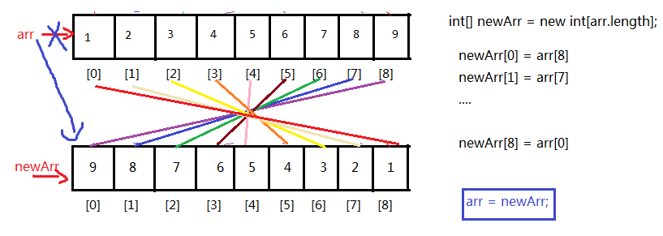

```java
int[] arr = {1,2,3,4,5,6,7,8,9};

//(1)先创建一个新数组
int[] newArr = new int[arr.length];

//(2)复制元素
int len = arr.length;
for(int i=0; i<newArr.length; i++){
    newArr[i] = arr[len -1 - i];
}

//(3)舍弃旧的，让arr指向新数组
arr = newArr;//这里把新数组的首地址赋值给了arr

//(4)遍历显示
for(int i=0; i<arr.length; i++){
    System.out.println(arr[i]);
}

```

> 缺点：需要借助一个数组，浪费额外空间，原数组需要垃圾回收

第二种方式示例代码：

**实现思想：**数组对称位置的元素互换。


```java
int[] arr = {1,2,3,4,5,6,7,8,9};

//(1)计算要交换的次数：  次数 = arr.length/2
//(2)首尾对称位置交换
for(int i=0; i<arr.length/2; i++){//循环的次数就是交换的次数
    int temp = arr[i];
    arr[i] = arr[arr.length-1-i];
	arr[arr.length-1-i] = temp;
}

//（3）遍历显示
for(int i=0; i<arr.length; i++){
    System.out.println(arr[i]);
}
```

或


```java
	public static void main(String[] args){
		int[] arr = {1,2,3,4,5,6,7,8,9};

		//左右对称位置交换
		for(int left=0,right=arr.length-1; left<right; left++,right--){
		    //首  与  尾交换
		    int temp = arr[left];
		    arr[left] = arr[right];
			arr[right] = temp;
		}

		//（3）遍历显示
		for(int i=0; i<arr.length; i++){
		    System.out.println(arr[i]);
		}
	}
```


#### 2、数组的扩容

示例：当原来的数组长度不够了需要扩容，例如需要新增位置来存储10

```java
int[] arr = {1,2,3,4,5,6,7,8,9};

//如果要把arr数组扩容，增加1个位置
//(1)先创建一个新数组，它的长度 = 旧数组的长度+1，或者也可以扩大为原来数组长度的1.5倍，2倍等
int[] newArr = new int[arr.length + 1];

//(2)复制元素
//注意：i<arr.length   因位arr比newArr短，避免下标越界
for(int i=0; i<arr.length; i++){
    newArr[i] = arr[i];
}

//(3)把新元素添加到newArr的最后
newArr[newArr.length-1] = 10;

//(4)如果下面继续使用arr，可以让arr指向新数组
arr = newArr;

//(4)遍历显示
for(int i=0; i<arr.length; i++){
    System.out.println(arr[i]);
}
```

> （1）至于新数组的长度定义多少合适，看实际情况，如果新增的元素个数确定，那么可以增加指定长度，如果新增元素个数不确定，那么可以扩容为原来的1.5倍、2倍等
>
> （2）数组扩容太多会造成浪费，太少会导致频繁扩容，效率低下

#### 3、数组元素的插入

示例：在原数组的某个[index]插入一个元素

情形一：原数组未满

```java
String[] arr = new String[5];
arr[0]="张三";
arr[1]="李四";
arr[2]="王五";

那么目前数组的长度是5，而数组的实际元素个数是3，如果此时需要在“张三”和“李四”之间插入一个“赵六”，即在[index=1]的位置插入“赵六”，需要怎么做呢？
```

```java
String[] arr = new String[5];
arr[0]="张三";
arr[1]="李四";
arr[2]="王五";

//（1）移动2个元素，需要移动的起始元素下标是[1]，它需要移动到[2]，一共一共2个
System.arraycopy(arr,1,arr,2,2);
//（2）插入新元素
arr[1]="赵六";

//(3)遍历显示
for(int i=0; i<arr.length; i++){
    System.out.println(arr[i]);
}
```

情形二：原数组已满

```java
String[] arr = new String[3];
arr[0]="张三";
arr[1]="李四";
arr[2]="王五";

那么目前数组的长度是3，而数组的实际元素个数是3，如果此时需要在“张三”和“李四”之间插入一个“赵六”，即在[index=1]的位置插入“赵六”，需要怎么做呢？
```

```java
String[] arr = new String[3];
arr[0]="张三";
arr[1]="李四";
arr[2]="王五";

//（1）先扩容
String[] newArr = new String[4];
for(int i=0; i<arr.length; i++){
	newArr[i] = arr[i];
}
arr=newArr;

//（2）移动2个元素，需要移动的起始元素下标是[1]，它需要移动到[2]，一共一共2个
System.arraycopy(arr,1,arr,2,2);
//（3）插入新元素
arr[1]="赵六";

//(4)遍历显示
for(int i=0; i<arr.length; i++){
    System.out.println(arr[i]);
}
```

#### 4、数组元素的删除

示例：

```java
String[] arr = new String[3];
arr[0]="张三";
arr[1]="李四";
arr[2]="王五";

现在需要删除“李四”，我们又不希望数组中间空着元素，该如何处理呢？
```

```java
String[] arr = new String[3];
arr[0]="张三";
arr[1]="李四";
arr[2]="王五";

//（1）移动元素，需要移动元素的起始下标[2]，该元素需要移动到[1]，一共需要移动1个元素
System.arraycopy(arr,2,arr,1,1);

//（2）因为数组元素整体往左移动，这里本质上是复制，原来最后一个元素需要置空
arr[2]=null;//使得垃圾回收尽快回收对应对象的内存
```


#### 5、数组的二分查找

二分查找：对折对折再对折

要求：要求数组元素必须支持比较大小，并且数组中的元素已经按大小排好序

示例：

```java
class Exam2{
	public static void main(String[] args){
		int[] arr = {2,5,7,8,10,15,18,20,22,25,28};//数组是有序的
		int value = 18;
		
        int index = -1;
		int left = 0;
        int right = arr.length - 1;
        int mid = (left + right)/2;
        while(left<=right){
            //找到结束
            if(value == arr[mid]){
                index = mid;
                break;
            }//没找到
            else if(value > arr[mid]){//往右继续查找
                //移动左边界，使得mid往右移动
                left = mid + 1;
            }else if(value < arr[mid]){//往左边继续查找
                right = mid - 1;
            }
            
            mid = (left + right)/2;
        }
        
        if(index==-1){
    		System.out.println(value + "不存在");
		}else{
    		System.out.println(value + "的下标是" + index);
		}
        
	}
}
```

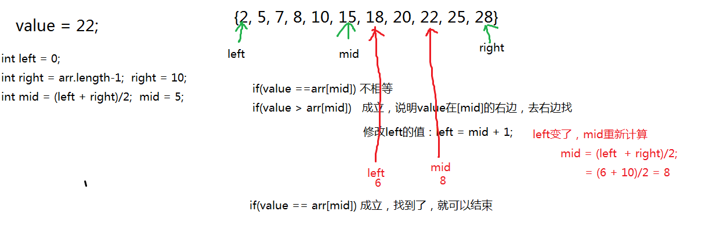

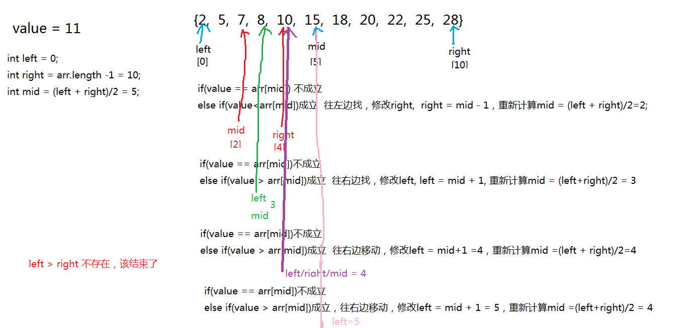

#### 6、数组的直接选择排序

示例代码：简单的直接选择排序

```java
int[] arr = {49,38,65,97,76,13,27,49};

for(int i=1; i<arr.length; i++){//外循环的次数 = 轮数 = 数组的长度-1
    //（1）找出本轮未排序元素中的最值
    /*
    未排序元素：
    第1轮：i=1,未排序，[0,7]，本轮未排序元素第一个元素是[0]
    第2轮：i=2,未排序，[1,7]，本轮未排序元素第一个元素是[1]
    ...
    第7轮：i=7,未排序，[6,7]，本轮未排序元素第一个元素是[6]
    
    每一轮未排序元素的起始下标：0,1,2,3,4,5,6，正好是i-1的
    未排序的后面的元素依次：
    第1轮：[1,7]  j=1,2,3,4,5,6,7
    第2轮：[2,4]  j=2,3,4,5,6,7
    。。。。
    第7轮：[7]    j=7
    j的起点是i，终点都是7
    */
    int max = arr[i-1];
    int index = i-1;
    for(int j=i; j<arr.length; j++){
        if(arr[j] > max){
            max = arr[j];
            index = j;
        }
    }
    
    //（2）如果这个最值没有在它应该在的位置，就与这个位置的元素交换
    /*
    第1轮，最大值应该在[0]
    第2轮，最大值应该在[1]
    ....
    第7轮，最大值应该在[6]
    正好是i-1的值
    */
    if(index != i-1){
        //交换arr[i-1]与arr[index]
        int temp = arr[i-1];
        arr[i-1] = arr[index];
        arr[index] = temp;
    }
}

//显示结果
for(int i=0; i<arr.length; i++){
	System.out.print(arr[i]);
}
```


### 10.4.2 数组工具类

java.util.Arrays数组工具类，提供了很多静态方法来对数组进行操作，而且如下每一个方法都有各种重载形式，以下只列出int[]类型的，其他类型的数组类推：

* static int binarySearch(int[] a, int key) ：要求数组有序，在数组中查找key是否存在，如果存在返回第一次找到的下标，不存在返回负数

* static int[] copyOf(int[] original, int newLength)  ：根据original原数组复制一个长度为newLength的新数组，并返回新数组

* static int[] copyOfRange(int[] original, int from, int to) ：复制original原数组的[from,to)构成新数组，并返回新数组

* static boolean equals(int[] a, int[] a2) ：比较两个数组的长度、元素是否完全相同

* static void fill(int[] a, int val) ：用val填充整个a数组
* static void fill(int[] a, int fromIndex, int toIndex, int val)：将a数组[fromIndex,toIndex)部分填充为val 
* static void sort(int[] a) ：将a数组按照从小到大进行排序
* static void sort(int[] a, int fromIndex, int toIndex) ：将a数组的[fromIndex, toIndex)部分按照升序排列
* static String toString(int[] a) ：把a数组的元素，拼接为一个字符串，形式为：[元素1，元素2，元素3。。。]

示例代码：

```java
import java.util.Arrays;
import java.util.Random;

public class Test{
    public static void main(String[] args){
    	int[] arr = new int[5];
        // 打印数组,输出地址值
  		System.out.println(arr); // [I@2ac1fdc4
  		// 数组内容转为字符串
    	System.out.println("arr数组初始状态："+ Arrays.toString(arr));
    	
    	Arrays.fill(arr, 3);
    	System.out.println("arr数组现在状态："+ Arrays.toString(arr));
    	
    	Random rand = new Random();
    	for (int i = 0; i < arr.length; i++) {
			arr[i] = rand.nextInt(100);//赋值为100以内的随机整数
		}
    	System.out.println("arr数组现在状态："+ Arrays.toString(arr));
    	
    	int[] arr2 = Arrays.copyOf(arr, 10);
    	System.out.println("新数组：" + Arrays.toString(arr2));
    	
    	System.out.println("两个数组的比较结果：" + Arrays.equals(arr, arr2));
    	
    	Arrays.sort(arr);
    	System.out.println("arr数组现在状态："+ Arrays.toString(arr));
    }
}
```

### 10.4.3 数组面试题

#### 1、编程题1

找出数组中一个值，使其左侧值的加和等于右侧值的加和，

​	例如：[1,2,5,3,2,4,2]，结果为：第4个值3

​			    [9, 6, 8, 8, 7, 6, 9, 5, 2, 5]，结果是没有

```java
	public static void main(String[] args) {
		int[] arr = {1,2,5,3,2,4,2};
			
		int index = leftSumEqualsRightSum(arr);
		if(index!=-1) {
			System.out.println(arr[index]);
		}else {
			System.out.println("没有");
		}
	}
	
	public static int leftSumEqualsRightSum(int[] arr) {
		for (int mid = 0; mid < arr.length; mid++) {
			int leftSum = 0;
			int rightSum = 0;
			for (int i = 0; i <mid; i++) {
				leftSum += arr[i];
			}
			for (int i = mid+1; i < arr.length; i++) {
				rightSum += arr[i];
			}
			if(leftSum==rightSum) {
				return mid;
			}
		}
		return -1;
	}
```

#### 2、编程题2

- 左奇右偶

  -  10个整数的数组{26,67,49,38,52,66,7,71,56,87}。
  -  元素重新排列，所有的奇数保存到数组左边，所有的偶数保存到数组右边。

- 代码实现，效果如图所示：

  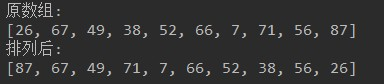

- 开发提示：

  - 左边的偶数与右边的奇数换位置：
  - 定义两个变量left和right，从左边开始查找偶数的位置，找到后用left记录，从右边开始找奇数的位置，找到后用right记录，如果left<right，那么就交换，然后在上一次的基础上继续查找，直到left与right擦肩。

```java
    //效率最高
    public void order2(int[] arr){
        for (int left = 0,right = arr.length-1; left < right; ){
            //left代表左边需要交换的数的下标，偶数的下标
            //如果arr[left]此时是奇数，说明此时left不是我们要找的下标，left++往后移动
            while(arr[left]%2!=0){//当arr[left]是偶数时，结束while循环
                left++;
            }
            //如果arr[right]此时是偶数，说明此时right不是我们要找的下标，right--往前移动
            while(arr[right]%2==0){//当arr[right]是奇数时，结束while循环
                right--;
            }
            if(left < right){
                int temp = arr[left];
                arr[left] = arr[right];
                arr[right]= temp;
            }
        }
    }
```

```java
public void order3(int[] arr){
        int len = arr.length;
        while (len>0) {
            for (int j=0; j<len-1; j++){
                //左边的元素是偶数，就和它相邻的元素交换
                if (arr[j]%2==0) {
                    int temp = arr[j];
                    arr[j] = arr[j+1];
                    arr[j+1] = temp;
                }
            }
            len--;
        }
    }
```

```java
public void order(int[] arr){
        //从左边往右边找偶数，记录下标，evenIndex，这个是错误的数字的下标
        //从右边往左边找奇数，记录下标，oddIndex，这个是错误的数字的下标
        //交换arr[oddIndex]与arr[evenIndex]，调整之后就可以了
        int evenIndex = 0;
        int oddIndex = arr.length-1;
        while(evenIndex < oddIndex){
            for (int i=0; i<arr.length; i++){
                if(arr[i]%2==0){
                    evenIndex = i;
                    break;
                }
            }

            for(int i=arr.length-1; i>=0; i--){
                if(arr[i]%2!=0){
                    oddIndex = i;
                    break;
                }
            }

            if(evenIndex < oddIndex) {
                int temp = arr[evenIndex];
                arr[evenIndex] = arr[oddIndex];
                arr[oddIndex] = temp;
            }
        }
    }
```


#### 3、编程题3

* 数组去重

  * 10个整数{9,10,6,6,1,9,3,5,6,4}，范围1-10，保存到数组中。
  * 去除数组中重复的内容，只保留唯一的元素。

* 按步骤编写代码，效果如图所示：

  

* 开发提示：

  - 定义一个变量count，初始化为数组的长度
  - 遍历每一个元素，如果该元素与前面的某个元素相等，那么通过移动数组，把该元素覆盖掉，并修改count--。
  - 最后创建一个新数组，长度为count，并从原数组把前count个元素复制过来

#### 4、编程题4

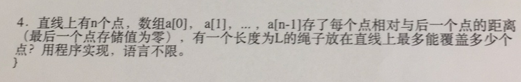

```java
import java.util.Arrays;

public class TestExer4 {
	public static void main(String[] args) {
		
		double[] arr = new double[10];
		for (int i = 0; i < arr.length-1; i++) {
			arr[i] = Math.random() * 100;//[0,100)之间的小数
		}
		arr[arr.length-1] = 0;
		System.out.println("直线上每一个点距离下一个点的距离："+Arrays.toString(arr));
		
		double length = 150.5;
		
		int count = 0;
		double sum = 0;
		for (int i = 0; i < arr.length; i++) {
			sum += arr[i];
			if(sum<=length) {
				count++;
			}else {
				break;
			}
		}
		System.out.println("长度为：" + length + "的绳子最多能覆盖" +count+"个点");
	}
}
```


#### 5、编程题5


冒泡排序：

```java
public static void bubbleSort(int[] arr) {
		for (int i = 1; i < arr.length; i++) {
			for (int j = 0; j < arr.length-i; j++) {
				if(arr[j] > arr[j+1]) {
					int temp = arr[j];
					arr[j] = arr[j+1];
					arr[j+1] = temp;
				}
			}
		}
	}
```

直接选择排序：

```java
public static void selectSort(int[] arr) {
		for (int i = 0; i < arr.length-1; i++) {
			int minIndex = i;
			for (int j = i+1; j < arr.length; j++) {
				if(arr[minIndex] > arr[j]) {
					minIndex = j;
				}
			}
			if(minIndex!=i) {
				int temp = arr[minIndex];
				arr[minIndex] = arr[i];
				arr[i] = temp;
			}
		}
	}
```

### 10.4.4 附加（有能力同学）

#### 1、折半插入排序

例如：数组{12,2,6,1,5}

第一次：在[0,1)之间找插入2的位置==>left = [0] ==> {2,12,6,1,5}

第二次：在[0,2)之间找插入6的位置==>left = [1] ==> {2,6,12,1,5}

第三次：在[0,3)之间找插入1的位置==>left = [0] ==>{1,2,6,12,5}

第四次：在[0,4)之间找插入5的位置==>left = [2] ==>{1,2,5,6,12}

```java
    @Test
    public void test(){
        int[] arr = {12,2,6,1,5};
        sort(arr);
        System.out.println(Arrays.toString(arr));
    }

    public void sort(int[] arr){
        for (int i=1; i<arr.length; i++){
            //找到[0,i)之间插入arr[i]的位置
            //使用二分查找法
            int left = 0;
            int right=i-1;
            while (left<=right){
                int mid = (left + right)/2;
                if(arr[i]<=arr[mid]){
                    right = mid - 1;
                }else{
                    left = mid + 1;
                }
            }
 
            //在[0,i)插入arr[i]
            if(left < i){
                int temp = arr[i];
                System.arraycopy(arr,left,arr,left+1,i-left);
                arr[left] = temp;
            }
        }
    }
```


#### 2、快速排序

例如：数组{5, 2, 6, 12, 1,7,9}

```java
    @Test
    public void test(){
        int[] arr = {5, 2, 6, 12, 1,7,9};
        sort(arr,0, arr.length-1);
        System.out.println(Arrays.toString(arr));
    }

    //将[start+1,end]之间的元素分为两拨，左边的所有元素比arr[start]小，右边的所有元素比arr[start]大
    public void sort(int[] arr,int start, int end){
        if(start < end){
            int left = start+1;
            int right = end;
            while(left<right){
                //从左往右，从[start+1]开始找比arr[start]大的数arr[left]，让它与arr[right]交换
                //当arr[left]大于arr[start]就停止循环，因为此时找到了比arr[start]大的数arr[left]
                while(arr[left]<=arr[start] && left<=end){
                    left++;
                }
                
                //从右往左，从[end]开始找比比arr[start]小的数arr[right]，让它与arr[left]交换
               //当arr[right]小于arr[start]就停止循环，因为此时找到了比arr[start]小的数arr[right]
                while(arr[right]>=arr[start] && right>start){
                    right--;
                }
                
                
                if(left < right){
                    int temp = arr[left];
                    arr[left] = arr[right];
                    arr[right] = temp;
                }
            }
            
            //经过上面的while，//如果right>start+1，那么说明在[start+1,end]之间的数分为两拨
            //[start+1,right]之间的是比arr[start]小的数
            //[right,end]之间的是比arr[start]大的数
            //交换arr[start]与arr[right]
            if(right > start + 1){
                int temp = arr[start];
                arr[start] = arr[right];
                arr[right] = temp;
            }
            //此时[start,right-1]之间都是比arr[start]小的数据了，但是它们还未排序
            //此时[right+1,end]之间都是比arr[start]大的数据了，但是它们还未排序
            //所以需要分别对[start,right-1]、[right+1,end]之间元素重复上面的操作继续排序
            sort(arr,start,right-1);
            sort(arr,right+1,end);
        }

    }
```

第1次调用sort(arr,0,6)
交换arr[left=2]与arr[right=4]：[5, 2, 1, 12, 6, 7, 9]
交换基准位置的元素与分界位置的元素：arr[start=0]与arr[right=2]：[1, 2, 5, 12, 6, 7, 9]
第2次调用sort(arr,0,1)
第3次调用sort(arr,0,0)
第4次调用sort(arr,2,1)
第5次调用sort(arr,3,6)
交换基准位置的元素与分界位置的元素：arr[start=3]与arr[right=6]：[1, 2, 5, 9, 6, 7, 12]
第6次调用sort(arr,3,5)
交换基准位置的元素与分界位置的元素：arr[start=3]与arr[right=5]：[1, 2, 5, 7, 6, 9, 12]
第7次调用sort(arr,3,4)
第8次调用sort(arr,3,3)
第9次调用sort(arr,5,4)
第10次调用sort(arr,6,5)
第11次调用sort(arr,7,6)

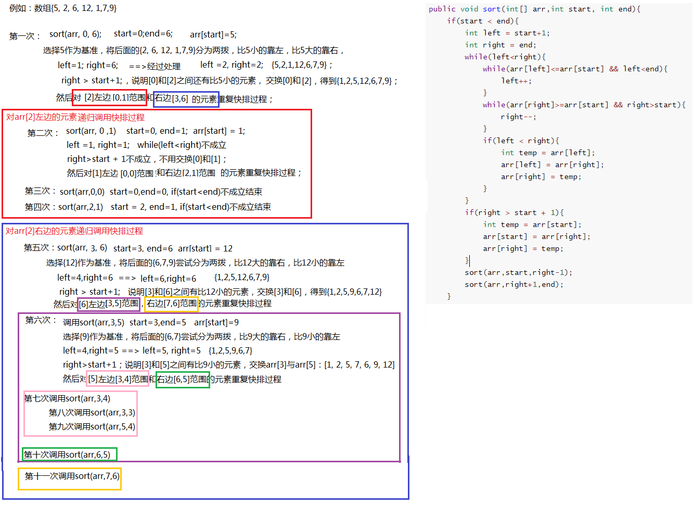


## 10.5 字符串

`java.lang.String` 类代表字符串。Java程序中所有的字符串文字（例如`"abc"` ）都可以被看作是实现此类的实例。字符串是常量；它们的值在创建之后不能更改。字符串缓冲区支持可变的字符串。因为 String 对象是不可变的，所以可以共享。

`String` 类包括的方法可用于检查序列的单个字符、比较字符串、搜索字符串、提取子字符串、创建字符串副本并将所有字符全部转换为大写或小写。 

Java 语言提供对字符串串联符号（"+"）以及将其他对象转换为字符串的特殊支持（toString()方法）。

### 10.5.1 字符串的特点

1、字符串String类型本身是final声明的，意味着我们不能继承String。

2、字符串的对象也是不可变对象，意味着一旦进行修改，就会产生新对象

> 我们修改了字符串后，如果想要获得新的内容，必须重新接受。
>
> 如果程序中涉及到大量的字符串的修改操作，那么此时的时空消耗比较高。可能需要考虑使用StringBuilder或StringBuffer的可变字符序列。

3、String对象内部是用字符数组进行保存的

> JDK1.9之前有一个char[] value数组，JDK1.9之后byte[]数组

`"abc"` 等效于 `char[] data={ 'a' , 'b' , 'c' }`。

```java
例如： 
String str = "abc";

相当于： 
char data[] = {'a', 'b', 'c'};     
String str = new String(data);
// String底层是靠字符数组实现的。
```

4、String类中这个char[] values数组也是final修饰的，意味着这个数组不可变，然后它是private修饰，外部不能直接操作它，String类型提供的所有的方法都是用新对象来表示修改后内容的，所以保证了String对象的不可变。

5、就因为字符串对象设计为不可变，那么所以字符串有常量池来保存很多常量对象

常量池在方法区。

如果细致的划分：

（1）JDK1.6及其之前：方法区

（2）JDK1.7：堆

（3）JDK1.8：元空间

```java
String s1 = "abc";
String s2 = "abc";
System.out.println(s1 == s2);
// 内存中只有一个"abc"对象被创建，同时被s1和s2共享。
```

### 10.5.2 构造字符串对象

#### 1、使用构造方法

* `public String() ` ：初始化新创建的 String对象，以使其表示空字符序列。
* ` String(String original)`： 初始化一个新创建的 `String` 对象，使其表示一个与参数相同的字符序列；换句话说，新创建的字符串是该参数字符串的副本。
* `public String(char[] value) ` ：通过当前参数中的字符数组来构造新的String。
* `public String(char[] value,int offset, int count) ` ：通过字符数组的一部分来构造新的String。
* `public String(byte[] bytes) ` ：通过使用平台的默认字符集解码当前参数中的字节数组来构造新的String。
* `public String(byte[] bytes,String charsetName) ` ：通过使用指定的字符集解码当前参数中的字节数组来构造新的String。

构造举例，代码如下：

```java
//字符串常量对象
String str = "hello";

// 无参构造
String str1 = new String（）；

//创建"hello"字符串常量的副本
String str2 = new String("hello");

//通过字符数组构造
char chars[] = {'a', 'b', 'c','d','e'};     
String str3 = new String(chars);
String str4 = new String(chars,0,3);

// 通过字节数组构造
byte bytes[] = {97, 98, 99 };     
String str5 = new String(bytes);
String str6 = new String(bytes,"GBK");
```

#### 2、使用静态方法

* static String copyValueOf(char[] data)： 返回指定数组中表示该字符序列的 String
* static String copyValueOf(char[] data, int offset, int count)：返回指定数组中表示该字符序列的 String
* static String valueOf(char[] data)  ： 返回指定数组中表示该字符序列的 String
* static String valueOf(char[] data, int offset, int count) ： 返回指定数组中表示该字符序列的 String
* static String valueOf(xx  value)：xx支持各种数据类型，返回各种数据类型的value参数的字符串表示形式。

```java
	public static void main(String[] args) {
		char[] data = {'h','e','l','l','o','j','a','v','a'};
		String s1 = String.copyValueOf(data);
		String s2 = String.copyValueOf(data,0,5);
		int num = 123456;
		String s3 = String.valueOf(num);
		System.out.println(s1);
		System.out.println(s2);
		System.out.println(s3);
	}
```

#### 3、使用""+

任意数据类型与"字符串"进行拼接，结果都是字符串

```java
	public static void main(String[] args) {
		int num = 123456;
		String s = num + "";
		System.out.println(s);
		
		Student stu = new Student();
		String s2 = stu + "";//自动调用对象的toString()，然后与""进行拼接
		System.out.println(s2);
	}
```

### 10.5.3 字符串的对象的个数

1、字符串常量对象

```java
String str1 = "hello";//1个，在常量池中
```

2、字符串的普通对象和常量对象一起

```java
String str3 = new String("hello");
//str3首先指向堆中的一个字符串对象，然后堆中字符串的value数组指向常量池中常量对象的value数组
```

### 10.5.4 字符串对象的内存分析

```java
String s;

String s = null;

String s = "";
String s = new String();
String s = new String("");

String s = "abc";
String s = new String("abc");

char[] arr = {'a','b'};
String s = new String(arr);


char[] arr = {'a','b','c','d','e'};
String s = new String(arr,0,3);
```

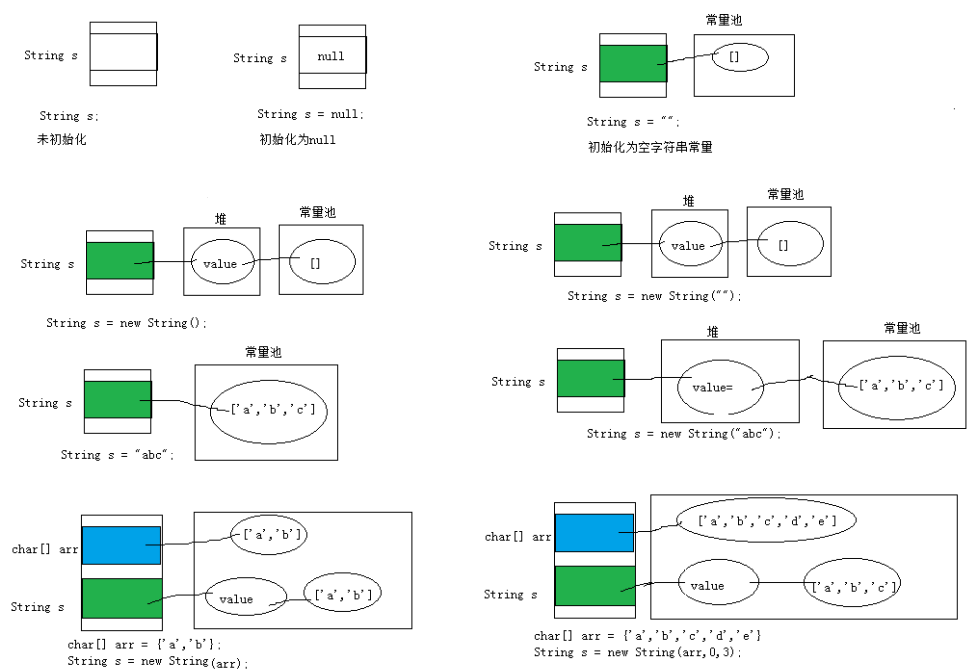


### 10.5.5 字符串拼接问题

#### 1、拼接结果的存储和比较问题

原则：

（1）常量+常量：结果是常量池

（2）常量与变量 或 变量与变量：结果是堆

（3）拼接后调用intern方法：结果在常量池

```java
	@Test
	public void test06(){
		String s1 = "hello";
		String s2 = "world";
		String s3 = "helloworld";
		
		String s4 = (s1 + "world").intern();//把拼接的结果放到常量池中
		String s5 = (s1 + s2).intern();
		
		System.out.println(s3 == s4);//true
		System.out.println(s3 == s5);//true
	}
	
	@Test
	public void test05(){
		final String s1 = "hello";
		final String s2 = "world";
		String s3 = "helloworld";
		
		String s4 = s1 + "world";//s4字符串内容也helloworld，s1是常量，"world"常量，常量+ 常量 结果在常量池中
		String s5 = s1 + s2;//s5字符串内容也helloworld，s1和s2都是常量，常量+ 常量 结果在常量池中
		String s6 = "hello" + "world";//常量+ 常量 结果在常量池中，因为编译期间就可以确定结果
		
		System.out.println(s3 == s4);//true
		System.out.println(s3 == s5);//true
		System.out.println(s3 == s6);//true
	}
	
	@Test
	public void test04(){
		String s1 = "hello";
		String s2 = "world";
		String s3 = "helloworld";
		
		String s4 = s1 + "world";//s4字符串内容也helloworld，s1是变量，"world"常量，变量 + 常量的结果在堆中
		String s5 = s1 + s2;//s5字符串内容也helloworld，s1和s2都是变量，变量 + 变量的结果在堆中
		String s6 = "hello" + "world";//常量+ 常量 结果在常量池中，因为编译期间就可以确定结果
		
		System.out.println(s3 == s4);//false
		System.out.println(s3 == s5);//false
		System.out.println(s3 == s6);//true
	}
```

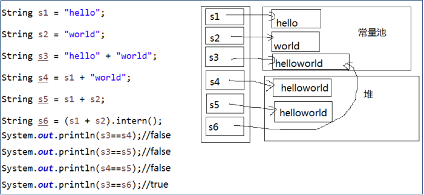

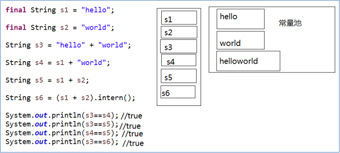

#### 2、拼接效率问题

```java
public class TestString {
	public static void main(String[] args) {
		String str = "0";
		for (int i = 0; i <= 5; i++) {
			str += i;  
		}
		System.out.println(str);
	}
}
```

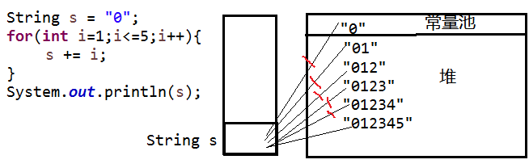

不过现在的JDK版本，都会使用可变字符序列对如上代码进行优化，我们反编译查看字节码：

```cmd
javap -c TestString.class
```

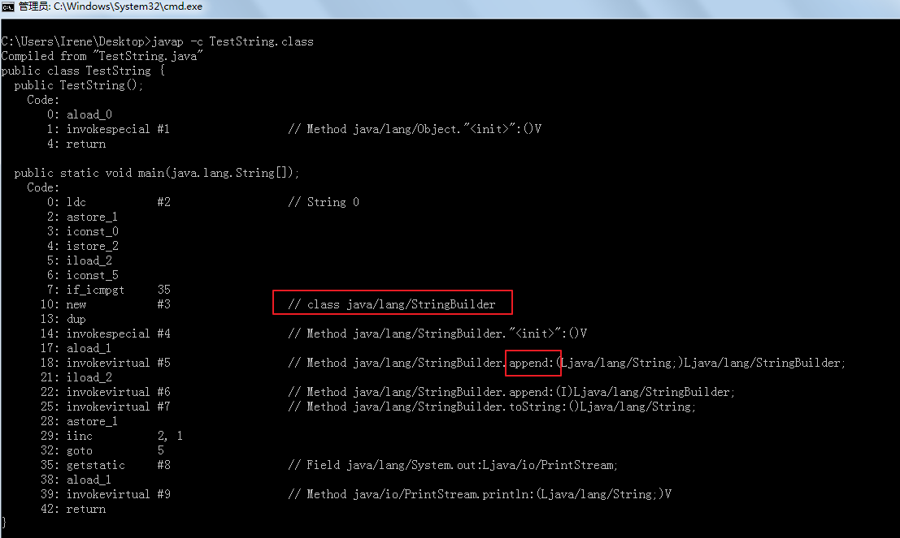

#### 3、两种拼接

```java
public class TestString {
	public static void main(String[] args) {
		String str = "hello";
		String str2 = "world";
		String str3 ="helloworld";
		
		String str4 = "hello".concat("world");
		String str5 = "hello"+"world";
		
		System.out.println(str3 == str4);//false
		System.out.println(str3 == str5);//true
	}
}
```

> concat方法拼接，哪怕是两个常量对象拼接，结果也是在堆。

### 10.5.6  字符串对象的比较

1、==：比较是对象的地址

> 只有两个字符串变量都是指向字符串的常量对象时，才会返回true

```java
String str1 = "hello";
String str2 = "hello";
System.out.println(str1 == str2);//true
    
String str3 = new String("hello");
String str4 = new String("hello");
System.out.println(str1 == str4); //false
System.out.println(str3 == str4); //false
```

2、equals：比较是对象的内容，因为String类型重写equals，区分大小写

只要两个字符串的字符内容相同，就会返回true

```java
String str1 = "hello";
String str2 = "hello";
System.out.println(str1.equals(str2));//true
    
String str3 = new String("hello");
String str4 = new String("hello");
System.out.println(str1.equals(str3));//true
System.out.println(str3.equals(str4));//true
```

3、equalsIgnoreCase：比较的是对象的内容，不区分大小写

```java
String str1 = new String("hello");
String str2 = new String("HELLO");
System.out.println(str1.equalsIgnoreCase(strs)); //true
```

4、compareTo：String类型重写了Comparable接口的抽象方法，自然排序，按照字符的Unicode编码值进行比较大小的，严格区分大小写

```java
String str1 = "hello";
String str2 = "world";
str1.compareTo(str2) //小于0的值
```

5、compareToIgnoreCase：不区分大小写，其他按照字符的Unicode编码值进行比较大小

```java
String str1 = new String("hello");
String str2 = new String("HELLO");
str1.compareToIgnoreCase(str2)  //等于0
```

### 10.5.7 空字符的比较

1、哪些是空字符串

```java
String str1 = "";
String str2 = new String();
String str3 = new String("");
```

空字符串：长度为0

2、如何判断某个字符串是否是空字符串

```java
if("".equals(str))

if(str!=null  && str.isEmpty())

if(str!=null && str.equals(""))

if(str!=null && str.length()==0)
```

### 10.5.8 字符串的常用方法

#### 1、系列1

（1）boolean isEmpty()：字符串是否为空

（2）int length()：返回字符串的长度

（3）String concat(xx)：拼接，等价于+

（4）boolean equals(Object obj)：比较字符串是否相等，区分大小写

（5）boolean equalsIgnoreCase(Object obj)：比较字符串是否相等，区分大小写

（6）int compareTo(String other)：比较字符串大小，区分大小写，按照Unicode编码值比较大小

（7）int compareToIgnoreCase(String other)：比较字符串大小，不区分大小写

（8）String toLowerCase()：将字符串中大写字母转为小写

（9）String toUpperCase()：将字符串中小写字母转为大写

（10）String trim()：去掉字符串前后空白符

```java
	@Test
	public void test01(){
		//将用户输入的单词全部转为小写，如果用户没有输入单词，重新输入
		Scanner input = new Scanner(System.in);
		String word;
		while(true){
			System.out.print("请输入单词：");
			word = input.nextLine();
			if(word.trim().length()!=0){
				word = word.toLowerCase();
				break;
			}
		}
		System.out.println(word);
	}

	@Test
	public void test02(){
        //随机生成验证码，验证码由0-9，A-Z,a-z的字符组成
		char[] array = new char[26*2+10];
		for (int i = 0; i < 10; i++) {
			array[i] = (char)('0' + i);
		}
		for (int i = 10,j=0; i < 10+26; i++,j++) {
			array[i] = (char)('A' + j);
		}
		for (int i = 10+26,j=0; i < array.length; i++,j++) {
			array[i] = (char)('a' + j);
		}
		String code = "";
		Random rand = new Random();
		for (int i = 0; i < 4; i++) {
			code += array[rand.nextInt(array.length)];
		}
		System.out.println("验证码：" + code);
		//将用户输入的单词全部转为小写，如果用户没有输入单词，重新输入
		Scanner input = new Scanner(System.in);
		System.out.print("请输入验证码：");
		String inputCode = input.nextLine();
		
		if(!code.equalsIgnoreCase(inputCode)){
			System.out.println("验证码输入不正确");
		}
	}
```

#### 2、系列2：查找

（11）boolean contains(xx)：是否包含xx

（12）int indexOf(xx)：从前往后找当前字符串中xx，即如果有返回第一次出现的下标，要是没有返回-1

（13）int lastIndexOf(xx)：从后往前找当前字符串中xx，即如果有返回最后一次出现的下标，要是没有返回-1

```java
	@Test
	public void test01(){
		String str = "尚硅谷是一家靠谱的培训机构，尚硅谷可以说是IT培训的小清华，JavaEE是尚硅谷的当家学科，尚硅谷的大数据培训是行业独角兽。尚硅谷的前端和运维专业一样独领风骚。";
		System.out.println("是否包含清华：" + str.contains("清华"));
		System.out.println("培训出现的第一次下标：" + str.indexOf("培训"));
		System.out.println("培训出现的最后一次下标：" + str.lastIndexOf("培训"));
	}
```

#### 3、系列3：字符串截取

（14）String substring(int beginIndex) ：返回一个新的字符串，它是此字符串的从beginIndex开始截取到最后的一个子字符串。 

（15）String substring(int beginIndex, int endIndex) ：返回一个新字符串，它是此字符串从beginIndex开始截取到endIndex(不包含)的一个子字符串。 

```java
	@Test
	public void test01(){
		String str = "helloworldjavaatguigu";
		String sub1 = str.substring(5);
		String sub2 = str.substring(5,10);
		System.out.println(sub1);
		System.out.println(sub2);
	}

	@Test
	public void test02(){
		String fileName = "快速学习Java的秘诀.dat";
		//截取文件名
		System.out.println("文件名：" + fileName.substring(0,fileName.lastIndexOf(".")));
		//截取后缀名
		System.out.println("后缀名：" + fileName.substring(fileName.lastIndexOf(".")));
	}
```

#### 4、系列4：和字符相关

（16）char charAt(index)：返回[index]位置的字符

（17）char[] toCharArray()： 将此字符串转换为一个新的字符数组返回

（18）String(char[] value)：返回指定数组中表示该字符序列的 String。 

（19）String(char[] value, int offset, int count)：返回指定数组中表示该字符序列的 String。

（20）static String copyValueOf(char[] data)： 返回指定数组中表示该字符序列的 String

（21）static String copyValueOf(char[] data, int offset, int count)：返回指定数组中表示该字符序列的 String

（22）static String valueOf(char[] data, int offset, int count) ： 返回指定数组中表示该字符序列的 String

（23）static String valueOf(char[] data)  ：返回指定数组中表示该字符序列的 String

```java
	@Test
	public void test01(){
		//将字符串中的字符按照大小顺序排列
		String str = "helloworldjavaatguigu";
		char[] array = str.toCharArray();
		Arrays.sort(array);
		str = new String(array);
		System.out.println(str);
	}
	
	@Test
	public void test02(){
		//将首字母转为大写
		String str = "jack";
		str = Character.toUpperCase(str.charAt(0))+str.substring(1);
		System.out.println(str);
	}
```

#### 5、系列5：编码与解码

（24）byte[] getBytes()：编码，把字符串变为字节数组，按照平台默认的字符编码进行编码

​	byte[] getBytes(字符编码方式)：按照指定的编码方式进行编码

（25）new String(byte[] ) 或 new String(byte[], int, int)：解码，按照平台默认的字符编码进行解码

​           new String(byte[]，字符编码方式 ) 或 new String(byte[], int, int，字符编码方式)：解码，按照指定的编码方式进行解码

```java
	/*
	 * GBK，UTF-8，ISO8859-1所有的字符编码都向下兼容ASCII码
	 */
	public static void main(String[] args) throws Exception {
		String str = "中国";
		System.out.println(str.getBytes("ISO8859-1").length);// 2
		// ISO8859-1把所有的字符都当做一个byte处理，处理不了多个字节
		System.out.println(str.getBytes("GBK").length);// 4 每一个中文都是对应2个字节
		System.out.println(str.getBytes("UTF-8").length);// 6 常规的中文都是3个字节

		/*
		 * 不乱码：（1）保证编码与解码的字符集名称一样（2）不缺字节
		 */
		System.out.println(new String(str.getBytes("ISO8859-1"), "ISO8859-1"));// 乱码
		System.out.println(new String(str.getBytes("GBK"), "GBK"));// 中国
		System.out.println(new String(str.getBytes("UTF-8"), "UTF-8"));// 中国
	}
```

##### 字符编码发展

##### **ASCII码**

计算机一开始发明的时候是用来解决数字计算的问题，后来人们发现，计算机还可以做更多的事，例如文本处理。但由于计算机只识“数”，因此人们必须告诉计算机哪个数字来代表哪个特定字符，例如65代表字母‘A’，66代表字母‘B’，以此类推。但是计算机之间字符-数字的对应关系必须得一致，否则就会造成同一段数字在不同计算机上显示出来的字符不一样。因此美国国家标准协会ANSI制定了一个标准，规定了常用字符的集合以及每个字符对应的编号，这就是ASCII字符集（Character Set），也称ASCII码。

那时候的字符编解码系统非常简单，就是简单的查表过程。其中：

* 0～31及127(共33个)是控制字符或通信专用字符（其余为可显示字符），如控制符：LF（换行）、CR（回车）、FF（换页）、DEL（删除）、BS（退格)
* 32～126(共95个)是字符(32是空格），其中48～57为0到9十个阿拉伯数字。
* 65～90为26个大写英文字母，97～122号为26个小写英文字母，其余为一些标点符号、运算符号等。

##### **OEM字符集的衍生**

当计算机开始发展起来的时候，人们逐渐发现，ASCII字符集里那可怜的128个字符已经不能再满足他们的需求了。人们就在想，一个字节能够表示的数字（编号）有256个，而ASCII字符只用到了0x00~0x7F，也就是占用了前128个，后面128个数字不用白不用，因此很多人打起了后面这128个数字的主意。可是问题在于，很多人同时有这样的想法，但是大家对于0x80-0xFF这后面的128个数字分别对应什么样的字符，却有各自的想法。这就导致了当时销往世界各地的机器上出现了大量各式各样的OEM字符集。不同的OEM字符集导致人们无法跨机器交流各种文档。例如职员甲发了一封简历résumés给职员乙，结果职员乙看到的却是r?sum?s，因为é字符在职员甲机器上的OEM字符集中对应的字节是0x82，而在职员乙的机器上，由于使用的OEM字符集不同，对0x82字节解码后得到的字符却是?。

##### **多字节字符集（MBCS）和中文字符集**

上面我们提到的字符集都是基于单字节编码，也就是说，一个字节翻译成一个字符。这对于拉丁语系国家来说可能没有什么问题，因为他们通过扩展第8个比特，就可以得到256个字符了，足够用了。但是对于亚洲国家来说，256个字符是远远不够用的。因此这些国家的人为了用上电脑，又要保持和ASCII字符集的兼容，就发明了多字节编码方式，相应的字符集就称为多字节字符集（Muilti-Bytes Charecter Set）。例如中国使用的就是双字节字符集编码。

例如目前最常用的中文字符集GB2312，涵盖了所有简体字符以及一部分其他字符；GBK（K代表扩展的意思）则在GB2312的基础上加入了对繁体字符等其他非简体字符。这两个字符集的字符都是使用1-2个字节来表示。Windows系统采用936代码页来实现对GBK字符集的编解码。在解析字节流的时候，如果遇到字节的最高位是0的话，那么就使用936代码页中的第1张码表进行解码，这就和单字节字符集的编解码方式一致了。如果遇到字节的最高位是1的话，那么就表示需要两个字节值才能对应一个字符。


##### **ANSI标准、国家标准、ISO标准**

不同ASCII衍生字符集的出现，让文档交流变得非常困难，因此各种组织都陆续进行了标准化流程。例如美国ANSI组织制定了ANSI标准字符编码（注意，我们现在通常说到ANSI编码，通常指的是平台的默认编码，例如英文操作系统中是ISO-8859-1，中文系统是GBK），ISO组织制定的各种ISO标准字符编码，还有各国也会制定一些国家标准字符集，例如中国的GBK，GB2312和GB18030。

操作系统在发布的时候，通常会往机器里预装这些标准的字符集还有平台专用的字符集，这样只要你的文档是使用标准字符集编写的，通用性就比较高了。例如你用GB2312字符集编写的文档，在中国大陆内的任何机器上都能正确显示。同时，我们也可以在一台机器上阅读多个国家不同语言的文档了，前提是本机必须安装该文档使用的字符集。

##### **Unicode的出现**

虽然通过使用不同字符集，我们可以在一台机器上查阅不同语言的文档，但是我们仍然**无法解决一个问题：如果一份文档中含有不同国家的不同语言的字符，那么无法在一份文档中显示所有字符**。为了解决这个问题，我们需要一个全人类达成共识的巨大的字符集，这就是Unicode字符集。

Unicode字符集涵盖了目前人类使用的所有字符，并为每个字符进行统一编号，分配唯一的字符码（Code Point）。Unicode字符集将所有字符按照使用上的频繁度划分为17个层面（Plane），每个层面上有216=65536个字符码空间。其中第0个层面BMP，基本涵盖了当今世界用到的所有字符。其他的层面要么是用来表示一些远古时期的文字，要么是留作扩展。我们平常用到的Unicode字符，一般都是位于BMP层面上的。目前Unicode字符集中尚有大量字符空间未使用。

Unicode同样也不完美，这里就有三个的问题，一个是，我们已经知道，英文字母只用一个字节表示就够了，第二个问题是如何才能区别Unicode和ASCII？计算机怎么知道两个字节表示一个符号，而不是分别表示两个符号呢？第三个，如果和GBK等双字节编码方式一样，用最高位是1或0表示两个字节和一个字节，就少了很多值无法用于表示字符，不够表示所有字符。Unicode在很长一段时间内无法推广，直到互联网的出现，为解决Unicode如何在网络上传输的问题，于是面向传输的众多 UTF（UCS Transfer Format）标准出现了，顾名思义，UTF-8就是每次8个位传输数据，而UTF-16就是每次16个位。UTF-8就是在互联网上使用最广的一种Unicode的实现方式，这是为传输而设计的编码，并使编码无国界，这样就可以显示全世界上所有文化的字符了。

UTF-8最大的一个特点，就是它是一种变长的编码方式。它可以使用1~4个字节表示一个符号。从unicode到uft-8并不是直接的对应，而是要过一些算法和规则来转换（**即Uncidoe字符集≠UTF-8编码方式**）。

并不是直接的对应，而是要过一些算法和规则来转换（**即Uncidoe字符集≠UTF-8编码方式**）。

Unicode符号范围         | UTF-8编码方式

(十六进制)                      |        （二进制）

—————————————————————–

0000 0000-0000 007F | 0xxxxxxx（兼容原来的ASCII）

0000 0080-0000 07FF | 110xxxxx 10xxxxxx

0000 0800-0000 FFFF | 1110xxxx 10xxxxxx 10xxxxxx

0001 0000-0010 FFFF | 11110xxx 10xxxxxx 10xxxxxx 10xxxxxx


因此，Unicode只是定义了一个庞大的、全球通用的字符集，并为每个字符规定了唯一确定的编号，具体存储成什么样的字节流，取决于字符编码方案。推荐的Unicode编码是UTF-16和UTF-8。

早期字符编码、字符集和代码页等概念都是表达同一个意思。例如GB2312字符集、GB2312编码，936代码页，实际上说的是同个东西。

但是对于Unicode则不同，Unicode字符集只是定义了字符的集合和唯一编号，Unicode编码，则是对UTF-8、UCS-2/UTF-16等具体编码方案的统称而已，并不是具体的编码方案。所以当需要用到字符编码的时候，你可以写gb2312，codepage936，utf-8，utf-16，但请不要写Unicode。

#### 6、系列6：开头与结尾

（26）boolean startsWith(xx)：是否以xx开头

（27）boolean endsWith(xx)：是否以xx结尾

```java
	@Test
	public void test2(){
		String name = "张三";
		System.out.println(name.startsWith("张"));
	}
	
	@Test
	public void test(){
		String file = "Hello.txt";
		if(file.endsWith(".java")){
			System.out.println("Java源文件");
		}else if(file.endsWith(".class")){
			System.out.println("Java字节码文件");
		}else{
			System.out.println("其他文件");
		}
	}
```

#### 7、系列7：正则匹配

（28）boolean matchs(正则表达式)：判断当前字符串是否匹配某个正则表达式

##### 常用正则表达式：

###### 字符类

`[abc]`：`a`、`b` 或 `c`（简单类）

`[^abc]`：任何字符，除了 `a`、`b` 或 `c`（否定）

`[a-zA-Z]`：`a` 到 `z` 或 `A` 到 `Z`，两头的字母包括在内（范围）

###### 预定义字符类

`.`：任何字符（与[行结束符](#lt)可能匹配也可能不匹配）

`\d`：数字：`[0-9]`

`\D`：非数字： `[^0-9]`

`\s`：空白字符：`[ \t\n\x0B\f\r]`

`\S`：非空白字符：`[^\s]`

`\w`：单词字符：`[a-zA-Z_0-9]`

`\W`：非单词字符：`[^\w]`

###### POSIX 字符类（仅 US-ASCII）

```\p{Lower} ```小写字母字符：[a-z] 

```\p{Upper} ```大写字母字符：[A-Z] 

```\p{ASCII} ```所有 ASCII：[\x00-\x7F] 

```\p{Alpha} ```字母字符：[\p{Lower}\p{Upper}] 

```\p{Digit}``` 十进制数字：[0-9] 

```\p{Alnum} ```字母数字字符：[\p{Alpha}\p{Digit}] 

```\p{Punct}``` 标点符号：!"#$%&'()*+,-./:;<=>?@[\]^_`{|}~ 

```\p{Blank}``` 空格或制表符：[ \t] 

###### 边界匹配器

`^`：行的开头

`$`：行的结尾

###### Greedy 数量词

*X*`?`：*X*，一次或一次也没有

*X*`*`：*X*，零次或多次

*X*`+`：*X*，一次或多次

*X*`{`*n*`}`：*X*，恰好 *n* 次

*X*`{`*n*`,}`：*X*，至少 *n* 次

*X*`{`*n*`,`*m*`}`：*X*，至少 *n* 次，但是不超过 *m* 次

###### Logical 运算符

*XY*：*X* 后跟 *Y*

*X*`|`*Y*：*X* 或 *Y*

`(`*X*`)`：X，作为捕获组

###### 特殊构造（非捕获） 

(?:X) X，作为非捕获组 

(?=X) X，通过零宽度的正 lookahead 

(?!X) X，通过零宽度的负 lookahead 

(?<=X) X，通过零宽度的正 lookbehind 

(?<!X) X，通过零宽度的负 lookbehind 

(?>X) X，作为独立的非捕获组 

```java
	@Test
	public void test1(){
		//简单判断是否全部是数字，这个数字可以是1~n位
		String str = "12a345";
		
		//正则不是Java的语法，它是独立与Java的规则
		//在正则中\是表示转义，
		//同时在Java中\也是转义
		boolean flag = str.matches("\\d+");
		System.out.println(flag);
	}
	
	@Test
	public void test2(){
		String str = "123456789";
		
		//判断它是否全部由数字组成，并且第1位不能是0，长度为9位
		//第一位不能是0，那么数字[1-9]
		//接下来8位的数字，那么[0-9]{8}+
		boolean flag = str.matches("[1-9][0-9]{8}+");
		System.out.println(flag);
	}

	@Test
    public void test03(){
        //密码要求：必须有大写字母，小写字母，数字组成，6位
        System.out.println("Cly892".matches("^(?=.*[A-Z])(?=.*[a-z])(?=.*[0-9])[A-Za-z0-9]{6}$"));//true
        System.out.println("1A2c45".matches("^(?=.*[A-Z])(?=.*[a-z])(?=.*[0-9])[A-Za-z0-9]{6}$"));//true
        System.out.println("Clyyyy".matches("^(?=.*[A-Z])(?=.*[0-9])[A-Za-z0-9]{6}$"));//false
    }
```

1.验证用户名和密码，要求第一个字必须为字母，一共6~16位字母数字下划线组成：（^[a-zA-Z]\w{5,15}$）

2.验证电话号码：xxx/xxxx-xxxxxxx/xxxxxxxx：（^(\d{3,4}-)\d{7,8}$）

3.验证手机号码：( ^(13[0-9]|14[5|7]|15[0|1|2|3|5|6|7|8|9]|18[0|1|2|3|5|6|7|8|9])\d{8}$ )

4.验证身份证号： (^\d{15}$)|(^\d{18}$)|(^\d{17}(\d|X|x)$) 

5.验证Email地址：(^\w+([-+.]\w+)*@\w+([-.]\w+)*\.\w+([-.]\w+)*$)

6.只能输入由数字和26个英文字母组成的字符串：(^[A-Za-z0-9]+$)

7.整数或者小数：(^[0-9]+(\.\[0-9\]+){0,1}$)

8.中文字符的正则表达式：([\u4e00-\u9fa5])

9.金额校验(非零开头的最多带两位小数的数字)：(^(\[1-9\][0-9]*)+(.[0-9]{1,2})?$)

10.IPV4地址：(((\\d{1,2})|(1\\d{1,2})|(2[0-4]\\d)|(25[0-5]))\\.){3}((\\d{1,2})|(1\\d{1,2})|(2[0-4]\\d)|(25[0-5]))


#### 8、系列8：替换

（29）String replace(xx,xx)：不支持正则

（30）String replaceFirst(正则，value)：替换第一个匹配部分

（31）String repalceAll(正则， value)：替换所有匹配部分

```java
	@Test
	public void test4(){
		String str = "hello244world.java;887";
		//把其中的非字母去掉
		str = str.replaceAll("[^a-zA-Z]", "");
		System.out.println(str);
	}
```

#### 9、系列9：拆分

（32）String[] split(正则)：按照某种规则进行拆分

```java
	@Test
	public void test4(){
		String str = "张三.23|李四.24|王五.25";
		//|在正则中是有特殊意义，我这里要把它当做普通的|
		String[] all = str.split("\\|");
		
		//转成一个一个学生对象
		Student[] students = new Student[all.length];
		for (int i = 0; i < students.length; i++) {
			//.在正则中是特殊意义，我这里想要表示普通的.
			String[] strings = all[i].split("\\.");//张三,  23
			String name = strings[0];
			int age = Integer.parseInt(strings[1]);
			students[i] = new Student(name,age);
		}
		
		for (int i = 0; i < students.length; i++) {
			System.out.println(students[i]);
		}
		
	}
	
	@Test
	public void test3(){
		String str = "1Hello2World3java4atguigu5";
		str = str.replaceAll("^\\d|\\d$", "");
		String[] all = str.split("\\d");
		for (int i = 0; i < all.length; i++) {
			System.out.println(all[i]);
		}
	}
	
	@Test
	public void test2(){
		String str = "1Hello2World3java4atguigu";
		str = str.replaceFirst("\\d", "");
		System.out.println(str);
		String[] all = str.split("\\d");
		for (int i = 0; i < all.length; i++) {
			System.out.println(all[i]);
		}
	}
	
	
	@Test
	public void test1(){
		String str = "Hello World java atguigu";
		String[] all = str.split(" ");
		for (int i = 0; i < all.length; i++) {
			System.out.println(all[i]);
		}
	}
```

## 10.6 可变字符序列

### 10.6.1 String与可变字符序列的区别

因为String对象是不可变对象，虽然可以共享常量对象，但是对于频繁字符串的修改和拼接操作，效率极低。因此，JDK又在java.lang包提供了可变字符序列StringBuilder和StringBuffer类型。

StringBuffer：老的，线程安全的（因为它的方法有synchronized修饰）

StringBuilder：线程不安全的

### 10.6.2 StringBuilder、StringBuffer的API

常用的API，StringBuilder、StringBuffer的API是完全一致的

（1）StringBuffer append(xx)：拼接，追加

（2）StringBuffer insert(int index, xx)：在[index]位置插入xx

（3）StringBuffer delete(int start, int end)：删除[start,end)之间字符

StringBuffer deleteCharAt(int index)：删除[index]位置字符

（4）void setCharAt(int index, xx)：替换[index]位置字符

（5）StringBuffer reverse()：反转

（6）void setLength(int newLength) ：设置当前字符序列长度为newLength

（7）StringBuffer replace(int start, int end, String str)：替换[start,end)范围的字符序列为str

（8）int indexOf(String str)：在当前字符序列中查询str的第一次出现下标

​          int indexOf(String str, int fromIndex)：在当前字符序列[fromIndex,最后]中查询str的第一次出现下标

​         int lastIndexOf(String str)：在当前字符序列中查询str的最后一次出现下标

​         int lastIndexOf(String str, int fromIndex)：在当前字符序列[fromIndex,最后]中查询str的最后一次出现下标

（9）String substring(int start)：截取当前字符序列[start,最后]

（10）String substring(int start, int end)：截取当前字符序列[start,end)

（11）String toString()：返回此序列中数据的字符串表示形式

```java
	@Test
	public void test6(){
		StringBuilder s = new StringBuilder("helloworld");
		s.setLength(30);
		System.out.println(s);
	}
	@Test
	public void test5(){
		StringBuilder s = new StringBuilder("helloworld");
		s.setCharAt(2, 'a');
		System.out.println(s);
	}
	
	
	@Test
	public void test4(){
		StringBuilder s = new StringBuilder("helloworld");
		s.reverse();
		System.out.println(s);
	}
	
	@Test
	public void test3(){
		StringBuilder s = new StringBuilder("helloworld");
		s.delete(1, 3);
		s.deleteCharAt(4);
		System.out.println(s);
	}
	
	
	@Test
	public void test2(){
		StringBuilder s = new StringBuilder("helloworld");
		s.insert(5, "java");
		s.insert(5, "chailinyan");
		System.out.println(s);
	}
	
	@Test
	public void test1(){
		StringBuilder s = new StringBuilder();
		s.append("hello").append(true).append('a').append(12).append("atguigu");
		System.out.println(s);
		System.out.println(s.length());
	}
```

### 10.6.3 效率测试

```java
/*
 * Runtime：JVM运行时环境
 * Runtime是一个单例的实现
 */
public class TestTime {
	public static void main(String[] args) {
//		testStringBuilder();
		testStringBuffer();
//		testString();
	}
	public static void testString(){
		long start = System.currentTimeMillis();
		String s = new String("0");
		for(int i=1;i<=10000;i++){
			s += i;
		}
		long end = System.currentTimeMillis();
		System.out.println("String拼接+用时："+(end-start));//444
		
		long memory = Runtime.getRuntime().totalMemory() - Runtime.getRuntime().freeMemory();
        System.out.println("String拼接+memory占用内存: " + memory);//53185144字节
	}
	public static void testStringBuilder(){
		long start = System.currentTimeMillis();
		StringBuilder s = new StringBuilder("0");
		for(int i=1;i<=10000;i++){
			s.append(i);
		}
		long end = System.currentTimeMillis();
		System.out.println("StringBuilder拼接+用时："+(end-start));//4
		long memory = Runtime.getRuntime().totalMemory() - Runtime.getRuntime().freeMemory();
        System.out.println("StringBuilder拼接+memory占用内存: " + memory);//1950488
	}
	public static void testStringBuffer(){
		long start = System.currentTimeMillis();
		StringBuffer s = new StringBuffer("0");
		for(int i=1;i<=10000;i++){
			s.append(i);
		}
		long end = System.currentTimeMillis();
		System.out.println("StringBuffer拼接+用时："+(end-start));//7
		long memory = Runtime.getRuntime().totalMemory() - Runtime.getRuntime().freeMemory();
        System.out.println("StringBuffer拼接+memory占用内存: " + memory);//1950488
	}
}
```

## 10.7 字符串特点相关面试题

### 1、面试题：字符串的length和数组的length有什么不同？

字符串的length()，数组的length属性

### 2、字符串对象不可变


```java
class TEXT{
	public int num;
	public String str;
	
	public TEXT(int num, String str){
		this.num = num;
		this.str = str;
	}
}
public class Class4 {
    //tIn是传对象的地址，修改形参的属性，会影响实参
    //intIn是传数据，基本数据类型的形参修改和实参无关
    //Integer和String对象不可变
	public static void f1(TEXT tIn, int intIn, Integer integerIn, String strIn){
		tIn.num =200;
		tIn.str = "bcd";//形参和实参指向的是同一个TEXT的对象，修改了属性，就相当于修改实参对象的属性
		intIn = 200;//基本数据类型的形参是实参的“副本”，无论怎么修改和实参都没关系
		integerIn = 200;//Integer对象和String对象一样都是不可变，一旦修改都是新对象，和实参无关
		strIn = "bcd";
	}
	public static void main(String[] args) {
		TEXT tIn = new TEXT(100, "abc");//tIn.num = 100, tIn.str="abc"
		int intIn = 100;
		Integer integerIn = 100;
		String strIn = "abc";
		
		f1(tIn,intIn,integerIn,strIn);
		
		System.out.println(tIn.num + tIn.str + intIn + integerIn + strIn);
		//200 + bcd + 100 + 100 + abc
	}
}
```


### 3、字符串对象个数


### 4、字符串对象比较


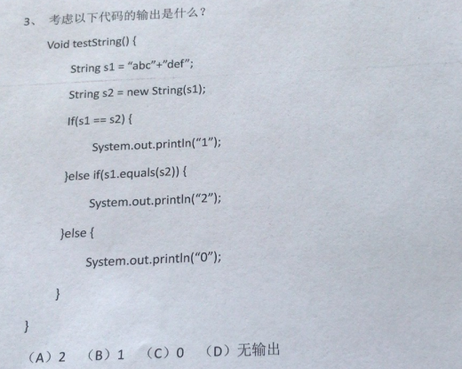


### 5、空字符串

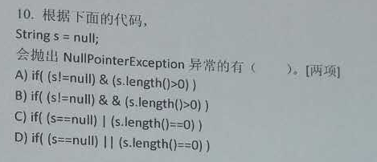

## 10.8 字符串算法相关面试题

### 1、编程题

在字符串中找出连续最长数字串，返回这个串的长度，并打印这个最长数字串。

例如：abcd12345cd125se123456789，返回9，打印出123456789


```java
public class TestExer1 {
	public static void main(String[] args) {
		String str = "abcd12345cd125se123456789";
		
		//去掉最前和最后的字母
		str =	str.replaceAll("^[a-zA-Z]+", "");
		
		//[a-zA-Z]：表示字母范围
		//+：一次或多次
		String[] strings = str.split("[a-zA-Z]+");
		
		String max = "";
		for (String string : strings) {
			if(string.length() > max.length()) {
				max = string;
			}
		}
		System.out.println("最长的数字串：" + max + "，它的长度为：" + max.length());
	}
}
```


### 2、编程题

不能使用trim()，实现去除字符串两端的空格。

```java
	public static void main(String[] args) {
		String str ="    he   llo   ";
		System.out.println(myTrim(str));
		System.out.println(myTrim2(str));
		System.out.println(myTrim3(str));
	}
	
	public static String myTrim3(String str){
		//利用正则表达式
		//^表示开头    \s表示  空白符   *表示0次或多次     |表示或者    $表示结尾
		return str.replaceAll("(^\\s*)|(\\s*$)", "");
	}
	
	public static String myTrim2(String str){
		while(str.startsWith(" ")){
			str = str.replaceFirst(" ", "");
		}
		while(str.endsWith(" ")){
			str = str.substring(0, str.length()-1);
		}
		return str;
	}
	
	public static String myTrim(String str){
		char[] array = str.toCharArray();
		int start =0;
		for(int i=0;i<array.length;i++){
			if(array[i] == ' '){
				start++;
			}else{
				break;
			}
		}
		int end = array.length-1;
		for(int i=end;i>=0;i--){
			if(array[i] == ' '){
				end--;
			}else{
				break;
			}
		}
		
		String result = str.substring(start,end+1);
		
		return result;
	}
```

### 3、编程题

将字符串中指定部分进行反转。比如将“abcdefgho”反转为”abfedcgho”

```java
	public static void main(String[] args) {
		String str ="abcdefgho";
		System.out.println(str);
		System.out.println(reverse(str,2,5));

	}
	
	//从第start个字符，到第end个字符
	public static String reverse(String str,int start,int end){
		char[] array = str.toCharArray();
		for(int i = start,j=end;i< j;i++,j--){
			char temp =array[i];
			array[i]=array[j];
			array[j]=temp;
		}
		String s = new String(array);
		return s;
	}

	//从第start个字符，到第end个字符
	public static String reverse(String str,int start,int end){
        String left = str.substring(0,start);
		String middle = str.substring(start,end+1);
        String left = str.substring(end+1);
		return left+new StringBuilder(middle).reverse()+right;
	}
```


### 4、编程题

获取一个字符串在另一个字符串中出现的次数。

​     比如：获取"ab"在 “abababkkcadkabkebfkabkskab”中出现的次数

```java
	public static void main(String[] args) {
		String str1="ab";
		String str2="abababkkcadkabkebfkabkskab";
		System.out.println(count(str1,str2));
	}
	
	public static int count(String str1,String str2){
		int count =0;
		do{
			int index = str2.indexOf(str1);
			if(index !=-1){
				count++;
				str2 = str2.substring(index + str1.length());
			}else{
				break;
			}
			
		}while(true);
		return count;
	}
```

### 5、编程题

获取两个字符串中最大相同子串。

比如：str1 = "abcwerthelloyuiodef“;str2 = "cvhellobnm"

   提示：将短的那个串进行长度依次递减的子串与较长的串比较。

```java
	public static void main(String[] args) {
		String str=findMaxSubString("abcwerthelloyuiodef","cvhellobnm");
		System.out.println(str);
	}
	
	//提示：将短的那个串进行长度依次递减的子串与较长的串比较。
	public static String findMaxSubString(String str1,String str2){
		String result="";
		
		String mixStr = str1.length()<str2.length()?str1:str2;
		String maxStr = str1.length()>str2.length()?str1:str2;
		
		//外循环控制从左到右的下标，内循环控制从右到左的下标
		for(int i=0;i<mixStr.length();i++){
			for(int j=mixStr.length();j>=i;j--){
				String str=mixStr.substring(i, j);
				if(maxStr.contains(str)){
					//找出最大相同子串
					if(result.length()<str.length()){
						result = str;
					}
				}
			}
		}
		return result;
	}
```

### 6、编程题

编写代码完成如下功能

public static String replace(String text, String target, String replace){

....

}

示例：replace(“aabbccbb”, “bb”, “dd”);  结果：aaddccdd

注意：不能使用String及StringBuffer等类的replace等现成的替换API方法。


```java
	public static void main(String[] args) {
		System.out.println(replace("aabbcbcbb","bb","dd"));
	}
	public static String replace(String text, String target, String replace){
		while(true) {
			int index = text.indexOf(target);
			if(index!=-1) {
				text = text.substring(0,index) + replace + text.substring(index+target.length());
			}else {
				break;
			}
		}
		return text;
	}
```

### 7、编程题

1个字符串中可能包含a-z中的多个字符，字符也可能重复，例如：String data = “aabcexmkduyruieiopxzkkkkasdfjxjdsds”;写一个程序，对于给定一个这样的字符串求出字符串出现次数最多的那个字母以及出现的次数（若次数最多的字母有多个，则全部求出）


```java
	public static void main(String[] args) {
		String str = "aabbyolhljlhlxxmnbwyteuhfhjloiqqbhrg";
		
		//统计每个字母的次数
		int[] counts = new int[26];
		char[] letters = str.toCharArray();
		for (int i = 0; i < letters.length; i++) {
			counts[letters[i]-97]++;
		}
		
		//找出最多次数值
		int max = counts[0];
		for (int i = 1; i < counts.length; i++) {
			if(max < counts[i]) {
				max = counts[i];
			}
		}
		//找出所有最多次数字母
		for (int i = 0; i < counts.length; i++) {
			if(counts[i] == max) {
				System.out.println((char)(i+97));
			}
		}
	}
```

> 如果学习完集合之后，该题还可以使用Map集合写出不同的答案

### 8、编程题

假设日期段用两个6位长度的正整数表示，例如：(201401，201406)用来表示2014年1月到2014年6月，求两个日期段的重叠月份数。例如：输入：时间段1：201401和201406，时间段2：201403和201409，输出：4

解释：重叠月份：3,4,5,6月共4个月

情形1：两个时间段都是同一年内的，实现代码如下：

```java
	public static void main(String[] args) {
		String date1Start = "201401";
		String date1End = "201406";
		
		String date2Start = "201403";
		String date2End = "201409";
		
		int date1StartMonth = Integer.parseInt(date1Start.substring(4));
		int date1EndMonth = Integer.parseInt(date1End.substring(4));
		
		int date2StartMonth = Integer.parseInt(date2Start.substring(4));
		int date2EndMonth = Integer.parseInt(date2End.substring(4));
		
		int start = date1StartMonth >= date2StartMonth ? date1StartMonth : date2StartMonth;
		int end = date1EndMonth <= date2EndMonth ? date1EndMonth : date2EndMonth;
        System.out.println("重叠月份数："+(end-start+1));
        
		System.out.println("重叠的月份有：");
		for (int i = start; i <= end; i++) {
			System.out.println(i);
		}        
	}
```

情形2：两个时间段可能不在同一年内的，实现代码如下：

```java
	public static void main(String[] args) {
		String date1Start = "201401";
		String date1End = "201506";
		
		String date2Start = "201403";
		String date2End = "201505";
		
		String date1 = handleDate(date1Start,date1End);
		String date2 = handleDate(date2Start,date2End);
		System.out.println(date1);
		System.out.println(date2);
		
		String sameDate = findMaxSubString(date1,date2);

		System.out.println("重叠的月份数：" + sameDate.length()/6);
		if (!"".equals(sameDate)) {
			System.out.println("重叠的月份有：");
			while (sameDate.length() > 0) {
				String sameMonth = sameDate.substring(0, 6);
				System.out.println(sameMonth);
				sameDate = sameDate.substring(6);
			}
			
		}
	}
	
	public static String findMaxSubString(String str1,String str2){
		String result="";
		
		String mixStr = str1.length()<str2.length()?str1:str2;
		String maxStr = str1.length()>str2.length()?str1:str2;
		
		//外循环控制从左到右的下标，内循环控制从右到左的下标
		for(int i=0;i<mixStr.length();i++){
			for(int j=mixStr.length();j>=i;j--){
				String str=mixStr.substring(i, j);
				if(maxStr.contains(str)){
					//找出最大相同子串
					if(result.length()<str.length()){
						result = str;
					}
				}
			}
		}
		return result;
	}
	
	public static String handleDate(String dateStart, String dateEnd) {
		int dateStartYear = Integer.parseInt(dateStart.substring(0,4));
		int dateEndYear = Integer.parseInt(dateEnd.substring(0,4));
		int dateStartMonth = Integer.parseInt(dateStart.substring(4));
		int dateEndMonth = Integer.parseInt(dateEnd.substring(4));
		
		String date = "";
		if(dateStartYear == dateEndYear) {//一年之内
			for (int i = dateStartMonth; i <=dateEndMonth; i++) {
				if(i<10) {
					date += dateStartYear+"0"+i;
				}else {
					date += dateStartYear+""+i;
				}
			}
		}else {//跨年
			for (int i = dateStartMonth; i <=12; i++) {//date1StartYear起始年
				if(i<10) {
					date += dateStartYear+"0"+i;
				}else {
					date += dateStartYear+""+i;
				}
			}
			for (int i = dateStartYear+1; i < dateEndYear; i++) {//中间间隔年
				for (int j = 1; j <= 12; j++) {
					if(j<10) {
						date += i+"0"+j;
					}else {
						date += i+""+j;
					}
				}
			}
			for (int i = 1; i <= dateEndMonth; i++) {//date1EndYear结束年
				if(i<10) {
					date += dateEndYear+"0"+i;
				}else {
					date += dateEndYear+""+i;
				}
			}
		}
		return date;
	}
}
```


