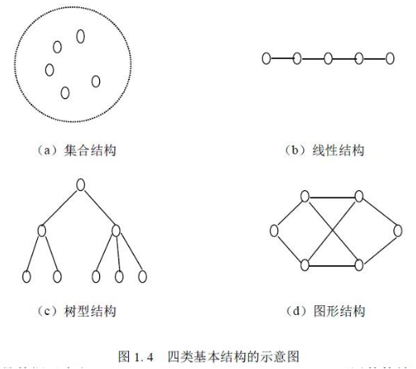
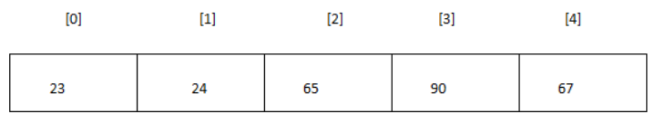
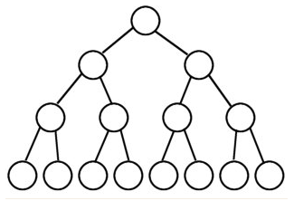
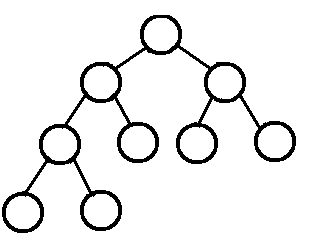
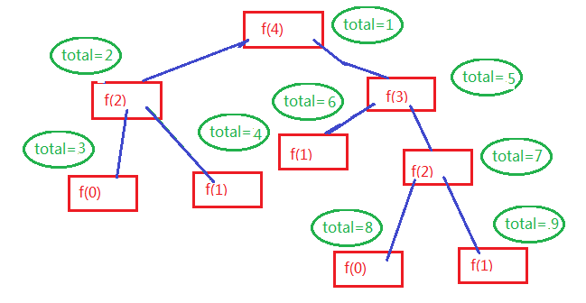
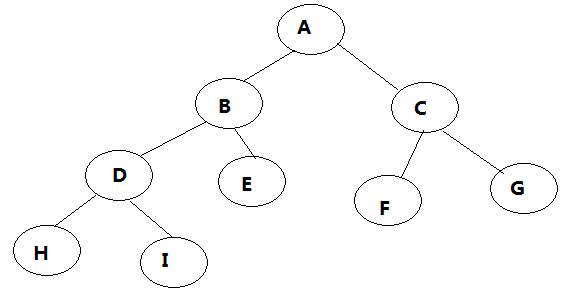
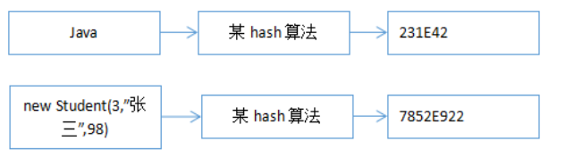
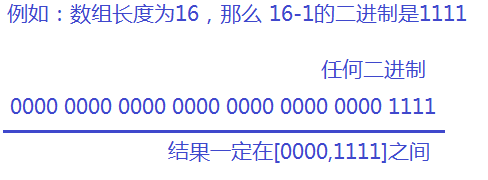
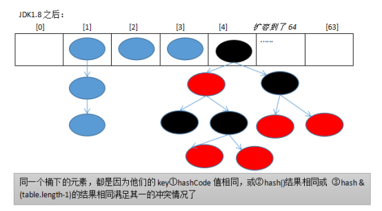

# 第13章 数据结构与算法

## 主要内容

* 数据结构

## 学习目标

* [ ] 对数据结构有初步了解
* [ ] 掌握动态数组的实现方式
* [ ] 掌握单链表与双链表的实现方式
* [ ] 掌握哈希表的实现方式

# 第十三章 数据结构与算法

## 13.1 数据结构

**数据结构**就是研究数据的**逻辑结构和物理结构**以及它们之间相互关系，并对这种结构定义**相应的运算**，而且确保经过这些运算后所得到的新结构仍然是原来的结构类型。


数据的逻辑结构指反映数据元素之间的逻辑关系，而与他们在计算机中的存储位置无关：

* 集合（数学中集合的概念）：数据结构中的元素之间除了“同属一个集合” 的相互关系外，别无其他关系；
* 线性结构：数据结构中的元素存在一对一的相互关系；
* 树形结构：数据结构中的元素存在一对多的相互关系；
* 图形结构：数据结构中的元素存在多对多的相互关系。



数据的物理结构/存储结构：是描述数据具体在内存中的存储（如：顺序结构、链式结构、索引结构、哈希结构）等，一种数据逻辑结构可表示成一种或多种物理存储结构。

数据结构和算法是一门完整并且复杂的课程，那么我们今天只是简单的讨论常见的几种数据结构，让我们对数据结构与算法有一个初步的了解。

## 13.2 动态数组

### 13.2.1 动态数组的特点

逻辑结构：线性的

物理结构：顺序结构

申请内存：一次申请一大段连续的空间，一旦申请到了，内存就固定了。

存储特点：所有数据存储在这个连续的空间中，数组中的每一个元素都是一个具体的数据（或对象），所有数据都紧密排布，不能有间隔。

例如：整型数组



例如：对象数组


### 13.2.2 动态数组的基本操作

与数据结构相关的数据操作：

* 插入
* 删除
* 修改
* 查找
* 遍历

```java
public interface Container<E> extends Iterable<E>{
	void add(E e);
	void insert(int index,E value);
	void delete(E e);
	void delete(int index);
	E update(int index, E value);
	void update(E old, E value);
	boolean contains(E e);
	int indexOf(E e);
	E get(int index);
	Object[] getAll();
	int size();
}
```

### 13.2.3 动态数组实现

```java
import java.util.Arrays;
import java.util.Iterator;
import java.util.NoSuchElementException;

public class MyArrayList<E> implements Container<E>{
	private Object[] all;
	private int total;
	
	public MyArrayList(){
		all = new Object[5];
	}

	@Override
	public void add(E e) {
		ensureCapacityEnough();
		all[total++] = e;
	}

	private void ensureCapacityEnough() {
		if(total >= all.length){
			all = Arrays.copyOf(all, all.length*2);
		}
	}

	@Override
	public void insert(int index, E value) {
		//是否需要扩容
		ensureCapacityEnough();
		addCheckIndex(index);
		if(total-index>0) {
			System.arraycopy(all, index, all, index+1, total-index);
		}
		all[index]=value;
		total++;
	}

	private void addCheckIndex(int index) {
		if(index<0 || index>total){
			throw new IndexOutOfBoundsException(index+"越界");
		}
	}

	@Override
	public void delete(E e) {
		int index = indexOf(e);
		if(index==-1){
			throw new NoSuchElementException(e+"不存在");
		}
		delete(index);
	}

	@Override
	public void delete(int index) {
		checkIndex(index);
		if(total-index-1>0) {
			System.arraycopy(all, index+1, all, index, total-index-1);
		}
		all[--total] = null;
	}

	private void checkIndex(int index) {
		if(index<0 || index>total){
			throw new IndexOutOfBoundsException(index+"越界");
		}
	}

	@Override
	public E update(int index, E value) {
		checkIndex(index);
		E oldValue = get(index);
		all[index]=value;
		return oldValue;
	}
	
	@Override
	public void update(E old, E value) {
		int index = indexOf(old);
		if(index!=-1){
			update(index, value);
		}
	}

	@Override
	public boolean contains(E e) {
		return indexOf(e) != -1;
	}

	@Override
	public int indexOf(E e) {
		int index = -1;
		if(e==null){
			for (int i = 0; i < total; i++) {
				if(e == all[i]){
					index = i;
					break;
				}
			}
		}else{
			for (int i = 0; i < total; i++) {
				if(e.equals(all[i])){
					index = i;
					break;
				}
			}
		}
		return index;
	}

	@SuppressWarnings("unchecked")
	@Override
	public E get(int index) {
		checkIndex(index);
		return (E) all[index];
	}

	@Override
	public Object[] getAll() {
		return Arrays.copyOf(all, total);
	}

	@Override
	public int size() {
		return total;
	}

	@Override
	public Iterator<E> iterator() {
		return new Itr();
	}
	
	private class Itr implements Iterator<E>{
		private int cursor;

		@Override
		public boolean hasNext() {
			return cursor!=total;
		}

		@SuppressWarnings("unchecked")
		@Override
		public E next() {
			return (E) all[cursor++];
		}

		@Override
		public void remove() {
			MyArrayList.this.delete(--cursor);
		}
		
	}
}
```

### 13.2.4  动态数组测试

```java
import java.util.Arrays;
import java.util.Iterator;

import org.junit.Test;

public class TestMyArrayList {
	@Test
	public void test01(){
		MyArrayList<String> my = new MyArrayList<String>();
		my.add("hello");
		my.add("java");
		my.add("world");
		my.add("atguigu");
		my.add("list");
		my.add("data");
		
		System.out.println("元素个数：" + my.size());
		Object[] all = my.getAll();
		System.out.println(Arrays.toString(all));
		
		my.insert(2, "尚硅谷");
		System.out.println("元素个数：" + my.size());
		all = my.getAll();
		System.out.println(Arrays.toString(all));
	}
	
	@Test
	public void test02(){
		MyArrayList<String> my = new MyArrayList<String>();
		my.add("hello");
		my.add("java");
		my.add("world");
		my.add("atguigu");
		my.add("list");
		my.add("data");
		
		my.delete(1);
		System.out.println("元素个数：" + my.size());
		Object[] all = my.getAll();
		System.out.println(Arrays.toString(all));
		
		my.delete("atguigu");
		System.out.println("元素个数：" + my.size());
		all = my.getAll();
		System.out.println(Arrays.toString(all));
	}
	
	@Test
	public void test03(){
		MyArrayList<String> my = new MyArrayList<String>();
		my.add("hello");
		my.add("java");
		my.add("world");
		my.add("atguigu");
		my.add("list");
		my.add("data");
		
		String update = my.update(3, "尚硅谷");
		System.out.println("元素个数：" + my.size());
		System.out.println("被替换的是：" + update);
		Object[] all = my.getAll();
		System.out.println(Arrays.toString(all));
		
		my.update("java", "Java");
		System.out.println("元素个数：" + my.size());
		System.out.println("被替换的是：java");
		all = my.getAll();
		System.out.println(Arrays.toString(all));
	}
	
	@Test
	public void test04(){
		MyArrayList<String> my = new MyArrayList<String>();
		my.add("hello");
		my.add("java");
		my.add("world");
		my.add("atguigu");
		my.add("list");
		my.add("data");
		
		System.out.println(my.contains("java"));
		System.out.println(my.indexOf("java"));
		System.out.println(my.get(0));
	}
	
	@Test
	public void test05(){
		MyArrayList<String> my = new MyArrayList<String>();
		my.add("hello");
		my.add("java");
		my.add("world");
		my.add("atguigu");
		my.add("list");
		my.add("data");
		
		for (String string : my) {
			System.out.println(string);
		}
	}
	
	@Test
	public void test06(){
		MyArrayList<String> my = new MyArrayList<String>();
		my.add("hello");
		my.add("java");
		my.add("world");
		my.add("atguigu");
		my.add("list");
		my.add("data");
		
		Iterator<String> iterator = my.iterator();
		while(iterator.hasNext()) {
			String next = iterator.next();
			if(next.length()>4) {
				iterator.remove();
			}
		}
		for (String string : my) {
			System.out.println(string);
		}
	}
}
```

### 13.2.5 Java核心类库中的动态数组

Java的List接口的实现类中有两个动态数组的实现：Vector和ArrayList。

#### 1、ArrayList与Vector的区别？

它们的底层物理结构都是数组，我们称为动态数组。

* ArrayList是新版的动态数组，线程不安全，效率高，Vector是旧版的动态数组，线程安全，效率低。
* 动态数组的扩容机制不同，ArrayList扩容为原来的1.5倍，Vector扩容增加为原来的2倍。
* 数组的初始化容量，如果在构建ArrayList与Vector的集合对象时，没有显式指定初始化容量，那么Vector的内部数组的初始容量默认为10，而ArrayList在JDK1.6及之前的版本也是10，而JDK1.7之后的版本ArrayList初始化为长度为0的空数组，之后在添加第一个元素时，再创建长度为10的数组。
* Vector因为版本古老，支持Enumeration 迭代器。但是该迭代器不支持快速失败。而Iterator和ListIterator迭代器支持快速失败。如果在迭代器创建后的任意时间从结构上修改了向量（通过迭代器自身的 remove 或 add 方法之外的任何其他方式），则迭代器将抛出 ConcurrentModificationException。因此，面对并发的修改，迭代器很快就完全失败，而不是冒着在将来不确定的时间任意发生不确定行为的风险。

#### 2、源码分析

##### （1）Vector源码分析

```java
    public Vector() {
        this(10);//指定初始容量initialCapacity为10
    }
	public Vector(int initialCapacity) {
        this(initialCapacity, 0);//指定capacityIncrement增量为0
    }
    public Vector(int initialCapacity, int capacityIncrement增量为0) {
        super();
        //判断了形参初始容量initialCapacity的合法性
        if (initialCapacity < 0)
            throw new IllegalArgumentException("Illegal Capacity: "+
                                               initialCapacity);
        //创建了一个Object[]类型的数组
        this.elementData = new Object[initialCapacity];//默认是10
        //增量，默认是0，如果是0，后面就按照2倍增加，如果不是0，后面就按照你指定的增量进行增量
        this.capacityIncrement = capacityIncrement;
    }
```

```java
//synchronized意味着线程安全的   
	public synchronized boolean add(E e) {
        modCount++;
    	//看是否需要扩容
        ensureCapacityHelper(elementCount + 1);
    	//把新的元素存入[elementCount]，存入后，elementCount元素的个数增1
        elementData[elementCount++] = e;
        return true;
    }

    private void ensureCapacityHelper(int minCapacity) {
        // overflow-conscious code
        //看是否超过了当前数组的容量
        if (minCapacity - elementData.length > 0)
            grow(minCapacity);//扩容
    }
    private void grow(int minCapacity) {
        // overflow-conscious code
        int oldCapacity = elementData.length;//获取目前数组的长度
        //如果capacityIncrement增量是0，新容量 = oldCapacity的2倍
        //如果capacityIncrement增量是不是0，新容量 = oldCapacity + capacityIncrement增量;
        int newCapacity = oldCapacity + ((capacityIncrement > 0) ?
                                         capacityIncrement : oldCapacity);
        
        //如果按照上面计算的新容量还不够，就按照你指定的需要的最小容量来扩容minCapacity
        if (newCapacity - minCapacity < 0)
            newCapacity = minCapacity;
        
        //如果新容量超过了最大数组限制，那么单独处理
        if (newCapacity - MAX_ARRAY_SIZE > 0)
            newCapacity = hugeCapacity(minCapacity);
        
        //把旧数组中的数据复制到新数组中，新数组的长度为newCapacity
        elementData = Arrays.copyOf(elementData, newCapacity);
    }
```

```java
    public boolean remove(Object o) {
        return removeElement(o);
    }
    public synchronized boolean removeElement(Object obj) {
        modCount++;
        //查找obj在当前Vector中的下标
        int i = indexOf(obj);
        //如果i>=0，说明存在，删除[i]位置的元素
        if (i >= 0) {
            removeElementAt(i);
            return true;
        }
        return false;
    }
    public int indexOf(Object o) {
        return indexOf(o, 0);
    }
    public synchronized int indexOf(Object o, int index) {
        if (o == null) {//要查找的元素是null值
            for (int i = index ; i < elementCount ; i++)
                if (elementData[i]==null)//如果是null值，用==null判断
                    return i;
        } else {//要查找的元素是非null值
            for (int i = index ; i < elementCount ; i++)
                if (o.equals(elementData[i]))//如果是非null值，用equals判断
                    return i;
        }
        return -1;
    }
    public synchronized void removeElementAt(int index) {
        modCount++;
        //判断下标的合法性
        if (index >= elementCount) {
            throw new ArrayIndexOutOfBoundsException(index + " >= " +
                                                     elementCount);
        }
        else if (index < 0) {
            throw new ArrayIndexOutOfBoundsException(index);
        }
        
        //j是要移动的元素的个数
        int j = elementCount - index - 1;
        //如果需要移动元素，就调用System.arraycopy进行移动
        if (j > 0) {
            //把index+1位置以及后面的元素往前移动
            //index+1的位置的元素移动到index位置，依次类推
            //一共移动j个
            System.arraycopy(elementData, index + 1, elementData, index, j);
        }
        //元素的总个数减少
        elementCount--;
        //将elementData[elementCount]这个位置置空，用来添加新元素，位置的元素等着被GC回收
        elementData[elementCount] = null; /* to let gc do its work */
    }
```

##### （2）ArrayList源码分析

JDK1.6：

```java
    public ArrayList() {
		this(10);//指定初始容量为10
    }
    public ArrayList(int initialCapacity) {
		super();
        //检查初始容量的合法性
        if (initialCapacity < 0)
            throw new IllegalArgumentException("Illegal Capacity: "+
                                               initialCapacity);
        //数组初始化为长度为initialCapacity的数组
		this.elementData = new Object[initialCapacity];
    }
```

JDK1.7

```java
    private static final int DEFAULT_CAPACITY = 10;//默认初始容量10
	private static final Object[] EMPTY_ELEMENTDATA = {};
	public ArrayList() {
        super();
        this.elementData = EMPTY_ELEMENTDATA;//数组初始化为一个空数组
    }
    public boolean add(E e) {
        //查看当前数组是否够多存一个元素
        ensureCapacityInternal(size + 1);  // Increments modCount!!
        elementData[size++] = e;
        return true;
    }
    private void ensureCapacityInternal(int minCapacity) {
        if (elementData == EMPTY_ELEMENTDATA) {//如果当前数组还是空数组
            //minCapacity按照 默认初始容量和minCapacity中的的最大值处理
            minCapacity = Math.max(DEFAULT_CAPACITY, minCapacity);
        }
		//看是否需要扩容处理
        ensureExplicitCapacity(minCapacity);
    }
	//...
```

JDK1.8

```java
private static final int DEFAULT_CAPACITY = 10;
private static final Object[] EMPTY_ELEMENTDATA = {};
private static final Object[] DEFAULTCAPACITY_EMPTY_ELEMENTDATA = {};

    public ArrayList() {
        this.elementData = DEFAULTCAPACITY_EMPTY_ELEMENTDATA;//初始化为空数组
    }
    public boolean add(E e) {
        //查看当前数组是否够多存一个元素
        ensureCapacityInternal(size + 1);  // Increments modCount!!
        
        //存入新元素到[size]位置，然后size自增1
        elementData[size++] = e;
        return true;
    }
    private void ensureCapacityInternal(int minCapacity) {
        //如果当前数组还是空数组
        if (elementData == DEFAULTCAPACITY_EMPTY_ELEMENTDATA) {
            //那么minCapacity取DEFAULT_CAPACITY与minCapacity的最大值
            minCapacity = Math.max(DEFAULT_CAPACITY, minCapacity);
        }
		//查看是否需要扩容
        ensureExplicitCapacity(minCapacity);
    }
    private void ensureExplicitCapacity(int minCapacity) {
        modCount++;//修改次数加1

        // 如果需要的最小容量  比  当前数组的长度  大，即当前数组不够存，就扩容
        if (minCapacity - elementData.length > 0)
            grow(minCapacity);
    }
    private void grow(int minCapacity) {
        // overflow-conscious code
        int oldCapacity = elementData.length;//当前数组容量
        int newCapacity = oldCapacity + (oldCapacity >> 1);//新数组容量是旧数组容量的1.5倍
        //看旧数组的1.5倍是否够
        if (newCapacity - minCapacity < 0)
            newCapacity = minCapacity;
        //看旧数组的1.5倍是否超过最大数组限制
        if (newCapacity - MAX_ARRAY_SIZE > 0)
            newCapacity = hugeCapacity(minCapacity);
        
        //复制一个新数组
        elementData = Arrays.copyOf(elementData, newCapacity);
    }
```

```java
    public boolean remove(Object o) {
        //先找到o在当前ArrayList的数组中的下标
        //分o是否为空两种情况讨论
        if (o == null) {
            for (int index = 0; index < size; index++)
                if (elementData[index] == null) {//null值用==比较
                    fastRemove(index);
                    return true;
                }
        } else {
            for (int index = 0; index < size; index++)
                if (o.equals(elementData[index])) {//非null值用equals比较
                    fastRemove(index);
                    return true;
                }
        }
        return false;
    }
    private void fastRemove(int index) {
        modCount++;//修改次数加1
        //需要移动的元素个数
        int numMoved = size - index - 1;
        
        //如果需要移动元素，就用System.arraycopy移动元素
        if (numMoved > 0)
            System.arraycopy(elementData, index+1, elementData, index,
                             numMoved);
        
        //将elementData[size-1]位置置空，让GC回收空间，元素个数减少
        elementData[--size] = null; // clear to let GC do its work
    }
```

```java
    public E remove(int index) {
        rangeCheck(index);//检验index是否合法

        modCount++;//修改次数加1
        
        //取出[index]位置的元素，[index]位置的元素就是要被删除的元素，用于最后返回被删除的元素
        E oldValue = elementData(index);
        
		//需要移动的元素个数
        int numMoved = size - index - 1;
        
        //如果需要移动元素，就用System.arraycopy移动元素
        if (numMoved > 0)
            System.arraycopy(elementData, index+1, elementData, index,
                             numMoved);
        //将elementData[size-1]位置置空，让GC回收空间，元素个数减少
        elementData[--size] = null; // clear to let GC do its work

        return oldValue;
    }
```

```java
    public E set(int index, E element) {
        rangeCheck(index);//检验index是否合法

        //取出[index]位置的元素，[index]位置的元素就是要被替换的元素，用于最后返回被替换的元素
        E oldValue = elementData(index);
        //用element替换[index]位置的元素
        elementData[index] = element;
        return oldValue;
    }
    public E get(int index) {
        rangeCheck(index);//检验index是否合法

        return elementData(index);//返回[index]位置的元素
    }
```

```java
    public int indexOf(Object o) {
        //分为o是否为空两种情况
        if (o == null) {
            //从前往后找
            for (int i = 0; i < size; i++)
                if (elementData[i]==null)
                    return i;
        } else {
            for (int i = 0; i < size; i++)
                if (o.equals(elementData[i]))
                    return i;
        }
        return -1;
    }
    public int lastIndexOf(Object o) {
         //分为o是否为空两种情况
        if (o == null) {
            //从后往前找
            for (int i = size-1; i >= 0; i--)
                if (elementData[i]==null)
                    return i;
        } else {
            for (int i = size-1; i >= 0; i--)
                if (o.equals(elementData[i]))
                    return i;
        }
        return -1;
    }
```

## 13.3 链式存储结构

逻辑结构：有线性的和非线性的

物理结构：不要求连续的存储空间

存储特点：数据必须封装到“结点”中，结点包含多个数据项，数据值只是其中的一个数据项，其他的数据项用来记录与之有关的结点的地址。

例如：以下列出几种常见的链式存储结构（当然远不止这些）

### 链表


#### 单链表

单链表结点：

```java
class Node{
	Object data;
	Node next;
	public Node(Object data, Node next) {
		this.data = data;
		this.next = next;
	}
}
```

单链表：

```java
public class OneWayLinkedList<E>{
	private Node<E> head;//头结点
	private int total;//记录实际元素个数
	
	private static class Node<E>{
		E data;
		Node<E> next;
		Node(E data, Node<E> next) {
			this.data = data;
			this.next = next;
		}
	}
}
```

#### 双链表

双链表结点：

```java
class Node{
	Node prev;
	Object data;
	Node next;
	public Node(Node prev, Object data, Node next) {
		this.prev = prev;
		this.data = data;
		this.next = next;
	}
}
```

双向链表：

```java
public class LinkedList<E>{
	private Node<E> first;//头结点
    private Node<E> last;//尾结点
	private int total;//记录实际元素个数
	
	private static class Node<E>{
        Node<E> prev;
		E data;
		Node<E> next;
		Node(Node<E> prev, E data, Node<E> next) {
            this.prev = prev;
			this.data = data;
			this.next = next;
		}
	}
}
```

### 二叉树


#### 二叉树实现基本结构

```java
class Node{
	Node parent;
	Node left;
	Object data;
	Node right;
	public Node(Node parent,Node left, Object data, Node right) {
		this.parent = parent;
		this.left = left;
		this.data = data;
		this.right = right;
	}
}
```

二叉树

```java
public class BinaryTree<E>{
    private Node<E> root;
    private int total;
    
    private static class Node<E>{
        Node<E> parent;
        Node<E> left;
        E data;
        Node<E> right;
        
        public Node(Node<E> parent, Node<E> left, E data, Node<E> right) {
            this.parent = parent;
            this.left = left;
            this.data = data;
            this.right = right;
        }
	}
}
```

#### 二叉树分类

* 满二叉树： 除最后一层无任何子节点外，每一层上的所有结点都有两个子结点的二叉树。 第n层的结点数是2的n-1次方，2的n次方-1

  

* 完全二叉树： 叶结点只能出现在最底层的两层，且最底层叶结点均处于次底层叶结点的左侧。

  

* 平衡二叉树：平衡二叉树（Self-balancing binary search tree）又被称为AVL树（有别于AVL算法），且具有以下性质：它是一 棵空树或它的左右两个子树的高度差的绝对值不超过1，并且左右两个子树都是一棵平衡二叉树， 但不要求非叶节点都有两个子结点 。平衡二叉树的常用实现方法有红黑树、AVL、替罪羊树、Treap、伸展树等。 最小二叉平衡树的节点的公式如下 F(n)=F(n-1)+F(n-2)+1 这个类似于一个递归的数列，可以参考Fibonacci(斐波那契)数列，1是根节点，F(n-1)是左子树的节点数量，F(n-2)是右子树的节点数量。


例如：斐波那契数列（Fibonacci）：1，1，2，3，5，8，13.....

规律：除了第一个和第二个数以外，后面的数等于前两个数之和，

​	f(0) =1，

​	f(1) = 1，

​	f(2) = f(0) + f(1) =2，

​	f(3) = f(1) + f(2) = 3, 

​	f(4) = f(2) + f(3) = 5

​	...

​	f(n) = f(n-2) + f(n-1);



#### 二叉树的遍历

* 前序遍历：中左右
* 中序遍历：左中右
* 后序遍历：左右中



前序遍历：ABDHIECFG

中序遍历：HDIBEAFCG

后序遍历：HIDEBFGCA

## 13.4 单链表

### 13.4.1 单链表的实现

逻辑结构：单向链表

物理结构：链式顺序结构

```java
package com.atguigu.test06;

public class OneWayLinkedList<E>{
	private Node<E> head;
	private int total;
	
	private static class Node<E>{
		E data;
		Node<E> next;
		Node(E data, Node<E> next) {
			this.data = data;
			this.next = next;
		}
	}

	public void add(E e) {
		Node<E> newNode = new Node<>(e,null);
		if(head==null){
			head = newNode;
		}else{
			Node<E> node = head;
			while(node.next!=null){
				node = node.next;
			}
			node.next = newNode;
		}
		total++;
	}


	public void delete(E e) {
		Node<E> node = head;
		Node<E> find = null;
		Node<E> last = null;
		
		if(e==null){
			while(node!=null){
				if(node.data==null){
					find = node;
					break;
				}
				last = node;
				node = node.next;
			}
		}else{
			while(node!=null){
				if(e.equals(node.data)){
					find = node;
					break;
				}
				last = node;
				node = node.next;
			}
		}
		
		if(find != null){
			if(last==null){
				head = find.next;
			}else{
				last.next = find.next;
			}
			total--;
		}
	}
	
	public void update(E old, E value) {
		Node<E> node = head;
		Node<E> find = null;
		
		if(old==null){
			while(node!=null){
				if(node.data==null){
					find = node;
					break;
				}
				node = node.next;
			}
		}else{
			while(node!=null){
				if(old.equals(node.data)){
					find = node;
					break;
				}
				node = node.next;
			}
		}
		
		if(find != null){
			find.data = value;
		}
	}

	public boolean contains(E e) {
		return indexOf(e) != -1;
	}

	public int indexOf(E e) {
		int index = -1;
		if(e==null){
			int i=0;
			for(Node<E> node = head; node!=null; node=node.next ){
				if(node.data==e){
					index=i;
					break;
				}
				i++;
			}
		}else{
			int i=0;
			for(Node<E> node = head; node!=null; node=node.next ){
				if(e.equals(node.data)){
					index=i;
					break;
				}
				i++;
			}
		}
		return index;
	}

	public Object[] getAll() {
		Object[] all = new Object[total];
		Node<E> node = head;
		for (int i = 0; i < all.length; i++,node = node.next) {
			all[i] = node.data;
		}
		return all;
	}

	public int size() {
		return total;
	}
}
```

### 13.4.2 单链表的测试

```java
import java.util.Arrays;

import org.junit.Test;

public class TestOneWayLinkedList {
	@Test
	public void test01(){
		OneWayLinkedList<String> my = new OneWayLinkedList<String>();
		my.add("hello");
		my.add("java");
		my.add("world");
		my.add("atguigu");
		my.add("list");
		my.add("data");
		
		System.out.println("元素个数：" + my.size());
		Object[] all = my.getAll();
		System.out.println(Arrays.toString(all));
	}
	
	@Test
	public void test02(){
		OneWayLinkedList<String> my = new OneWayLinkedList<String>();
		my.add("hello");
		my.add("java");
		my.add("world");
		my.add("atguigu");
		my.add("list");
		my.add("data");
		
		my.delete("hello");
		System.out.println("元素个数：" + my.size());
		Object[] all = my.getAll();
		System.out.println(Arrays.toString(all));
		
		my.delete("atguigu");
		System.out.println("元素个数：" + my.size());
		all = my.getAll();
		System.out.println(Arrays.toString(all));
		
		my.delete("data");
		System.out.println("元素个数：" + my.size());
		all = my.getAll();
		System.out.println(Arrays.toString(all));
	}
	
	@Test
	public void test03(){
		OneWayLinkedList<String> my = new OneWayLinkedList<String>();
		my.add("hello");
		my.add("java");
		my.add("world");
		my.add("atguigu");
		my.add("list");
		my.add("data");
		
		my.update("java", "Java");
		System.out.println("元素个数：" + my.size());
		Object[] all = my.getAll();
		System.out.println(Arrays.toString(all));
	}
	
	@Test
	public void test04(){
		OneWayLinkedList<String> my = new OneWayLinkedList<String>();
		my.add("hello");
		my.add("java");
		my.add("world");
		my.add("atguigu");
		my.add("list");
		my.add("data");
		
		System.out.println(my.contains("java"));
		System.out.println(my.indexOf("java"));
	}
	
	@Test
	public void test05(){
		OneWayLinkedList<String> my = new OneWayLinkedList<String>();
		my.add("hello");
		my.add("java");
		my.add("world");
		my.add("atguigu");
		my.add("list");
		my.add("data");
		
		for (String string : my) {
			System.out.println(string);
		}
	}
}
```

## 13.5 双链表

Java中有双链表的实现：LinkedList，它是List接口的实现类。

### LinkedList源码分析

```java
int size = 0;
Node<E> first;//记录第一个结点的位置
Node<E> last;//记录最后一个结点的位置

    private static class Node<E> {
        E item;//元素数据
        Node<E> next;//下一个结点
        Node<E> prev;//前一个结点

        Node(Node<E> prev, E element, Node<E> next) {
            this.item = element;
            this.next = next;
            this.prev = prev;
        }
    }
```

```java
    public boolean add(E e) {
        linkLast(e);//默认把新元素链接到链表尾部
        return true;
    }
    void linkLast(E e) {
        final Node<E> l = last;//用l 记录原来的最后一个结点
        
        //创建新结点
        final Node<E> newNode = new Node<>(l, e, null);
        //现在的新结点是最后一个结点了
        last = newNode;
        
        //如果l==null，说明原来的链表是空的
        if (l == null)
            //那么新结点同时也是第一个结点
            first = newNode;
        else
            //否则把新结点链接到原来的最后一个结点的next中
            l.next = newNode;
        //元素个数增加
        size++;
        //修改次数增加
        modCount++;
    }
```

```java
    public boolean remove(Object o) {
        //分o是否为空两种情况
        if (o == null) {
            //找到o对应的结点x
            for (Node<E> x = first; x != null; x = x.next) {
                if (x.item == null) {
                    unlink(x);//删除x结点
                    return true;
                }
            }
        } else {
            //找到o对应的结点x
            for (Node<E> x = first; x != null; x = x.next) {
                if (o.equals(x.item)) {
                    unlink(x);//删除x结点
                    return true;
                }
            }
        }
        return false;
    }
    E unlink(Node<E> x) {//x是要被删除的结点
        // assert x != null;
        final E element = x.item;//被删除结点的数据
        final Node<E> next = x.next;//被删除结点的下一个结点
        final Node<E> prev = x.prev;//被删除结点的上一个结点

        //如果被删除结点的前面没有结点，说明被删除结点是第一个结点
        if (prev == null) {
            //那么被删除结点的下一个结点变为第一个结点
            first = next;
        } else {//被删除结点不是第一个结点
            //被删除结点的上一个结点的next指向被删除结点的下一个结点
            prev.next = next;
            //断开被删除结点与上一个结点的链接
            x.prev = null;//使得GC回收
        }

        //如果被删除结点的后面没有结点，说明被删除结点是最后一个结点
        if (next == null) {
            //那么被删除结点的上一个结点变为最后一个结点
            last = prev;
        } else {//被删除结点不是最后一个结点
            //被删除结点的下一个结点的prev执行被删除结点的上一个结点
            next.prev = prev;
            //断开被删除结点与下一个结点的连接
            x.next = null;//使得GC回收
        }
		//把被删除结点的数据也置空，使得GC回收
        x.item = null;
        //元素个数减少
        size--;
        //修改次数增加
        modCount++;
        //返回被删除结点的数据
        return element;
    }
```

### 链表与动态数组的区别

动态数组底层的物理结构是数组，因此根据索引访问的效率非常高，但是根据索引的插入和删除效率不高，因为涉及到移动元素，而且添加操作时可能涉及到扩容问题，那么就会增加时空消耗。

链表底层的物理结构是链表，因此根据索引访问的效率不高，但是插入和删除的效率高，因为不需要移动元素，只需要修改前后元素的指向关系即可，而链表的添加不会涉及到扩容问题。

## 13.3 栈和队列

堆栈是一种先进后出（FILO：first in last out）或后进先出（LIFI：last in first out）的结构。

队列是一种（但并非一定）先进先出（FIFO）的结构。

### 13.3.1 Stack类

java.util.Stack<E>是Vector<E>集合的子类。

比Vector多了几个方法

 *  (1)peek：查看栈顶元素，不弹出
 *  (2)pop：弹出栈
 *  (3)push：压入栈     	即添加到链表的头

```java
	@Test
	public void test3(){
		Stack<Integer> list = new Stack<>();
		list.push(1);
		list.push(2);
		list.push(3);
		
		System.out.println(list);
		
		/*System.out.println(list.pop());
		System.out.println(list.pop());
		System.out.println(list.pop());
		System.out.println(list.pop());//java.util.NoSuchElementException
*/
		
		System.out.println(list.peek());
		System.out.println(list.peek());
		System.out.println(list.peek());
	}
```

### 11.3.2 Queue和Deque接口

`Queue`除了基本的 `Collection`操作外，队列还提供其他的插入、提取和检查操作。每个方法都存在两种形式：一种抛出异常（操作失败时），另一种返回一个特殊值（`null` 或  `false`，具体取决于操作）。`Queue` 实现通常不允许插入  元素，尽管某些实现（如 ）并不禁止插入  。即使在允许 null 的实现中，也不应该将  插入到  中，因为  也用作  方法的一个特殊返回值，表明队列不包含元素。 

|          | *抛出异常*                                          | *返回特殊值*                                      |
| -------- | --------------------------------------------------- | ------------------------------------------------- |
| 插入| add(e)| offer(e)|
| 移除| remove()| poll()|
| 检查 | element()| peek()|

`Deque`，名称 *deque* 是“double ended queue（双端队列）”的缩写，通常读为“deck”。此接口定义在双端队列两端访问元素的方法。提供插入、移除和检查元素的方法。每种方法都存在两种形式：一种形式在操作失败时抛出异常，另一种形式返回一个特殊值（`null`  或 `false`，具体取决于操作）。

|          | **第一个元素（头部）**                                      |                                                             | **最后一个元素（尾部）**                                  |                                                           |
| -------- | ----------------------------------------------------------- | ----------------------------------------------------------- | --------------------------------------------------------- | --------------------------------------------------------- |
|          | *抛出异常*                                                  | *特殊值*                                                    | *抛出异常*                                                | *特殊值*                                                  |
| **插入** | addFirst(e)| offerFirst(e)| addLast(e)| offerLast(e)|
| **移除** | removeFirst() | pollFirst() | removeLast()| pollLast()|
| **检查** | getFirst()| peekFirst()| getLast() | peekLast()|

此接口扩展了 `Queue`接口。在将双端队列用作队列时，将得到  FIFO（先进先出）行为。将元素添加到双端队列的末尾，从双端队列的开头移除元素。从 `Queue` 接口继承的方法完全等效于  `Deque` 方法，如下表所示：  

| **`Queue` 方法**                                    | **等效 `Deque` 方法**                                       |
| --------------------------------------------------- | ----------------------------------------------------------- |
| add(e)| addLast(e)|
| offer(e)| offerLast(e) |
| remove()| removeFirst()|
| poll()| pollFirst()|
| element()| getFirst()|
| peek()| peekFirst()|

双端队列也可用作 LIFO（后进先出）堆栈。应优先使用此接口而不是遗留 `Stack` 类。在将双端队列用作堆栈时，元素被推入双端队列的开头并从双端队列开头弹出。堆栈方法完全等效于 `Deque` 方法，如下表所示：  

| **堆栈方法**                                    | **等效 `Deque` 方法**                                       |
| ----------------------------------------------- | ----------------------------------------------------------- |
| push(e)| addFirst(e)|
| pop()| removeFirst()|
| peek()| peekFirst() |

结论：Deque接口的实现类既可以用作FILO堆栈使用，又可以用作FIFO队列使用。

Deque接口的实现类有ArrayDeque和LinkedList，它们一个底层是使用数组实现，一个使用双向链表实现。

## 13.4 哈希表

HashMap和Hashtable都是哈希表。

### **13.4.1 hashCode值**

hash算法是一种可以从任何数据中提取出其“指纹”的数据摘要算法，它将任意大小的数据映射到一个固定大小的序列上，这个序列被称为hash code、数据摘要或者指纹。比较出名的hash算法有MD5、SHA。hash是具有唯一性且不可逆的，唯一性是指相同的“对象”产生的hash code永远是一样的。



### **13.4.2 哈希表的物理结构**

HashMap和Hashtable是散列表，其中维护了一个长度为**2的幂次方**的Entry类型的数组table，数组的每一个元素被称为一个桶(bucket)，你添加的映射关系(key,value)最终都被封装为一个Map.Entry类型的对象，放到了某个table[index]桶中。使用数组的目的是查询和添加的效率高，可以根据索引直接定位到某个table[index]。

#### **1、数组元素类型：Map.Entry**

JDK1.7：

映射关系被封装为HashMap.Entry类型，而这个类型实现了Map.Entry接口。

观察HashMap.Entry类型是个结点类型，即table[index]下的映射关系可能串起来一个链表。因此我们把table[index]称为“桶bucket"。

```java
public class HashMap<K,V>{
    transient Entry<K,V>[] table = (Entry<K,V>[]) EMPTY_TABLE;
    static class Entry<K,V> implements Map.Entry<K,V> {
            final K key;
            V value;
            Entry<K,V> next;
            int hash;
            //...省略
    }
    //...
}
```


JDK1.8：

映射关系被封装为HashMap.Node类型或HashMap.TreeNode类型，它俩都直接或间接的实现了Map.Entry接口。

存储到table数组的可能是Node结点对象，也可能是TreeNode结点对象，它们也是Map.Entry接口的实现类。即table[index]下的映射关系可能串起来一个链表或一棵红黑树（自平衡的二叉树）。

```java
public class HashMap<K,V>{
    transient Node<K,V>[] table;
    static class Node<K,V> implements Map.Entry<K,V> {
            final int hash;
            final K key;
            V value;
            Node<K,V> next;
            //...省略
    }
    static final class TreeNode<K,V> extends LinkedHashMap.Entry<K,V> {
        TreeNode<K,V> parent;  // red-black tree links
        TreeNode<K,V> left;
        TreeNode<K,V> right;
        TreeNode<K,V> prev;
        boolean red;//是红结点还是黑结点
        //...省略
    }
    //....
}
```

```java
public class LinkedHashMap<K,V>{
	static class Entry<K,V> extends HashMap.Node<K,V> {
        Entry<K,V> before, after;
        Entry(int hash, K key, V value, Node<K,V> next) {
            super(hash, key, value, next);
        }
    }
    //...
}
```


#### 2、数组的长度始终是2的n次幂

table数组的默认初始化长度：

```java
static final int DEFAULT_INITIAL_CAPACITY = 1 << 4;
```

如果你手动指定的table长度不是2的n次幂，会通过如下方法给你纠正为2的n次幂

JDK1.7：

HashMap处理容量方法：

```java
    private static int roundUpToPowerOf2(int number) {
        // assert number >= 0 : "number must be non-negative";
        return number >= MAXIMUM_CAPACITY
                ? MAXIMUM_CAPACITY
                : (number > 1) ? Integer.highestOneBit((number - 1) << 1) : 1;
    }
```

Integer包装类：

```java
    public static int highestOneBit(int i) {
        // HD, Figure 3-1
        i |= (i >>  1);
        i |= (i >>  2);
        i |= (i >>  4);
        i |= (i >>  8);
        i |= (i >> 16);
        return i - (i >>> 1);
    }
```

JDK1.8：

```java
    static final int tableSizeFor(int cap) {
        int n = cap - 1;
        n |= n >>> 1;
        n |= n >>> 2;
        n |= n >>> 4;
        n |= n >>> 8;
        n |= n >>> 16;
        return (n < 0) ? 1 : (n >= MAXIMUM_CAPACITY) ? MAXIMUM_CAPACITY : n + 1;
    }
```

如果数组不够了，扩容了怎么办？扩容了还是2的n次幂，因为每次数组扩容为原来的2倍

JDK1.7：

```java
    void addEntry(int hash, K key, V value, int bucketIndex) {
        if ((size >= threshold) && (null != table[bucketIndex])) {
            resize(2 * table.length);//扩容为原来的2倍
            hash = (null != key) ? hash(key) : 0;
            bucketIndex = indexFor(hash, table.length);
        }
        createEntry(hash, key, value, bucketIndex);
    }
```

JDK1.8：

```java
    final Node<K,V>[] resize() {
        Node<K,V>[] oldTab = table;
        int oldCap = (oldTab == null) ? 0 : oldTab.length;//oldCap原来的容量
        int oldThr = threshold;
        int newCap, newThr = 0;
        if (oldCap > 0) {
            if (oldCap >= MAXIMUM_CAPACITY) {
                threshold = Integer.MAX_VALUE;
                return oldTab;
            }//newCap = oldCap << 1  新容量=旧容量扩容为原来的2倍
            else if ((newCap = oldCap << 1) < MAXIMUM_CAPACITY &&
                     oldCap >= DEFAULT_INITIAL_CAPACITY)
                newThr = oldThr << 1; // double threshold
        	}
   		//......此处省略其他代码
	}
```

那么为什么要保持table数组一直是2的n次幂呢？

#### 3、那么HashMap是如何决定某个映射关系存在哪个桶的呢？

因为hash值是一个整数，而数组的长度也是一个整数，有两种思路：

①hash 值 % table.length会得到一个[0,table.length-1]范围的值，正好是下标范围，但是用%运算，不能保证均匀存放，可能会导致某些table[index]桶中的元素太多，而另一些太少，因此不合适。

②hash 值 & (table.length-1)，因为table.length是2的幂次方，因此table.length-1是一个二进制低位全是1的数，所以&操作完，也会得到一个[0,table.length-1]范围的值。



JDK1.7：

```java
    static int indexFor(int h, int length) {
        // assert Integer.bitCount(length) == 1 : "length must be a non-zero power of 2";
        return h & (length-1); //此处h就是hash
    }
```

JDK1.8：

```java
    final V putVal(int hash, K key, V value, boolean onlyIfAbsent, boolean evict) {
        Node<K,V>[] tab; Node<K,V> p; int n, i;
        if ((tab = table) == null || (n = tab.length) == 0)
            n = (tab = resize()).length;
        if ((p = tab[i = (n - 1) & hash]) == null)  // i = (n - 1) & hash
            tab[i] = newNode(hash, key, value, null);
        //....省略大量代码
}
```

#### 4、hash是hashCode的再运算

不管是JDK1.7还是JDK1.8中，都不是直接用key的hashCode值直接与table.length-1计算求下标的，而是先对key的hashCode值进行了一个运算，JDK1.7和JDK1.8关于hash()的实现代码不一样，但是不管怎么样都是为了提高hash code值与 (table.length-1)的按位与完的结果，尽量的均匀分布。

JDK1.7：

```java
    final int hash(Object k) {
        int h = hashSeed;
        if (0 != h && k instanceof String) {
            return sun.misc.Hashing.stringHash32((String) k);
        }

        h ^= k.hashCode();
        h ^= (h >>> 20) ^ (h >>> 12);
        return h ^ (h >>> 7) ^ (h >>> 4);
    }
```

JDK1.8：

```java
	static final int hash(Object key) {
        int h;
        return (key == null) ? 0 : (h = key.hashCode()) ^ (h >>> 16);
    }
```

虽然算法不同，但是思路都是将hashCode值的高位二进制与低位二进制值进行了异或，然高位二进制参与到index的计算中。

为什么要hashCode值的二进制的高位参与到index计算呢？

因为一个HashMap的table数组一般不会特别大，至少在不断扩容之前，那么table.length-1的大部分高位都是0，直接用hashCode和table.length-1进行&运算的话，就会导致总是只有最低的几位是有效的，那么就算你的hashCode()实现的再好也难以避免发生碰撞，这时让高位参与进来的意义就体现出来了。它对hashcode的低位添加了随机性并且混合了高位的部分特征，显著减少了碰撞冲突的发生。

#### 5、解决[index]冲突问题

虽然从设计hashCode()到上面HashMap的hash()函数，都尽量减少冲突，但是仍然存在两个不同的对象返回的hashCode值相同，或者hashCode值就算不同，通过hash()函数计算后，得到的index也会存在大量的相同，因此key分布完全均匀的情况是不存在的。那么发生碰撞冲突时怎么办？

JDK1.8之间使用：数组+链表的结构。

JDK1.8之后使用：数组+链表/红黑树的结构。

即hash相同或hash&(table.lengt-1)的值相同，那么就存入同一个“桶”table[index]中，使用链表或红黑树连接起来。




#### 6、为什么JDK1.8会出现红黑树和链表共存呢？

因为当冲突比较严重时，table[index]下面的链表就会很长，那么会导致查找效率大大降低，而如果此时选用二叉树可以大大提高查询效率。

但是二叉树的结构又过于复杂，如果结点个数比较少的时候，那么选择链表反而更简单。

所以会出现红黑树和链表共存。

#### 7、什么时候树化？什么时候反树化？

```java
static final int TREEIFY_THRESHOLD = 8;//树化阈值
static final int UNTREEIFY_THRESHOLD = 6;//反树化阈值
static final int MIN_TREEIFY_CAPACITY = 64;//最小树化容量
```

* 当某table[index]下的链表的结点个数达到8，并且table.length>=64，那么如果新Entry对象还添加到该table[index]中，那么就会将table[index]的链表进行树化。

* 当某table[index]下的红黑树结点个数少于6个，此时，
  * 如果继续删除table[index]下树结点，一直删除到2个以下时就会变回链表。
  * 如果继续添加映射关系到当前map中，如果添加导致了map的table重新resize，那么只要table[index]下的树结点仍然<=6个，那么会变回链表

```java
class MyKey{
	int num;

	public MyKey(int num) {
		super();
		this.num = num;
	}

	@Override
	public int hashCode() {
		if(num<=20){
			return 1;
		}else{
			final int prime = 31;
			int result = 1;
			result = prime * result + num;
			return result;			
		}
	}

	@Override
	public boolean equals(Object obj) {
		if (this == obj)
			return true;
		if (obj == null)
			return false;
		if (getClass() != obj.getClass())
			return false;
		MyKey other = (MyKey) obj;
		if (num != other.num)
			return false;
		return true;
	}
	
}
public class TestHashMap {
	
	@Test
	public void test1(){
		//这里为了演示的效果，我们造一个特殊的类，这个类的hashCode（）方法返回固定值1
		//因为这样就可以造成冲突问题，使得它们都存到table[1]中
		HashMap<MyKey, String> map = new HashMap<>();
		for (int i = 1; i <= 11; i++) {
			map.put(new MyKey(i), "value"+i);//树化演示
		}
    }
   @Test
	public void test2(){
		HashMap<MyKey, String> map = new HashMap<>();
		for (int i = 1; i <= 11; i++) {
			map.put(new MyKey(i), "value"+i);
		}
        for (int i = 1; i <=11; i++) {
			map.remove(new MyKey(i));//反树化演示
		}
    }
    @Test
	public void test3(){
		HashMap<MyKey, String> map = new HashMap<>();
		for (int i = 1; i <= 11; i++) {
			map.put(new MyKey(i), "value"+i);
		}

		for (int i = 1; i <=5; i++) {
			map.remove(new MyKey(i));
		}//table[1]下剩余6个结点
		
		for (int i = 21; i <= 100; i++) {
			map.put(new MyKey(i), "value"+i);//添加到扩容时，反树化
		}
	}
```

### 13.4.3 JDK1.7的put方法源码分析

（1）几个关键的常量和变量值的作用：

初始化容量：

```java
int DEFAULT_INITIAL_CAPACITY = 1 << 4;//16
```

①默认负载因子

```java
static final float DEFAULT_LOAD_FACTOR = 0.75f;
```

②阈值：扩容的临界值

```java
int threshold;
```

```java
threshold = table.length * loadFactor;
```

③负载因子

```java
final float loadFactor;
```

负载因子的值大小有什么关系？

如果太大，threshold就会很大，那么如果冲突比较严重的话，就会导致table[index]下面的结点个数很多，影响效率。

如果太小，threshold就会很小，那么数组扩容的频率就会提高，数组的使用率也会降低，那么会造成空间的浪费。

```java
    public HashMap() {
    	//DEFAULT_INITIAL_CAPACITY：默认初始容量16
    	//DEFAULT_LOAD_FACTOR：默认加载因子0.75
        this(DEFAULT_INITIAL_CAPACITY, DEFAULT_LOAD_FACTOR);
    }
    public HashMap(int initialCapacity, float loadFactor) {
        //校验initialCapacity合法性
        if (initialCapacity < 0)
            throw new IllegalArgumentException("Illegal initial capacity: " +
        //校验initialCapacity合法性                                       initialCapacity);
        if (initialCapacity > MAXIMUM_CAPACITY)
            initialCapacity = MAXIMUM_CAPACITY;
        //校验loadFactor合法性
        if (loadFactor <= 0 || Float.isNaN(loadFactor))
            throw new IllegalArgumentException("Illegal load factor: " +
                                               loadFactor);
		//加载因子，初始化为0.75
        this.loadFactor = loadFactor;
        // threshold 初始为初始容量                                  
        threshold = initialCapacity;
        init();
    }
```

```java
public V put(K key, V value) {
        //如果table数组是空的，那么先创建数组
        if (table == EMPTY_TABLE) {
            //threshold一开始是初始容量的值
            inflateTable(threshold);
        }
        //如果key是null，单独处理
        if (key == null)
            return putForNullKey(value);
        
        //对key的hashCode进行干扰，算出一个hash值
        int hash = hash(key);
        
        //计算新的映射关系应该存到table[i]位置，
        //i = hash & table.length-1，可以保证i在[0,table.length-1]范围内
        int i = indexFor(hash, table.length);
        
        //检查table[i]下面有没有key与我新的映射关系的key重复，如果重复替换value
        for (Entry<K,V> e = table[i]; e != null; e = e.next) {
            Object k;
            if (e.hash == hash && ((k = e.key) == key || key.equals(k))) {
                V oldValue = e.value;
                e.value = value;
                e.recordAccess(this);
                return oldValue;
            }
        }

        modCount++;
        //添加新的映射关系
        addEntry(hash, key, value, i);
        return null;
    }
    private void inflateTable(int toSize) {
        // Find a power of 2 >= toSize
        int capacity = roundUpToPowerOf2(toSize);//容量是等于toSize值的最接近的2的n次方
		//计算阈值 = 容量 * 加载因子
        threshold = (int) Math.min(capacity * loadFactor, MAXIMUM_CAPACITY + 1);
        //创建Entry[]数组，长度为capacity
        table = new Entry[capacity];
        initHashSeedAsNeeded(capacity);
    }
	//如果key是null，直接存入[0]的位置
    private V putForNullKey(V value) {
        //判断是否有重复的key，如果有重复的，就替换value
        for (Entry<K,V> e = table[0]; e != null; e = e.next) {
            if (e.key == null) {
                V oldValue = e.value;
                e.value = value;
                e.recordAccess(this);
                return oldValue;
            }
        }
        modCount++;
        //把新的映射关系存入[0]的位置，而且key的hash值用0表示
        addEntry(0, null, value, 0);
        return null;
    }
    void addEntry(int hash, K key, V value, int bucketIndex) {
        //判断是否需要库容
        //扩容：（1）size达到阈值（2）table[i]正好非空
        if ((size >= threshold) && (null != table[bucketIndex])) {
            //table扩容为原来的2倍，并且扩容后，会重新调整所有映射关系的存储位置
            resize(2 * table.length);
            //新的映射关系的hash和index也会重新计算
            hash = (null != key) ? hash(key) : 0;
            bucketIndex = indexFor(hash, table.length);
        }
		//存入table中
        createEntry(hash, key, value, bucketIndex);
    }
    void createEntry(int hash, K key, V value, int bucketIndex) {
        Entry<K,V> e = table[bucketIndex];
        //原来table[i]下面的映射关系作为新的映射关系next
        table[bucketIndex] = new Entry<>(hash, key, value, e);
        size++;//个数增加
    }
```

1、put(key,value)

（1）当第一次添加映射关系时，数组初始化为一个长度为**16**的**HashMap$Entry**的数组，这个HashMap$Entry类型是实现了java.util.**Map.Entry**接口

（2）特殊考虑：如果key为null，index直接是[0],hash也是0

（3）如果key不为null，在计算index之前，会对key的hashCode()值，做一个hash(key)再次哈希的运算，这样可以使得Entry对象更加散列的存储到table中

（4）计算index = table.length-1 & hash;

（5）如果table[index]下面，已经有映射关系的key与我要添加的新的映射关系的key相同了，会用新的value替换旧的value。

（6）如果没有相同的，会把新的映射关系添加到链表的头，原来table[index]下面的Entry对象连接到新的映射关系的next中。

（7）添加之前先判断if(size >= threshold  &&  table[index]!=null)如果该条件为true，会扩容

```java
if(size >= threshold  &&  table[index]!=null){

	①会扩容

	②会重新计算key的hash

	③会重新计算index

}
```

（8）size++


2、get(key)

（1）计算key的hash值，用这个方法hash(key)

（2）找index = table.length-1 & hash;

（3）如果table[index]不为空，那么就挨个比较哪个Entry的key与它相同，就返回它的value

3、remove(key)

（1）计算key的hash值，用这个方法hash(key)

（2）找index = table.length-1 & hash;

（3）如果table[index]不为空，那么就挨个比较哪个Entry的key与它相同，就删除它，把它前面的Entry的next的值修改为被删除Entry的next


### 13.4.4 JDK1.8的put方法源码分析

```java
几个常量和变量：
（1）DEFAULT_INITIAL_CAPACITY：默认的初始容量 16
（2）MAXIMUM_CAPACITY：最大容量  1 << 30
（3）DEFAULT_LOAD_FACTOR：默认加载因子 0.75
（4）TREEIFY_THRESHOLD：默认树化阈值8，当链表的长度达到这个值后，要考虑树化
（5）UNTREEIFY_THRESHOLD：默认反树化阈值6，当树中的结点的个数达到这个阈值后，要考虑变为链表
（6）MIN_TREEIFY_CAPACITY：最小树化容量64
		当单个的链表的结点个数达到8，并且table的长度达到64，才会树化。
		当单个的链表的结点个数达到8，但是table的长度未达到64，会先扩容
（7）Node<K,V>[] table：数组
（8）size：记录有效映射关系的对数，也是Entry对象的个数
（9）int threshold：阈值，当size达到阈值时，考虑扩容
（10）double loadFactor：加载因子，影响扩容的频率
```

```java
    public HashMap() {
        this.loadFactor = DEFAULT_LOAD_FACTOR; 
        // all other fields defaulted，其他字段都是默认值
    }
```

```java
    public V put(K key, V value) {
        return putVal(hash(key), key, value, false, true);
    }
	//目的：干扰hashCode值
    static final int hash(Object key) {
        int h;
		//如果key是null，hash是0
		//如果key非null，用key的hashCode值 与 key的hashCode值高16进行异或
		//		即就是用key的hashCode值高16位与低16位进行了异或的干扰运算
		
		/*
		index = hash & table.length-1
		如果用key的原始的hashCode值  与 table.length-1 进行按位与，那么基本上高16没机会用上。
		这样就会增加冲突的概率，为了降低冲突的概率，把高16位加入到hash信息中。
		*/
        return (key == null) ? 0 : (h = key.hashCode()) ^ (h >>> 16);
    }
    final V putVal(int hash, K key, V value, boolean onlyIfAbsent, boolean evict) {
        Node<K,V>[] tab; //数组
		Node<K,V> p; //一个结点
		int n, i;//n是数组的长度   i是下标
		
		//tab和table等价
		//如果table是空的
        if ((tab = table) == null || (n = tab.length) == 0){
            n = (tab = resize()).length;
            /*
			tab = resize();
			n = tab.length;*/
			/*
			如果table是空的，resize()完成了①创建了一个长度为16的数组②threshold = 12
			n = 16
			*/
        }
		//i = (n - 1) & hash ，下标 = 数组长度-1 & hash
		//p = tab[i] 第1个结点
		//if(p==null) 条件满足的话说明 table[i]还没有元素
		if ((p = tab[i = (n - 1) & hash]) == null){
			//把新的映射关系直接放入table[i]
            tab[i] = newNode(hash, key, value, null);
			//newNode（）方法就创建了一个Node类型的新结点，新结点的next是null
        }else {
            Node<K,V> e; 
			K k;
			//p是table[i]中第一个结点
			//if(table[i]的第一个结点与新的映射关系的key重复)
            if (p.hash == hash &&
                ((k = p.key) == key || (key != null && key.equals(k)))){
                e = p;//用e记录这个table[i]的第一个结点
			}else if (p instanceof TreeNode){//如果table[i]第一个结点是一个树结点
                //单独处理树结点
                //如果树结点中，有key重复的，就返回那个重复的结点用e接收，即e!=null
                //如果树结点中，没有key重复的，就把新结点放到树中，并且返回null，即e=null
				e = ((TreeNode<K,V>)p).putTreeVal(this, tab, hash, key, value);
            }else {
				//table[i]的第一个结点不是树结点，也与新的映射关系的key不重复
				//binCount记录了table[i]下面的结点的个数
                for (int binCount = 0; ; ++binCount) {
					//如果p的下一个结点是空的，说明当前的p是最后一个结点
                    if ((e = p.next) == null) {
						//把新的结点连接到table[i]的最后
                        p.next = newNode(hash, key, value, null);
						
						//如果binCount>=8-1，达到7个时
                        if (binCount >= TREEIFY_THRESHOLD - 1){ // -1 for 1st
                            //要么扩容，要么树化
							treeifyBin(tab, hash);
						}
                        break;
                    }
					//如果key重复了，就跳出for循环，此时e结点记录的就是那个key重复的结点
            if (e.hash == hash &&((k = e.key) == key || (key != null && key.equals(k)))){
                        break;
					}
                    p = e;//下一次循环，e=p.next，就类似于e=e.next，往链表下移动
                }
            }
			//如果这个e不是null，说明有key重复，就考虑替换原来的value
            if (e != null) { // existing mapping for key
                V oldValue = e.value;
                if (!onlyIfAbsent || oldValue == null){
                    e.value = value;
				}
                afterNodeAccess(e);//什么也没干
                return oldValue;
            }
        }
        ++modCount;
		
		//元素个数增加
		//size达到阈值
        if (++size > threshold){
            resize();//一旦扩容，重新调整所有映射关系的位置
		}
        afterNodeInsertion(evict);//什么也没干
        return null;
    }	
	
   final Node<K,V>[] resize() {
        Node<K,V>[] oldTab = table;//oldTab原来的table
		//oldCap：原来数组的长度
        int oldCap = (oldTab == null) ? 0 : oldTab.length;
		
		//oldThr：原来的阈值
        int oldThr = threshold;//最开始threshold是0
		
		//newCap，新容量
		//newThr：新阈值
        int newCap, newThr = 0;
        if (oldCap > 0) {//说明原来不是空数组
            if (oldCap >= MAXIMUM_CAPACITY) {//是否达到数组最大限制
                threshold = Integer.MAX_VALUE;
                return oldTab;
            }else if ((newCap = oldCap << 1) < MAXIMUM_CAPACITY &&
                     oldCap >= DEFAULT_INITIAL_CAPACITY){
				//newCap = 旧的容量*2 ，新容量<最大数组容量限制
				//新容量：32,64，...
				//oldCap >= 初始容量16
				//新阈值重新算 = 24，48 ....
                newThr = oldThr << 1; // double threshold
			}
        }else if (oldThr > 0){ // initial capacity was placed in threshold
            newCap = oldThr;
        }else {               // zero initial threshold signifies using defaults
            newCap = DEFAULT_INITIAL_CAPACITY;//新容量是默认初始化容量16
			//新阈值= 默认的加载因子 * 默认的初始化容量 = 0.75*16 = 12
            newThr = (int)(DEFAULT_LOAD_FACTOR * DEFAULT_INITIAL_CAPACITY);
        }
        if (newThr == 0) {
            float ft = (float)newCap * loadFactor;
            newThr = (newCap < MAXIMUM_CAPACITY && ft < (float)MAXIMUM_CAPACITY ?
                      (int)ft : Integer.MAX_VALUE);
        }
        threshold = newThr;//阈值赋值为新阈值12，24.。。。
		
		//创建了一个新数组，长度为newCap，16，32,64.。。
        @SuppressWarnings({"rawtypes","unchecked"})
            Node<K,V>[] newTab = (Node<K,V>[])new Node[newCap];
        table = newTab;
		
		
        if (oldTab != null) {//原来不是空数组
			//把原来的table中映射关系，倒腾到新的table中
            for (int j = 0; j < oldCap; ++j) {
                Node<K,V> e;
                if ((e = oldTab[j]) != null) {//e是table下面的结点
                    oldTab[j] = null;//把旧的table[j]位置清空
                    if (e.next == null)//如果是最后一个结点
                        newTab[e.hash & (newCap - 1)] = e;//重新计算e的在新table中的存储位置，然后放入
                    else if (e instanceof TreeNode)//如果e是树结点
						//把原来的树拆解，放到新的table
                        ((TreeNode<K,V>)e).split(this, newTab, j, oldCap);
                    else { // preserve order
                        Node<K,V> loHead = null, loTail = null;
                        Node<K,V> hiHead = null, hiTail = null;
                        Node<K,V> next;
						/*
						把原来table[i]下面的整个链表，重新挪到了新的table中
						*/
                        do {
                            next = e.next;
                            if ((e.hash & oldCap) == 0) {
                                if (loTail == null)
                                    loHead = e;
                                else
                                    loTail.next = e;
                                loTail = e;
                            }
                            else {
                                if (hiTail == null)
                                    hiHead = e;
                                else
                                    hiTail.next = e;
                                hiTail = e;
                            }
                        } while ((e = next) != null);
                        if (loTail != null) {
                            loTail.next = null;
                            newTab[j] = loHead;
                        }
                        if (hiTail != null) {
                            hiTail.next = null;
                            newTab[j + oldCap] = hiHead;
                        }
                    }
                }
            }
        }
        return newTab;
    }	
	
    Node<K,V> newNode(int hash, K key, V value, Node<K,V> next) {
		//创建一个新结点
	   return new Node<>(hash, key, value, next);
    }

    final void treeifyBin(Node<K,V>[] tab, int hash) {
        int n, index; 
		Node<K,V> e;
		//MIN_TREEIFY_CAPACITY：最小树化容量64
		//如果table是空的，或者  table的长度没有达到64
        if (tab == null || (n = tab.length) < MIN_TREEIFY_CAPACITY)
            resize();//先扩容
        else if ((e = tab[index = (n - 1) & hash]) != null) {
			//用e记录table[index]的结点的地址
            TreeNode<K,V> hd = null, tl = null;
			/*
			do...while，把table[index]链表的Node结点变为TreeNode类型的结点
			*/
            do {
                TreeNode<K,V> p = replacementTreeNode(e, null);
                if (tl == null)
                    hd = p;//hd记录根结点
                else {
                    p.prev = tl;
                    tl.next = p;
                }
                tl = p;
            } while ((e = e.next) != null);
			
            //如果table[index]下面不是空
            if ((tab[index] = hd) != null)
                hd.treeify(tab);//将table[index]下面的链表进行树化
        }
    }	
```

1、添加过程

A. 先计算key的hash值，如果key是null，hash值就是0，如果为null，使用(h = key.hashCode()) ^ (h >>> 16)得到hash值；

B. 如果table是空的，先初始化table数组；

C. 通过hash值计算存储的索引位置index = hash & (table.length-1)

D. 如果table[index]==null，那么直接创建一个Node结点存储到table[index]中即可

E. 如果table[index]!=null

​	a) 判断table[index]的根结点的key是否与新的key“相同”（hash值相同并且(满足key的地址相同或key的equals返回true)），如果是那么用e记录这个根结点

​	b) 如果table[index]的根结点的key与新的key“不相同”，而且table[index]是一个TreeNode结点，说明table[index]下是一棵红黑树，如果该树的某个结点的key与新的key“相同”（hash值相同并且(满足key的地址相同或key的equals返回true)），那么用e记录这个相同的结点，否则将(key,value)封装为一个TreeNode结点，连接到红黑树中

​	c) 如果table[index]的根结点的key与新的key“不相同”，并且table[index]不是一个TreeNode结点，说明table[index]下是一个链表，如果该链表中的某个结点的key与新的key“相同”，那么用e记录这个相同的结点，否则将新的映射关系封装为一个Node结点直接链接到链表尾部，并且判断table[index]下结点个数达到**TREEIFY_THRESHOLD(8)**个，如果table[index]下结点个数已经达到，那么再判断table.length是否达到**MIN_TREEIFY_CAPACITY(64)**，如果没达到，那么先扩容，扩容会导致所有元素重新计算index，并调整位置，如果table[index]下结点个数已经达到**TREEIFY_THRESHOLD(8)**个并table.length也已经达到**MIN_TREEIFY_CAPACITY(64)**，那么会将该链表转成一棵自平衡的红黑树。

F. 如果在table[index]下找到了新的key“相同”的结点，即e不为空，那么用新的value替换原来的value，并返回旧的value，结束put方法

G. 如果新增结点而不是替换，那么size++，并且还要重新判断size是否达到threshold阈值，如果达到，还要扩容。

```java
if(size > threshold ){
	①会扩容

	②会重新计算key的hash

	③会重新计算index

}
```


2、remove(key)

（1）计算key的hash值，用这个方法hash(key)

（2）找index = table.length-1 & hash;

（3）如果table[index]不为空，那么就挨个比较哪个Entry的key与它相同，就删除它，把它前面的Entry的next的值修改为被删除Entry的next

（4）如果table[index]下面原来是红黑树，结点删除后，个数小于等于6，会把红黑树变为链表

### 13.4.5 关于映射关系的key是否可以修改？

映射关系存储到HashMap中会存储key的hash值，这样就不用在每次查找时重新计算每一个Entry或Node（TreeNode）的hash值了，因此如果已经put到Map中的映射关系，再修改key的属性，而这个属性又参与hashcode值的计算，那么会导致匹配不上。

这个规则也同样适用于LinkedHashMap、HashSet、LinkedHashSet、Hashtable等所有散列存储结构的集合。

JDK1.7：

```java
public class HashMap<K,V>{
    transient Entry<K,V>[] table = (Entry<K,V>[]) EMPTY_TABLE;
    static class Entry<K,V> implements Map.Entry<K,V> {
            final K key;
            V value;
            Entry<K,V> next;
            int hash; //记录Entry映射关系的key的hash(key.hashCode())值
            //...省略
    }
    //...
}
```

JDK1.8：

```java
public class HashMap<K,V>{
    transient Node<K,V>[] table;
    static class Node<K,V> implements Map.Entry<K,V> {
            final int hash;//记录Node映射关系的key的hash(key.hashCode())值
            final K key;
            V value;
            Node<K,V> next;
            //...省略
    }
    //....
}
```

示例代码：

```java
import java.util.HashMap;

public class TestHashMap {
	public static void main(String[] args) {
		HashMap<ID,String> map = new HashMap<>();
		ID i1 = new ID(1);
		ID i2 = new ID(2);
		ID i3 = new ID(3);
		
		map.put(i1, "haha");
		map.put(i2, "hehe");
		map.put(i3, "xixi");
		
		System.out.println(map.get(i1));//haha
		i1.setId(10);
		System.out.println(map.get(i1));//null
	}
}
class ID{
	private int id;

	public ID(int id) {
		super();
		this.id = id;
	}

	@Override
	public int hashCode() {
		final int prime = 31;
		int result = 1;
		result = prime * result + id;
		return result;
	}

	@Override
	public boolean equals(Object obj) {
		if (this == obj)
			return true;
		if (obj == null)
			return false;
		if (getClass() != obj.getClass())
			return false;
		ID other = (ID) obj;
		if (id != other.id)
			return false;
		return true;
	}

	public int getId() {
		return id;
	}

	public void setId(int id) {
		this.id = id;
	}
	
}
```

> 所以实际开发中，经常选用String，Integer等作为key，因为它们都是不可变对象。

