# day08【IDE开发工具】

## 今日内容

* eclipse

## 教学目标

* [ ] 熟练eclipse的使用

# IDE开发工具之一：eclipse的使用

## 1、概述

Eclipse是一个IDE(集成开发环境)，集成了代码编写功能，分析功能，编译功能，调试功能等一体化的开发软件。

* 免费
* Java语言编写
* 免安装
* 扩展性强

下载和安装

* 下载地址：http://eclipse.org
* 绿色版  解压就可以使用(Eclipse)

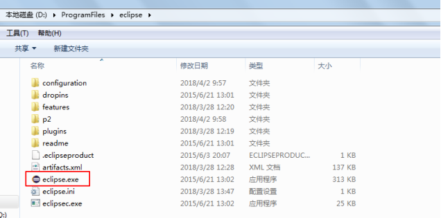

| 版本代号           | 平台版本        | 需要的JDK最低版本 |
| ------------------ | --------------- | ----------------- |
| Galileo（伽利略）  | 3.5             | JDK1.5            |
| Helios（太阳神）   | 3.6             | JDK1.5            |
| Indigo（靛蓝）     | 3.7             | JDK1.5            |
| Juno（朱诺，天后） | 3.8及4.2        | JDK1.5            |
| Kepler（开普勒）   | 4.3             | JDK1.6            |
| Luna（月神）       | 4.4             | JDK1.6            |
| Mars（火星）       | 4.5             | JDK1.7            |
| Neon（霓虹灯）  | 4.6               | JDK1.8 |
| Oxygen（氧气）  | 4.7               | JDK1.8 |
| Photon（光子）  | 4.8               | JDK1.8 |
| Eclipse 2018-09 | 4.9               |        |
| Eclipse 2018-12 | 4.10              |        |
| Eclipse 2019-03 | 4.11              |  |
| Eclipse 2019-06 | 4.12              |        |

## 2、工作空间workspace

### 1、eclipse的管理层次

工作空间：存放项目代码等、其中的.metadata目录中是eclipse关于本工作空间的个性化配置文件、插件

eclipse中管理层次是：工作空间 》 项目 》 包 》 类等

一个工作空间可以有很多的项目，但是项目之间是互相独立的，一个项目不能使用另一个项目中的类等

一个项目可以有很多的包，不同包之间的类可以通过导包方式互相使用

一个包中可以有很多的类

### 2、指定工作空间

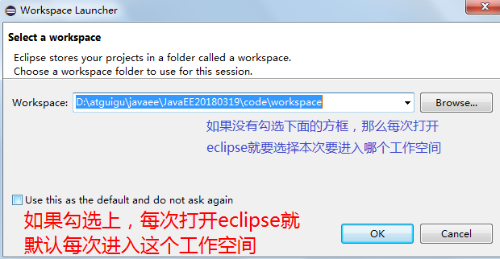

如果想取消默认进入某个工作空间，可以把下面的选项勾上：

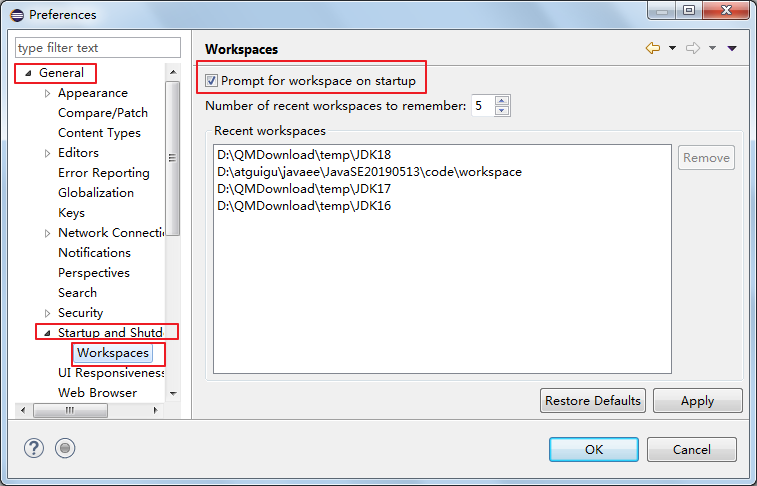

### 3、如何切换工作空间

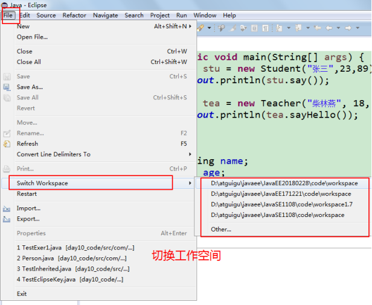

### 4、设置工作空间字符编码等


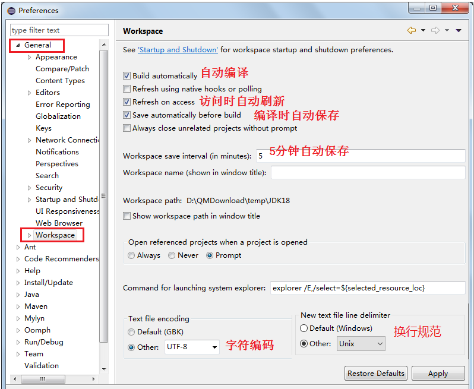

### 5、缩进4个空格


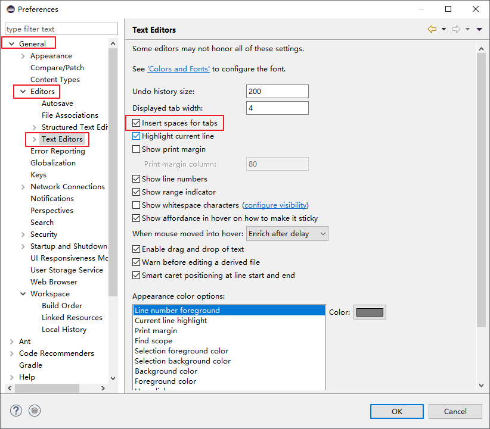

## 3、界面介绍

### 基本界面介绍

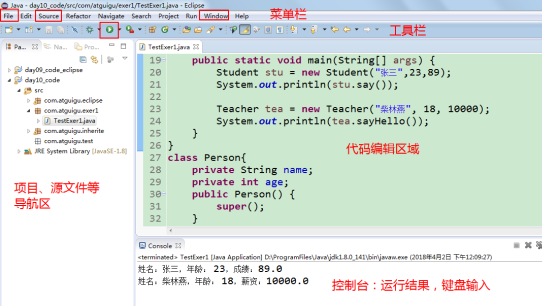

左边的导航区域：

* navigation：导航器
* package explorer：包资源管理器（建议初学者开发时选择使用这个，更紧凑一些）
* project explorer：项目资源管理器

### 如何打开各种小窗口

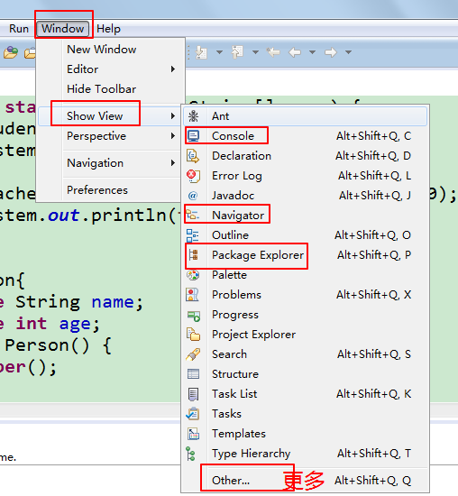

### 如何快速恢复界面布局

当界面中各种小窗口乱了，如何快速恢复如初：

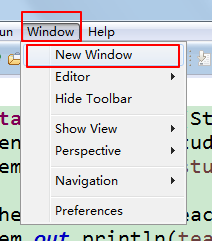

### 如何保存布局

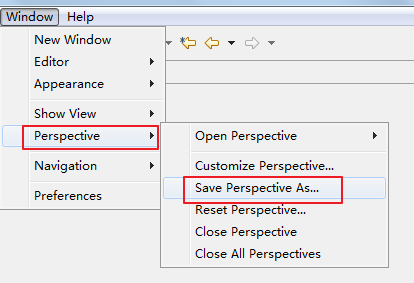

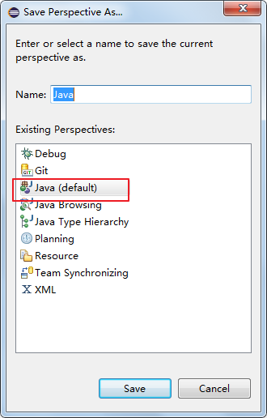


## 4、设置字体

Window -> Preferences -> General -> Appearance -> Colors and Fornts，只需修改 Basic 里面的 Text Font 就可以了

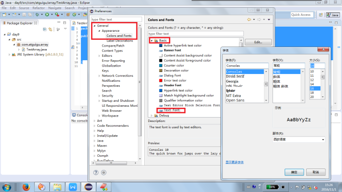


## 5、设置编辑区域背景颜色

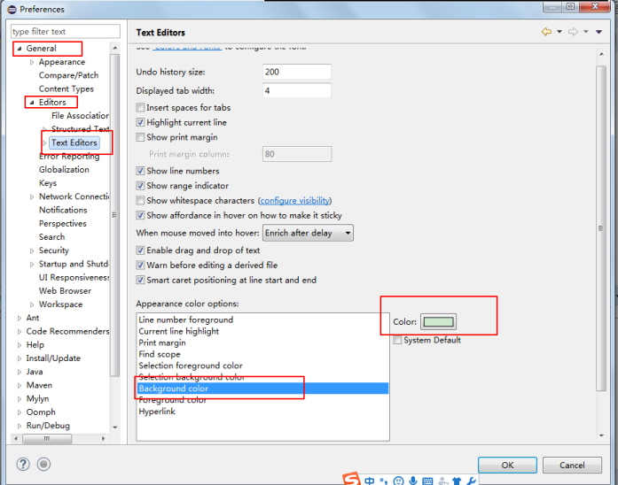

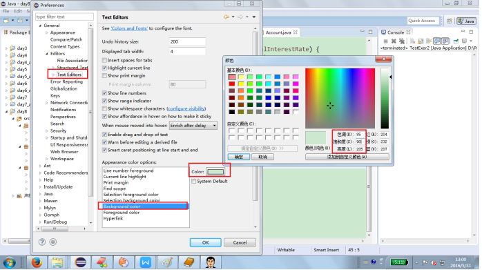

## 6、设置控制台相关颜色

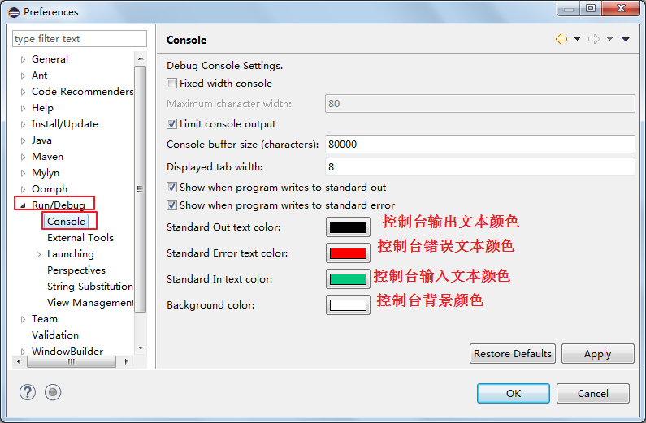


## 7、创建项目

File菜单--》New --》Java Project

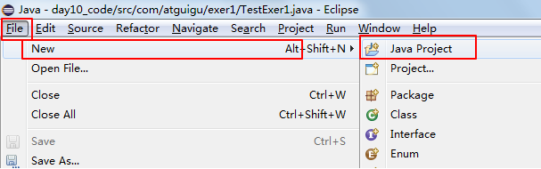

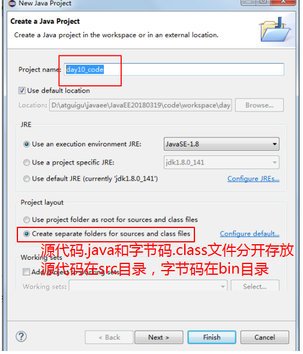

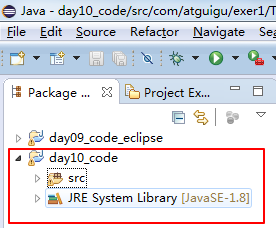

## 8、创建类等

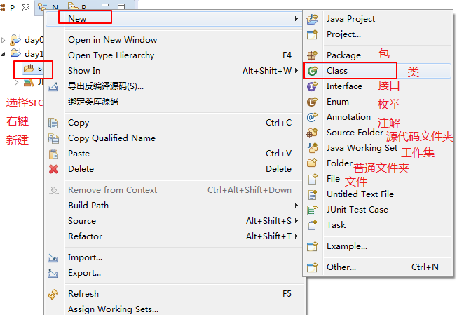

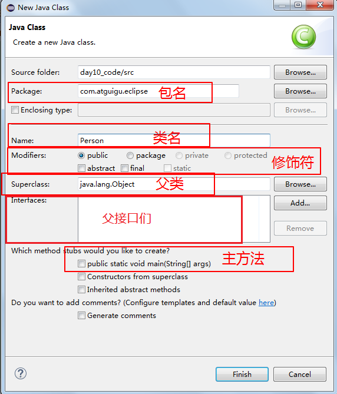

## 9、运行Java程序

要作为Java程序运行，该类必须包含main方法，而且在eclipse中，包含主方法的类必须与源文件名相同

三种方式运行Java程序

（1）工具栏选择**绿色**运行按钮 --> Run As --> Java Application

（2）菜单栏选择运行Run菜单 --> Run As --> Java Application

（3）光标定位到main所在的代码中，右键 --> Run As --> Java Application

（4）光标定位到main所在的代码中，快捷键Ctrl + F11

## 10、显示与隐藏行号

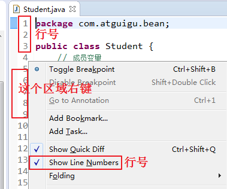

如果发现已经√上了，还是看不见，有可能你把行号的颜色与背景颜色设置成一样了


## 11、导入项目

File菜单--》import--》找到General展开，并找到Existing Projects into Workspace点击next,然后选择你要导入的项目

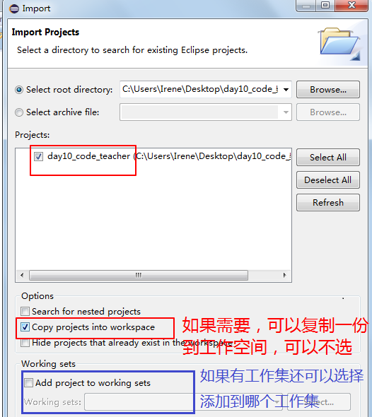

### 如何解决导入项目重名问题

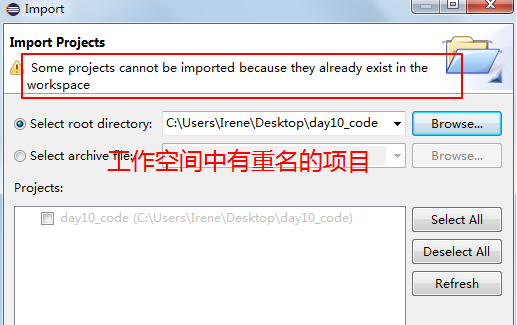

打开要导入的项目目录，找到.project项目配置文件，修改<name>新项目名</name>

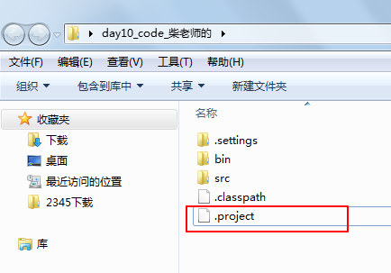

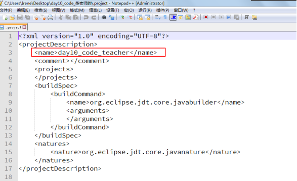

## 12、用工作集管理众多的项目

当工作空间的项目特别多时，可以分类管理项目。这个时候就需要用到working set

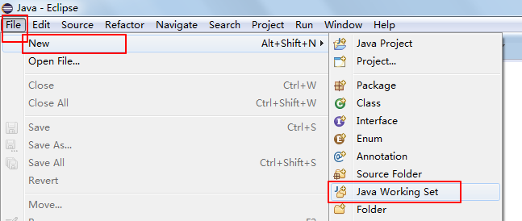

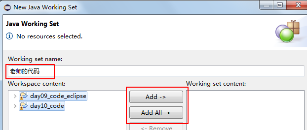

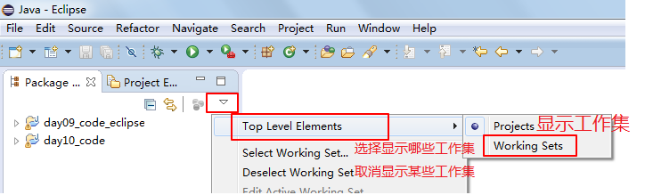

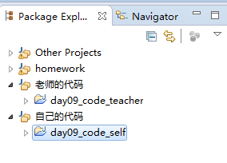

## 13、快捷键

### 软件通用的快捷键

* 保存：Ctrl + S
* 剪切：Ctrl + X
* 粘贴：Ctrl + V
* 复制：Ctrl + C
* 全选：Ctlr + A
* 撤销：Ctrl + Z
* 反撤销：Ctrl + Y
*  查找与替换：Ctrl + F  (find)


### Eclipse的快捷键

* 内容提示帮助：Alt + /
* 快速单词补全：Ctrl + Alt + /
* 方法形参列表提醒：Alt + Shift + /
* 快速帮助：Ctrl + 1
  * 快速把一个语句结果赋值给一个变量（assign statement to new local variable）
  * 编译错误快速提示修改建议
* 快速导包：Ctrl + Shift  + O
* 快速复制一行：
  * 向下复制一行：Ctrl + Alt + ↓
  * 向上复制一行：Ctrl + Alt + ↑
* 交换两行：
  * 与上一行交换：Alt + ↑
  * 与下一行交换：Alt + ↓
* 删除一行或选择的多行：Ctrl + D (delete)
* 注释：
  * 单行注释与取消单行注释：Ctrl +/
  * 多行注释：Ctrl + Shift + /
  * 取消多行注释：Ctrl +Shift  + \
* 快速格式化：Ctrl +Shift + F(format)
* 快速插入一行编辑
  * 在光标的下一行插入一个空行：Shift+回车
  * 在光标上一行插入新航开始编辑：Ctrl + Shift + 回车
* 多行编辑：Alt + Shift + A    再按一次退出多行编辑模式
* 弹出自动生成代码的菜单选择，包括自动生成构造器、get/set、equals、toString等：Alt + Shift + S
* 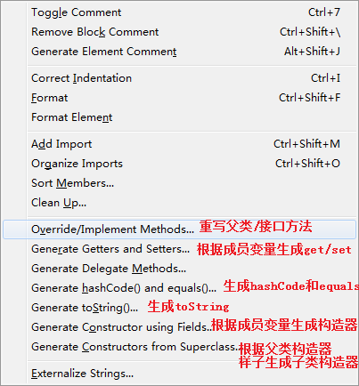
* 弹出包围当前代码的结构选择，包括for，while，try..catch等：Alt+Shift+Z
* 快速给类、变量、方法等重命名：Alt +Shift + R (rename)
* 将选中代码封装到一个新方法中：Alt + Shift +M (method)
* 打开某个类型的源代码：Ctrl+Shift+T  + 输入类型名
* 代码跟踪：Ctrl+点击某个类或方法        
* 回到刚刚的位置：Alt+<--
* 快速查看某类的继承关系图：选择某个类型后Ctrl+T
* 打开某个类型成员列表图：Ctrl + O (outline)
* 打开的多个源文件切换：Alt + ←， Alt + →
* ​				         Ctrl + PgUp，Ctrl + PgDown  

### 自定义eclipse快捷键

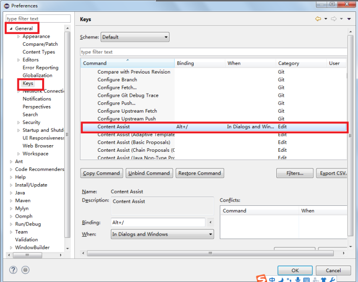

例如：自定义快速合拢和展开所有方法体的快捷键

collapse all（合拢）：Ctrl + Shift + PgUP

expand all（展开）：Ctrl + Shift + PgDn

## 14、快速开发模板

1、main方法：main + Alt + / 选择main方法后回车

2、System.out语句：sysout +  Alt + / + 选择sysout回车

3、for循环：for +  Alt + / + 选择for回车

4、switch结构：switch + Alt + / + 选择switch

### 定义自己的开发模板

例如：sop ==> System.out.print();

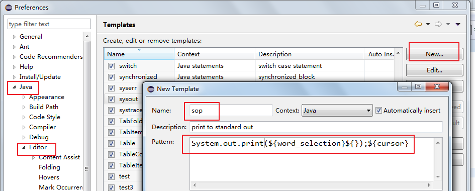

## 15、修改代码风格

在创建类时，自动创建构造器和main等时，方法体中有

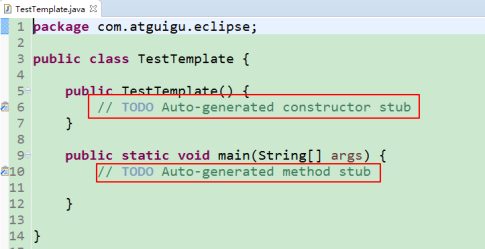

如何去掉呢？

windows-->Preferences -->Java-->Code Style -->Code Template --> Code --> xxx body -->把不要的去掉

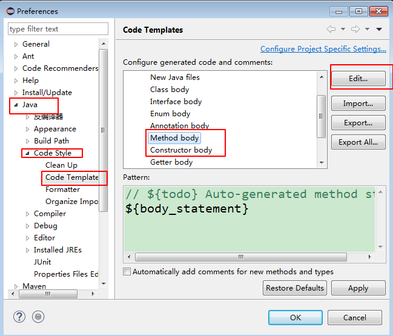

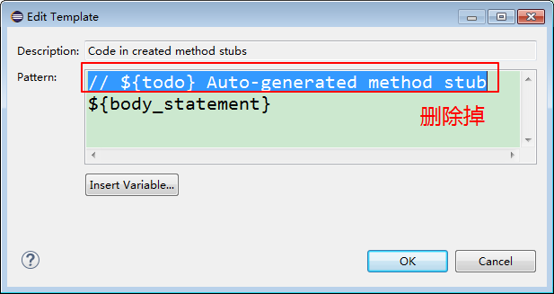

## 16、Debug

在所有调试中，调试一个Java程序是最简单的，主要有设置断点、启动调试、单步执行、结束调试几步。

1）设置断点：在源代码文件中，在想要设置断点的代码行的前面的标记行处，双击鼠标左键就可以设置断点，在相同位置再次双击即可取消断点。

2）启动调试：Eclipse提供四种方式来启动程序(Launch)的调试，分别是通过菜单(Run –> Debug)、图标(“绿色臭虫”、右键->Debug As以及快捷键(F11)，在这一点上，与其他命令(例如Run)类似。

弹出提示，需要切换到调试（Debug）工作区，然后点击【Yes】。

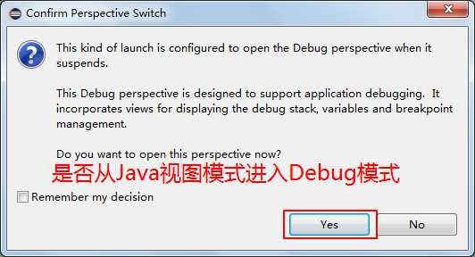

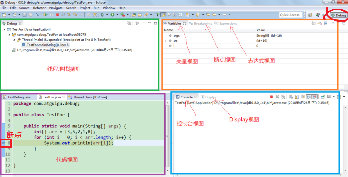

### Debug小工具

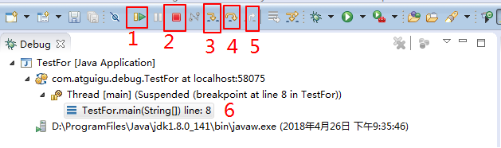

1.表示从当前位置继续运行直到下一个断点，快捷键为F8。 

2.表示打断整个进程，结束整个程序。 

3.表示进入当前方法，快捷键为F5。 

4.表示运行下一行代码，快捷键为F6。单步调试。 

5.表示退出当前方法，返回到调用层，快捷键为F7。 

6.表示当前线程的堆栈，从中可以看出在运行哪些代码，并且整个调用过程，以及代码行号。

## 17、练习eclipse的使用

### 练习1:

1、设置eclipse的工作空间workspace，这就是以后存放你在eclipse中编写的代码的目录

2、设置eclipse当前工作空间的字符编码为UTF-8

3、设置自己喜欢的字体颜色

4、创建工作集：teacher_code（存放老师的项目代码），self_code（存放自己上课练习的代码），homework（存放作业代码），project（存放项目代码）等

5、自定义快速合拢和展开所有方法体的快捷键

collapse all（合拢）：Ctrl + Shift + PgUP

expand all（展开）：Ctrl + Shift + PgDn

6、自定义开发模板

sop： ==> System.out.print();

### 练习2：

1、创建day09_eclipse_self的Java项目

2、创建包：com.atguigu.eclipse.demo

3、创建类：com.atguigu.eclipse.demo.TestEclipse类，并编写main方法，打印“hello eclipse"并运行

4、创建类：com.atguigu.bean.Person类，并包括属性：id,name,age,gender，并私有化，提供无参和有参构造，get/set方法

5、创建类：com.atguigu.test.TestPesron类，并编写main方法，并创建Person对象，打印显示对象信息

6、创建类：com.atguigu.test.TestInput类，并编写main方法，并用无参构造创建Person对象，然后用Scanner，从键盘输入各个信息，为Person对象属性赋值，并打印对象信息

7、创建类：com.atguigu.test.Count类，并编写public  int  sum(int n)：用递归就1-n的累加和

8、创建类：com.atguigu.test.TestCount类，并编写main方法，在main中编写for循环，从1循环到10，

并在循环体中调用sum(i)，打印结果，并用debug调试运行过程

9、创建类：com.atguigu.test.TestArray类，并编写main方法，在main中编写如下代码：

```java
    public static void main(String[] args){
    	int[] arr = {3,6,2,8,4};
    	
    	for (int i = 1; i < arr.length; i++) {
			for (int j = 0; j <= arr.length-i; j++) {
				if(arr[j] > arr[j+1]){
					int temp =arr[j];
					arr[j] = arr[j+1];
					arr[j+1] = temp;
				}
			}
		}
    	
    	for (int i = 0; i < arr.length; i++) {
			System.out.println(arr[i]);
		}
    }
```

用Debug找出问题

## 18、eclipse使用中的一些小问题

1、在方法外使用sysout等

2、编译报错仍然视而不见，继续运行

3、类、包、变量重命名问题

4、把在一个源文件中的多个类移动到新的独立.java文件中

5、抽取重复的代码重构成方法