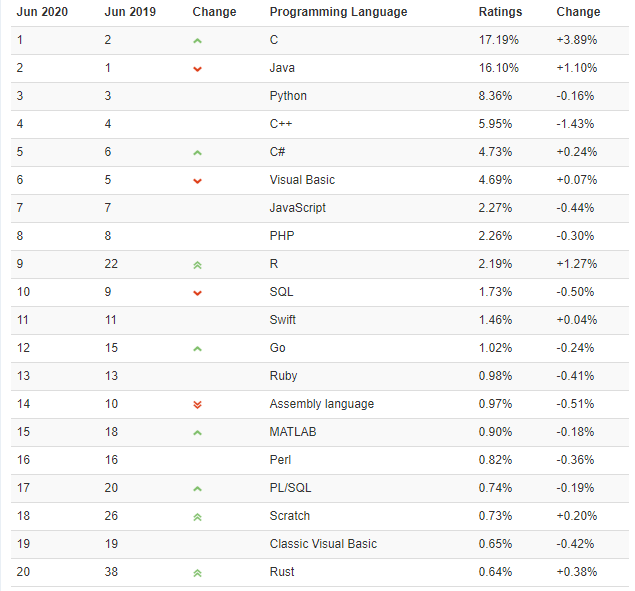
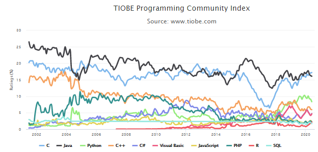
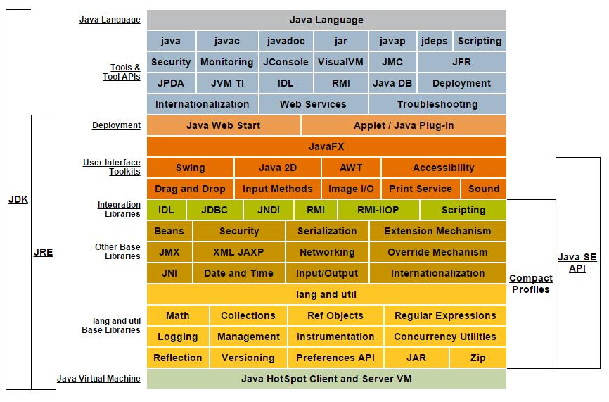
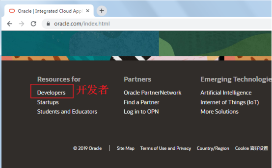
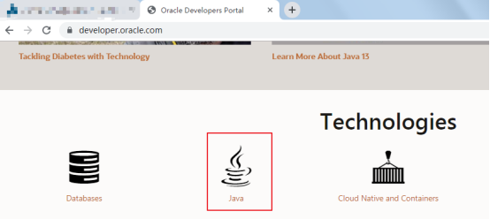
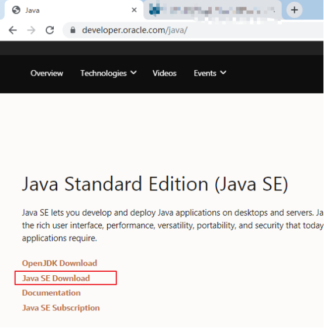
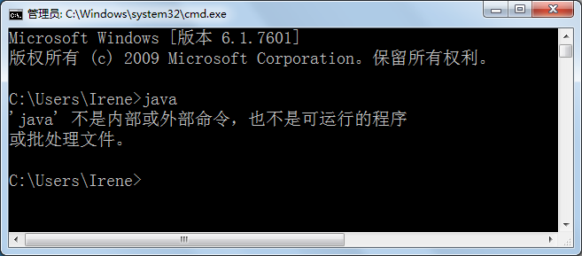
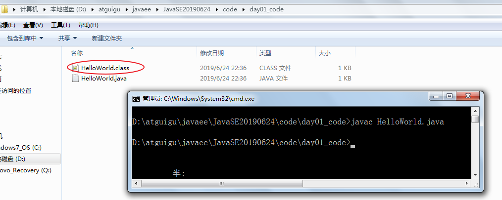

# JavaSE_第1章 Java概述

## 学习目标

* [ ] 理解Java语言的跨平台实现原理
* [ ] 理解JDK/JRE/JVM的组成和作用
* [ ] 能够配置环境变量JAVA_HOME（会参照笔记配置）
* [ ] 能够编写HelloWorld程序编译并执行
* [ ] 会使用单行注释和多行注释

# 第一章 Java概述

## 1.1 JavaSE课程体系介绍

JavaSE知识图解


JavaSE知识模块介绍

* **第一部分：计算机编程语言核心结构：**`数据类型`、`运算符`、`流程控制`、`数组`、…
* **第二部分：Java面向对象核心逻辑：**`类和对象`、`封装`、`继承`、`多态`、`抽象`、`接口`、…
* **第三部分：JavaSE核心高级应用：**`集合`、`I/O`、`多线程`、`网络编程`、`反射机制`、…
* **第四部分：Java新特性：**`Lambda表达式`、`函数式编程`、`新Date/Time API`、`接口的默认、静态和私有方法`、…
* **第五部分：MySQL/JDBC核心技术：**`SQL语句`、`数据库连接池`、`DBUtils`、`事务管理`、`批处理`、…

## 1.2 计算机语言介绍（了解）

### 计算机语言是什么

所谓计算机编程语言，就是人们可以使用编程语言对计算机下达命令，让计算机完成人们需要的功能。

### 计算机语言发展

* 第一代：机器语言
* 第二代：汇编语言
* 第三代：高级语言

### 计算机语言排行榜



### 计算机语言走势



## 1.3 Java语言概述（了解）

### Java生态圈

**Java是目前应用最为广泛的软件开发平台之一。**随着Java以及Java社区的不断壮大，Java 也早已不再是简简单单的一门计算机语言了，它更是一个平台、一种文化、一个社区。

**作为一个平台，**Java虚拟机扮演着举足轻重的作用。除了 Java语言，任何一种能够被编译成字节码的计算机语言都属于Java这个平台。Groovy、Scala、 JRuby、Kotlin等都是Java平台的一部分，它们依赖于Java虚拟机，同时，Java平台也因为它们变得更加丰富多彩。

**作为一种文化，**Java几乎成为了 “开源”的代名词。在Java程序中，有着数不清的开源软件和框架。如Tomcat、Struts, Hibernate, Spring等。就连JDK和JVM自身也有不少开源的实现，如OpenJDK、Apache Harmony。可以说，“共享”的精神在Java世界里体现得淋漓尽致。

**作为一个社区，**Java拥有全世界最多的技术拥护者和开源社区支持，有数不清的论坛和资料。从桌面应用软件、嵌入式开发到企业级应用、后台服务器、中间件，都可以看到Java的身影。其应用形式之复杂、参与人数之众多也令人咋舌。可以说，Java社区已经俨然成为了一个良好而庞大的生态系统。**其实这才是Java最大的优势和财富。**

### Java 是最好的语言吗？

不是，因为在每个领域都有更合适的编程语言。

- C 语言无疑是现代计算机软件编程语言的王者，几乎所有的操作系统都是 C 语言写成的。C++ 是面向对象的 C 语言，一直在不断的改进。


- JavaScript 是能运行在浏览器中的语言，丰富的前端界面离不开 Javascript 的功劳。近年来的 Node.js 又在后端占有一席之地。
- Python 用于系统管理，并通过高性能预编译的库，提供 API 来进行科学计算，文本处理等，是 Linux 必选的解释性语言。
- Ruby 强于 DSL（领域特定语言），程序员可以定义丰富的语义来充分表达自己的思想。
- Erlang 就是为分布式计算设计的，能保证在大规模并发访问的情况下，保持强壮和稳定性。
- Go 语言内置了并发能力，可以编译成本地代码。当前新的网络相关项目，很大比例是由 Go 语言编写的，如 Docker、Kubernetes 等。
- 编写网页用 PHP，函数式编程有 Lisp，编写 iOS 程序有 Swift/Objective-C。
-  R的思想是：它可以提供一些集成的统计工具，但更大量的是它提供各种数学计算、统计计算的[函数](https://baike.baidu.com/item/函数/301912)，从而使使用者能灵活机动的进行数据分析，甚至创造出符合需要的新的统计计算方法 
-  SQL 是用于访问和处理数据库的标准的计算机语言， 这类数据库包括：MySQL，Oracle, Sybase, SQL Server, DB2, Access 等等 


一句话概括，**能留在排行榜之上的语言，都是好的语言，在其所在的领域能做到最好。**

### Java语言发展历史

Java诞生于SUN（Stanford University Network），09年SUN被Oracle（甲骨文）收购。

Java之父是詹姆斯.高斯林(James Gosling)。

1996年发布JDK1.0版。

目前最新的版本是Java13。我们学习的Java8。

|   发行版本   |  发行时间  |                             备注                             |
| :----------: | :--------: | :----------------------------------------------------------: |
|     Java     | 1995.05.23 |     Sun公司在Sun world会议上正式发布Java和HotJava浏览器      |
|   Java 1.0   | 1996.01.23 |             Sun公司发布了Java的第一个开发工具包              |
|   Java 1.1   | 1997.02.19 |                                                              |
|   Java 1.2   | 1998.12.08 |    拆分成：J2SE（标准版）、J2EE（企业版）、J2ME（小型版）    |
|   Java 1.3   | 2000.05.08 |                                                              |
|   Java1.4    | 2004.02.06 |                                                              |
| **Java 5.0** | 2004.09.30 | ①版本号从1.4直接更新至5.0；②平台更名为JavaSE、JavaEE、JavaME |
|   Java 6.0   | 2006.12.11 |               2009.04.20 Oracle宣布收购SUN公司               |
|   Java 7.0   | 2011.07.02 |                                                              |
| **Java 8.0** | 2014.03.18 |                                                              |
|   Java 9.0   | 2017.09.22 |    ①每半年更新一次；②Java 9.0开始不再支持windows 32位系统    |
|  Java 10.0   | 2018.03.21 |                                                              |
|  Java 11.0   | 2018.09.25 |                  JDK安装包取消独立JRE安装包                  |
|  Java 12.0   | 2019.03.19 |                                                              |
|  Java 13.0   | 2019.9.18  |                                                              |

### Java技术体系平台

* JavaSE（Java Platform, Standard Edition标准版）：允许您在桌面和服务器上开发和部署Java应用程序。Java提供了丰富的用户界面、性能、多功能性、可移植性和当今应用程序所需的安全性。
* JavaEE（Java Platform, Enterprise Edition企业版）：是为开发企业环境下的应用程序提供的一套解决方案，主要针对于Web应用程序开发。
* JavaME（Java Platform, Micro Edition 小型版）：为互联网上的嵌入式和移动设备上运行的应用提供了一个健壮、灵活的环境：微控制器、传感器、网关、移动电话、个人数字助理（PDA）、电视机顶盒、打印机等等。JavaME包括灵活的用户界面、健壮的安全性、内置的网络协议，以及支持动态下载的网络和离线应用程序。基于JavaME的应用程序在许多设备上都是可移植的，但是利用了每个设备的本机功能。
  *  Java Embedded: 用于解锁物联网的智能设备的价值：
    通过远程市场更新和刷新功能延长产品生命周期和价值；
    利用Java的可伸缩性、健壮性、可移植性和全套功能，提高生产效率，降低成本，缩短上市时间；
    在边缘启用快速数据功能；
  * Java Card：使安全元件（如智能卡和其他防篡改安全芯片）能够承载采用Java技术的应用程序。Java card提供了一个安全的、可互操作的执行平台，它可以在一个资源受限的设备上存储和更新多个应用程序，同时保持最高的认证级别和与标准的兼容性。
  * Java TV：是一种基于JavaME的技术，它为开发在tv和机顶盒设备上运行的java应用程序提供了一个性能良好、安全且易于实现的解决方案。使用Java TV运行时，开发人员可以轻松创建应用程序，例如电子节目指南（EPG）、视频点播（VOD）客户端、游戏和教育应用程序、用于访问Internet数据的应用程序（例如天气、新闻播报器、社交网络）以及大多数蓝光光盘标题上的用户界面和奖金内容。

## 1.4 Java语言跨平台原理

### Java语言的特点

* **完全面向对象：**Java语言支持封装、继承、多态，面向对象编程，让程序更好达到`高内聚`，`低耦合`的标准。
* **支持分布式：**Java语言支持Internet应用的开发，在基本的Java应用编程接口中有一个网络应用编程接口（java net），它提供了用于网络应用编程的类库，包括URL、URLConnection、Socket、ServerSocket等。Java的RMI（远程方法激活）机制也是开发分布式应用的重要手段。
* **健壮型：**Java的强类型机制、异常处理、垃圾的自动收集等是Java程序健壮性的重要保证。对指针的丢弃是Java的明智选择。
* **安全：**Java通常被用在网络环境中，为此，Java提供了一个安全机制以防恶意代码的攻击。如：安全防范机制（类ClassLoader），如分配不同的名字空间以防替代本地的同名类、字节代码检查。
* **跨平台性：**Java程序（后缀为java的文件）在Java平台上被编译为体系结构中立的字节码格式（后缀为class的文件），然后可以在实现这个Java平台的任何系统中运行。

### Java语言的跨平台原理

- **跨平台**：任何软件的运行，都必须要运行在操作系统之上，而我们用Java编写的软件可以运行在任何的操作系统上，这个特性称为**Java语言的跨平台特性**。该特性是由JVM实现的，我们编写的程序运行在JVM上，而JVM运行在操作系统上。
- **JVM**（Java Virtual Machine ）：Java虚拟机，简称JVM，是运行所有Java程序的假想计算机，是Java程序的运行环境之一，也是Java 最具吸引力的特性之一。我们编写的Java代码，都运行在**JVM** 之上。


如图所示，Java的虚拟机本身是不具备跨平台功能的，每个操作系统下都有不同版本的虚拟机。

- **JRE ** (Java Runtime Environment) ：是Java程序的运行时环境，包含`JVM` 和运行时所需要的`核心类库`。
- **JDK**  (Java Development Kit)：是Java程序开发工具包，包含`JRE` 和开发人员使用的工具。

我们想要运行一个已有的Java程序，那么只需安装`JRE` 即可。

我们想要开发一个全新的Java程序，那么必须安装`JDK` ，其内部包含`JRE`。




## 1.5 JDK下载和安装

### JDK的下载

* 下载网址：www.oracle.com 

* 下载步骤：

  * 登录Oracle公司官网，www.oracle.com，如图所示：在底部选择Developers开发者

    

  * 在**Developers**页面中间的技术分类部分，选择`Java`，单击进入，如图所示：

    

  * 下拉页面，找到**Java**，在此选择`JavaSEDownload`，单击进入，如图所示：

  

  * 选择Downloads选项卡，默认是最新版的Java13下载，在此处选择`Oracle JDK DOWNLOAD`，单击进入可以下载JDK13，如图所示：


选择**Accept License Agreement**，并选择对应的操作系统类型，如图所示


  * 如果要下载之前JDK版本，那么在刚才JavaSE/Download页面，下拉到最下面，找到Java Archive（Java档案馆），单击Download


例如：这里选择JavaSE 8(8U211 and later)，选择**Accept License Agreement**，并选择对应的操作系统类型。早期版本分为32位/64位操作系统区分，其中x86表示32位，x64表示64位。


### JDK的安装

* 安装步骤：

  * 双击`jdk-8u202-windows-x64.exe`文件，并单击`下一步`，如图所示：

    

  * 取消独立JRE的安装，单击`公共JRE前的下拉列表`，选择`此功能将不可用`如图所示：

    

  * 修改安装路径，单击更改，如图所示：

    

  * 将安装路径修改为`D:\develop\Java\jdk1.8.0_202\`，并单击确定，如图所示：

    

  * 单击下一步，如图所示：

    

  * 稍后几秒，安装完成，如图所示：

    

  * 目录结构，如图所示：

    

## 1.6 配置环境变量

为什么配置path？

希望在命令行使用javac.exe等工具时，任意目录下都可以找到这个工具所在的目录。

例如：我们在C:\Users\Irene目录下使用java命令，结果如下：



我们在JDK的安装目录的bin目录下使用java命令，结果如下：


我们不可能每次使用java.exe，javac.exe等工具的时候都进入到JDK的安装目录下，太麻烦了。我们希望在任意目录下都可以使用JDK的bin目录的开发工具，因此我们需要告诉操作系统去哪里找这些开发工具，这就需要配置path环境变量。

### 1.7.1 只配置path

* 步骤：

  * 打开桌面上的计算机，进入后在左侧找到`计算机`，单击鼠标`右键`，选择`属性`，如图所示：

    

  * 选择`高级系统设置`，如图所示：

    

  * 在`高级`选项卡，单击`环境变量`，如图所示：

    

  * 在`系统变量`中，选中`Path` 环境变量，`双击`或者`点击编辑` ,如图所示：

    

  * 在变量值的最前面，键入`D:\develop\Java\jdk1.8.0_202\bin;`  分号必须要写，而且还要是**英文符号**。如图所示：

    

  * 环境变量配置完成，**重新开启**DOS命令行，在任意目录下输入`javac` 命令，运行成功。

    


### 1.7.2 配置JAVA_HOME+path
* 步骤：

  * 打开桌面上的计算机，进入后在左侧找到`计算机`，单击鼠标`右键`，选择`属性`，如图所示：

    

  * 选择`高级系统设置`，如图所示：

    

  * 在`高级`选项卡，单击`环境变量`，如图所示：

    

  * 在`系统变量`中，单击`新建` ，创建新的环境变量，如图所示：

    

  * 变量名输入`JAVA_HOME`，变量值输入 `D:\develop\Java\jdk1.8.0_202` ，并单击`确定`，如图所示：

    

  * 选中`Path` 环境变量，`双击`或者`点击编辑` ,如图所示：

    

  * 在变量值的最前面，键入`%JAVA_HOME%\bin;`  分号必须要写，而且还要是**英文符号**。如图所示：

    

  * 环境变量配置完成，**重新开启**DOS命令行，在任意目录下输入`javac` 命令，运行成功。

    


## 1.7 入门程序HelloWorld

### 1.7.1 HelloWorld案例

#### 程序开发步骤说明

JDK安装完毕，可以开发我们第一个Java程序了。

Java程序开发三步骤：**编写**、**编译**、**运行**。


#### 编写Java源程序

1. 在`D:\atguigu\javaee\JavaSE20190624\code\day01_code` 目录下新建文本文件，完整的文件名修改为`HelloWorld.java`，其中文件名为`HelloWorld`，后缀名必须为`.java` 。
2. 用记事本或notepad++等文本编辑器打开

3. 在文件中键入文本并保存，代码如下：

```java
public class HelloWorld {
  	public static void main(String[] args) {
    	System.out.println("HelloWorld");
  	}
}
```

> 友情提示：
>
> 每个字母和符号必须与示例代码一模一样。

第一个`HelloWord` 源程序就编写完成了，但是这个文件是程序员编写的，JVM是看不懂的，也就不能运行，因此我们必须将编写好的`Java源文件` 编译成JVM可以看懂的`字节码文件` ，也就是`.class`文件。

编译Java源文件

在DOS命令行中，**进入**`D:\atguigu\javaee\JavaSE20190624\code\day01_code`**目录**，使用`javac` 命令进行编译。

命令：

```java
javac Java源文件名.后缀名
```

举例：

```
javac HelloWorld.java
```



编译成功后，命令行没有任何提示。打开`D:\atguigu\javaee\JavaSE20190624\code\day01_code`目录，发现产生了一个新的文件 `HelloWorld.class`，该文件就是编译后的文件，是Java的可运行文件，称为**字节码文件**，有了字节码文件，就可以运行程序了。 

> Java源文件的编译工具`javac.exe`

#### 运行Java程序

在DOS命令行中，**进入Java源文件的目录**，使用`java` 命令进行运行。

命令：

```java
java 类名字
```

举例：

```
java HelloWorld
```

> 友情提示：
>
> java HelloWord  不要写 不要写 不要写 .class


> Java字节码文件的运行工具：java.exe

### 1.7.2 HelloWorld案例常见错误

* 	单词拼写问题
  * 正确：class		错误：Class
  * 正确：String              错误：string
  * 正确：System            错误：system
  * 正确：main		错误：mian
* 	Java语言是一门严格区分大小写的语言
* 	标点符号使用问题
  * 不能用中文符号，英文半角的标点符号（正确）
  * 括号问题，成对出现

### 1.7.3 Java程序的结构与格式

结构：

```java
类{
    方法{
        语句;
    }
}
```

格式：

（1）每一级缩进一个Tab键

（2）{}的左半部分在行尾，右半部分单独一行，与和它成对的"{"的行首对齐

### 1.7.4 Java程序的入口

Java程序的入口是main方法

```java
public static void main(String[] args){
    
}
```

### 1.7.5 编写Java程序时应该注意的问题

1、字符编码问题

当cmd命令行窗口的字符编码与.java源文件的字符编码不一致，如何解决？


解决方案一：

	在Notepad++等编辑器中，修改源文件的字符编码


解决方案二：

	在使用javac命令式，可以指定源文件的字符编码

```cmd
javac -encoding utf-8 Review01.java
```


2、大小写问题

（1）源文件名：

	不区分大小写，我们建议大家还是区分

（2）字节码文件名与类名

	区分大小写

（3）代码中

	区分大小写


3、源文件名与类名一致问题？

（1）源文件名是否必须与类名一致？public呢？

如果这个类不是public，那么源文件名可以和类名不一致。

如果这个类是public，那么要求源文件名必须与类名一致。

我们建议大家，不管是否是public，都与源文件名保持一致，而且一个源文件尽量只写一个类，目的是为了好维护。


（2）一个源文件中是否可以有多个类？public呢？

一个源文件中可以有多个类，编译后会生成多个.class字节码文件。

但是一个源文件只能有一个public的类。


（3）main必须在public的类中吗？

不是。

但是后面写代码时，基本上main习惯上都在public类中。
