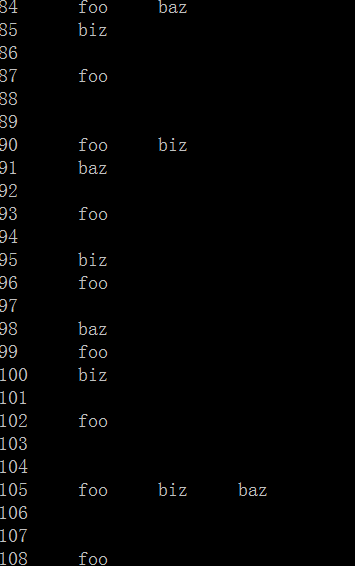
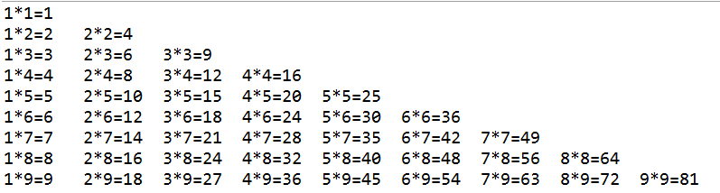
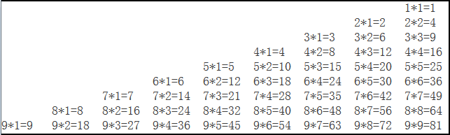
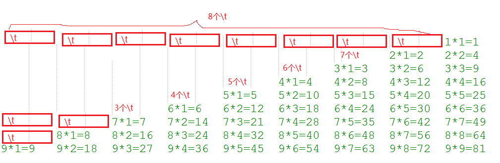
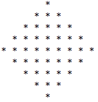
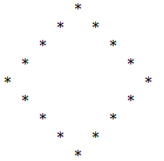

# day04【流程控制语句】拓展练习

## 第1题：累加和

1、求1-100的和

## 第2题：1-100偶数

2、打印1-100的偶数

## 第3题：正负数个数

3、从键盘输入整数，输入0结束，统计输入的正数、负数的个数。

## 第4题：猜数

4、随机生成一个100以内的正整数，猜数字游戏

从键盘输入数，如果大了提示，大了，如果小了，提示小了，如果对了，就不再猜了，并统计一共猜了多少次

提示：随机数  

（1）Math.random()

double num = Math.random();// [0,1)的小数

（2）java.util.Random rand = new java.util.Random();

int num= rand.nextInt(100);//[0,100)的整数

## 第5题：水仙花数

5、输出所有的水仙花数，所谓水仙花数是指一个3位数，其各个位上数字立方和等于其本身。

​    例如： 153 = 1\*1\*1 + 5\*5\*5 + 3\*3\*3 

打印所有水仙花数的个数？

## 第6题：foobizbaz

6、从1循环到150并在每行打印一个值，

另外在每个3的倍数行上打印出“foo”,在每个5的倍数行上打印“biz”,

在每个7的倍数行上打印输出“baz”。

例如：

## 第7题：最大公约数和最小公倍数  

7、输入两个正整数m和n，求其最大公约数和最小公倍数

## 第8题：3、5、7的倍数不打印

8、打印1-100之间数，其中3、5、7的倍数不打印

## 第9题：完数

9、一个数如果恰好等于它的因子之和，这个数就称为"完数"。（因子：除去这个数本身的约数）

例如6=1＋2＋3.编程 找出1000以内的所有完数

## 第10题：九九乘法表

10、九九乘法表

## 第11题：菱形

11、打印菱形

## 第12题：素数

12、找出1-100之间所有的素数（质数）

