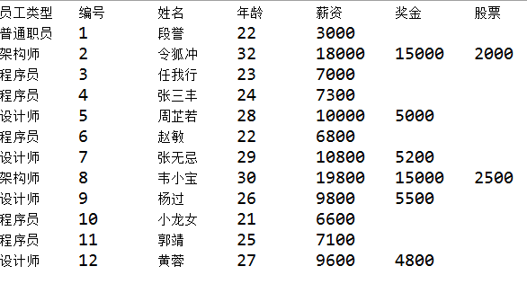
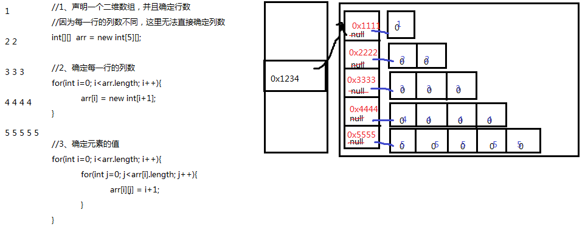

# 第4章【数组】

## 学习目标

- [ ] 理解容器的概念
- [ ] 掌握数组的声明和初始化
- [ ] 使用索引访问数组的元素
- [ ] 了解数组的内存图解
- [ ] 避免空指针和越界异常
- [ ] 掌握数组的遍历
- [ ] 掌握数组元素的统计
- [ ] 掌握数组最大值的获取
- [ ] 掌握数组元素的查找
- [ ] 掌握数组的冒泡排序

# 第四章 数组

## 4.1 容器概述

### 案例分析

现在需要统计某公司员工的工资情况，例如计算平均工资、找到最高工资等。假设该公司有50名员工，用前面所学的知识，程序首先需要声明50个变量来分别记住每位员工的工资，然后在进行操作，这样做会显得很麻烦，而且错误率也会很高。因此我们可以使用容器进行操作。将所有的数据全部存储到一个容器中，统一操作。

### 容器概念

- **容器：**是将多个数据存储到一起，每个数据称为该容器的元素。
- **生活中的容器：**水杯，衣柜，教室

## 4.2 数组的概念

- **数组概念：** 数组就是用于存储数据的长度固定的容器，保证多个数据的数据类型要一致。

百度百科中对数组的定义：

所谓**数组**(array)，就是相同数据类型的元素按一定顺序排列的集合，就是把有限个类型相同的变量用一个名字命名，以便统一管理他们，然后用编号区分他们，这个名字称为**数组名**，编号称为**下标或索引**(index)。组成数组的各个变量称为数组的**元素**(element)。数组中元素的个数称为**数组的长度**(length)。


数组的特点：

1、数组的长度一旦确定就不能修改

2、创建数组时会在内存中开辟一整块连续的空间。

3、存取元素的速度快，因为可以通过[下标]，直接定位到任意一个元素。

## 4.3 数组的声明与初始化

数组的声明：

```java
//推荐
元素的数据类型[] 二维数组的名称;

//不推荐
元素的数据类型  二维数组名[];
```

### 方式一：静态初始化

* **格式：**

```java
数据类型[] 数组名 = {元素1,元素2,元素3...};//必须在一个语句中完成，不能分开两个语句写
```

* 举例：

定义存储1，2，3，4，5整数的数组容器

```java
int[] arr = {1,2,3,4,5};//正确

int[] arr;
arr = {1,2,3,4,5};//错误
```

### 方式二：静态初始化

* **格式：**

```java
数据类型[] 数组名 = new 数据类型[]{元素1,元素2,元素3...};
或
数据类型[] 数组名;
数组名 = new 数据类型[]{元素1,元素2,元素3...};
```

* 举例：

定义存储1，2，3，4，5整数的数组容器。

```java
int[] arr = new int[]{1,2,3,4,5};//正确

int[] arr;
arr = new int[]{1,2,3,4,5};//正确

int[] arr = new int[5]{1,2,3,4,5};//错误的，后面有{}指定元素列表，就不需要在[长度]指定长度。
```

### 方式三：动态初始化

- **格式：**

```java
 数组存储的元素的数据类型[] 数组名字 = new 数组存储的元素的数据类型[长度];

  或

 数组存储的数据类型[] 数组名字;
 数组名字 = new 数组存储的数据类型[长度];
```

- 数组定义格式详解：
  - 数组存储的元素的数据类型： 创建的数组容器可以存储什么数据类型的数据。
  - 元素的类型可以是任意的Java的数据类型。例如：int, String, Student等
  - [] : 表示数组。
  - 数组名字：为定义的数组起个变量名，满足标识符规范，可以使用名字操作数组。
  - new：关键字，创建数组使用的关键字。因为数组本身是引用数据类型，所以要用new创建数组对象。
  - [长度]：数组的长度，表示数组容器中可以存储多少个元素。
  - **注意：数组有定长特性，长度一旦指定，不可更改。**
    - 和水杯道理相同，买了一个2升的水杯，总容量就是2升，不能多也不能少。
- 举例：

定义可以存储5个整数的数组容器，代码如下：

```java
int[] arr = new int[5];

int[] arr;
arr = new int[5];
```

> 思考：用这种方式初始化的数组，元素有值吗？

## 4.4 数组元素的访问

- **索引：** 每一个存储到数组的元素，都会自动的拥有一个编号，从0开始，这个自动编号称为**数组索引(index)**，可以通过数组的索引访问到数组中的元素。
- **索引范围：**[0, 数组的长度-1]
- **格式：**

```java
数组名[索引]
```

- **索引访问数组中的元素：**
  - 数组名[索引]=数值，为数组中的元素赋值
  - 变量=数组名[索引]，获取出数组中的元素

```java
public static void main(String[] args) {
    //定义存储int类型数组，赋值元素1，2，3，4，5
    int[] arr = {1,2,3,4,5};
    //为0索引元素赋值为6
    arr[0] = 6;
    //获取数组0索引上的元素
    int i = arr[0];
    System.out.println(i);
    //直接输出数组0索引元素
    System.out.println(arr[0]);
}
```

## 4.5 数组的遍历

* **数组的长度属性：** 每个数组都具有长度，而且是固定的，Java中赋予了数组的一个属性，可以获取到数组的长度，语句为：`数组名.length` ，属性length的执行结果是数组的长度，int类型结果。由次可以推断出，数组的最大索引值为`数组名.length-1`。
* **数组遍历：** 就是将数组中的每个元素分别获取出来，就是遍历。遍历也是数组操作中的基石。

```java
public static void main(String[] args) {
  	int[] arr = new int[]{1,2,3,4,5};
  	//打印数组的属性，输出结果是5
  	System.out.println("数组的长度：" + arr.length);
    
    //遍历输出数组中的元素
    System.out.println("数组的元素有：");
    for(int i=0; i<arr.length; i++){
        System.out.println(arr[i]);
    }
}
```

## 4.6 数组元素的默认值

当我们使用动态初始化创建数组时：

```java
 数组存储的元素的数据类型[] 数组名字 = new 数组存储的元素的数据类型[长度];
```

此时只确定了数组的长度，那么数组的元素是什么值呢？

数组的元素有默认值：


## 4.7 数组内存图

### 4.7.1 内存概述

内存是计算机中重要的部件之一，它是与CPU进行沟通的桥梁。其作用是用于暂时存放CPU中的运算数据，以及与硬盘等外部存储器交换的数据。只要计算机在运行中，CPU就会把需要运算的数据调到内存中进行运算，当运算完成后CPU再将结果传送出来。我们编写的程序是存放在硬盘中的，在硬盘中的程序是不会运行的，必须放进内存中才能运行，运行完毕后会清空内存。

Java虚拟机要运行程序，必须要对内存进行空间的分配和管理。

### 4.7.2 Java虚拟机的内存划分

为了提高运算效率，就对空间进行了不同区域的划分，因为每一片区域都有特定的处理数据方式和内存管理方式。


| 区域名称   | 作用                                                      |
| ----------| ---------------------------------------------------------|
| 程序计数器 | 程序计数器是CPU中的寄存器，它包含每一个线程下一条要执行的指令的地址 |
| 本地方法栈 | 当程序中调用了native的本地方法时，本地方法执行期间的内存区域 |
| 方法区     | 存储已被虚拟机加载的类信息、常量、静态变量、即时编译器编译后的代码等数据。 |
| 堆内存     | 存储对象（包括数组对象），new来创建的，都存储在堆内存。      |
| 虚拟机栈   | 用于存储正在执行的每个Java方法的局部变量表等。局部变量表存放了编译期可知长度的各种基本数据类型、对象引用，方法执行完，自动释放。 |

### 4.7.3 数组在内存中的存储

#### 1、一个数组内存图

```java
public static void main(String[] args) {
  	int[] arr = new int[3];
  	System.out.println(arr);//[I@5f150435
}

```


> 思考：打印arr为什么是[I@5f150435，它是数组的地址吗？
>
> 答：它不是数组的地址。
>
> 问？不是说arr中存储的是数组对象的首地址吗？
>
> 答：arr中存储的是数组的首地址，但是因为数组是引用数据类型，打印arr时，会自动调用arr数组对象的toString()方法，默认该方法实现的是对象类型名@该对象的hashCode()值的十六进制值。
>
> 问？对象的hashCode值是否就是对象内存地址？
>
> 答：不一定，因为这个和不同品牌的JVM产品的具体实现有关。例如：Oracle的OpenJDK中给出了5种实现，其中有一种是直接返回对象的内存地址，但是OpenJDK默认没有选择这种方式。

#### 2、数组下标为什么是0开始

因为第一个元素距离数组首地址间隔0个单元。

#### 3、两个数组内存图

```java
public static void main(String[] args) {
    int[] arr = new int[3];
    int[] arr2 = new int[2];
    System.out.println(arr);
    System.out.println(arr2);
}

```


#### 4、两个变量指向一个数组

```java
public static void main(String[] args) {
    // 定义数组，存储3个元素
    int[] arr = new int[3];
    //数组索引进行赋值
    arr[0] = 5;
    arr[1] = 6;
    arr[2] = 7;
    //输出3个索引上的元素值
    System.out.println(arr[0]);
    System.out.println(arr[1]);
    System.out.println(arr[2]);
    //定义数组变量arr2，将arr的地址赋值给arr2
    int[] arr2 = arr;
    arr2[1] = 9;
    System.out.println(arr[1]);
}

```

 

## 4.8 数组的练习题

1、练习1：用一个数组存储26个小写英文字母，并遍历显示，显示要求如：a->A

2、练习2：用一个数组存储本组学员的年龄，从键盘输入，并遍历显示

3、练习3：用一个数组存储本组学员的姓名，从键盘输入，并遍历显示

4、练习4：用数组存储一个星期的7个英文单词，然后从键盘输入星期的值[1-7]，输出对应的英文单词

5、练习5：用数组存储平年每一个月的总天数，从键盘输入年，月，日，输出这一天是这一年的第几天

​	提示：闰年（1）能被4整除不能被100整除（2）或能被400整除的年份

6、练习6：从1990年1月1日开始，三天打鱼两天晒网，问某年某月某日是打鱼还是晒网

7、画内存图

（1）
int[] arr1 = {1,2,3,4,5};

（2）
int[] arr2 = new int[5];
for(int i=0; i<arr2.length; i++){
	arr[i] = i+1;
}
画出当i=3的内存图

## 4.9 数组的常见算法

### 4.9.1 数组统计：求总和、均值、统计偶数个数等

思路：遍历数组，挨个的累加，判断每一个元素

示例代码：

```java
int[] arr = {4,5,6,1,9};
//求总和、均值
int sum = 0;//因为0加上任何数都不影响结果
for(int i=0; i<arr.length; i++){
    sum += arr[i];
}
double avg = (double)sum/arr.length;
```

示例代码2：

```java
int[] arr = {4,5,6,1,9};

//求总乘积
long result = 1;//因为1乘以任何数都不影响结果
for(int i=0; i<arr.length; i++){
    result *= arr[i];
}
```

示例代码3：

```java
int[] arr = {4,5,6,1,9};
//统计偶数个数
int even = 0;
for(int i=0; i<arr.length; i++){
    if(arr[i]%2==0){
        even++;
    }
}
```

### 4.9.2  数组的顺序查找

顺序查找：挨个查看

要求：对数组元素的顺序没要求

顺序查找示例代码：

```java
//查找value第一次在数组中出现的index
public static void main(String[] args){
    int[] arr = {4,5,6,1,9};
    int value = 1;
    int index = -1;

    for(int i=0; i<arr.length; i++){
        if(arr[i] == value){
            index = i;
            break;
        }
    }

    if(index==-1){
        System.out.println(value + "不存在");
    }else{
        System.out.println(value + "的下标是" + index);
    }
}
```

### 4.9.3 数组找最值


思路：

（1）先假设第一个元素最大/最小

（2）然后用max/min与后面的元素一一比较

示例代码：

```java
int[] arr = {4,5,6,1,9};
//找最大值
int max = arr[0];
for(int i=1; i<arr.length; i++){
    if(arr[i] > max){
        max = arr[i];
    }
}
```

### 4.9.4 数组中找最值及其下标

情况一：找最值及其第一次出现的下标

思路：

（1）先假设第一个元素最大/最小

（2）用max/min变量表示最大/小值，用max/min与后面的元素一一比较

（3）用index时刻记录目前比对的最大/小的下标

示例代码：

```java
int[] arr = {4,5,6,1,9};
//找最大值
int max = arr[0];
int index = 0;
for(int i=1; i<arr.length; i++){
    if(arr[i] > max){
        max = arr[i];
        index = i;
    }
}
```

或

思路：

（1）先假设第一个元素最大/最小

（2）用maxIndex时刻记录目前比对的最大/小的下标，那么arr[maxIndex]就是目前的最大值

```java
int[] arr = {4,5,6,1,9};
//找最大值
int maxIndex = 0;
for(int i=1; i<arr.length; i++){
    if(arr[i] > arr[maxIndex]){
        maxIndex = i;
    }
}
System.out.println("最大值：" + arr[maxIndex]);
```

情况二：找最值及其所有最值的下标（即可能最大值重复）

思路：

（1）先找最大值

①假设第一个元素最大

②用max与后面的元素一一比较

（2）遍历数组，看哪些元素和最大值是一样的

示例代码：

```java
int[] arr = {4,5,6,1,9};
//找最大值
int max = arr[0];
for(int i=1; i<arr.length; i++){
    if(arr[i] > max){
        max = arr[i];
    }
}

//遍历数组，看哪些元素和最大值是一样的
for(int i=0; i<arr.length; i++){
    if(max == arr[i]){
        System.out.print(i+"\t");
    }
}
```


### 4.9.5 冒泡排序

Java中的经典算法之冒泡排序（Bubble Sort）

原理：比较两个相邻的元素，将值大的元素交换至右端。

思路：依次比较相邻的两个数，将小数放到前面，大数放到后面。

​	即第一趟，首先比较第1个和第2个元素，将小数放到前面，大数放到后面。

​			然后比较第2个和第3个元素，将小数放到前面，大数放到后面。

​			如此继续，直到比较最后两个数，将小数放到前面，大数放到后面。

​	重复第一趟步骤，直至全部排序完成。

```java
例如：冒泡：从小到大，从左到右两两比较
/*
{6,3,8,2,9,1}
	第一轮：
	第1次：arr[0]与arr[1]比较，6>3成立，就交换，{3,6,8,2,9,1}
	第2次：arr[1]与arr[2]比较，6>8不成立，不交换{3,6,8,2,9,1}
	第3次：arr[2]与arr[3]比较，8>2成立，就交换，{3,6,2,8,9,1}
	第4次：arr[3]与arr[4]比较，8>9不成立，不交换{3,6,2,8,9,1}
	第5次：arr[4]与arr[5]比较，9>1成立，就交换，{3,6,2,8,1,9}
	
	第一轮结果：{3,6,2,8,1,9}   9已经到达正确位置，下一轮不用在参与

	第二轮：
	第1次：arr[0]与arr[1]比较，3>6不成立，不交换{3,6,2,8,1,9}
	第2次：arr[1]与arr[2]比较，6>2成立，就交换，{3,2,6,8,1,9}
	第3次：arr[2]与arr[3]比较，6>8不成立，不交换{3,2,6,8,1,9}
	第4次：arr[3]与arr[4]比较，8>1成立，就交换，{3,2,6,1,8,9}
	
	第二轮结果：{3,2,6,1,8,9}   8已经到达正确位置，下一轮不用在参与
	
	第三轮：
	第1次：arr[0]与arr[1]比较，3>2成立，就交换，{2,3,6,1,8,9}
	第2次：arr[1]与arr[2]比较，3>6不成立，不交换{2,3,6,1,8,9}
	第3次：arr[2]与arr[3]比较，6>1成立，就交换，{2,3,1,6,8,9}
	
	第三轮结果：{2,3,1,6,8,9}   6已经到达正确位置，下一轮不用在参与
	
	第四轮：
	第1次：arr[0]与arr[1]比较，2>3不成立，不交换{2,3,1,6,8,9} 
	第2次：arr[1]与arr[2]比较，3>1成立，就交换，{2,1,3,6,8,9} 
	
	第四轮结果：{2,1,3,6,8,9}    3已经到达正确位置，下一轮不用在参与
	
	第五轮
	第1次：arr[0]与arr[1]比较，2>1成立，就交换，{1,2,3,6,8,9}
	
	第五轮结果：{1,2,3,6,8,9}   2已经到达正确位置，下一轮不用在参与
	
	剩下1，肯定是最小的了，不用比较了
	
	6个元素，比较了5轮， n个元素需要n-1轮
	每一轮比较很多次
*/
```

示例代码：

```java
	public static void main(String[] args){
		int[] arr = {6,3,8,2,9,1};  //arr.length = 6
		
		//i=1,2,3,4,5  一共5轮
		for(int i=1; i<arr.length; i++){//轮数
			/*
			i=1，第1轮，j=0,1,2,3,4   arr[j]与arr[j+1]
			i=2，第2轮，j=0,1,2,3     arr[j]与arr[j+1]
			i=3，第3轮，j=0,1,2       arr[j]与arr[j+1]
			i=4，第4轮，j=0,1         arr[j]与arr[j+1]
			i=5，第5轮，j=0           arr[j]与arr[j+1]
			
			j=0, j<=arr.length-1-i
			*/
			for(int j=0; j<=arr.length-1-i; j++){
				if(arr[j] > arr[j+1]){
					int temp = arr[j];
					arr[j] = arr[j+1];
					arr[j+1] = temp;
				}
			}
		}
		
		//结果
		for(int i=0; i<arr.length; i++){
			System.out.print(arr[i] + " ");
		}
	}
```

示例代码：从大到小，从右到左

```java
char[] arr = {'h','e','l','l','o','j','a','v','a'};
for(int i=1; i<arr.length; i++){//外循环的次数 = 轮数 = 数组的长度-1
    /*
    第1轮，i=1，从右到左两两比较，arr[8]与arr[7]，arr[7]与arr[6]....arr[1]与arr[0]
    第2轮，i=2，从右到左两两比较，arr[8]与arr[7]，arr[7]与arr[6]....arr[2]与arr[1]
    ...
    第8轮，i=8，从右到左两两比较，arr[8]与arr[7]
    		   arr[j]与arr[j-1]
    找两个关键点：（1）j的起始值：8（2）找j的终止值，依次是1,2,3,。。。8，得出j>=i
    */
    for(int j=8; j>=i; j--){
        //从大到小，后面的元素 > 前面的元素，就交换
        if(arr[j]>arr[j-1]){
            int temp = arr[j];
            arr[j] = arr[j-1];
            arr[j-1] = temp;
        }
    }
}	
		
```

### 4.9.6 练习

1、随机产生10个[0,100)之间整数，统计3的倍数的个数

2、随机产生10个[0,150)之间整数，统计既是3又是5，但不是7的倍数的个数

3、随机产生10个[0,100)之间整数，统计素数的个数

4、已知本组学员有：String[] names = {"张三","李四","王五","赵六","钱七"};，从键盘输入一个学生姓名，查看他是否是本组学员

5、声明两个数组，一个存储本组学员姓名，一个存储本组学员成绩，找出最高分同学的姓名

##  4.10 二维数组

* 二维数组：本质上就是元素为一维数组的一个数组。

* 二维数组的标记：\[\]\[\]

```java
int[][] arr; //arr是一个二维数组，可以看成元素是int[]一维数组类型的一个数组
```

二维数组也可以看成一个二维表，行*列组成的二维表，只不过这个二维表，每一行的列数还可能不同。但是每一个单元格中的元素的数据类型是一致的，例如：都是int，都是String等


### 4.10.1 二维数组的声明与初始化

语法格式：

```java
//推荐
元素的数据类型[][] 二维数组的名称;

//不推荐
元素的数据类型  二维数组名[][];
//不推荐
元素的数据类型[]  二维数组名[];
```

面试：

```
int[] x, y[];
//x是一维数组，y是二维数组
```

#### 1、静态初始化

```java
元素的数据类型[][] 二维数组名 = new 元素的数据类型[][]{
			{元素1，元素2，元素3 。。。}, 
			{第二行的值列表},
			...
			{第n行的值列表}
		};

元素的数据类型[][] 二维数组名;
二维数组名 = new 元素的数据类型[][]{
			{元素1，元素2，元素3 。。。}, 
			{第二行的值列表},
			...
			{第n行的值列表}
		};
		
//以下格式要求声明与静态初始化必须一起完成
元素的数据类型[][] 二维数组的名称 = {
			{元素1，元素2，元素3 。。。}, 
			{第二行的值列表},
			...
			{第n行的值列表}
		};
```

> **如果是静态初始化，右边new 数据类型\[\]\[\]中不能写数字，因为行数和列数，由{}的元素个数决定**

举例：

```java
	int[][] arr;
	arr = new int[][]{{1,2,3},{4,5,6},{7,8,9}};
	arr = new int[3][3]{{1,2,3},{4,5,6},{7,8,9}};//错误，静态初始化右边new 数据类型[]中不能写数字

	int[][] arr = new int[][]{{1,2,3},{4,5,6},{7,8,9}};

	int[][] arr = {{1,2,3},{4,5,6},{7,8,9}};//声明与初始化必须在一句完成
```

```java
public class Array2Demo1 {
	public static void main(String[] args) {
		//定义数组
		int[][] arr = {{1,2,3},{4,5},{6}};
		
		System.out.println(arr);
		System.out.println(arr[0]);
		System.out.println(arr[1]);
		System.out.println(arr[2]);
		
		System.out.println(arr[0][0]); //1
		System.out.println(arr[1][0]); //4
		System.out.println(arr[2][0]); //6
		
		System.out.println(arr[0][1]); //2
		System.out.println(arr[1][1]); //5
		//越界
		System.out.println(arr[2][1]); //错误
	}
}
```

#### 2、动态初始化（规则二维表：每一行的列数是相同的）

```java
//（1）确定行数和列数
元素的数据类型[][] 二维数组名 = new 元素的数据类型[m][n];
	m:表示这个二维数组有多少个一维数组。或者说一共二维表有几行
	n:表示每一个一维数组的元素有多少个。或者说每一行共有一个单元格

//此时创建完数组，行数、列数确定，而且元素也都有默认值

//（2）再为元素赋新值
二维数组名[行下标][列下标] = 值;
```

```java
public static void main(String[] args) {
    //定义一个二维数组
    int[][] arr = new int[3][2];
    
    //定义了一个二维数组arr
    //这个二维数组有3个一维数组的元素
    //每一个一维数组有2个元素
    //输出二维数组名称
    System.out.println(arr); //地址值	[[I@175078b
    
    //输出二维数组的第一个元素一维数组的名称
    System.out.println(arr[0]); //地址值	[I@42552c
    System.out.println(arr[1]); //地址值	[I@e5bbd6
    System.out.println(arr[2]); //地址值	[I@8ee016
    
    //输出二维数组的元素
    System.out.println(arr[0][0]); //0
    System.out.println(arr[0][1]); //0
    
    //...
}	 
```

#### 3、动态初始化（不规则：每一行的列数可能不一样）

```java
//（1）先确定总行数
元素的数据类型[][] 二维数组名 = new 元素的数据类型[总行数][];

//此时只是确定了总行数，每一行里面现在是null

//（2）再确定每一行的列数，创建每一行的一维数组
二维数组名[行下标] = new 元素的数据类型[该行的总列数];

//此时已经new完的行的元素就有默认值了，没有new的行还是null

//(3)再为元素赋值
二维数组名[行下标][列下标] = 值;
```

```java
	public static void main(String[] args) {
		//定义数组
		int[][] arr = new int[3][];
        
        System.out.println(arr);	//[[I@175078b
        
        System.out.println(arr[1][0]);//NullPointerException
		System.out.println(arr[0]); //null
		System.out.println(arr[1]); //null
		System.out.println(arr[2]); //null
		
		//动态的为每一个一维数组分配空间
		arr[0] = new int[2];
		arr[1] = new int[3];
		arr[2] = new int[1];
		
		System.out.println(arr[0]); //[I@42552c
		System.out.println(arr[1]); //[I@e5bbd6
		System.out.println(arr[2]); //[I@8ee016
		
		System.out.println(arr[0][0]); //0
		System.out.println(arr[0][1]); //0
		//ArrayIndexOutOfBoundsException
		//System.out.println(arr[0][2]); //错误
		
		arr[1][0] = 100;
		arr[1][2] = 200;
	}
```

### 4.10.2 二维数组的相关名称及其表示方式

（1）二维数组的长度/行数： 

​	二维数组名.length

（2）二维数组的某一行：

​	二维数组名[行下标]

​	行下标的范围：[0, 二维数组名.length-1]

（3）某一行的列数：

​	二维数组名[行下标].length

​       因为二维数组的每一行是一个一维数组

（4）某一个元素

​	二维数组名\[行下标\]\[列下标\]

### 4.10.3  二维数组的遍历

```java
for(int i=0; i<二维数组名.length; i++){
    for(int j=0; j<二维数组名[i].length; j++){
        System.out.print(二维数组名[i][j]);
    }
    System.out.println();
}
```

### 4.10.4 数组操作的常见异常

#### 1 数组越界异常

观察一下代码，运行后会出现什么结果。

```java
public static void main(String[] args) {
    int[] arr = {1,2,3};
    System.out.println(arr[3]);
}

```

创建数组，赋值3个元素，数组的索引就是0，1，2，没有3索引，因此我们不能访问数组中不存在的索引，程序运行后，将会抛出 `ArrayIndexOutOfBoundsException`  数组越界异常。在开发中，数组的越界异常是**不能出现**的，一旦出现了，就必须要修改我们编写的代码。


#### 2 数组空指针异常

观察一下代码，运行后会出现什么结果。

```java
	public static void main(String[] args) {
		//定义数组
		int[][] arr = new int[3][];
        
        System.out.println(arr[0][0]);//NullPointerException
    }
```

因为此时数组的每一行还未分配具体存储元素的空间，此时arr\[0\]是null，此时访问arr\[0\]\[0\]会抛出`NullPointerException` 空指针异常。


**空指针异常在内存图中的表现**


### 4.10.5 二维数组练习

#### 1、练习1

1、请使用二维数组存储如下数据，并遍历显示

 1

 2 2

 3 3 3

 4 4 4 4

 5 5 5 5 5

```java
	public static void main(String[] args){
		//1、声明一个二维数组，并且确定行数
		//因为每一行的列数不同，这里无法直接确定列数
		int[][]  arr = new int[5][];
		
		//2、确定每一行的列数
		for(int i=0; i<arr.length; i++){
			/*
			arr[0] 的列数是1
			arr[1] 的列数是2
			arr[2] 的列数是3
			arr[3] 的列数是4
			arr[4] 的列数是5
			*/
			arr[i] = new int[i+1];
		}
		
		//3、确定元素的值
		for(int i=0; i<arr.length; i++){
			for(int j=0; j<arr[i].length; j++){
				arr[i][j] = i+1;
			}
		}
		
		//4、遍历显示
		for(int i=0; i<arr.length; i++){
			for(int j=0; j<arr[i].length; j++){
				System.out.print(arr[i][j] + " ");
			}
			System.out.println();
		}
		
	}
```

```java
	public static void main(String[] args){
		//1、声明一个二维数组，并且初始化
        int[][] arr = {
            {1},
            {2,2},
            {3,3,3},
            {4,4,4,4},
            {5,5,5,5,5}
        };
		
		
		//2、遍历显示
		for(int i=0; i<arr.length; i++){
			for(int j=0; j<arr[i].length; j++){
				System.out.print(arr[i][j] + " ");
			}
			System.out.println();
		}
		
	}
```

```java
	public static void main(String[] args){
		//1、声明一个二维数组，并且确定行数
		//因为每一行的列数不同，这里无法直接确定列数
		int[][]  arr = new int[5][];
		
		
		for(int i=0; i<arr.length; i++){
			//2、确定每一行的列数
			arr[i] = new int[i+1];
			
			//3、确定元素的值
			for(int j=0; j<arr[i].length; j++){
				arr[i][j] = i+1;
				
				System.out.print(arr[i][j] + " ");
			}

			System.out.println();
		}

	}
```

#### 2、练习2

2、请使用二维数组存储如下数据，并遍历显示

 1 1 1 1 1

 2 2 2 2 2

 3 3 3 3 3

 4 4 4 4 4

```java
public static void main(String[] args){
		int[][] arr = {
			{1,1,1,1,1},
			{2,2,2,2,2},
			{3,3,3,3,3},
			{4,4,4,4,4}
		};
		
		for(int i=0; i<arr.length; i++){
			for(int j=0; j<arr[i].length; j++){
				System.out.print(arr[i][j]+" ");
			}
			System.out.println();
		}
	}
```

```java
	public static void main(String[] args) {
		//1、声明二维数组，并确定行数和列数
		int[][] arr = new int[4][5];
		
		//2、确定元素的值
		for (int i = 0; i < arr.length; i++) {
			for (int j = 0; j < arr.length; j++) {
				arr[i][j] = i + 1;
			}
		}
		
		//3、遍历显示
		for(int i=0; i<arr.length; i++){
			for(int j=0; j<arr[i].length; j++){
				System.out.print(arr[i][j] + " ");
			}
			System.out.println();
		}
	}
```

#### 3、练习3

3、请使用二维数组存储如下数据，并遍历显示

```java
		String[][] employees = {
		        {"10", "1", "段誉", "22", "3000"},
		        {"13", "2", "令狐冲", "32", "18000", "15000", "2000"},
		        {"11", "3", "任我行", "23", "7000"},
		        {"11", "4", "张三丰", "24", "7300"},
		        {"12", "5", "周芷若", "28", "10000", "5000"},
		        {"11", "6", "赵敏", "22", "6800"},
		        {"12", "7", "张无忌", "29", "10800","5200"},
		        {"13", "8", "韦小宝", "30", "19800", "15000", "2500"},
		        {"12", "9", "杨过", "26", "9800", "5500"},
		        {"11", "10", "小龙女", "21", "6600"},
		        {"11", "11", "郭靖", "25", "7100"},
		        {"12", "12", "黄蓉", "27", "9600", "4800"}
		    };
```

其中"10"代表普通职员，"11"代表程序员，"12"代表设计师，"13"代表架构师



```java
	public static void main(String[] args) {
		String[][] employees = {
		        {"10", "1", "段誉", "22", "3000"},
		        {"13", "2", "令狐冲", "32", "18000", "15000", "2000"},
		        {"11", "3", "任我行", "23", "7000"},
		        {"11", "4", "张三丰", "24", "7300"},
		        {"12", "5", "周芷若", "28", "10000", "5000"},
		        {"11", "6", "赵敏", "22", "6800"},
		        {"12", "7", "张无忌", "29", "10800","5200"},
		        {"13", "8", "韦小宝", "30", "19800", "15000", "2500"},
		        {"12", "9", "杨过", "26", "9800", "5500"},
		        {"11", "10", "小龙女", "21", "6600"},
		        {"11", "11", "郭靖", "25", "7100"},
		        {"12", "12", "黄蓉", "27", "9600", "4800"}
		    };
		System.out.println("员工类型\t编号\t姓名\t年龄\t薪资\t奖金\t股票\t");
		for (int i = 0; i < employees.length; i++) {
			switch(employees[i][0]){
			case "10":
				System.out.print("普通职员");
				break;
			case "11":
				System.out.print("程序员");
				break;
			case "12":
				System.out.print("设计师");
				break;
			case "13":
				System.out.print("架构师");
				break;
			}
			for (int j = 1; j < employees[i].length; j++) {
				System.out.print("\t" + employees[i][j]);
			}
			System.out.println();
		}
	}
```

### 4.10.6 二维数组的内存图分析

#### 1、示例一

```java
        int[][] arr = {
            {1},
            {2,2},
            {3,3,3},
            {4,4,4,4},
            {5,5,5,5,5}
        };
```


#### 2、示例二

```java
		//1、声明二维数组，并确定行数和列数
		int[][] arr = new int[4][5];
		
		//2、确定元素的值
		for (int i = 0; i < arr.length; i++) {
			for (int j = 0; j < arr.length; j++) {
				arr[i][j] = i + 1;
			}
		}
```


#### 3、示例三

```java
		//1、声明一个二维数组，并且确定行数
		//因为每一行的列数不同，这里无法直接确定列数
		int[][]  arr = new int[5][];
		
		//2、确定每一行的列数
		for(int i=0; i<arr.length; i++){
			/*
			arr[0] 的列数是1
			arr[1] 的列数是2
			arr[2] 的列数是3
			arr[3] 的列数是4
			arr[4] 的列数是5
			*/
			arr[i] = new int[i+1];
		}
		
		//3、确定元素的值
		for(int i=0; i<arr.length; i++){
			for(int j=0; j<arr[i].length; j++){
				arr[i][j] = i+1;
			}
		}
```



