# 第7章 面向对象基础（下）

## 学习目标

* [ ] 认识枚举类型
* [ ] 会使用枚举类型
* [ ] 认识包装类
* [ ] 认识包装类
* [ ] 会使用包装类进行处理字符串
* [ ] 会分析包装类的相关面试题
* [ ] 能够声明抽象类
* [ ] 能够说出抽象类的特点
* [ ] 能够继承抽象类

* [ ] 掌握声明接口的格式
* [ ] 掌握实现接口的格式
* [ ] 说出接口中成员的特点
* [ ] 说出接口的其他特点
* [ ] 掌握static关键字的用法
* [ ] 说出内部类的几种形式
* [ ] 能够声明静态内部类和非静态成员内部类
* [ ] 能够看懂和声明匿名内部类
* [ ] 能够使用系统预定义的三个基本注解
* [ ] 能够编写文档注释
* [ ] 能够使用JUnit框架的@Test注解

# 第七章 面向对象基础--下（续）

## 7.1 枚举

### 7.1.1 概述

某些类型的对象是有限的几个，这样的例子举不胜举：

* 星期：Monday(星期一)......Sunday(星期天)
* 性别：Man(男)、Woman(女)
* 月份：January(1月)......December(12月)
* 季节：Spring(春节)......Winter(冬天)
* 支付方式：Cash（现金）、WeChatPay（微信）、Alipay(支付宝)、BankCard(银行卡)、CreditCard(信用卡)
* 员工工作状态：Busy（忙）、Free（闲）、Vocation（休假）
* 订单状态：Nonpayment（未付款）、Paid（已付款）、Fulfilled（已配货）、Delivered（已发货）、Checked（已确认收货）、Return（退货）、Exchange（换货）、Cancel（取消）

枚举类型本质上也是一种类，只不过是这个类的对象是固定的几个，而不能随意让用户创建。

在JDK1.5之前，需要程序员自己通过特殊的方式来定义枚举类型。

在JDK1.5之后，Java支持enum关键字来快速的定义枚举类型。

### 7.1.2 JDK1.5之前

在JDK1.5之前如何声明枚举类呢？

* 构造器加private私有化
* 本类内部创建一组常量对象，并添加public static修饰符，对外暴露这些常量对象

示例代码：

```java
public class TestEnum {
	public static void main(String[] args) {
		Season spring = Season.SPRING;
		System.out.println(spring);
	}
}
class Season{
	public static final Season SPRING = new Season();
	public static final Season SUMMER = new Season();
	public static final Season AUTUMN = new Season();
	public static final Season WINTER = new Season();
	
	private Season(){
		
	}
	
	public String toString(){
		if(this == SPRING){
			return "春";
		}else if(this == SUMMER){
			return "夏";
		}else if(this == AUTUMN){
			return "秋";
		}else{
			return "冬";
		}
	}
}
```

### 7.1.3 JDK1.5之后

语法格式：

```java
【修饰符】 enum 枚举类名{
    常量对象列表
}

【修饰符】 enum 枚举类名{
    常量对象列表;
    
    其他成员列表;
}
```

示例代码：

```java
public class TestEnum {
	public static void main(String[] args) {
		Season spring = Season.SPRING;
		System.out.println(spring);
	}
}
enum Season{
	SPRING,SUMMER,AUTUMN,WINTER
}
```

示例代码：

```java
public class TestEnum {
	public static void main(String[] args) {
		Season spring = Season.SPRING;
		System.out.println(spring);
	}
}
enum Season{
	SPRING("春"),SUMMER("夏"),AUTUMN("秋"),WINTER("冬");
	private final String description;
	
	private Season(String description){
		this.description = description;
	}
	
	public String toString(){//需要手动编写，无法使用Generate toString()...
		return description;
	}
}
```

枚举类的要求和特点：

* 枚举类的常量对象列表必须在枚举类的首行，因为是常量，所以建议大写。
* 如果常量对象列表后面没有其他代码，那么“；”可以省略，否则不可以省略“；”。
* 编译器给枚举类默认提供的是private的无参构造，如果枚举类需要的是无参构造，就不需要声明，写常量对象列表时也不用加参数，
* 如果枚举类需要的是有参构造，需要手动定义private的有参构造，调用有参构造的方法就是在常量对象名后面加(实参列表)就可以。
* 枚举类默认继承的是java.lang.Enum类，因此不能再继承其他的类型。
* JDK1.5之后switch，提供支持枚举类型，case后面可以写枚举常量名。
* 枚举类型如有其它属性，建议（**不是必须**）这些属性也声明为final的，因为常量对象在逻辑意义上应该不可变。

### 7.1.4 枚举类型常用方法

```java
1.toString(): 默认返回的是常量名（对象名），可以继续手动重写该方法！
2.name():返回的是常量名（对象名） 【很少使用】
3.ordinal():返回常量的次序号，默认从0开始
4.values():返回该枚举类的所有的常量对象，返回类型是当前枚举的数组类型，是一个静态方法
5.valueOf(String name)：根据枚举常量对象名称获取枚举对象
```

示例代码：

```java
public class TestEnum {
	public static void main(String[] args) {
		Season[] values = Season.values();
		for (int i = 0; i < values.length; i++) {
			switch(values[i]){
			case SPRING:
				System.out.println(values[i]+":春暖花开，万物复苏");
				break;
			case SUMMER:
				System.out.println(values[i]+":百花争艳，郁郁葱葱");
				break;
			case AUTUMN:
				System.out.println(values[i]+":菊桂飘香，百树凋零");
				break;
			case WINTER:
				System.out.println(values[i]+":梅花独开，大地一色");
				break;
			}
		}
	}
}
enum Season{
	SPRING,SUMMER,AUTUMN,WINTER
}
```

### 7.1.5 练习

案例：
1、声明月份枚举类Month：

（1）创建：1-12月常量对象

```java
JANUARY,FEBRUARY,MARCH,APRIL,MAY,JUNE,JULY,AUGUST,SEPTEMBER,OCTOBER,NOVEMBER,DECEMBER
```

（2）声明两个属性：value（月份值，例如：JANUARY的value为1），
					 description（描述，例如：JANUARY的description为1月份是一年的开始）。

（3）声明一个有参构造，创建12个对象

（4）声明一个方法：public static Month getByValue(int value)

（5）手动重写toString()：返回对象信息，例如：1->JANUARY->1月份是一年的开始。

2、在测试类中，从键盘输入1个1-12的月份值，获取对应的月份对象，并打印对象

## 7.2 包装类

### 7.2.1 包装类

Java提供了两个类型系统，基本类型与引用类型，使用基本类型在于效率，然而当要使用只针对对象设计的API或新特性（例如泛型），那么基本数据类型的数据就需要用包装类来包装。

| 序号 | 基本数据类型 | 包装类（java.lang包） |
| ---- | ------------ | --------------------- |
| 1    | byte         | Byte                  |
| 2    | short        | Short                 |
| 3    | int          | **Integer**           |
| 4    | long         | Long                  |
| 5    | float        | Float                 |
| 6    | double       | Double                |
| 7    | char         | **Character**         |
| 8    | boolean      | Boolean               |
| 9    | void         | Void                  |

### 7.2.2  装箱与拆箱

 装箱：把基本数据类型转为包装类对象。

> 转为包装类的对象，是为了使用专门为对象设计的API和特性

拆箱：把包装类对象拆为基本数据类型。

> 转为基本数据类型，一般是因为需要运算，Java中的大多数运算符是为基本数据类型设计的。比较、算术等

基本数值---->包装对象

```java
Integer i1 = new Integer(4);//使用构造函数函数
Integer i2 = Integer.valueOf(4);//使用包装类中的valueOf方法
```

包装对象---->基本数值

```java
Integer i1 = new Integer(4);
int num1 = i1.intValue();
```

JDK1.5之后，可以自动装箱与拆箱。

> 注意：只能与自己对应的类型之间才能实现自动装箱与拆箱。

```java
Integer i = 4;//自动装箱。相当于Integer i = Integer.valueOf(4);
i = i + 5;//等号右边：将i对象转成基本数值(自动拆箱) i.intValue() + 5;
//加法运算完成后，再次装箱，把基本数值转成对象。
```

```java
Integer i = 1;
Double d = 1;//错误的，1是int类型
```

总结：对象（引用数据类型）能用的运算符有哪些？

（1）instanceof

（2）=：赋值运算符

（3）==和!=：用于比较地址，但是要求左右两边对象的类型一致或者是有父子类继承关系。

（4）对于字符串这一种特殊的对象，支持“+”，表示拼接。

### 7.2.3 包装类的一些API

#### 1、基本数据类型和字符串之间的转换

（1）把基本数据类型转为字符串

```java
int a = 10;
//String str = a;//错误的
//方式一：
String str = a + "";
//方式二：
String str = String.valueOf(a);
```

（2）把字符串转为基本数据类型

String转换成对应的基本类型 ，除了Character类之外，其他所有包装类都具有parseXxx静态方法可以将字符串参数转换为对应的基本类型，例如：

* `public static int parseInt(String s)`：将字符串参数转换为对应的int基本类型。
* `public static long parseLong(String s)`：将字符串参数转换为对应的long基本类型。
* `public static double parseDouble(String s)`：将字符串参数转换为对应的double基本类型。

或把字符串转为包装类，然后可以自动拆箱为基本数据类型

* ```public static Integer valueOf(String s)```：将字符串参数转换为对应的Integer包装类，然后可以自动拆箱为int基本类型
* ```public static Long valueOf(String s)```：将字符串参数转换为对应的Long包装类，然后可以自动拆箱为long基本类型
* ```public static Double valueOf(String s)```：将字符串参数转换为对应的Double包装类，然后可以自动拆箱为double基本类型

注意:如果字符串参数的内容无法正确转换为对应的基本类型，则会抛出`java.lang.NumberFormatException`异常。

```java
int a = Integer.parseInt("整数的字符串");
double d = Double.parseDouble("小数的字符串");
boolean b = Boolean.parseBoolean("true或false");

int a = Integer.valueOf("整数的字符串");
double d = Double.valueOf("小数的字符串");
boolean b = Boolean.valueOf("true或false");
```

#### 2、数据类型的最大最小值

```java
Integer.MAX_VALUE和Integer.MIN_VALUE
Long.MAX_VALUE和Long.MIN_VALUE
Double.MAX_VALUE和Double.MIN_VALUE
```

#### 3、字符转大小写

```java
Character.toUpperCase('x');
Character.toLowerCase('X');
```

#### 4、整数转进制

```java
Integer.toBinaryString(int i) 
Integer.toHexString(int i)
Integer.toOctalString(int i)
```

### 7.2.4 包装类对象的缓存问题

| 包装类    | 缓存对象    |
| --------- | ----------- |
| Byte      | -128~127    |
| Short     | -128~127    |
| Integer   | -128~127    |
| Long      | -128~127    |
| Float     | 没有        |
| Double    | 没有        |
| Character | 0~127       |
| Boolean   | true和false |

```java
Integer i = 1;
Integer j = 1;
System.out.println(i == j);//true

Integer i = 128;
Integer j = 128;
System.out.println(i == j);//false

Integer i = new Integer(1);//新new的在堆中
Integer j = 1;//这个用的是缓冲的常量对象，在方法区
System.out.println(i == j);//false

Integer i = new Integer(1);//新new的在堆中
Integer j = new Integer(1);//另一个新new的在堆中
System.out.println(i == j);//false
```

```java
	@Test
	public void test3(){
		Double d1 = 1.0;
		Double d2 = 1.0;
		System.out.println(d1==d2);//false 比较地址，没有缓存对象，每一个都是新new的
	}
```

### 7.2.5 面试题

#### 1、类型转换问题

```java
	@Test
	public void test4(){
		Double d1 = 1.0;
		double d2 = 1.0;
		System.out.println(d1==d2);//true 和基本数据类型比较会自动拆箱，比较数据值
	}
	
	@Test
	public void test2(){
		Integer i = 1000;
		double j = 1000;
		System.out.println(i==j);//true  会先将i自动拆箱为int，然后根据基本数据类型“自动类型转换”规则，转为double比较
	}
	
	@Test
	public void test(){
		Integer i = 1000;
		int j = 1000;
		System.out.println(i==j);//true 会自动拆箱，按照基本数据类型进行比较
	}
```

#### 2、不可变对象

```java
public class TestExam {
	public static void main(String[] args) {
		int i = 1;
		Integer j = new Integer(2);
		Circle c = new Circle();
		change(i,j,c);
		System.out.println("i = " + i);//1
		System.out.println("j = " + j);//2
		System.out.println("c.radius = " + c.radius);//10.0
	}
	
	/*
	 * 方法的参数传递机制：
	 * （1）基本数据类型：形参的修改完全不影响实参
	 * （2）引用数据类型：通过形参修改对象的属性值，会影响实参的属性值
	 * 这类Integer等包装类对象是“不可变”对象，即一旦修改，就是新对象，和实参就无关了
	 */
	public static void change(int a ,Integer b,Circle c ){
		a += 10;
//		b += 10;//等价于  b = new Integer(b+10);
		c.radius += 10;
		/*c = new Circle();
		c.radius+=10;*/
	}
}
class Circle{
	double radius;
}
```

## 7.3 抽象类

### 7.3.1 由来

抽象：即不具体、或无法具体

例如：当我们声明一个几何图形类：圆、矩形、三角形类等，发现这些类都有共同特征：求面积、求周长、获取图形详细信息。那么这些共同特征应该抽取到一个公共父类中。但是这些方法在父类中又**无法给出具体的实现**，而是应该交给子类各自具体实现。那么父类在声明这些方法时，**就只有方法签名，没有方法体**，我们把没有方法体的方法称为**抽象方法**。Java语法规定，包含抽象方法的类必须是**抽象类**。

### 7.3.2 语法格式

* **抽象方法** ： 没有方法体的方法。
* **抽象类**：被abstract所修饰的类。

抽象类的语法格式

```java
【权限修饰符】 abstract class 类名{
    
}
【权限修饰符】 abstract class 类名 extends 父类{
    
}
```

抽象方法的语法格式

```java
【其他修饰符】 abstract 返回值类型  方法名(【形参列表】);
```

> 注意：抽象方法没有方法体

代码举例：

```java
public abstract class Animal {
    public abstract void run()；
}
```

```java
public class Cat extends Animal {
    public void run (){
      	System.out.println("小猫在墙头走~~~")； 	 
    }
}
```

```java
public class CatTest {
 	 public static void main(String[] args) {
        // 创建子类对象
        Cat c = new Cat(); 
       
        // 调用run方法
        c.run();
  	}
}
输出结果：
小猫在墙头走~~~
```

此时的方法重写，是子类对父类抽象方法的完成实现，我们将这种方法重写的操作，也叫做**实现方法**。

### 7.3.3 注意事项

关于抽象类的使用，以下为语法上要注意的细节，虽然条目较多，但若理解了抽象的本质，无需死记硬背。

1. 抽象类**不能创建对象**，如果创建，编译无法通过而报错。只能创建其非抽象子类的对象。

   > 理解：假设创建了抽象类的对象，调用抽象的方法，而抽象方法没有具体的方法体，没有意义。

2. 抽象类中，也有构造方法，是供子类创建对象时，初始化父类成员变量使用的。

   > 理解：子类的构造方法中，有默认的super()或手动的super(实参列表)，需要访问父类构造方法。

3. 抽象类中，不一定包含抽象方法，但是有抽象方法的类必定是抽象类。

   > 理解：未包含抽象方法的抽象类，目的就是不想让调用者创建该类对象，通常用于某些特殊的类结构设计。

4. 抽象类的子类，必须重写抽象父类中**所有的**抽象方法，否则，编译无法通过而报错。除非该子类也是抽象类。 

   > 理解：假设不重写所有抽象方法，则类中可能包含抽象方法。那么创建对象后，调用抽象的方法，没有意义。

### 7.3.4 练习

#### 1、练习1

定义一个几何图形父类Graphic。所有几何图形都应该具备一个计算面积的方法。但是不同的几何图形计算面积的方式完全不同。

```java
abstract class Graphic{
	public abstract double getArea();
}
class Circle extends Graphic{
	private double radius;

	public Circle(double radius) {
		super();
		this.radius = radius;
	}

	public Circle() {
		super();
	}

	public double getRadius() {
		return radius;
	}

	public void setRadius(double radius) {
		this.radius = radius;
	}

	@Override
	public double getArea() {
		return Math.PI * radius * radius;
	}
	
}
class Rectangle extends Graphic{
	private double length;
	private double width;
	public Rectangle(double length, double width) {
		super();
		this.length = length;
		this.width = width;
	}
	public Rectangle() {
		super();
	}
	public double getLength() {
		return length;
	}
	public void setLength(double length) {
		this.length = length;
	}
	public double getWidth() {
		return width;
	}
	public void setWidth(double width) {
		this.width = width;
	}
	@Override
	public double getArea() {
		return length * width;
	}
}
```

#### 2、练习2

1、声明抽象父类：Person，包含抽象方法：
public abstract void walk();
public abstract void eat();

2、声明子类Man，继承Person
重写walk()：大步流星走路
重写eat()：狼吞虎咽吃饭
新增方法：public void smoke()实现为吞云吐雾

3、声明子类Woman，继承Person
重写walk()：婀娜多姿走路
重写eat()：细嚼慢咽吃饭
新增方法：public void buy()实现为买买买...

4、在测试类中创建子类对象，调用方法测试

```java
public abstract class Person {
	public abstract void walk();
	public abstract void eat();
}

```

```java
public class Man extends Person {

	@Override
	public void walk() {
		System.out.println("大步流星走路");
	}

	@Override
	public void eat() {
		System.out.println("狼吞虎咽吃饭");
	}

	public void smoke(){
		System.out.println("吞云吐雾");
	}
}
```

```java
public class Woman extends Person {

	@Override
	public void walk() {
		System.out.println("婀娜多姿走路");
	}

	@Override
	public void eat() {
		System.out.println("细嚼慢咽吃饭");
	}
	
	public void buy(){
		System.out.println("买买买...");
	}
}
```

```java
public class TestExer1 {

	public static void main(String[] args) {
		Man m = new Man();
		m.eat();
		m.walk();
		m.smoke();
		
		System.out.println("-------------------------");
		
		Woman w = new Woman();
		w.eat();
		w.walk();
		w.buy();
	}

}
```


## 7.4 接口

### 7.4.1 概述

生活中大家每天都在用USB接口，那么USB接口与我们今天要学习的接口有什么相同点呢？

 	USB是通用串行总线的英文缩写，是Intel公司开发的总线架构，使得在计算机上添加串行设备（鼠标、键盘、打印机、扫描仪、摄像头、充电器、MP3机、手机、数码相机、移动硬盘等）非常容易。只须将设备插入计算机的USB端口中，系统会自动识别和配置。 有了USB，我们电脑需要提供的各种插槽的口越来越少，而能支持的其他设备的连接却越来越多。

​	那么我们平时看到的电脑上的USB插口、以及其他设备上的USB插口是什么呢？

​	其实，不管是电脑上的USB插口，还是其他设备上的USB插口都只是遵循了USB规范的一种具体设备而已。

​	根据时代发展，USB接口标准经历了一代USB、第二代USB 2.0和第三代USB 3.0 。

​	USB规格第一次是于1995年，由Intel、IBM、Compaq、Microsoft、NEC、Digital、North Telecom等七家公司组成的USBIF(USB Implement Forum)共同提出，USBIF于1996年1月正式提出USB1.0规格，频宽为1.5Mbps。

   USB2.0技术规范是有由Compaq、Hewlett Packard、Intel、Lucent、Microsoft、NEC、Philips共同制定、发布的，规范把外设数据传输速度提高到了480Mbps，被称为USB 2.0的高速(High-speed)版本.

   USB 3.0是最新的USB规范，该规范由英特尔等公司发起,USB3.0的最大传输带宽高达5.0Gbps(640MB/s),USB3.0 引入全双工数据传输。5根线路中2根用来发送数据，另2根用来接收数据，还有1根是地线。也就是说，USB 3.0可以同步全速地进行读写操作。

| **USB版本** | **最大传输速率** | **速率称号**          | **最大输出电流** | **推出时间** |
| ----------- | ---------------- | --------------------- | ---------------- | ------------ |
| USB1.0      | 1.5Mbps(192KB/s) | 低速(Low-Speed)       | 5V/500mA         | 1996年1月    |
| USB1.1      | 12Mbps(1.5MB/s)  | 全速(Full-Speed)      | 5V/500mA         | 1998年9月    |
| USB2.0      | 480Mbps(60MB/s)  | 高速(High-Speed)      | 5V/500mA         | 2000年4月    |
| USB3.0      | 5Gbps(500MB/s)   | 超高速(Super-Speed)   | 5V/900mA         | 2008年11月   |
| USB 3.1     | 10Gbps(1280MB/s) | 超高速+(Super-speed+) | 20V/5A           | 2013年12月   |

 下面是USB2.0和USB3.0标准下的各类接口示意图： 

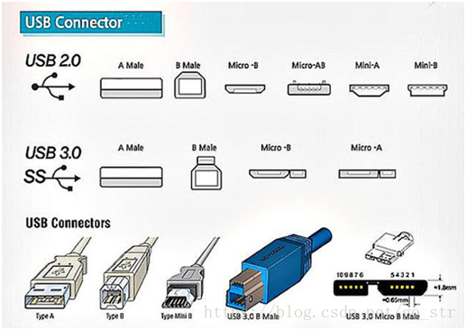

​		电脑边上提供了USB插槽，这个插槽遵循了USB的规范，只要其他设备也是遵循USB规范的，那么就可以互联，并正常通信。至于这个电脑、以及其他设备是哪个厂家制造的，内部是如何实现的，我们都无需关心。

​		这种设计是将规范和实现分离，这也正是Java接口的好处。Java的软件系统会有很多模块组成，那么各个模块之间也应该采用这种面相接口的低耦合，为系统提供更好的可扩展性和可维护性。

* 接口就是规范，定义的是一组规则，体现了现实世界中“如果你是/要...则必须能...”的思想。继承是一个"是不是"的is-a关系，而接口实现则是 "能不能"的has-a关系。
  * 例如：你能不能用USB进行连接，或是否具备USB通信功能，就看你是否遵循USB接口规范
  * 例如：Java程序是否能够连接使用某种数据库产品，那么要看该数据库产品有没有实现Java设计的JDBC规范


### 7.4.2 定义格式

接口的定义，它与定义类方式相似，但是使用 `interface` 关键字。它也会被编译成.class文件，但一定要明确它并不是类，而是另外一种引用数据类型。

> 引用数据类型：数组，类，接口。

#### 1、接口的声明格式

```java
【修饰符】 interface 接口名{
    //接口的成员列表：
    // 静态常量
    // 抽象方法
    // 默认方法
    // 静态方法
    // 私有方法
}
```

示例代码：

```java
interface Usb3{
    //静态常量
	long MAX_SPEED = 500*1024*1024;//500MB/s
    
    //抽象方法
	void read();
    void write();
    
    //默认方法
    public default void start(){
        System.out.println("开始");
    }
    public default void stop(){
        System.out.println("结束");
    }
    
    //静态方法
    public static void show(){
        System.out.println("USB 3.0可以同步全速地进行读写操作");
    }
}
```

#### 2、接口的成员说明

接口定义的是多个类共同的公共行为规范，这些行为规范是与外部交流的通道，这就意味着接口里通常是定义一组公共方法。

在JDK8之前，接口中只允许出现：

（1）公共的静态的常量：其中public static final可以省略

（2）公共的抽象的方法：其中public abstract可以省略

> 理解：接口是从多个相似类中抽象出来的规范，不需要提供具体实现

在JDK1.8时，接口中允许声明默认方法和静态方法：

（3）公共的默认的方法：其中public 可以省略，建议保留，但是default不能省略

（4）公共的静态的方法：其中public 可以省略，建议保留，但是static不能省略

在JDK1.9时，接口又增加了：

（5）私有方法

除此之外，接口中不能有其他成员，没有构造器，没有初始化块，因为接口中没有成员变量需要初始化。

#### 3、面试题拷问？

1、为什么接口中只能声明公共的静态的常量？

因为接口是标准规范，那么在规范中需要声明一些底线边界值，当实现者在实现这些规范时，不能去随意修改和触碰这些底线，否则就有“危险”。

例如：USB1.0规范中规定最大传输速率是1.5Mbps，最大输出电流是5V/500mA

​           USB3.0规范中规定最大传输速率是5Gbps(500MB/s)，最大输出电流是5V/900mA

例如：尚硅谷学生行为规范中规定学员，早上8:25之前进班，晚上21:30之后离开等等。

2、为什么JDK1.8之后要允许接口定义静态方法和默认方法呢？因为它违反了接口作为一个抽象标准定义的概念。

**静态方法**：因为之前的标准类库设计中，有很多Collection/Colletions或者Path/Paths这样成对的接口和类，后面的类中都是静态方法，而这些静态方法都是为前面的接口服务的，那么这样设计一对API，不如把静态方法直接定义到接口中使用和维护更方便。

**默认方法**：（1）我们要在已有的老版接口中提供新方法时，如果添加抽象方法，就会涉及到原来使用这些接口的类就会有问题，那么为了保持与旧版本代码的兼容性，只能允许在接口中定义默认方法实现。比如：Java8中对Collection、List、Comparator等接口提供了丰富的默认方法。（2）当我们接口的某个抽象方法，在很多实现类中的实现代码是一样的，此时将这个抽象方法设计为默认方法更为合适，那么实现类就可以选择重写，也可以选择不重写。

3、为什么JDK1.9要允许接口定义私有方法呢？因为我们说接口是规范，规范时需要公开让大家遵守的

**私有方法**：因为有了默认方法和静态方法这样具有具体实现的方法，那么就可能出现多个方法由共同的代码可以抽取，而这些共同的代码抽取出来的方法又只希望在接口内部使用，所以就增加了私有方法。

### 7.4.3 实现接口

接口的使用，它**不能创建对象**，但是可以被实现（`implements` ，类似于被继承）。

类与接口的关系为实现关系，即**类实现接口**，该类可以称为接口的实现类，也可以称为接口的子类。实现的动作类似继承，格式相仿，只是关键字不同，实现使用 ` implements`关键字。

#### 1、实现接口语法格式

```java
【修饰符】 class 实现类  implements 接口{
	// 重写接口中抽象方法【必须】，当然如果实现类是抽象类，那么可以不重写
  	// 重写接口中默认方法【可选】
}

【修饰符】 class 实现类 extends 父类 implements 接口{
    // 重写接口中抽象方法【必须】，当然如果实现类是抽象类，那么可以不重写
  	// 重写接口中默认方法【可选】
}
```

注意：

1. 如果接口的实现类是非抽象类，那么必须重写接口中**所有**抽象方法。

2. 默认方法可以选择保留，也可以重写。

   > 重写时，default单词就不要再写了，它只用于在接口中表示默认方法，到类中就没有默认方法的概念了

3. 不能重写静态方法

示例代码：

```java
class MobileHDD implements Usb3{

	//重写/实现接口的抽象方法，【必选】
	public void read() {
		System.out.println("读数据");
	}
    public void write(){
        System.out.println("写数据");
    }
	
	//重写接口的默认方法，【可选】
	//重写默认方法时，default单词去掉
	public void end(){
        System.out.println("清理硬盘中的隐藏回收站中的东西，再结束");
    }
}
```

#### 2、如何调用对应的方法

* 对于接口的静态方法，直接使用“接口名.”进行调用即可
  * 也只能使用“接口名."进行调用，不能通过实现类的对象进行调用
* 对于接口的抽象方法、默认方法，只能通过实现类对象才可以调用
  * 接口不能直接创建对象，只能创建实现类的对象

```java
public class TestInteface {
	public static void main(String[] args) {
		//创建实现类对象
		MobileHDD b = new MobileHDD();
		
		//通过实现类对象调用重写的抽象方法，以及接口的默认方法，如果实现类重写了就执行重写的默认方法，如果没有重写，就执行接口中的默认方法
		b.start();
		b.read();
		b.stop();
		
		//通过接口名调用接口的静态方法
		MobileHDD.show();
	}
}
```

#### 3、练习

1、声明一个LiveAble接口

* 包含两个抽象方法：
  * void eat();	
  * void breathe();
* 包含默认方法  default void sleep()，实现为打印“静止不动”
* 包含静态方法 static void drink()，实现为“喝水”

2、声明动物Animal类，实现LiveAble接口。

* void eat();实现为“吃东西”，
* void breathe();实现为"吸入氧气呼出二氧化碳"
* void sleep()重写为”闭上眼睛睡觉"

3、声明植物Plant类，实现LiveAble接口。

* void eat();实现为“吸收营养”
* void breathe();实现为"吸入二氧化碳呼出氧气"

4、在测试类中，分别创建两个实现类的对象，调用对应的方法。通过接口名，调用静态方法

定义接口：

```java
public interface LiveAble {
    // 定义抽象方法
    public abstract void eat();
    public abstract void breathe();
    //定义默认方法
    public default void sleep(){
    	System.out.println("静止不动");
    }
    //定义静态方法
    public static void drink(){
    	System.out.println("喝水");
    }
}
```

定义实现类：

```java
public Animal implements LiveAble {
	//重写/实现接口的抽象方法
    @Override
    public void eat() {
        System.out.println("吃东西");
    }
    
    //重写/实现接口的抽象方法
    @Override
    public void breathe(){
        System.out.println("吸入氧气呼出二氧化碳");
    }
    
    //重写接口的默认方法
    @Override
    public void sleep() {
        System.out.println("闭上眼睛睡觉");
    }
}
```

```java
public class Plant implements LiveAble {
	//重写/实现接口的抽象方法
    @Override
    public void eat() {
        System.out.println("吸收营养");
    }
    //重写/实现接口的抽象方法
    @Override
    public void breathe(){
        System.out.println("吸入二氧化碳呼出氧气");
    }
}
```

定义测试类：

```java
public class InterfaceDemo {
    public static void main(String[] args) {
        // 创建实现类（子类）对象  
        Animal a = new Animal();
        // 调用实现后的方法
        a.eat();
        a.sleep();
        a.breathe();
        
        //创建实现类（子类）对象
        Plant p = new Plant();
        p.eat();
        p.sleep();
        p.breathe();
        
        //通过接口调用静态方法
        LiveAble.drink();
    }
}
输出结果：
吃东西
闭上眼睛睡觉
吸入氧气呼出二氧化碳
吸收营养
静止不动
吸入二氧化碳呼出氧气
喝水
```

### 7.4.4 接口的多实现

之前学过，在继承体系中，一个类只能继承一个父类。而对于接口而言，一个类是可以实现多个接口的，这叫做接口的**多实现**。并且，一个类能继承一个父类，同时实现多个接口。

实现格式：

```java
【修饰符】 class 实现类  implements 接口1，接口2，接口3。。。{
	// 重写接口中所有抽象方法【必须】，当然如果实现类是抽象类，那么可以不重写
  	// 重写接口中默认方法【可选】
}

【修饰符】 class 实现类 extends 父类 implements 接口1，接口2，接口3。。。{
    // 重写接口中所有抽象方法【必须】，当然如果实现类是抽象类，那么可以不重写
  	// 重写接口中默认方法【可选】
}
```

> 接口中，有多个抽象方法时，实现类必须重写所有抽象方法。**如果抽象方法有重名的，只需要重写一次**。

定义多个接口：

```java
interface A {
    public abstract void showA();
    public abstract void show();
}

interface B {
    public abstract void showB();
    public abstract void show();
}
```

定义实现类：

```java
public class C implements A,B{
    @Override
    public void showA() {
        System.out.println("showA");
    }

    @Override
    public void showB() {
        System.out.println("showB");
    }

    @Override
    public void show() {
        System.out.println("show");
    }
}
```

#### 练习

1、声明第一个接口Runner，包含抽象方法：void run()

2、声明第二个接口Swimming，包含抽象方法：void swim()

3、声明兔子类，实现Runner接口

4、声明乌龟类，实现Runner接口和Swimming接口

```java
interface Runner{
	void run();
}
```

```java
interface Swimming{
	void swim();
}
```

```java
class Rabbit implements Runner{

	@Override
	public void run() {
		System.out.println("兔子跑得快");
	}
	
}
```

```java
class Tortoise implements Runner,Swimming{

	@Override
	public void swim() {
		System.out.println("乌龟游得快");
	}

	@Override
	public void run() {
		System.out.println("乌龟跑的慢");
	}
	
}
```

### 7.4.5 默认方法冲突问题

#### 1、亲爹优先原则

当一个类，既继承一个父类，又实现若干个接口时，父类中的成员方法与接口中的抽象方法重名，子类就近选择执行父类的成员方法。代码如下：

定义接口：

```java
interface A {
    public default void methodA(){
        System.out.println("AAAAAAAAAAAA");
    }
}
```

定义父类：

```java
class D {
    public void methodA(){
        System.out.println("DDDDDDDDDDDD");
    }
}
```

定义子类：

```java
class C extends D implements A {
  	// 未重写methodA方法
}
class B extends D implements A{
    //当然也可以选择重写
    public void methodA(){
        System.out.println("BBBBBBBBBBBB");
    }
}
```

定义测试类：

```java
public class Test {
    public static void main(String[] args) {
        C c = new C();
        c.methodA(); 
        
        B b = new B();
        b.methodA();
    }
}
输出结果:
DDDDDDDDDDDD
BBBBBBBBBBBB
```

#### 2、必须做出选择

当一个类同时实现了多个接口，而多个接口中包含方法签名相同的默认方法时，怎么办呢？


无论你多难抉择，最终都是要做出选择的。代码如下：

声明接口：

```java
interface A{
	public default void d(){
		System.out.println("今晚7点-8点陪我吃饭看电影");
	}
}
interface B{
	public default void d(){
		System.out.println("今晚7点-8点陪我逛街吃饭");
	}
}
```
选择保留其中一个，通过“接口名.super.方法名"的方法选择保留哪个接口的默认方法。
```java
class C implements A,B{

	@Override
	public void d() {
		A.super.d();
	}
	
}
```
选择自己完全重写：
```java
class D implements A,B{
	@Override
	public void d() {
		System.out.println("自己待着");
	}
}
```

### 7.4.6 接口的多继承  

一个接口能继承另一个或者多个接口，接口的继承也使用 `extends` 关键字，子接口继承父接口的方法。

定义父接口：

```java
interface A {
    void a();
    public default void methodA(){
        System.out.println("AAAAAAAAAAAAAAAAAAA");
    }
}

interface B {
    void b();
    public default void methodB(){
        System.out.println("BBBBBBBBBBBBBBBBBBB");
    }
}
```

定义子接口：

```java
interface C extends A,B{
    @Override
    public default void methodB() {
        System.out.println("CCCCCCCCCCCCCCCCCCCC");
    }
}
```

> 小贴士：
>
> 子接口重写默认方法时，default关键字可以保留。
>
> 子类重写默认方法时，default关键字不可以保留。

```java
class D implements C{

	@Override
	public void a() {
		System.out.println("xxxxx");
	}

	@Override
	public void b() {
		System.out.println("yyyyy");
	}
	
}
```

```java
class E implements A,B,C{//效果和上面的D是等价的

	@Override
	public void b() {
		System.out.println("xxxxx");
	}

	@Override
	public void a() {
		System.out.println("yyyyy");
	}
	
}
```

### 7.4.7 接口与实现类对象的多态引用

实现类实现接口，类似于子类继承父类，因此，接口类型的变量与实现类的对象之间，也可以构成多态引用。通过接口类型的变量调用方法，最终执行的是你new的实现类对象实现的方法体。

```java
public class TestInterface {
	public static void main(String[] args) {
		Flyable b = new Bird();
		b.fly();
		
		Flyable k = new Kite();
		k.fly();
	}
}
interface Flyable{
    //抽象方法
	void fly();
}
class Bird implements Flyable{

	@Override
	public void fly() {
		System.out.println("展翅高飞");
	}
	
}
class Kite implements Flyable{

	@Override
	public void fly() {
		System.out.println("别拽我，我要飞");
	}
	
}
```

### 7.4.8  接口面试题排错

#### 第1题：成员变量冲突问题


```java
class Base{
    int x = 1;
}
interface JieKou1{
    int x = 2;//公共的静态的常量
}
interface JieKou2{
    int x = 3;
}
class Sub extends Base implements JieKou1,JieKou2{
    public void test(){
//        System.out.println(x);//错误，模糊不清
        System.out.println(super.x);
        System.out.println(JieKou1.x);
        System.out.println(JieKou2.x);
    }
}
```

#### 第2题

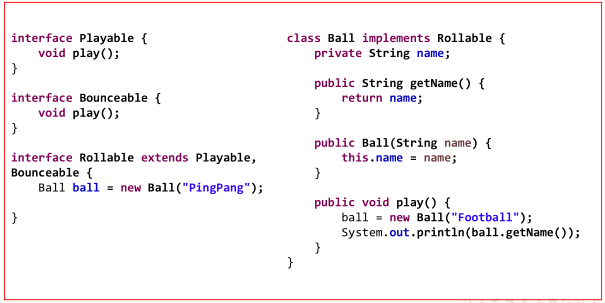

### 7.4.9  经典接口介绍

#### 1、java.lang.Comparable

我们知道基本数据类型的数据（除boolean类型外）需要比较大小的话，之间使用比较运算符即可，但是引用数据类型是不能直接使用比较运算符来比较大小的。那么，如何解决这个问题呢？

Java给所有引用数据类型的大小比较，指定了一个标准接口，就是java.lang.Comparable接口：

```java
package java.lang;

public interface Comparable{
    int compareTo(Object obj);
}
```

那么我们想要使得我们某个类的对象可以比较大小，怎么做呢？步骤：

第一步：哪个类的对象要比较大小，哪个类就实现java.lang.Comparable接口，并重写方法

* 方法体就是你要如何比较当前对象和指定的另一个对象的大小

第二步：对象比较大小时，通过对象调用compareTo方法，根据方法的返回值决定谁大谁小。

* this对象（调用compareTo方法的对象）大于指定对象（传入compareTo()的参数对象）返回正整数
* this对象（调用compareTo方法的对象）小于指定对象（传入compareTo()的参数对象）返回负整数
* this对象（调用compareTo方法的对象）等于指定对象（传入compareTo()的参数对象）返回零

代码示例：

```java
public class TestComparable {
	public static void main(String[] args) {
		Student s1 = new Student(1,"张三",89);
		Student s2 = new Student(2,"李四",89);
		if(s1.compareTo(s2)>0){
			System.out.println("s1>s2");
		}else if(s1.compareTo(s2)<0){
			System.out.println("s1<s2");
		}else{
			System.out.println("s1 = s2");
		}
	}
}
class Student implements Comparable{
	private int id;
	private String name;
	private int score;
	
	//省略了构造器、get/set、toString等方法

	@Override
	public int compareTo(Object o) {
		//这些需要强制，将o对象向下转型为Student类型的变量，才能调用Student类中的属性
		Student stu = (Student) o;
		if(this.score != stu.score){
			return this.score - stu.score;
		}else{//成绩相同，按照学号比较大小
			return this.id - stu.id;
		}
	}
	
}
```

##### 练习1：冒泡排序

声明一个Employee员工类，包含编号、姓名、薪资，实现Comparable接口，要求，按照薪资比较大小，如果薪资相同，按照编号比较大小。

声明一个测试类TestEmployee类，在main中创建Employee[]数组，长度为5，并且存储5个员工对象，现在要求用冒泡排序，实现对这个数组进行排序，遍历结果。

```java
class Employee implements Comparable{
	private int id;
	private String name;
	private double salary;
	public Employee(int id, String name, double salary) {
		super();
		this.id = id;
		this.name = name;
		this.salary = salary;
	}
	public Employee() {
		super();
	}
	public int getId() {
		return id;
	}
	public void setId(int id) {
		this.id = id;
	}
	public String getName() {
		return name;
	}
	public void setName(String name) {
		this.name = name;
	}
	public double getSalary() {
		return salary;
	}
	public void setSalary(double salary) {
		this.salary = salary;
	}
	@Override
	public String toString() {
		return "Employee [id=" + id + ", name=" + name + ", salary=" + salary + "]";
	}
	@Override
	public int compareTo(Object o) {
		Employee emp = (Employee) o;
		if(this.getSalary() != emp.getSalary()){
			return Double.compare(this.getSalary(), emp.getSalary());
		}
		return this.id - emp.id;
	}
}
```

```java
public class TestComparable {
	public static void main(String[] args) {
		Employee[] arr = new Employee[5];
		arr[0] = new Employee(1,"张三",13000);
		arr[1] = new Employee(2,"李四",13000);
		arr[2] = new Employee(3,"王五",14000);
		arr[3] = new Employee(4,"赵六",7000);
		arr[4] = new Employee(5,"钱七",9000);
		
		//原顺序
		System.out.println("员工列表：");
		for (int i = 0; i < arr.length; i++) {
			System.out.println(arr[i]);
		}
		//冒泡排序
		for (int i = 1; i < arr.length; i++) {
			for (int j = 0; j < arr.length-i; j++) {
                //因为Employee类型实现了Comparable接口，所以有compareTo()方法
				if(arr[j].compareTo(arr[j+1])>0){
					Employee temp = arr[j];
					arr[j] = arr[j+1];
					arr[j+1] = temp;
				}
			}
		}
		System.out.println("排序后员工列表：");
		for (int i = 0; i < arr.length; i++) {
			System.out.println(arr[i]);
		}
	}
}
```

##### 练习2：自定义数组排序工具类

自定义一个数组工具类MyArrays，它包含一个静态方法，可以给任意对象数组用冒泡排序实现从小到大排序，该怎么定义这个方法呢？

```java
class MyArrays{
	public static void sort(Object[] arr){
		//冒泡排序
		for (int i = 1; i < arr.length; i++) {
			for (int j = 0; j < arr.length-i; j++) {
				//将arr[j]强制为Comparable接口类型，目的是调用compareTo方法
				//当然如果数组的元素没有实现这个接口，那么将会发生ClassCastException
				Comparable c = (Comparable) arr[j];
				if(c.compareTo(arr[j+1])>0){
					Object temp = arr[j];
					arr[j] = arr[j+1];
					arr[j+1] = temp;
				}
			}
		}
	}
    
    public static void print(Object[] arr){
        for (int i = 0; i < arr.length; i++) {
			System.out.println(arr[i]);
		}
    }
}

```

使用自定义的MyArrays数组工具类，给练习1的员工数组进行排序

```java
public class TestComparable {
	public static void main(String[] args) {
		Employee[] arr = new Employee[5];
		arr[0] = new Employee(1,"张三",13000);
		arr[1] = new Employee(2,"李四",13000);
		arr[2] = new Employee(3,"王五",14000);
		arr[3] = new Employee(4,"赵六",7000);
		arr[4] = new Employee(5,"钱七",9000);
		
		//原顺序
		System.out.println("员工列表：");
		MyArrays.print(arr);
        
        //要求Employee类型必须实现Comparable接口，否则将发生ClassCastException异常
		MyArrays.sort(arr);
        
		System.out.println("排序后员工列表：");
		MyArrays.print(arr);
	}
}
```

> java.util.Arrays数组工具类的public static void sort(Object[] a)就是这么实现的，只不过它使用的排序算法是效率更高快排，而不是冒泡排序，但是无论哪种排序算法，最终都要涉及到两个元素的比较大小，都需要通过元素调用compareTo()方法。

#### 2、java.util.Comparator

思考：

（1）如果一个类，没有实现Comparable接口，而这个类你又不方便修改（例如：一些第三方的类，你只有.class文件，没有源文件），那么这样类的对象也要比较大小怎么办？

（2）如果一个类，实现了Comparable接口，也指定了两个对象的比较大小的规则，但是此时此刻我不想按照它预定义的方法比较大小，但是我又不能随意修改，因为会影响其他地方的使用，怎么办？

JDK在设计类库之初，也考虑到这种情况了，所以又增加了一个java.util.Comparator接口。

```java
package java.util;

public interface Comparator{
    int compare(Object o1,Object o2);
}
```

那么我们想要比较某个类的两个对象的大小，怎么做呢？步骤：

第一步：编写一个类，我们称之为比较器类型，实现java.util.Comparator接口，并重写方法

* 方法体就是你要如何指定的两个对象的大小

第二步：比较大小时，通过比较器类型的对象调用compare()方法，将要比较大小的两个对象作为compare方法的实参传入，根据方法的返回值决定谁大谁小。

* o1对象大于o2返回正整数
* o1对象小于o2返回负整数
* o1对象等于o2返回零

代码示例：一个没有实现Comparable接口的学生类

```java
class Student{
	private String name;
	private int score;
	public Student(String name, int score) {
		super();
		this.name = name;
		this.score = score;
	}
	public Student() {
		super();
	}
	public String getName() {
		return name;
	}
	public void setName(String name) {
		this.name = name;
	}
	public int getScore() {
		return score;
	}
	public void setScore(int score) {
		this.score = score;
	}
	@Override
	public String toString() {
		return "Student [name=" + name + ", score=" + score + "]";
	}
	
}
```

代码示例：定义定制比较器类

```java
class StudentScoreCompare implements Comparator{

	@Override
	public int compare(Object o1, Object o2) {
		Student s1 = (Student) o1;
		Student s2 = (Student) o2;
		return s1.getScore() - s2.getScore();
	}
	
}
```

代码示例：测试类

```java
import java.util.Comparator;

public class TestComparator {
	public static void main(String[] args) {
		Student stu1 = new Student("张三",89);
		Student stu2 = new Student("李四",78);
		
		StudentScoreCompare ssc = new StudentScoreCompare();
		if(ssc.compare(stu1, stu2)>0){
			System.out.println(stu1 + ">" + stu2);
		}else if(ssc.compare(stu1, stu2)<0){
			System.out.println(stu1 + "<" + stu2);
		}else{
			System.out.println(stu1 + "=" + stu2);
		}
	}
}
```

##### 练习1：冒泡排序

声明一个Employee员工类，包含编号、姓名、薪资，

声明一个测试类，在main中，创建Employee[]数组，长度为5，显示原来顺序结果

声明一个定制比较器EmpSalaryComparator，实现Comparator接口，按照薪资比较大小

声明一个定制比较器EmpIdComparator，实现Comparator接口，按照编号比较大小

在测试类中，分别用这个两个比较器对象，对数组进行排序，并显示排序后结果

员工类示例代码：

```java
class Employee{
	private int id;
	private String name;
	private double salary;
	public Employee(int id, String name, double salary) {
		super();
		this.id = id;
		this.name = name;
		this.salary = salary;
	}
	public Employee() {
		super();
	}
	public int getId() {
		return id;
	}
	public void setId(int id) {
		this.id = id;
	}
	public String getName() {
		return name;
	}
	public void setName(String name) {
		this.name = name;
	}
	public double getSalary() {
		return salary;
	}
	public void setSalary(double salary) {
		this.salary = salary;
	}
	@Override
	public String toString() {
		return "Employee [id=" + id + ", name=" + name + ", salary=" + salary + "]";
	}
}
```
员工薪资定制比较器类型：
```java
class EmpSalaryComparator implements Comparator{

	@Override
	public int compare(Object o1, Object o2) {
		Employee e1 = (Employee) o1;
		Employee e2 = (Employee) o2;
		return Double.compare(e1.getSalary(), e2.getSalary());
	}
	
}
```
员工编号定制比较器类型：
```java
class EmpIdComparator implements Comparator{

	@Override
	public int compare(Object o1, Object o2) {
		Employee e1 = (Employee) o1;
		Employee e2 = (Employee) o2;
		return e1.getId() - e2.getId();
	}
	
}
```

测试类示例代码：

```java
import java.util.Comparator;

public class TestComparator {
	public static void main(String[] args) {
		Employee[] arr = new Employee[5];
		arr[0] = new Employee(1,"张三",13000);
		arr[1] = new Employee(3,"王五",14000);
		arr[2] = new Employee(2,"李四",13000);
		arr[3] = new Employee(4,"赵六",7000);
		arr[4] = new Employee(5,"钱七",9000);
		
		//原顺序
		System.out.println("员工列表：");
		for (int i = 0; i < arr.length; i++) {
			System.out.println(arr[i]);
		}
		
		EmpSalaryComparator ec = new EmpSalaryComparator();
		//冒泡排序
		for (int i = 1; i < arr.length; i++) {
			for (int j = 0; j < arr.length-i; j++) {
				if(ec.compare(arr[j], arr[j+1])>0){
					Employee temp = arr[j];
					arr[j] = arr[j+1];
					arr[j+1] = temp;
				}
			}
		}
		
		System.out.println("按照薪资排序后员工列表：");
		for (int i = 0; i < arr.length; i++) {
			System.out.println(arr[i]);
		}
		
		EmpIdComparator ec2 = new EmpIdComparator();
		//冒泡排序
		for (int i = 1; i < arr.length; i++) {
			for (int j = 0; j < arr.length-i; j++) {
				if(ec2.compare(arr[j], arr[j+1])>0){
					Employee temp = arr[j];
					arr[j] = arr[j+1];
					arr[j+1] = temp;
				}
			}
		}
				
		System.out.println("按照编号排序后员工列表：");
		for (int i = 0; i < arr.length; i++) {
			System.out.println(arr[i]);
		}
	}
}
```

##### 练习2：自定义数组排序工具类

自定义一个数组工具类MyArrays，它包含一个静态方法，可以给任意对象数组用冒泡排序实现从小到大排序，该怎么定义这个方法呢？

```java
class MyArrays{
	public static void sort(Object[] arr,Comparator c){
		//冒泡排序
		for (int i = 1; i < arr.length; i++) {
			for (int j = 0; j < arr.length-i; j++) {
				//这里不需要强制类型转换
				if(c.compare(arr[j], arr[j+1])>0){
					Object temp = arr[j];
					arr[j] = arr[j+1];
					arr[j+1] = temp;
				}
			}
		}
	}
	
    public static void print(Object[] arr){
 		for (int i = 0; i < arr.length; i++) {
			System.out.println(arr[i]);
		}       
    }
}
```

用新工具类，简化练习1测试类的代码

```java
public class TestComparator {
	public static void main(String[] args) {
		Employee[] arr = new Employee[5];
		arr[0] = new Employee(1,"张三",13000);
		arr[1] = new Employee(3,"王五",14000);
		arr[2] = new Employee(2,"李四",13000);
		arr[3] = new Employee(4,"赵六",7000);
		arr[4] = new Employee(5,"钱七",9000);
		
		//原顺序
		System.out.println("员工列表：");
		MyArrays.print(arr);
		
		EmpSalaryComparator ec = new EmpSalaryComparator();
		MyArrays.sort(arr, ec);
		
		System.out.println("按照薪资排序后员工列表：");
		MyArrays.print(arr);
		
		EmpIdComparator ec2 = new EmpIdComparator();
		MyArrays.sort(arr, ec2);
				
		System.out.println("按照编号排序后员工列表：");
		MyArrays.print(arr);
	}
}
```

> java.util.Arrays数组工具类的public static <T> void sort(T[] a, Comparator<? super T> c)就是这做的

#### 3、java.lang.Cloneable

在java.lang.Object类中有一个方法：

```java
protected Object clone()throws CloneNotSupportedException 
```

所有类型都可以重写这个方法，它是获取一个对象的克隆体对象用的，就是造一个和当前对象各种属性值一模一样的对象。当然地址肯定不同。

我们在重写这个方法后时，调用super.clone()，发现报异常CloneNotSupportedException，因为我们没有实现java.lang.Cloneable接口。

```java
class Teacher implements Cloneable{
	private int id;
	private String name;
	public Teacher(int id, String name) {
		super();
		this.id = id;
		this.name = name;
	}
	public Teacher() {
		super();
	}
	public int getId() {
		return id;
	}
	public void setId(int id) {
		this.id = id;
	}
	public String getName() {
		return name;
	}
	public void setName(String name) {
		this.name = name;
	}
	@Override
	public String toString() {
		return "Teacher [id=" + id + ", name=" + name + "]";
	}
	@Override
	public Object clone() throws CloneNotSupportedException {
		return super.clone();
	}
	@Override
	public int hashCode() {
		final int prime = 31;
		int result = 1;
		result = prime * result + id;
		result = prime * result + ((name == null) ? 0 : name.hashCode());
		return result;
	}
	@Override
	public boolean equals(Object obj) {
		if (this == obj)
			return true;
		if (obj == null)
			return false;
		if (getClass() != obj.getClass())
			return false;
		Teacher other = (Teacher) obj;
		if (id != other.id)
			return false;
		if (name == null) {
			if (other.name != null)
				return false;
		} else if (!name.equals(other.name))
			return false;
		return true;
	}
}
```

```java
public class TestClonable {
	public static void main(String[] args) throws CloneNotSupportedException {
		Teacher src = new Teacher(1,"柴老师");
		Object clone = src.clone();
		System.out.println(clone);
		System.out.println(src == clone);
		System.out.println(src.equals(clone));
	}
}
```

## 7.5 内部类

### 7.5.1 概述

1、什么是内部类？

将一个类A定义在另一个类B里面，里面的那个类A就称为**内部类**，B则称为**外部类**。


2、为什么要声明内部类呢？

当一个事物的内部，还有一个部分需要一个完整的结构进行描述，而这个内部的完整的结构又只为外部事物提供服务，不在其他地方单独使用，那么整个内部的完整结构最好使用内部类。

而且内部类因为在外部类的里面，因此可以直接访问外部类的私有成员。


3、内部类都有哪些形式？

根据内部类声明的位置（如同变量的分类），我们可以分为：

（1）成员内部类：

* 静态成员内部类
* 非静态成员内部类

（2）局部内部类

* 有名字的局部内部类
* 匿名的内部类

### 7.5.2 静态内部类

语法格式：

```java
【修饰符】 class 外部类{
    【其他修饰符】 static class 内部类{
    }
}
```

静态内部类的特点：

* 和其他类一样，它只是定义在外部类中的另一个完整的类结构
  * 可以继承自己的想要继承的父类，实现自己想要实现的父接口们，和外部类的父类和父接口无关
  * 可以在静态内部类中声明属性、方法、构造器等结构，包括静态成员
  * 可以使用abstract修饰，因此它也可以被其他类继承
  * 可以使用final修饰，表示不能被继承
  * 编译后有自己的独立的字节码文件，只不过在内部类名前面冠以外部类名和$符号。
* 和外部类不同的是，它可以允许四种权限修饰符：public，protected，缺省，private
  * 外部类只允许public或缺省的
* **只**可以在静态内部类中使用外部类的**静态成员**
  * 在静态内部类中不能使用外部类的非静态成员哦
* 在外部类的外面不需要通过外部类的对象就可以创建静态内部类的对象
* 如果在内部类中有变量与外部类的静态成员变量同名，可以使用“外部类名."进行区别

示例代码：

```java
public class TestInner{
    public static void main(String[] args){
    	Outer.Inner in= new Outer.Inner();
    	in.inMethod();
    	
    	Outer.Inner.inTest();
        
        Outer.Inner.inFun(3);
    }
}

class Outer{
	private static int a = 1;
	private int b = 2;
	protected static class Inner{
		static int d = 4;//可以
		void inMethod(){
			System.out.println("out.a = " + a);
//			System.out.println("out.b = " + b);//错误的
		}
		static void inTest(){
			System.out.println("out.a = " + a);
		}
        static void inFun(int a){
			System.out.println("out.a = " + Outer.a);
            System.out.println("local.a = " + a);
		}
	}
}
```

> 其实严格的讲（在James Gosling等人编著的《The Java Language Specification》）静态内部类不是内部类，而是类似于C++的嵌套类的概念，外部类仅仅是静态内部类的一种命名空间的限定名形式而已。所以接口中的内部类通常都不叫内部类，因为接口中的内部成员都是隐式是静态的（即public static)。例如：Map.Entry。

### 7.5.3 非静态成员内部类

语法格式：

```java
【修饰符】 class 外部类{
    【修饰符】 class 内部类{
    }
}
```

非静态内部类的特点：

* 和其他类一样，它只是定义在外部类中的另一个完整的类结构
  * 可以继承自己的想要继承的父类，实现自己想要实现的父接口们，和外部类的父类和父接口无关
  * 可以在非静态内部类中声明属性、方法、构造器等结构，但是**不允许声明静态成员**，但是可以**继承**父类的静态成员，而且**可以声明静态常量**。
  * 可以使用abstract修饰，因此它也可以被其他类继承
  * 可以使用final修饰，表示不能被继承
  * 编译后有自己的独立的字节码文件，只不过在内部类名前面冠以外部类名和$符号。
* 和外部类不同的是，它可以允许四种权限修饰符：public，protected，缺省，private
  * 外部类只允许public或缺省的
* 还可以在非静态内部类中使用外部类的**所有成员**，哪怕是私有的

* 在外部类的静态成员中不可以使用非静态内部类哦
  * 就如同静态方法中不能访问本类的非静态成员变量和非静态方法一样
* 在外部类的外面必须通过外部类的对象才能创建非静态内部类的对象
  * 因此在非静态内部类的方法中有两个this对象，一个是外部类的this对象，一个是内部类的this对象

示例代码：

```java
public class TestInner{
    public static void main(String[] args){
    	Outer out = new Outer();
    	Outer.Inner in= out.new Inner();
    	in.inMethod();
    	
    	Outer.Inner inner = out.getInner();
    	inner.inMethod();
    }
}
class Father{
	protected static int c = 3;
}
class Outer{
	private static int a = 1;
	private int b = 2;
	protected class Inner extends Father{
//		static int d = 4;//错误
		int b = 5;
		void inMethod(){
			System.out.println("out.a = " + a);
			System.out.println("out.b = " + Outer.this.b);
			System.out.println("in.b = " + b);
			System.out.println("father.c = " + c);
		}
	}
	
	public static void outMethod(){
//		Inner in = new Inner();//错误的
	}
	public Inner getInner(){
		return new Inner();
	}
}
```

#### 练习1：语法练习题

声明一个身体Body类，包含一个私有的boolean类型的属性live，初始化为true，表示活着。属性私有化，提供get/set方法。

声明一个身体Body的内部类Heart，包含void beat()方法，当live为true时，打印“心脏在跳动”，否则打印“心脏停止跳动"。因为Heart只为外部类Body服务，而又具有自己的方法，属性等，而且这里应该是有Body实体存在的情况下才能有Heart实体，所以这里把Heart声明为非静态内部类。

声明一个测试类，在测试类的主方法中，创建身体和心脏的对象，调用心脏对象的beat()方法，然后调用身体对象的setLive()方法，设置为false后，再调用心脏对象的beat()方法查看结果。

```java
public class Person {
    private  boolean live = true;
    class Heart {
        public void beat() {
            // 直接访问外部类成员
            if (live) {
                System.out.println("心脏在跳动");
            } else {
                System.out.println("心脏不跳了");
            }
        }
    }

    public boolean isLive() {
        return live;
    }

    public void setLive(boolean live) {
        this.live = live;
    }

}
```

```java
public class InnerDemo {
    public static void main(String[] args) {
        // 创建外部类对象 
        Person p  = new Person();
        // 创建内部类对象
        Heart heart = p.new Heart();

        // 调用内部类方法
        heart.beat();
        // 调用外部类方法
        p.setLive(false);
        // 调用内部类方法
        heart.beat();
    }
}
输出结果:
心脏在跳动
心脏不跳了
```

或

```java
public class Beatable{//可跳动的
    public abstract void beat();
}
```

```java
public class Person {
    private  boolean live = true;
    private  Heart heart = new Heart();
    private class Heart implements Beatable{
        public void jump() {
            // 直接访问外部类成员
            if (live) {
                System.out.println("心脏在跳动");
            } else {
                System.out.println("心脏不跳了");
            }
        }
    }

    public boolean isLive() {
        return live;
    }

    public void setLive(boolean live) {
        this.live = live;
    }

	public Beatable getHeart(){
		return heart;
	}
}
```

```java
public class InnerDemo {
    public static void main(String[] args) {
        // 创建外部类对象 
        Person p  = new Person();
        // 获取内部类对象
        Beatable heart = p.getHeart();

        // 调用内部类方法
        heart.beat();
        // 调用外部类方法
        p.setLive(false);
        // 调用内部类方法
        heart.beat();
    }
}
输出结果:
心脏在跳动
心脏不跳了
```


#### 练习2：简单面试题

判断如下代码的运行结果：

```java
public class Test{
	public Test(){
		Inner s1 = new Inner();
		s1.a = 10;
		Inner s2 = new Inner();
		s2.a = 20;
		Test.Inner s3 = new Test.Inner();
		System.out.println(s3.a);
	}
	class Inner{
		public int a = 5;
	}
	public static void main(String[] args) {
		Test t = new Test();
		Inner r = t.new Inner();
		System.out.println(r.a);
	}
}
```

#### 练习3：高难面试题

代码填空题：

```java
public class TestInner{
    public static void main(String[] args){
    	Outer.Inner in = new Sub();
    	in.method();//输出 hello inner
    }
}

class Outer {
	abstract class Inner{
		abstract void method();
	}
}
class Sub ________（1）__________{
	
	
	
	______（2）多行代码_______________
	
}
```

参考答案：

```java
public class TestInner{
    public static void main(String[] args){
    	Outer.Inner in = new Sub();
    	in.method();//输出 hello inner
    }
}

class Outer {
	abstract class Inner{
		abstract void method();
	}
}
class Sub extends Outer.Inner{
	static Outer out = new Outer();
	Sub(){
		out.super();
	}

	@Override
	void method() {
		System.out.println("hello inner");
	}
	
}
```

### 7.5.4 局部内部类

语法格式：

```java
【修饰符】 class 外部类{
    【修饰符】 返回值类型  方法名(【形参列表】){
            【final/abstract】 class 内部类{
    	}
    }    
}
```

局部内部类的特点：

* 和外部类一样，它只是定义在外部类的某个方法中的另一个完整的类结构
  * 可以继承自己的想要继承的父类，实现自己想要实现的父接口们，和外部类的父类和父接口无关
  * 可以在局部内部类中声明属性、方法、构造器等结构，**但不包括静态成员，除非是从父类继承的或静态常量**
  * 可以使用abstract修饰，因此它也可以被同一个方法的在它后面的其他内部类继承
  * 可以使用final修饰，表示不能被继承
  * 编译后有自己的独立的字节码文件，只不过在内部类名前面冠以外部类名、$符号、编号。
    * 这里有编号是因为同一个外部类中，不同的方法中存在相同名称的局部内部类
* 和成员内部类不同的是，它前面不能有权限修饰符等
* 局部内部类如同局部变量一样，有作用域
* 局部内部类中是否能访问外部类的静态还是非静态的成员，取决于所在的方法
* 局部内部类中还可以使用所在方法的局部常量，即用final声明的局部变量
  * JDK1.8之后，如果某个局部变量在局部内部类中被使用了，自动加final

示例代码：

```java
class Outer{
	private static int a = 1;
	private int b = 2;
	
	public static void outMethod(){
		final int c = 3;
		class Inner{
			public void inMethod(){
				System.out.println("out.a = " + a);
//				System.out.println("out.b = " + b);//错误的，因为outMethod是静态的
				System.out.println("out.local.c = " + c);
			}
		}
		
		Inner in = new Inner();
		in.inMethod();
	}
	
	public void outTest(){
		final int c = 3;
		class Inner{
			public void inMethod(){
				System.out.println("out.a = " + a);
				System.out.println("out.b = " + b);//可以，因为outTest是飞静态的
				System.out.println("method.c = " + c);
			}
		}
		
		Inner in = new Inner();
		in.inMethod();
	}
	
}
```

#### 思考

为什么在局部内部类中使用外部类方法的局部变量要加final呢？

```java
public class TestInner{
	public static void main(String[] args) {
		A obj = Outer.method();
		//因为如果c不是final的，那么method方法执行完，method的栈空间就释放了，那么c也就消失了
		obj.a();//这里打印c就没有中可取了，所以把c声明为常量，存储在方法区中
	}
}

interface A{
	void a();
}
class Outer{
	public static A method(){
		final int c = 3;
		class Sub implements A{
			@Override
			public void a() {
				System.out.println("method.c = " + c);
			}
		}
		return new Sub();
	}
}
```

### 7.5.5  匿名内部类

#### 1、引入

当我们在开发过程中，需要用到一个抽象类的子类的对象或一个接口的实现类的对象，而且只创建一个对象，而且逻辑代码也不复杂。那么我们原先怎么做的呢？

（1）编写类，继承这个父类或实现这个接口

（2）重写父类或父接口的方法

（3）创建这个子类或实现类的对象

例如：

```java
public interface Runnable{
    public abstract void run();
}
```

```java
//声明接口实现类
public class MyRunnable implements Runnable{
    public void run(){
        while(true){
            System.out.println("大家注意安全");
            try
            	Thread.sleep(1000);
            }catch(Exception e){                
            }
        }
    }
}
```

```java
public class Test{
    public static void main(String[] args){
        //如果MyRunnable类只是在这里使用一次，并且只创建它的一个对象
        //分开两个.java源文件，反而不好维护
        Runnable target = new MyRunnable();
        Thread t = new Thread("安全提示线程",target);
        t.start();
    }
}
```

这里，因为考虑到这个子类或实现类是一次性的，那么我们“费尽心机”的给它取名字，就显得多余。那么我们完全可以使用匿名内部类的方式来实现，避免给类命名的问题。

可以修改为如下形式：

```java
public class Test{
    public static void main(String[] args){
        //MyRunnable类只是在这里使用一次，并且只创建它的一个对象，那么这些写代码更紧凑，更好维护
        Runnable target = new Runnable(){
            public void run(){
                while(true){
                    System.out.println("大家注意安全");
                    try
                        Thread.sleep(1000);
                    }catch(Exception e){                
                    }
                }
            }
        };
        Thread t = new Thread("安全提示线程",target);
        t.start();
    }
}
```

#### 2、语法格式

```java
new 父类(【实参列表】){
    重写方法...
}
//()中是否需要【实参列表】，看你想要让这个匿名内部类调用父类的哪个构造器，如果调用父类的无参构造，那么()中就不用写参数，如果调用父类的有参构造，那么()中需要传入实参
```

```java
new 父接口(){
    重写方法...
}
//()中没有参数，因为此时匿名内部类的父类是Object类，它只有一个无参构造
```

> 匿名内部类是没有名字的类，因此在声明类的同时就创建好了唯一的对象。

注意：

匿名内部类是一种特殊的局部内部类，只不过没有名称而已。所有局部内部类的限制都适用于匿名内部类。例如：

* 在匿名内部类中是否可以使用外部类的非静态成员变量，看所在方法是否静态
* 在匿名内部类中如果需要访问当前方法的局部变量，该局部变量需要加final

思考：这个对象能做什么呢？


答：（1）调用某个方法（2）赋值给父类/父接口的变量，通过多态引用使用这个对象（3）作为某个方法调用的实参

#### 3、使用方式一：匿名内部类的对象直接调用方法

```java
interface A{
	void a();
}
public class Test{
    public static void main(String[] args){
    	new A(){
			@Override
			public void a() {
				System.out.println("aaaa");
			}
    	}.a();
    }
}
```

```java
class B{
	public void b(){
		System.out.println("bbbb");
	}
}
public class Test{
    public static void main(String[] args){
    	new B(){
    		public void b(){
    			System.out.println("ccccc");
    		}
    	}.b();
    	
    }
}
```

#### 4、使用方式二：通过父类或父接口的变量多态引用匿名内部类的对象

```java
interface A{
	void a();
}
public class Test{
    public static void main(String[] args){
    	A obj = new A(){
			@Override
			public void a() {
				System.out.println("aaaa");
			}
    	};
    	obj.a();
    }
}
```

```java
class B{
	public void b(){
		System.out.println("bbbb");
	}
}
public class Test{
    public static void main(String[] args){
    	B obj = new B(){
    		public void b(){
    			System.out.println("ccccc");
    		}
    	};
    	obj.b();
    }
}
```

#### 5、使用方式三：匿名内部类的对象作为实参

```java
interface A{
	void method();
}
public class Test{
    public static void test(A a){
    	a.method();
    }
    
    public static void main(String[] args){
    	test(new A(){

			@Override
			public void method() {
				System.out.println("aaaa");
			}
    		
    	});
    }   
}
```

#### 6、练习

##### 练习1

声明一个Employee员工类，包含编号、姓名、薪资，

声明一个测试类，在main中，创建Employee[]数组，长度为5，显示原来顺序结果

调用java.util.Arrays数组工具类的排序方法public static void sort(Object[] a, Comparator c)对数组的元素进行排序，用匿名内部类的对象给c形参传入按照薪资比较大小的定制比较器对象。并显示排序后结果

调用java.util.Arrays数组工具类的排序方法public static void sort(Object[] a, Comparator c)对数组的元素进行排序，用匿名内部类的对象给c形参传入按照编号比较大小的定制比较器对象。并显示排序后结果

员工类示例代码：

```java
class Employee{
	private int id;
	private String name;
	private double salary;
	public Employee(int id, String name, double salary) {
		super();
		this.id = id;
		this.name = name;
		this.salary = salary;
	}
	public Employee() {
		super();
	}
	public int getId() {
		return id;
	}
	public void setId(int id) {
		this.id = id;
	}
	public String getName() {
		return name;
	}
	public void setName(String name) {
		this.name = name;
	}
	public double getSalary() {
		return salary;
	}
	public void setSalary(double salary) {
		this.salary = salary;
	}
	@Override
	public String toString() {
		return "Employee [id=" + id + ", name=" + name + ", salary=" + salary + "]";
	}
}
```

测试类：

```java
public class TestInner {
	public static void main(String[] args) {
		Employee[] arr = new Employee[5];
		arr[0] = new Employee(1,"张三",13000);
		arr[1] = new Employee(3,"王五",14000);
		arr[2] = new Employee(2,"李四",13000);
		arr[3] = new Employee(4,"赵六",7000);
		arr[4] = new Employee(5,"钱七",9000);
		
		//原顺序
		System.out.println("员工列表：");
		for (int i = 0; i < arr.length; i++) {
			System.out.println(arr[i]);
		}
		
		Arrays.sort(arr, new Comparator() {
			@Override
			public int compare(Object o1, Object o2) {
				Employee e1 = (Employee) o1;
				Employee e2 = (Employee) o2;
				return Double.compare(e1.getSalary(), e2.getSalary());
			}
		});
		
		System.out.println("按照薪资排序后员工列表：");
		for (int i = 0; i < arr.length; i++) {
			System.out.println(arr[i]);
		}
		
		Arrays.sort(arr, new Comparator() {
			@Override
			public int compare(Object o1, Object o2) {
				Employee e1 = (Employee) o1;
				Employee e2 = (Employee) o2;
				return e1.getId() - e2.getId();
			}
		});
				
		System.out.println("按照编号排序后员工列表：");
		for (int i = 0; i < arr.length; i++) {
			System.out.println(arr[i]);
		}
	}
}
```

##### 练习2

（1）声明一个抽象类Father，包含抽象方法：public abstract void method();
（2）用匿名内部类继承Father，并重写抽象方法，打印“hello baby"
并调用子类对象的method方法

```java
public abstract class Father{
	public abstract void method();
}
```

```java
public class TestExer1 {
	public static void main(String[] args) {
		new Father(){

			@Override
			public void method() {
				System.out.println("hello 孩子");
			}
			
		}.method();
	}
}
```

##### 练习3

（1）声明一个员工类Triangle三角形，有属性：a,b,c表示三条边
（2）在测试类中创建Triangle数组
（3）分别调用Arrays.sort(数组，Comparator)，用匿名内部类实现按照编号周长排列
（4）分别调用Arrays.sort(数组，Comparator)，用匿名内部类实现按照薪资面积排列

```java
public class Triangle {
	private double a;
	private double b;
	private double c;
	public Triangle(double a, double b, double c) {
		super();
		this.a = a;
		this.b = b;
		this.c = c;
	}
	public Triangle() {
		super();
	}
	public double getA() {
		return a;
	}
	public void setA(double a) {
		this.a = a;
	}
	public double getB() {
		return b;
	}
	public void setB(double b) {
		this.b = b;
	}
	public double getC() {
		return c;
	}
	public void setC(double c) {
		this.c = c;
	}
	@Override
	public String toString() {
		return "Triangle [a=" + a + ", b=" + b + ", c=" + c + "]";
	}
	public double getPerimeter(){
		return a+b+c;
	}
	public double getArea(){
		double p = getPerimeter()/2;
		return Math.sqrt(p*(p-a)*(p-b)*(p-c));
	}
}
```

```java
public class TestExer2 {
	public static void main(String[] args) {
		Triangle[] arr = new Triangle[3];
		arr[0]  = new Triangle(6, 1, 6);
		arr[1]  = new Triangle(3, 4, 5);
		arr[2]  = new Triangle(6, 6, 6);
		
		System.out.println("原来的顺序：");
		for (int i = 0; i < arr.length; i++) {
			System.out.println(arr[i]);
		}
		System.out.println("--------------------");
		System.out.println("按照周长排序：");
		Arrays.sort(arr, new Comparator() {

			@Override
			public int compare(Object o1, Object o2) {
				Triangle t1 = (Triangle) o1;
				Triangle t2 = (Triangle) o2;
				return Double.compare(t1.getPerimeter(), t2.getPerimeter());
			}
		});
		for (int i = 0; i < arr.length; i++) {
			System.out.println(arr[i]);
		}
		System.out.println("--------------------");
		System.out.println("按照面积排序：");
		Arrays.sort(arr, new Comparator() {

			@Override
			public int compare(Object o1, Object o2) {
				Triangle t1 = (Triangle) o1;
				Triangle t2 = (Triangle) o2;
				return Double.compare(t1.getArea(), t2.getArea());
			}
		});
		for (int i = 0; i < arr.length; i++) {
			System.out.println(arr[i]);
		}
	}
}
```

##### 练习4

1、声明一个接口：Predicate接口，包含public abstract boolean test(Object obj);抽象方法
2、声明一个员工类：Employee,有属性：编号、姓名、年龄、薪资
3、声明一个员工管理类：EmployeeService，
（1）包含Employee[] arr，并在EmployeeService构造器中，创建数组，并初始化数组，例如：
arr = new Employee[5];
		arr[0] = new Employee(4, "李四", 24, 24000);
		arr[1] = new Employee(3, "张三", 23, 13000);
		arr[2] = new Employee(5, "王五", 25, 15000);
		arr[3] = new Employee(1, "赵六", 27, 17000);
		arr[4] = new Employee(2, "钱七", 16, 6000);

（2）包含public Employee[] get(Predicate p){
		Employee[] result = new Employee[arr.length];
		int total = 0;
		for(int i=0; i<arr.length; i++){
			if(p.test(arr[i]){
				result[total++] = arr[i];
			}
		}
		return Arrays.copyOf(result,total);
	}		
这个方法的作用，就是用于在arr数组中筛选满足条件的元素
4、在测试类中，创建EmployeeService对象，调用get(Predicate p)方法，通过匿名内部类的对象给形参p赋值，
分别获取：
（1）所有员工对象
（2）所有年龄超过25的员工
（3）所有薪资高于15000的员工
（4）所有编号是偶数的员工
（5）名字是“张三”的员工
（6）年龄超过25，薪资高于15000的员工

```java
public interface Predicate {
	public abstract boolean test(Object obj);
}
```

```java
public class Employee{
	private int id;
	private String name;
	private int age;
	private double salary;
	public Employee() {
		super();
	}
	public Employee(int id, String name, int age, double salary) {
		super();
		this.id = id;
		this.name = name;
		this.age = age;
		this.salary = salary;
	}
	public int getId() {
		return id;
	}
	public void setId(int id) {
		this.id = id;
	}
	public String getName() {
		return name;
	}
	public void setName(String name) {
		this.name = name;
	}
	public int getAge() {
		return age;
	}
	public void setAge(int age) {
		this.age = age;
	}
	public double getSalary() {
		return salary;
	}
	public void setSalary(double salary) {
		this.salary = salary;
	}
	@Override
	public String toString() {
		return "Employee [id=" + id + ", name=" + name + ", age=" + age + ", salary=" + salary + "]";
	}
}
```

```java
public class EmployeeService {
	private Employee[] arr;

	public EmployeeService() {
		arr = new Employee[5];
		arr[0] = new Employee(4, "李四", 24, 24000);
		arr[1] = new Employee(3, "张三", 23, 13000);
		arr[2] = new Employee(5, "王五", 25, 15000);
		arr[3] = new Employee(1, "赵六", 27, 17000);
		arr[4] = new Employee(2, "钱七", 16, 6000);
	}
	public Employee[] get(Predicate p){
		Employee[] result = new Employee[arr.length] ;
		int total = 0;
		for (int i = 0; i < arr.length; i++) {
			if(p.test(arr[i])){
				result[total++] = arr[i];
			}
		}
		return Arrays.copyOf(result, total);
	}
}
```

```java
public class TestExer5 {
	public static void main(String[] args) {
		EmployeeService es = new EmployeeService();
		
		//（1）所有员工对象
		Employee[] employees = es.get(new Predicate(){

			@Override
			public boolean test(Object obj) {
				return true;
			}
			
		});
		for (int i = 0; i < employees.length; i++) {
			System.out.println(employees[i]);
		}
		System.out.println("============================");
//		（2）所有年龄超过25的员工
		employees = es.get(new Predicate(){

			@Override
			public boolean test(Object obj) {
				Employee emp = (Employee) obj;
				return emp.getAge()>25;
			}
			
		});
		for (int i = 0; i < employees.length; i++) {
			System.out.println(employees[i]);
		}
        //....
	}
}
```

## 7.6 static关键字

static是一个修饰符，可以修饰：

* 成员变量，我们称为类变量，或静态变量，表示某个类的所有对象共享的数据
* 成员方法，我们称为类方法，或静态方法，表示不需要实例对象就可以调用的方法，使用“类名."进行调用
  * 父类的静态方法可以被继承不能被重写
  * 父接口的静态方法不能被实现类继承
* 代码块，我们称为静态代码块，或静态初始化块，用于为静态变量初始化，每一个类的静态代码块只会执行一次，在类第一次初始化时执行
* 成员内部类，我们称为静态成员内部类，简称静态内部类，不需要外部类实例对象就可以使用的内部类，在静态内部类中只能使用外部类的静态成员
  * static不能修饰top-level的类

- 静态导入

```java
import static 包.类名.静态成员;
import static 包.类名.*;
```

例如：使用一个枚举类的常量对象时，使用一个接口的内部接口时等

## 7.7 注解

### 7.7.1 什么是注解

注解是以“**@注释名**”在代码中存在的，还可以添加一些参数值，例如：

```java
@SuppressWarnings(value=”unchecked”)
@Override
@Deprecated
@Test
@author
@param
....
```

注解Annotation是从JDK5.0开始引入。

虽然说注解也是一种注释，因为它们都不会改变程序原有的逻辑，只是对程序增加了某些注释性信息。不过它又不同于单行注释和多行注释，对于单行注释和多行注释是给程序员看的，而注解是可以被编译器或其他程序读取的一种注释，程序还可以根据注解的不同，做出相应的处理。所以注解是插入到代码中以便有工具可以对它们进行处理的标签。

一个完整的注解有三个部分：

* 注解的声明：就如同类、方法、变量等一样，需要先声明后使用
* 注解的使用：用于注解在包、类、方法、属性、构造、局部变量等上面的10个位置中一个或多个位置
* 注解的读取：有一段专门用来读取这些使用的注解，然后根据注解信息作出相应的处理，这段程序称为注解处理流程，这也是注解区别与普通注释最大的不同。

注解和之前的类和方法不一样。之前的类和方法只有声明和使用两个部分。类声明完了，作用和功能就定了，调用时根据声明执行即可。而注解的声明只是说明了该注解的使用格式，注解的作用由读取该注解的程序决定。

示例说明：

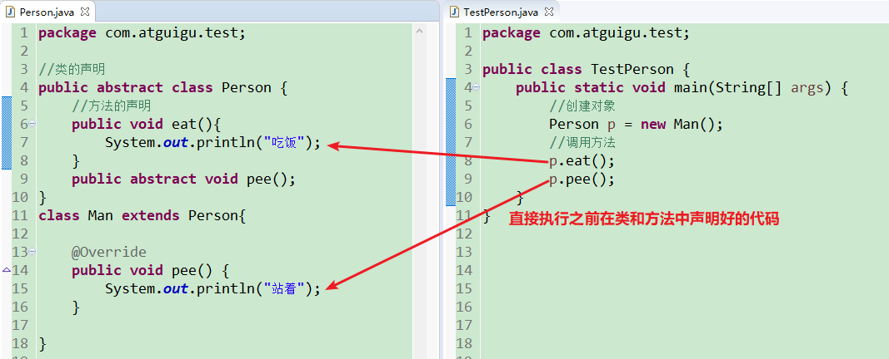

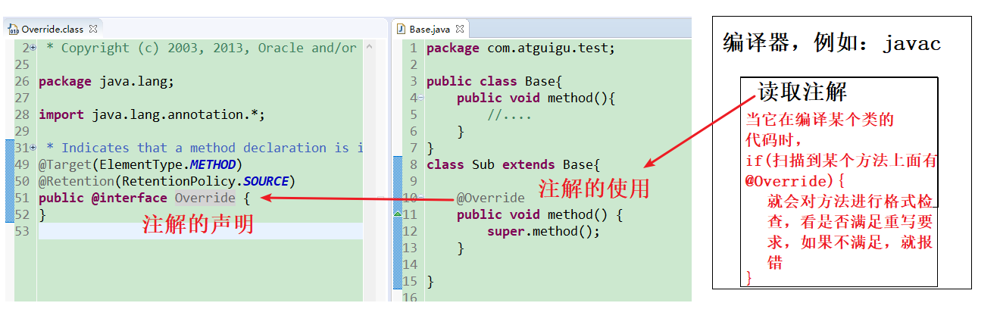


而我们平时使用的注解，要么是JRE核心类库中声明的，要么是某个框架（例如JUunit框架，Spring框架等）声明的，如果是JRE类库中声明的注解，JDK中都会提供该注解的读取程序，要么是在编译中，要么在某个其他的地方。而框架中声明注解，读取该注解的程序在框架中定义，因此每一个注解的意义由框架（例如JUunit框架，Spring框架等）决定。

### 7.7.2 系统预定义的三个最基本的注解

#### 1、@Override

​	用于检测被修饰的方法为有效的重写方法，如果不是，则报编译错误!

​	只能标记在方法上。

​	它会被编译器程序读取。

#### 2、@Deprecated

​	用于表示被标记的数据已经过时，不建议使用。

​	可以用于修饰 属性、方法、构造、类、包、局部变量、参数。

​	它会被编译器程序读取。

#### 3、@SuppressWarnings

​	抑制编译警告。

​	可以用于修饰类、属性、方法、构造、局部变量、参数

​	它会被编译器程序读取。

示例代码：

```java
public class TestAnnotation {
	@SuppressWarnings({"unused","rawtypes", "unchecked"})
	public static void main(String[] args) {
		
		int i;
	
		List list = new ArrayList();
		list.add("");
		list.add(123);
		list.add("");
		
		Father f = new Son();
		f.show();
		f.methodOl();
	}

}


class Father{
	@Deprecated
	public void show() {
		
	}
	public void methodOl() {
		System.out.println("Father Method");
	}
	public void print1n(){
		System.out.println("Father Method");
	}
	public int sum(int... nums){
		int sum = 0;
		for (int i = 0; i < nums.length; i++) {
			sum += nums[i];
		}
		return sum;
	}
}

class Son extends Father{
	
/*	@Override
	public void method01() {
		System.out.println("Son Method");
	}
	
	@Override
	public void println(){
		System.out.println("Father Method");
	}
	
	@Override
	public long sum(int[] nums){
		int sum = 0;
		for (int i = 0; i < nums.length; i++) {
			sum += nums[i];
		}
		return sum;
	}*/
}
```

### 7.7.3 Java中文档注释

* @author 标明开发该类模块的作者，多个作者之间使用,分割
* @version 标明该类模块的版本
* @see 参考转向，也就是相关主题
* @since 从哪个版本开始增加的
* @param 对方法中某参数的说明，如果没有参数就不能写
* @return 对方法返回值的说明，如果方法的返回值类型是void就不能写
* @throws/@exception 对方法可能抛出的异常进行说明 ，如果方法没有用throws显式抛出的异常就不能写
  * 其中 @param  @return 和 @exception 这三个标记都是只用于方法的。
  * @param的格式要求：@param 形参名 形参类型  形参说明
  * @return 的格式要求：@return 返回值类型 返回值说明
  * @exception 的格式要求：@exception 异常类型 异常说明
  * @param和@exception可以并列多个

javadoc.exe就是这些注解的信息处理流程。

示例代码：

```java
/**
 * 
 * @author Irene
 *
 */
public class TestAnnotation2 {
	
	/**
	 * 这是Java的主方法，是Java程序的入口
	 * @param args String[] 命令行参数，使用java命令时，在后面传入参数，例如
	 * 	java 类名   参数1  参数2 ....
	 */
	public static void main(String[] args) {
		
	}
	
	/**
	 * 这是一个求两个整数中最大值的方法
	 * @param a int 其中一个整数
	 * @param b int 另一个整数
	 * @return int 返回最大值
	 */
	public static int getMax(int a, int b){
		return a>b?a:b;
	}
	
	/**
	 * 这是复制一个文件的方法
	 * @param src String 源文件
	 * @param dest  String 目标文件
	 * @throws FileNotFoundException 当源文件找不到时会抛出该异常
	 */
	public static void copyFile(String src, String dest) throws FileNotFoundException{
		FileInputStream fis = new FileInputStream(src);
		//..
	}
	
	/**
	 * 
	 */
	public void println(){
		
	}
}
```

> 注释与代码要一致，如果不一致，会误导别人或自己

#### eclipse中导出javadoc


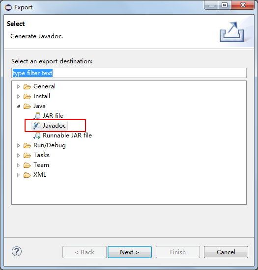

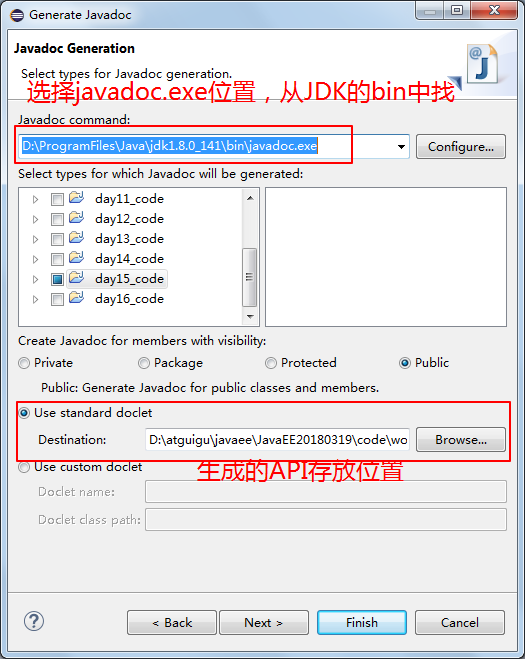

如果导出时有乱码问题，可以在上述窗口下面按next到最后一步通过增加Javadoc的额外参数选项来指定字符编码再导出：

```command
-docencoding UTF-8
-encoding UTF-8
-charset UTF-8
```

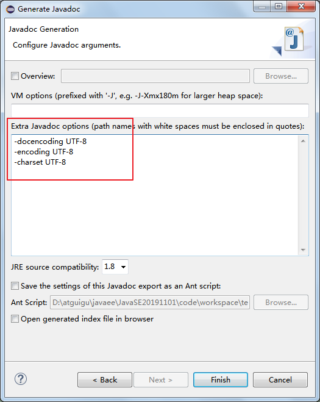

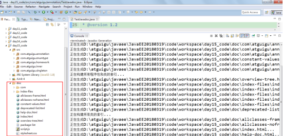

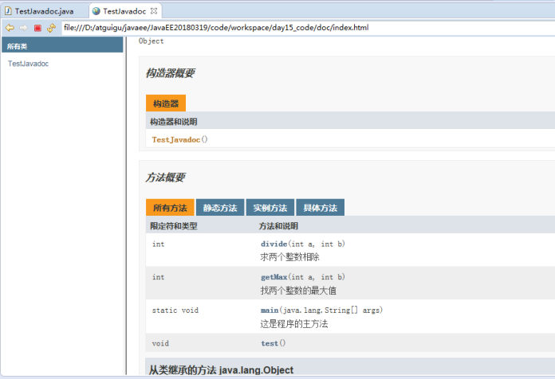

#### idea中导出javadoc


### 7.7.4 JUnit单元测试

JUnit是由 Erich Gamma 和 Kent Beck 编写的一个回归测试框架（regression testing framework）,供Java开发人员编写单元测试之用。多数Java的开发环境都已经集成了JUnit作为单元测试的工具。JUnit测试是程序员测试，即所谓白盒测试，因为程序员知道被测试的软件如何（How）完成功能和完成什么样（What）的功能。

要使用JUnit，必须在项目的编译路径中必须引入JUnit的库，即相关的.class文件组成的jar包。如何把JUnit的jar添加到编译路径如图所示：

#### 在eclipse中截图如下：

##### 方式一：


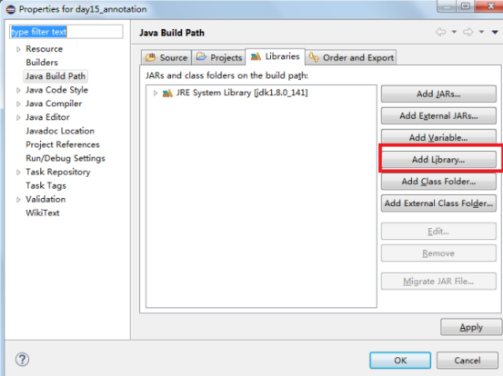


##### 方式二：

在@Test后面按Ctrl + 1，在选择Add JUnit 4 library to the build path

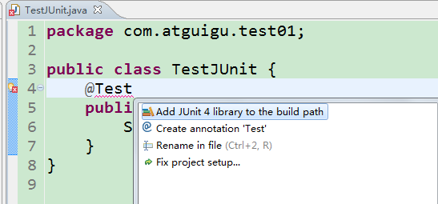


#### 在idea中截图如下：

##### 方式一：指定本地jar目录

单击工具栏的打开项目设置

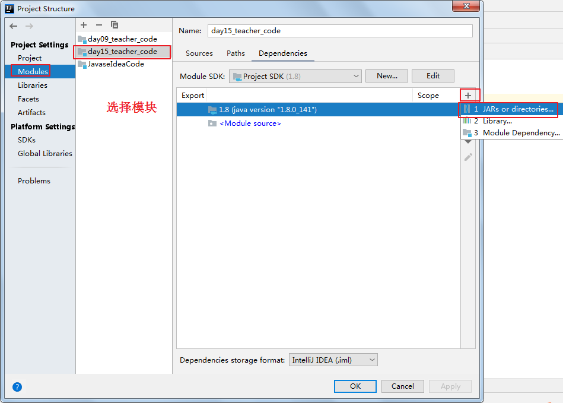


注意：如上操作需要提前下载，并将JUnit的相关jar放到当前模块的libs文件夹中。


##### 方式二：指定Marven仓库

在@Test后面按Alt + 回车，选择Add 'JUnit4' to classpath即可

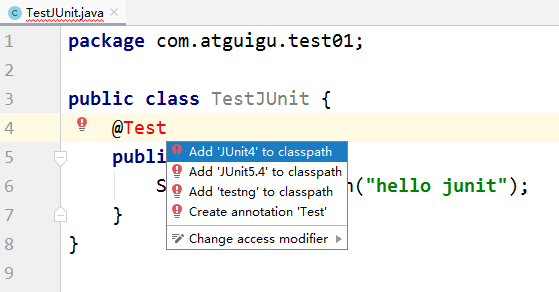

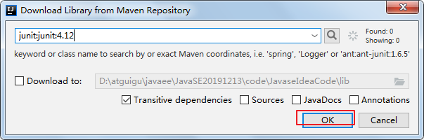

**注意：如果Maven的本地仓库（例如：C:\Users\Irene\\.m2）中没有则需要联网从Maven的中央仓库中下载。**


* 首先使用JUnit测试的类必须是public的。需要测试的方法都必须是public，无参，无返回值。
* @Test：标记在非静态的测试方法上。只有标记@Test的方法才能被作为一个测试方法单独测试。一个类中可以有多个@Test标记的方法。运行时如果只想运行其中一个@Test标记的方法，那么选择这个方法名，然后单独运行，否则整个类的所有标记了@Test的方法都会被执行，**而且执行顺序不可控**。

@Test注解会被JUnit框架读取，并处理。

示例代码：

```java
package com.atguigu.annotation;

import java.util.Arrays;

import org.junit.After;
import org.junit.AfterClass;
import org.junit.Before;
import org.junit.BeforeClass;
import org.junit.Test;

public class TestJUnit {
	private static Object[] array;
	private static int total;

	@Test
	public void delete(){
		//从数组中删除一个元素
		System.out.println("delete");
		System.arraycopy(array, 1, array, 0, 2);
		array[--total]=null;
        System.out.println(Arrays.toString(array));
	}
	@Test
	public void tadd(){
		//往数组中存储三个元素
		System.out.println("add");
		array[total++] = "hello";
		array[total++] = "world";
		array[total++] = "java";
        System.out.println(Arrays.toString(array));
	}
	
}
```


