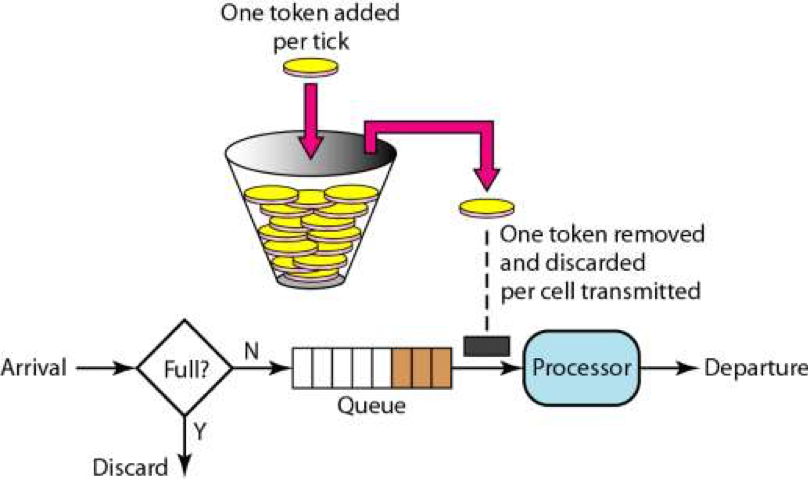

### Guaua工具类

```xml
<!-- https://mvnrepository.com/artifact/com.google.guava/guava -->
<dependency>
    <groupId>com.google.guava</groupId>
    <artifactId>guava</artifactId>
    <version>29.0-jre</version>
</dependency>
```


#### 1. Stopwatch

**使用场景：**用于代码进行程序耗时计算和性能调试。也可使用Arths运行时统计耗时替代。


**源码分析：**

```java
// 方法都是返回自身，可以链式调用
public final class Stopwatch {
  private final Ticker ticker; // 计时器，用于获取当前时间
  private boolean isRunning;   // 计时器是否运行中的状态标记
  private long elapsedNanos;   // 调用stop()的时刻 - 调用start()方法的时刻
  private long startTick;      // 计时器开启的时刻时间:调用start方法的时刻
}

```


**API使用：**

```java
// 设置startTick时间为stopwatch开始启动的时刻时间
public Stopwatch start() 

// 设置elapsedNanos时间为方法调用时间-stopwatch开启时间+上次程序stopwatch的elapsedNanos历史时间  
public Stopwatch stop()  

// 如果stopwatch仍在运行中，返回当前时刻时间-stopwatch开启时刻时间+历史elapsedNanos时间
// 如果stopwatch已停止运行，则直接返回elapsedNanos
private long elapsedNanos()

// 重置elapsedNanos=0
public Stopwatch reset()  

// 使用姿势一：start-stop ==> 获取统计时间
Stopwatch stopwatch = Stopwatch.createStarted();
doSomething();
stopwatch.stop(); // optional
long millis = stopwatch.elapsed(MILLISECONDS);

// 使用姿势二：start-stop ==> reset-start ==> stop
Stopwatch stopwatch = Stopwatch.createStarted();
doSomething();
stopwatch.stop();
long millis = stopwatch.elapsed(MILLISECONDS);
log.info("time: " + stopwatch); // formatted string like "12.3 ms"

stopwatch.reset().start();
doSomething();
stopwatch.stop();
long millis = stopwatch.elapsed(MILLISECONDS);
```


#### 2. Splitter

**使用场景：**主要用于字符串的切割成list或者map，简化开发。


**源码分析：**

```java
public final class Splitter {
  private final CharMatcher trimmer;      // 返回结果是否进行字符串trim处理
  private final boolean omitEmptyStrings; // 是否忽略空字符串
  private final Strategy strategy;        // 字符切割策略类【字符，字符串，正则表达式】
  private final int limit;                // 字符切割个数，达到指定值不切割
  ... 
}

```


**常用API：**

```java
// Splitter 字符切割构造方式[字符, 字符串, ]
public static Splitter on(char separator)
public static Splitter on(final String separator)
public static Splitter on(Pattern separatorPattern)
public static Splitter fixedLength(final int length)
  
// 构造Splitter 对空字符，切割个数，返回结果trim 操作策略
public Splitter omitEmptyStrings() 
public Splitter trimResults() 
public Splitter limit(int limit)  

// 对字符进行切割
public Iterable<String> split(final CharSequence sequence)
public List<String> splitToList(CharSequence sequence) 
  
// 使用MapSplitter将字符切割成map
public MapSplitter withKeyValueSeparator(String separator)
public MapSplitter withKeyValueSeparator(char separator)
public Map<String, String> split(CharSequence sequence)

```


#### 3. Joiner

**使用场景：**使用集合转化为指定格式分割的字符串展示【可以使用java8 Collector.joining替换】


**常用API：**

```java
// 变量：分割符
private final String separator;

// 构造函数
private Joiner(String separator)  
private Joiner(Joiner prototype) 
  
// 静态创建Joiner方法
public static Joiner on(String separator)
public static Joiner on(char separator)

// 返回过滤null 的Joiner对象
public Joiner skipNulls()
  
// 返回使用默认字符替换null的 Joiner对象
public Joiner useForNull(final String nullText)  
  
// 功能函数join
public final String join(Iterable<?> parts)
public final String join(Object[] parts)
  
  
// map: Joiner.on("#").withKeyValueSeparator("=").join(map);
public Joiner.MapJoiner withKeyValueSeparator(String keyValueSeparator)  
  
```


#### 4. 集合类

```java
// 1.Lists工具类

// 工厂方法  
public static <T> ArrayList<T> newArrayList()
public static <T> ArrayList<T> newArrayList(T... elements)
public static <E> LinkedList<E> newLinkedList()
  
// 生成新的集合倒序
public static <T> List<T> reverse(List<T> list) 
  
// 将集合按照长度分组 
public static <T> List<List<T>> partition(List<T> list, int size)  
  


// 2.Sets工具类

// 工厂方法  
public static <E> HashSet<E> newHashSet()
public static <E> HashSet<E> newHashSet(E... elements)  
  
// [并集,交集,差集]  
public static <E> Sets.SetView<E> union(final Set<? extends E> set1, final Set<? extends E> set2) 
public static <E> Sets.SetView<E> intersection(final Set<E> set1, final Set<?> set2)
public static <E> Sets.SetView<E> difference(final Set<E> set1, final Set<?> set2)
public ImmutableSet<E> immutableCopy() //SetView转ImmutableSet //不可变集合
  

// 3.Maps工具类

// 工厂方法 
public static <K, V> HashMap<K, V> newHashMap()
public static <K, V> LinkedHashMap<K, V> newLinkedHashMap() 
public static <K, V> ConcurrentMap<K, V> newConcurrentMap() 
  

  
// 4.ImmutableList不可变集合  
// 说明：Collections#unmodifiableList 只是包装原始集合，原始集合是可以进行add操作
public static <E> ImmutableList<E> of(E element) //工厂方法
public static <E> ImmutableList<E> copyOf(Collection<? extends E> elements) //copyOf
public static <E> ImmutableList.Builder<E> builder() //创建builder(有add方法可以添加元素)
public ImmutableList.Builder<E> add(E element) //添加对象到builder
public ImmutableList<E> build() //生成ImmutableList  
  
public static <E> ImmutableSet<E> of(E element) //工厂方法
public static <E> ImmutableSet<E> copyOf(Collection<? extends E> elements) //copyOf
public static <E> ImmutableSet.Builder<E> builder() //创建builder
public ImmutableSet.Builder<E> add(E element) //添加对象到builder
public ImmutableSet<E> build()  //ImmutableSet 
  
public static <K, V> ImmutableMap<K, V> of(K k1, V v1) //工厂方法
public static <K, V> ImmutableMap<K, V> copyOf(Map<? extends K, ? extends V> map) //copyOf
public static <K, V> ImmutableMap.Builder<K, V> builder() //创建builder
public ImmutableMap.Builder<K, V> put(K key, V value)  //添加对象到builder
public ImmutableMap<K, V> build() //ImmutableMap
 
  
// 5.MultiMap集合
public static <K, V> ArrayListMultimap<K, V> create() //创建
public boolean put(@NullableDecl K key, @NullableDecl V value) //添加元素

//工具类Multimaps的使用
//传入参数集合，和key函数返回一个ImmutableListMultimap（本质Map<K,List<V>>）
public static <K, V> ImmutableListMultimap<K, V> index(
Iterable<V> values, Function<? super V, K> keyFunction)
ListMultimap<String, Person> personGroup = Multimaps.index(persons, Person::getName); 

```


#### 5. Cache缓存

**使用场景：**用于本地LRU缓存实现。缓存对应的数据结构如下：


**API使用**：

```java
 private CacheLoader<Long, List<String>> loader = new CacheLoader<Long, List<String>>() {
     @Override
     public List<String> load(@Nullable Long shopDeliverId) {
         return Collections.emptyList();
     }
 };

 
 private LoadingCache<Long, List<String>> localCache = CacheBuilder.newBuilder()
         .maximumSize(2 * 1024L)
         .expireAfterWrite(1, TimeUnit.SECONDS)
         .removalListener(removalNotification -> {
             log.info("localCache onRemoval. key: {}, value: {}, cause: {}",
                     removalNotification.getKey(), removalNotification.getValue(), removalNotification.getCause());
         })
         .build(loader);
```


**源码分析：**

```java
1. Cache类数据结构
CacheBuilder类：，缓存构建器。用于创建localCache.传递过期策略，最大缓存数，移除通知，lood方式的参数。
CacheLoader抽象类：用于从数据源加载数据，定义load、reload、loadAll等操作。
   -- public abstract V load(K key) throws Exception;
    
LocalCache类：guava cache的核心类，包含了guava cache的数据结构以及基本的缓存的操作方法。
  -- 属性
    long maximumSize； // 最大长度
    final long expireAfterAccessNanos; // 创建或写或读后的固定值的有效期到达数据会被自动从缓存中移除。
    final long expireAfterWriteNanos; // 创建或写之后的 固定有效期到达时，数据会被自动从缓存中移除
    long refreshNanos; // 创建或写之后的固定值的有效期到达时，且新请求过来时，数据会被自动刷新
    CacheLoader<? super K, V> defaultLoader; // 缓存数据加载器
    final StatsCounter globalStatsCounter; // 计数器
    
  -- 核心方法: get(): 重载并获取 ; refresh():刷新缓存
    
  -- 静态内部类: LocalManualCache, LocalManualCache
  

-- Cache接口: 定义get、put、invalidate等操作。
  -- LoadingCache接口：继承自Cache并且定义了get、getUnchecked、refresh接口。会加载数据
    -- LocalManualCache类：实现Cache接口，通过代理LocalCache实现缓存接口基本操作
      -- LocalLoadingCache类：实现LoadingCache接口，继承LocalManualCache类。

RemovalNotification类：删除通知类，包含cause和key-value
RemovalCause枚举类：EXPLICIT, REPLACED, COLLECTED, EXPIRED, SIZE


  
2. 数据过期重载
  getOrLoad(K key) ==> key获取不到，会同步调用load方法加载缓存数据并返回
  refresh(K key) ==> 最终刷新调用的CacheLoader接口实现类的reload方法实现的异步刷新
  
3. 缓存回收机制
   i). 基于容量回收：CacheBuilder.maximumSize(long)
   ii).定时回收：
     expireAfterAccess(long, TimeUnit)：缓存项在给定时间内没有被读/写访问，则在下次读取时回收。   
     expireAfterWrite(long, TimeUnit)：缓存项在给定时间内没有被写（创建或覆盖），则在下次读取时回收。

   iii).基于引用回收：
     CacheBuilder.weakKeys()：使用弱引用存储键。当键没有其它（强或软）引用时，缓存项可以被垃圾回收。
        因为垃圾回收仅依赖恒等式（==），使用弱引用键的缓存用==而不是equals比较键。
     CacheBuilder.weakValues()：使用弱引用存储值。当值没有其它（强或软）引用时，缓存项可以被垃圾回收。
        因为垃圾回收仅依赖恒等式（==），使用弱引用值的缓存用==而不是equals比较值。
     CacheBuilder.softValues()：使用软引用存储值。软引用只有在响应内存需要时，才按照全局最近最少使用
        的顺序回收。考虑到使用软引用的性能影响，我们通常建议使用更有性能预测性的缓存大小限定

   iv）显式清除：任何时候，你都可以显式地清除缓存项，而不是等到它被回收，具体如下
     Cache.invalidate(key)
     Cache.invalidateAll(keys)
     Cache.invalidateAll()
```


#### 6. RateLimit限流

**限流的目的：**通过对并发访问/请求进行限速或者一个时间窗口内的的请求进行限速来保护系统，一旦达到限制速率则可以拒绝服务或进行流量整形。

**限流种类**：

* 限制总并发数 ==> 比如数据库连接池、线程池等
* 限制瞬时并发数 ==> nginx的limit_conn模块用来限制瞬时并发连接数、Java的Semaphore等
* 限制时间窗口内的平均速率 ==> nginx的limit_req模块r、Guava的RateLimite

**限流算法**：

* 漏桶算法：依赖于队列，请求到达如果队列未满则直接放入队列，然后有一个处理器按照固定频率从队列头取出请求进行处理。如果请求量大，则会导致队列满，那么新来的请求就会被抛弃。【如消息队列】

  


* 令牌桶算法：一个存放固定容量令牌的桶，按照固定速率往桶里添加令牌。桶中存放的令牌数有最大上限，超出之后就被丢弃或者拒绝。

  


**API使用：**

```java
// 1. 工厂方法创建RateLimiter
public static RateLimiter create(double permitsPerSecond) 
public static RateLimiter create(double permitsPerSecond, long warmupPeriod, TimeUnit unit)

// 2. 常用操作API
  
// 更新每秒生成许可数
public final void setRate(double permitsPerSecond)
  
// 获取设置的每秒生成许可数
public final double getRate()
  
// 获取许可数, 方法会阻塞直到拿到指定许可数
public double acquire(int permits)
  
// 指定时间内获取指定许可数，未获取返回false
public boolean tryAcquire(int permits, long timeout, TimeUnit unit)
  
 
// 3. 使用姿势
 i).配置中心管理限流值，动态进行setRate变更。
 ii).使用非阻塞tryAcquire进行限流处理
  
  
```


**源码分析：**

```java
1. 数据结构

RateLimiter抽象类
   -- SmoothRateLimiter平滑限流抽象类
      -- SmoothBursty
      -- SmoothWarmingUp

核心属性说明：
  double storedPermits; // 当前存储令牌数
  double maxPermits;  //最大存储令牌数
  double stableIntervalMicros;// 添加令牌时间间隔
  /**
   * 下一次请求可以获取令牌的起始时间
   * 由于RateLimiter允许预消费，上次请求预消费令牌后
   * 下次请求需要等待相应的时间到nextFreeTicketMicros时刻才可以获取令牌
  */
  long nextFreeTicketMicros = 0L;


2. RateLimiter创建过程
SmoothBursty平滑突发限流：
  storedPermits ==> 存储的令牌个数，初始值为0
  nextFreeTicketMicros ==> 下一次请求可以获取令牌的起始时间（默认当前时间）
  maxPermits ==> permitsPerSecond * maxBurstSeconds
  stableIntervalMicros ==> 令牌生成间隔时间 (1/permitsPerSecond)
  storedPermits ==> 当前存储令牌数默认为0
  maxBurstSeconds ==> 最大缓存突发流量令牌时间 1s
  
SmoothWarmingUp平滑预热限流：启动后会有一段预热期，逐步将分发频率提升到配置的速率。
  warmupPeriodMicros ==> 预热时间长度
  
3.acquire执行限流过程：
  i).首先根据当前时间和nextFreeTicketMicros得到已经存储的令牌数
     Min((当前时间-nextFreeTicketMicros) / stableIntervalMicros ,不能超过maxPermits)
  ii).计算等待时间：预消费令牌个数 * stableIntervalMicros，并且重新设置nextFreeTicketMicros
     nextFreeTicketMicros += waitTime
  
4.tryAcquire执行限流流程：
  i).判断 (nextFreeTicketMicros+timeout) <= now 则说明可以获取令牌，否则返回false
  ii).设置nextFreeTicketMicros，然后返回结果true
  
 
```


