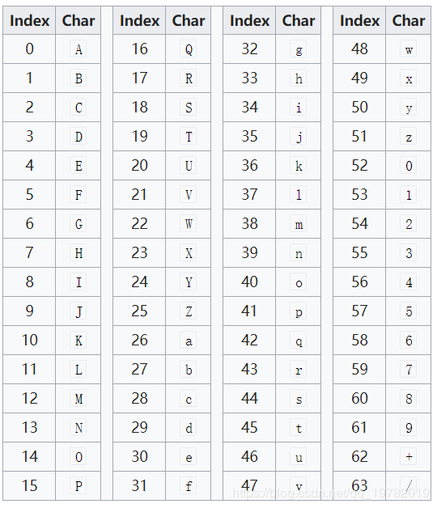

### apache-common-codec工具类

```xml
<!-- apache编码包 -->
<dependency>
    <groupId>commons-codec</groupId>
    <artifactId>commons-codec</artifactId>
    <version>1.14</version>
</dependency>

<!-- google加解密包 -->
<dependency>
    <groupId>com.google.crypto.tink</groupId>
    <artifactId>tink</artifactId>
    <version>1.3.0</version>
</dependency>
```


#### 1. Base64编码算法

**Base64**：是一种基于64个可打印字符来表示二进制的表示方法。由于所以每6个[比特]位为一个单元，对应某个可打印字符。3个字节有24个比特，对应于4个Base64单元，即3个字节可由4个可打印字符来表示。Base64常用于在通常处理文本的场合，表示、传输、存储一些二进制数据，包括MIME的电子邮]及XML的一些复杂数据。

**Base64索引表：**



**Base64算法实现：**把一个个24比特位组成的二进制组合转换成32比特位组成的二进制组合。每3个字节分成4组进行Base64编码  ==> 也就是每6个bit为一组进行索引值转换对应base64字符。分组不够需要用=填充

举例：字符a ==> 对应二进制01100001

按3字节分成4个分组：011000 010000  分组3无  分组4无   ==>  YQ==

```java
#Base64(加密和解密的对象是byte[])

# 加密
public static byte[] encodeBase64(final byte[] binaryData)
public static byte[] encodeBase64(final byte[] binaryData, final boolean isChunked)
public static String encodeBase64String(final byte[] binaryData)

#解密
public static byte[] decodeBase64(final byte[] base64Data)

@Test 
public void test() {
	String test = "hello world";
	byte[] encodeBytes = Base64.encodeBase64(test.getBytes());
	System.out.println(Base64.encodeBase64String("hello world".getBytes()));
	System.out.println("common codes encode:" + new String(encodeBytes));

	byte[] dencodeBytes = Base64.decodeBase64(encodeBytes);
	System.out.println("common codes decode:" + new String(dencodeBytes));
}
  
```


#### 2. DigestUtils

```java
#DigestUtils(md5/sha1-2-5)  
// md5散列算法值 ==> 16进制展示字符
public static byte[] md5(final byte[] data)
public static String md5Hex(final byte[] data)
public static String md5Hex(final String data)
 
// sha散列算法值  
public static byte[] sha256(final byte[] data)
public static String sha256Hex(final byte[] data)
public static String sha256Hex(final String data)

@Test
public void test5() {
	String test = "hello world";
	System.out.println(DigestUtils.md5Hex(test));  
	System.out.println(DigestUtils.sha1Hex(test));
	System.out.println(DigestUtils.sha256Hex(test));
	System.out.println(DigestUtils.sha512Hex(test));
}

#JDK:md5/sha
@Test
public void test2() {
	String test = "hello";
	try {
		MessageDigest md = MessageDigest.getInstance("MD5");
		byte[] md5Bype = md.digest(test.getBytes());
		System.out.println(Hex.encodeHexString(md5Bype));
	} catch (Exception e) {
	  e.printStackTrace();
	}
}

@Test
public void test3() {
	String test = "hello";
	try {
		MessageDigest md = MessageDigest.getInstance("SHA");
		md.update(test.getBytes());
		System.out.println(Hex.encodeHexString(md.digest()));
	} catch (Exception e) {
		e.printStackTrace();
	}
}
```


#### 3. Tink

```java
TinkConfig.register();
KeysetHandle keysetHandle =         KeysetHandle.generateNew(AeadKeyTemplates.AES128_CTR_HMAC_SHA256);
Aead aead = keysetHandle.getPrimitive(Aead.class);
byte[] encrypt = aead.encrypt(hello.getBytes(), "script".getBytes());
byte[] decrypt = aead.decrypt(encrypt, "script".getBytes());

```


#### 4. JDK加密解密

```java
@Slf4j
public class EncryptUtils {

    private EncryptUtils() {
    }

    /**
     * 返回加密后的密文
     *
     * @param plaintext           明文
     * @param key                 密钥
     * @param cipherAlgorithmEnum 非对称加密算法枚举
     * @return 加密后的密文
     */
    public static String encrypt(String plaintext, String key, CipherAlgorithmEnum cipherAlgorithmEnum) {
        Assert.hasLength(key, "Key must not be empty");
        Assert.isTrue(key.length() >= cipherAlgorithmEnum.getKeyLength(), "The length of key must large equals than " + cipherAlgorithmEnum.getKeyLength());

        try {
            // 获取加密对象
            Cipher cipher = Cipher.getInstance(cipherAlgorithmEnum.getTransformation());

            // 创建加密规则
            // 第一个参数key的字节
            // 第二个参数表示加密算法
            SecretKeySpec sks = new SecretKeySpec(key.getBytes(), cipherAlgorithmEnum.getAlgorithm());

            // ENCRYPT_MODE：加密模  DECRYPT_MODE: 解密模式
            // 初始化加密模式和算法
            if (cipherAlgorithmEnum.isNeedIV()) {
                IvParameterSpec ivParameterSpec = new IvParameterSpec(key.getBytes());
                cipher.init(Cipher.ENCRYPT_MODE, sks, ivParameterSpec);
            } else {
                cipher.init(Cipher.ENCRYPT_MODE, sks);
            }

            byte[] bytes = cipher.doFinal(plaintext.getBytes());
            return Base64Utils.encodeToString(bytes);
        } catch (Exception e) {
            throw new IllegalStateException("encrypt [" + plaintext + "] error" + plaintext, e);
        }
    }


    /**
     * 返回解密后的明文
     *
     * @param ciphertext          加密字符
     * @param key                 密钥
     * @param cipherAlgorithmEnum 非对称加密算法枚举
     * @return 返回解密后字符
     */
    public static String decrypt(String ciphertext, String key, CipherAlgorithmEnum cipherAlgorithmEnum) {
        Assert.hasLength(key, "Key must not be empty");
        Assert.isTrue(key.length() >= cipherAlgorithmEnum.getKeyLength(), "The length of key must large equals than " + cipherAlgorithmEnum.getKeyLength());

        try {
            // 获取加密对象
            Cipher cipher = Cipher.getInstance(cipherAlgorithmEnum.getTransformation());

            // 创建加密规则
            // 第一个参数key的字节
            // 第二个参数表示加密算法
            SecretKeySpec sks = new SecretKeySpec(key.getBytes(), cipherAlgorithmEnum.getAlgorithm());

            // ENCRYPT_MODE：加密模  DECRYPT_MODE: 解密模式
            // 初始化加密模式和算法
            if (cipherAlgorithmEnum.isNeedIV()) {
                IvParameterSpec ivParameterSpec = new IvParameterSpec(key.getBytes());
                cipher.init(Cipher.DECRYPT_MODE, sks, ivParameterSpec);
            } else {
                cipher.init(Cipher.DECRYPT_MODE, sks);
            }

            byte[] bytes = cipher.doFinal(Base64Utils.decodeFromString(ciphertext));
            return new String(bytes);

        } catch (Exception e) {
            throw new IllegalStateException("decrypt [" + ciphertext + "] error" + ciphertext, e);
        }
    }


    public static void printRsaKey() {
        // 获取密钥对生成器
        KeyPairGenerator keyPairGenerator = null;
        try {
            keyPairGenerator = KeyPairGenerator.getInstance("RSA");
        } catch (NoSuchAlgorithmException ex) {
            log.error("Unknown algorithm.", ex);
            return;
        }
        // 获取密钥对
        KeyPair keyPair = keyPairGenerator.generateKeyPair();

        // 获取公钥 / 私钥
        PublicKey publicKey = keyPair.getPublic();
        PrivateKey privateKey = keyPair.getPrivate();

        // 获取byte数组
        byte[] publicKeyEncoded = publicKey.getEncoded();
        byte[] privateKeyEncoded = privateKey.getEncoded();

        // 进行Base64编码
        System.out.println("公钥：" + Base64Utils.encodeToString(publicKeyEncoded));
        System.out.println("私钥：" + Base64Utils.encodeToString(privateKeyEncoded));

    }


    /**
     * 通过公钥字符构造公钥对象
     *
     * @param publicKey 公钥字符
     * @return 返回公钥对象
     */
    private static PublicKey getPublicKey(String publicKey) throws Exception {

        // 获取密钥工厂
        KeyFactory keyFactory = KeyFactory.getInstance("RSA");
        // 构建密钥规范 进行Base64解码
        X509EncodedKeySpec spec = new X509EncodedKeySpec(Base64Utils.decodeFromString(publicKey));

        // 生成公钥
        return keyFactory.generatePublic(spec);
    }

    /**
     * 通过私钥字符构造私钥对象
     *
     * @param privateKey 私钥字符
     * @return 私钥对象
     */
    private static PrivateKey getPrivateKey(String privateKey) throws Exception {
        // 获取密钥工厂
        KeyFactory keyFactory = KeyFactory.getInstance("RSA");
        // 构建密钥规范 进行Base64解码
        PKCS8EncodedKeySpec spec = new PKCS8EncodedKeySpec(Base64Utils.decodeFromString(privateKey));
        // 生成私钥
        return keyFactory.generatePrivate(spec);
    }


    /**
     * RSA加密
     *
     * @param publicKey 公钥字符
     * @param plaintext 明文
     * @return 返回base64编码后的密文
     */
    public static String encryptWithRsa(String publicKey, String plaintext) {

        try {
            // 创建加密对象
            Cipher cipher = Cipher.getInstance("RSA");

            // 初始化加密
            // 第一个参数:加密的模式
            // 第二个参数：使用私钥进行加密
            cipher.init(Cipher.ENCRYPT_MODE, getPublicKey(publicKey));
            byte[] bytes = cipher.doFinal(plaintext.getBytes());


            return Base64Utils.encodeToString(bytes);
        } catch (Exception e) {
            throw new IllegalStateException("encrypt [" + plaintext + "] error" + plaintext, e);
        }
    }


    /**
     * RSA解密
     *
     * @param privateKey 私钥
     * @param ciphertext 密文
     * @return 返回解密后的明文
     */
    public static String decryptWithRsa(String privateKey, String ciphertext) {
        try {
            // 创建加密对象
            Cipher cipher = Cipher.getInstance("RSA");
            // 私钥进行解密
            cipher.init(Cipher.DECRYPT_MODE, getPrivateKey(privateKey));
            // 由于密文进行了Base64编码, 在这里需要进行解码
            byte[] decode = Base64Utils.decodeFromString(ciphertext);
            return new String(cipher.doFinal(decode));
        } catch (Exception ex) {
            throw new IllegalStateException("decrypt [" + ciphertext + "] error" + ciphertext, ex);
        }

    }


    /**
     * 获取内容摘要信息
     *
     * @param plaintext  明文
     * @param privateKey 私钥字符
     * @return 摘要信息
     */
    public static String getSignature(String plaintext, String privateKey) {

        try {
            // 获取签名对象
            Signature signature = Signature.getInstance("sha256withrsa");
            // 初始化签名
            signature.initSign(getPrivateKey(privateKey));
            // 传入原文
            signature.update(plaintext.getBytes());

            // 开始签名
            byte[] sign = signature.sign();
            return Base64Utils.encodeToString(sign);
        } catch (Exception ex) {
            throw new IllegalStateException("getSignature error.", ex);
        }
    }


    /**
     * 签名使用：客户端生产的公钥复制到服务器端达到免密登录。比如：github,gitlab，ssh免密登录 复制客户端公钥达到认证目的
     * 客户端发起登录，传递公钥 ==> 服务端查询是否配置和该公钥 ==> 没有配置下载服务器公钥，并要求使用密码登录；如果配置了
     * 公钥，则使用公钥加密数据给客户端，客户端使用私钥解密，并发送对应签名完成认证。
     *
     * @param plaintext     明文
     * @param publicKey     公钥
     * @param signatureData 签名数据
     * @return 签名认证结果
     */
    public static boolean verifySignature(String plaintext, String publicKey, String signatureData) {
        try {
            // 获取签名对象
            Signature signature = Signature.getInstance("sha256withrsa");
            // 初始化签名
            signature.initVerify(getPublicKey(publicKey));
            // 传入原文
            signature.update(plaintext.getBytes());
            // 校验数据
            return signature.verify(Base64Utils.decodeFromString(signatureData));
        } catch (Exception ex) {
            throw new IllegalStateException("verifySignature error.", ex);
        }

    }


    /**
     * 密码算法枚举
     */
    public enum CipherAlgorithmEnum {

        /**
         * DES加密算法 + ECB加密模式
         */
        DES_ECB("DES/ECB/PKCS5Padding", "DES", 8, false),


        /**
         * DES加密算法 + CBC加密模式
         */
        DES_CBC("DES/CBC/PKCS5Padding", "DES", 8, true),


        /**
         * AES加密算法 + ECB加密模式
         */
        AES_ECB("AES/ECB/PKCS5Padding", "AES", 16, false),


        /**
         * AES加密算法 + CBC加密模式
         */
        AES_CBC("AES/CBC/PKCS5Padding", "AES", 16, true),

        ;
        /**
         * 加密转换规则
         */
        private String transformation;

        /**
         * 算法
         */
        private String algorithm;

        /**
         * 密钥长度
         */
        private Integer keyLength;


        /**
         * 是否需要需要向量设置【CBC加密方式需要设置向量】
         */
        private boolean needIV;


        CipherAlgorithmEnum(String transformation, String algorithm, Integer keyLength, boolean needIV) {
            this.transformation = transformation;
            this.algorithm = algorithm;
            this.keyLength = keyLength;
            this.needIV = needIV;
        }


        public String getTransformation() {
            return transformation;
        }

        public String getAlgorithm() {
            return algorithm;
        }

        public Integer getKeyLength() {
            return keyLength;
        }

        public boolean isNeedIV() {
            return needIV;
        }
    }
    
}
```

