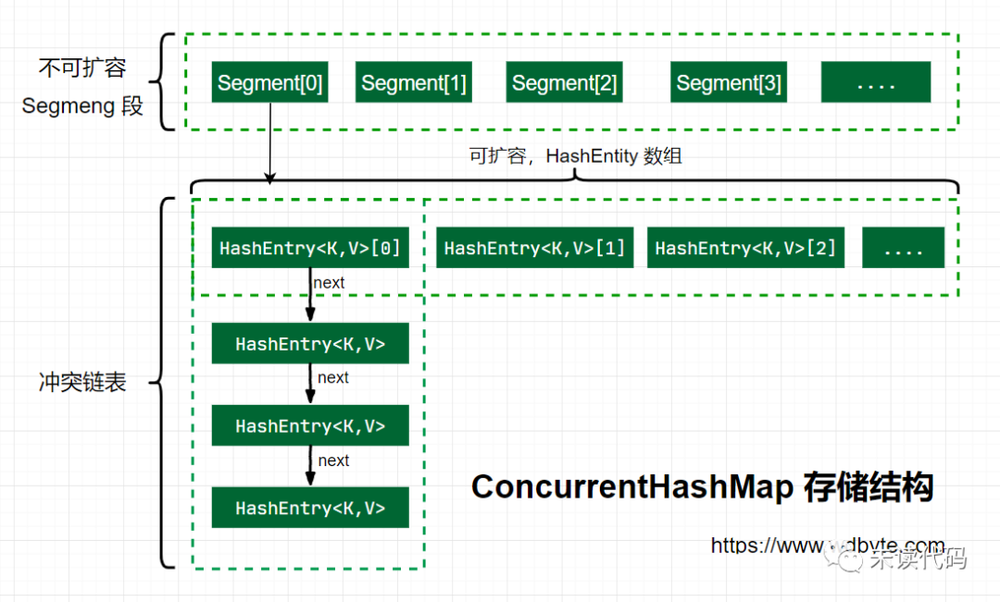

### Java并发编程

并发编程领域可以抽象成三个核心问题：任务分工 、任务协作、 互斥。

**任务分工：**首先我们可以将任务拆分成多个，然后发挥CPU多核效率提升系统响应，Java SDK 并发包里的 Executor、Fork/Join、Future 本质上都是一种分工方法。==> 提升cpu资源利用

**任务协作**：我们在拆分任务的过程中，线程之间可能存在协作问题。比如任务A执行需要等待任务B完成；这类情况可以统一描述为：当某个条件不满足时，某个任务对应的线程需要等待，当某个条件满足时，某个任务对应的线程需要被唤醒执行。Java SDK 里提供的 CountDownLatch、CyclicBarrier、Phaser、Exchanger 也都是用来解决线程协作问题。==> 解决多线程任务顺序问题

**互斥**：我们在执行不同分工的任务时候，可能共享同一个变量，这种情况我们需要使用互斥技术宝成多线程安全。Java 语言里 synchronized、SDK 里的各种 Lock 都能解决互斥问题；还可以使用无锁的数据结构，例如 Java SDK 里提供的原子类都是基于无锁技术实现的。


#### (一). 并发编程基础

##### 线程的基本概念

**程序**：是含有指令和数据的文件，被存储在磁盘或其他的数据存储设备中，也就是说程序是静态的代码。

**进程：**是程序的一次执行过程，系统运行程序的基本单位，因此进程是动态的。系统运行程序即是一个进程从创建，运行到消亡的过程。

**线程**：是一个比进程更小的执行单位。一个进程在其执行的过程中可以产生多个线程。与进程不同的是同类的多个线程共享进程的**堆**和**方法区**资源，但每个线程有自己的**程序计数器**、**虚拟机栈**和**本地方法栈**，所以系统在产生一个线程，或是在各个线程之间作切换工作时，负担要比进程小得多，也正因为如此，线程也被称为轻量级进程。


锁的基本概念：

* **可重入锁：**只有线程获取了锁，那么就可以无限次数进入该锁锁定的代码。

* **乐观锁和悲观锁：**乐观锁认为数据一般情况不会造成冲突，访问记录前不会加锁而是在更新数据提交更新的时候进行数据版本校验；悲观锁认为数据很容易被其他线程修改，所以在数据处理前加锁，直到数据处理结束。

* **公平锁和非公平锁：**公平锁表示线程获取锁的顺序是按照线程请求锁的时间早晚来决定的。非公平锁则是在运行时候闯入，后来可能先得到锁。

* **独占锁和共享锁：**独占锁表示锁只能被一个线程持有，共享锁同时可以被多个线程持有。


##### 线程间的等待通知

等待 - 通知机制：线程首先获取互斥锁，当线程要求的条件不满足时，释放互斥锁，进入等待状态；当要求的条件满足时，通知等待的线程，重新获取互斥锁。


##### 线程的安全性

线程安全性：当多个线程访问某个类时，这个类是始终能表现出正确的行为，就可以称这个类是线程安全的。

* 竞态条件问题【比如 i++】：执行i++是通过" 获取 - 修改 - 更新"三个步骤完成，多线程执行过程中可能同时执行代码获取i的值操作，从而导致修改的值不是` i = i + 2`, 而是`i = i + 1`。需要原子性操作保证。

* cpu多级缓存【发生内存不可见】：代码执行过程中，主内存中的变量值是加载到cpu高速缓存中进行计算的，多个线程执行过程中，不能感知变量已经被修改。

* cpu并行执行优化【发生乱序】：cpu为了效率采用并行执行，对于没有依赖的代码可能发生乱序行为。


##### 活跃性问题

活跃性问题，指的是某个操作无法执行下去。我们常见的“死锁”就是一种典型的活跃性问题，当然除了死锁外，还有两种情况，分别是“活锁”和“饥饿”。

* 死锁：一组互相竞争资源的线程因互相等待，导致“永久”阻塞的现象。 产生条件：

  > i). 互斥条件：资源同时只能被一个线程持有
  >
  > ii). 请求并持有条件：线程已经持有一个资源，又去申请被其他线程占用的资源。
  >
  > iii). 不可抢占条件：线程获取资源在执行完之前不能被其他线程抢占。
  >
  > iv). 环路等待条件：线程发生循环等待
  >
  > 解决死锁的思路：破坏2,3,4任一条件 ==> , 中断线程, 保持加锁顺序一致

* 活锁：线程虽然没有发生阻塞，因为互相谦让而导致无法执行不下去的情况。解决方式：等待一个随机的时间

* 饥饿：指的是线程因无法访问所需资源而无法执行下去的情况。解决方式 ：使用公平锁, 增加超时机制


#####性能问题

使用锁可以解决安全性问题，但是过度的串行会导致严重的性能问题。根据阿姆达尔（Amdahl）定律，具体公式如下：S=1 / [ (1 − p) + p / n ] 。公式里的 n 可以理解为 CPU 的核数，p 可以理解为并行百分比，提升性能的极限取决于串行百分比【1-p】，如果假设串行度是5%，再假设 CPU 的核数（也就是 n）无穷大，那加速比 S 的极限就是 20倍。解决性能问题方式：使用无锁算法或者减小锁力度。


#### (二). Java并发基础

##### Java线程API

```java
-- Runnable接口
  核心接口: public abstract void run();

  -- Thread类
    核心属性：
      private volatile String name; 
      private int priority; // 1,5,10
      private boolean daemon = false;  // 后台线程
      private Runnable target; // 任务
      private long tid; // 线程ID
      private ThreadGroup group;
      private ClassLoader contextClassLoader;
      private static int threadInitNumber; 
      private volatile int threadStatus = 0;

      // 持有ThreadLocalMap【线程私有变量Map集合】
      ThreadLocal.ThreadLocalMap threadLocals = null;

      // park阻塞对象
      volatile Object parkBlocker;

      // 异常处理
      private volatile UncaughtExceptionHandler uncaughtExceptionHandler;
      private static volatile UncaughtExceptionHandler defaultUncaughtExceptionHandler;


    核心方法：
      // 构造器方法
      public Thread(String name)
      public Thread(ThreadGroup group, String name)
      public Thread(ThreadGroup group, Runnable target)
      
      // 启动线程
      public synchronized void start()

      // 等待当前线程执行终止，并通过异常形式响应中断
      public final void join() throws InterruptedException;
      public final synchronized void join(long millis) throws InterruptedException;


      // 中断方法，异常会重置异常标识
      public void interrupt(); // 标识线程中断
      public boolean isInterrupted(); // 检测线程是否中断
      public static boolean interrupted(); // 标识当前线程中断，并清除中断标识


      // 判断当前线程是否存活
      public final native boolean isAlive()

      // 静态方法
      public static native void yield();  
      public static native Thread currentThread();

      // 休眠当前线程，不会释放锁资源，并且通过异常形式响应中断
      public static native void sleep(long millis) throws InterruptedException;  
      public static void sleep(long millis, int nanos)throws InterruptedException


      过期方法：stop(), destroy(), suspend(), resume()
    
      // 线程状态
      Thread#State ==> NEW, RUNNABLE, BLOCKED, WAITING, TIMED_WAITING, TERMINATED


-- Callable接口
  核心方法：
    V call() throws Exception;

  -- RunnableAdapter<T>接口 ==> 适配器，将老接口包装成新接口Callable
    核心属性：
      Runnable task; T result;


-- Future<V>接口
  核心方法：
    // 取消任务
    boolean cancel(boolean mayInterruptIfRunning);

    // 
    boolean isCancelled();
    boolean isDone();
    V get() throws InterruptedException, ExecutionException;
    V get(long timeout, TimeUnit unit) throws InterruptedException, ExecutionException, TimeoutException;


    -- RunnableFuture<V> 接口
      核心方法： void run();

      -- FutureTask
        核心属性：
          private volatile int state;  // 任务状态
          private Callable<V> callable; // callable任务
          private Object outcome; // callable执行完返回值，如果是异常则返回异常值
          private volatile Thread runner; // callable任务对应的线程
          private volatile WaitNode waiters;  // 等待任务线程的线程队列【单链表】

        核心方法：
          public FutureTask(Callable<V> callable);
          public FutureTask(Runnable runnable, V result);

          // 执行callable对应call方法，将结果或者异常放入outcome属性,并唤起所有等待线程
          public void run();

          // 如果任务还没有执行完，将当前线程加入阻塞线程队列waiters【等待被唤醒】。
          // 如果任务执行完了，返回异常或者正确结果
          public V get() throws InterruptedException, ExecutionException


-- Unsafe类 
  核心方法：
    // 获取字段内存偏移地址
    public native long objectFieldOffset(Field field);

    // 获取数据第一个元素的地址，第一个元素占用的字节
    public native int arrayBaseOffset(Class<?> arrayClass);
    public native int arrayIndexScale(Class<?> arrayClass);

    // 设置obj对象偏移量offset对应的值为value
    public native void putLongVolatile(Object obj, long offset, long value);

    public native void putOrderedLong(Object obj, long offset, long value);

    // 获取obj对象中偏移量为offset的变量对应的volatile语义
    public native long getLongVolatile(Object obj, long offset);


    // obj对象偏移量为offset的变量对应的值等于except, 则更新对应的偏移量的值为update
    public final native boolean compareAndSwapLong(Object obj, long offset, long except, long update);

    // obj对象偏移量为offset的变量对应的值并
    public final long getAndAddLong(Object obj, long offset, long addCount)
    public final long getAndSetLong(Object obj, long offset, long update)

    // 阻塞当前线程，isAbsolute标识是不是绝对时间，time指定毫秒数。能被中断返回
    public native void park(boolean isAbsolute, long time);

    // 唤醒调用park阻塞的线程
    public native void unpark(Object thread);


-- LockSupport类【线程的等待唤醒机制】
  核心方法：
    // 等待阻塞挂起当前线程，可以指定指定时间和阻塞对象
    // 如果当前线程已经获取与LockSupport关联凭证，则不会阻塞调用。
    // park方法对中断方法的响应和 sleep 有一些不太一样。它不会抛出中断异常，而是从park方法直接返回
    public static void park();
    public static void park(Object blocker);
    public static void parkNanos(Object blocker, long nanos);
    public static void parkUntil(Object blocker, long deadline);

    // 线程thread获取与LockSupport关联凭证, 并会唤醒该线程，从park方法返回
    public static void unpark(Thread thread);

```


##### Java线程创建

方式一：继承于Thread类

```java
class PrintNum extends Thread{
	public void run(){	
		System.out.println(Thread.currentThread().getName());
	}
}
```


方式二：实现Runnable接口

```java
class SubThread implements Runnable{
	public void run(){
		//子线程执行的代码
		System.out.println(Thread.currentThread().getName() + ":" + i);	
	}
}
```

  实现Runnable接口比继承Thread类所具有的优势：

* 适合多个相同的程序代码的线程去处理同一个资源
* 可以避免java中的单继承的限制
* 线程池只能放入实现Runable或callable类线程，不能直接放入继承Thread的类


方式三：实现Callable接口（有返回值，且call方法可以抛出异常）

```java
class CallableThread implements Callable<Integer>{
	@Override
	public Integer call() throws Exception {
		int sum = 0 ;
		for (int i = 0; i < 1000000000; i++) {
			sum += i;
		}
	  Thread.sleep(1000);
		return sum;
	}
}

public static void main(String[] args) throws Exception {
	CallableThread myc = new CallableThread();
	FutureTask<Integer> task = new FutureTask<>(myc);
	Thread t = new Thread(task);
	t.start();
	System.out.println(task.get());
}
```


```java
// JVM内部创建线程
public class HelloWorld {
    public static void main(String[] args) {
        System.out.println("hello world");
        ThreadGroup group = Thread.currentThread().getThreadGroup();
        ThreadGroup topGroup = group;

        while (group != null) {
            topGroup = group;
            group = group.getParent();
        }
        int nowThreads = topGroup.activeCount();
        Thread[] lstThreads = new Thread[nowThreads];
        topGroup.enumerate(lstThreads);
        for (int i = 0; i < nowThreads; i++) {
            System.out.println("线程number：" + i + " = " + lstThreads[i].getName());
        }
    }
}
// 线程number：0 = Reference Handler ==> 处理引用对象本身的垃圾回收
// 线程number：1 = Finalizer  ==> 处理用户的Finalizer方法
// 线程number：2 = Signal Dispatcher ==>外部jvm命令的转发器
// 线程number：3 = Attach Listener ==> 负责接收外部命令的，如jmap、jstack
// 线程number：4 = main
// 线程number：5 = Monitor Ctrl-Break

```


##### Java线程状态

线程状态说明：

* 新建状态【New】：新创建了一个线程对象。

* 就绪状态【Runnable】：线程对象创建后，其他线程调用了该对象的start()方法。该状态的线程位于可运行线程池中，变得可运行，等待获取CPU的使用权。

* 运行状态【Running】：就绪状态的线程获取了CPU，执行程序代码。

* 阻塞状态(Blocked)：阻塞状态是线程因为某种原因放弃CPU使用权，暂时停止运行。直到线程进入就绪状态，才有机会转到运行状态。阻塞的情况分三种：

  > 等待阻塞：运行的线程执行wait()方法，JVM会把该线程放入等待池中。【wait会释放持有的锁】
  > 同步阻塞：运行的线程在获取对象同步锁时，若同步锁被其他线程占用，JVM会把该线程放入锁池中。
  > 其他阻塞：运行的线程执行sleep()或join()方法，或者发出了I/O请求时，JVM会把该线程置为阻塞状态。当sleep()状态超时、join()等待线程终止或者超时、或者I/O处理完毕时，线程重新转入就绪状态。

* 死亡状态(Dead)：线程执行完了或者因异常退出了run()方法，该线程结束生命周期。

线程调用阻塞式 API 时，是否会转换到 BLOCKED 状态呢？在操作系统层面，线程是会转换到休眠状态的，但是在 JVM 层面，Java 线程的状态不会发生变化，也就是说 Java 线程的状态会依然保持 RUNNABLE 状态。JVM 层面并不关心操作系统调度相关的状态，因为在 JVM 看来，等待 CPU 使用权（操作系统层面此时处于可执行状态）与等待 I/O（操作系统层面此时处于休眠状态）没有区别，都是在等待某个资源，所以都归入了 RUNNABLE 状态。


##### Java内存模型

导致可见性的原因是缓存，导致有序性的原因是编译优化，那解决可见性、有序性最直接的办法就是禁用缓存和编译优化，但是这样会带来性能问题。合理的方案应该是按需禁用缓存以及编译优化。

Java 内存模型规范了 JVM 如何提供按需禁用缓存和编译优化的方法。具体来说，这些方法包括 volatile、synchronized 和 final 三个关键字，以及八项 Happens-Before 规则。

**happens-before原则（先行发生原则）**：【前面的操作对于后续的操作是可见的】

* 程序次序规则：在一个线程中，按照程序顺序，前面的操作 Happens-Before 于后续的任意操作。
* volatile变量规则：对一个 volatile 变量的写操作， Happens-Before 于后续对这个 volatile 变量的读操作。
* 传递规则：如果 A Happens-Before B，且 B Happens-Before C，那么 A Happens-Before C。
* 锁定规则：对一个锁的解锁 Happens-Before 于后续对这个锁的加锁。
* 线程启动规则：Thread对象的start()方法先行发生于此线程的每个一个动作
* 线程中断规则：对线程interrupt()方法的调用先行发生于被中断线程的代码检测到中断事件的发生
* 线程终结规则：线程中所有的操作都先行发生于线程的终止检测，我们可以通过Thread.join()方法结束、Thread.isAlive()的返回值手段检测到线程已经终止执行
* 对象终结规则：一个对象的初始化完成先行发生于他的finalize()方法的开始


#### (三). Java并发包基础

##### 隐试锁【synchronized】

Java语言内置的管程（synchronized）对 MESA 模型进行了精简。MESA 模型中，条件变量可以有多个，Java 语言内置的管程里只有一个条件变量。具体如下图所示。Java 内置的管程方案（synchronized）使用简单，synchronized 关键字修饰的代码块，在编译期会自动生成相关加锁和解锁的代码，但是仅支持一个条件变量。synchronized锁对象：修饰普通方法锁的是当前对象；修饰代码块锁的是当前对象；修饰静态方法锁类对象。


**同步互斥：**多个线程同时需要操作共享变量V，为了保护多线程下访问变量的安全性，同时只能允许一个线程进行访问【获取锁】。其他线程将被放入等待队列，只有获取锁的线程释放锁资源，入口等待队列的线程才能获取锁资源。

**等待-通知**：多线程同时操作共享变量V，获取锁的线程需要等待共享变量达到某个条件才能执行【比如生产消费模型中，生产者需要等待队列不能满，消费者需要等待队列不为空】。这个时候获取锁资源的线程需要释放锁资源，让其他线程获取锁资源并处理共享变量；当天件满足时候，需要将条件等待队列中的线程 加入到 入口等待线程。


##### 抽象队列同步器AQS

抽象的队列式的同步器【AQS】：定义了一套多线程访问共享资源的同步器框架，许多同步类实现都依赖于它，如常用的ReentrantLock/Semaphore/CountDownLatch。是构建并发包JUC的基石。


**同步器数据结构**：state[int类型] + 双向列表【Node队列】

```java
-- AbstractOwnableSynchronizer
  核心属性：
    // 独占线程
    private transient Thread exclusiveOwnerThread;

  -- AbstractQueuedSynchronizer类
    核心属性: 
      // 状态信息
      volatile int state;
      
      //头尾节点
      transient volatile Node head,tail


    核心方法：
      // 1. tryAcquire()尝试直接去获取资源, 如果获取成功直接返回
      // 2. 没有获取到锁， 调用addWaiter将该线程加入等待队列的尾部[首个节点是哨兵节点]，并标记为独占模式；
      // 3. acquireQueued(): 线程在等待队列中获取资源，获取不到线程会被阻塞，直到其他线程释放资源并调用unpark此线程后才返回继续运行。
      // 如果在整个等待过程中被中断过，则返回true，否则返回false。
      // 4. 如果线程在等待过程中被中断，它是不响应的。只是获取资源后才再进行自我中断selfInterrupt()，将中断补上。
      public final void acquire(long arg)

      // 调用tryRelease尝试释放资源，如果释放成功。调用unpark激活AQS等待队列被阻塞的线程。
      public final boolean release(long arg)

      // 调用tryAcquireShared获取共享资源，具体就是设置state状态，成功直接返回
      // 如果失败了，就将当先线程封装成Node.SHARED的Node节点插入到AQS尾部，并使用LockSupport.part挂起自己
      public final void acquireShared(long arg)

      // 使用tryReleaseShared释放资源，主要就是增加state值。然后使用LockSupport.unpark激活AQS中被阻塞的一个线程
      public final boolean releaseShared(long arg)


    抽象方法：
      // 线程是否正在独占资源。只有用到condition才需要去实现它。
      isHeldExclusively()

      // 独占方式。尝试获取/释放资源，成功则返回true，失败则返回false。
      protected boolean tryAcquire(long arg)
      protected boolean tryRelease(long arg)

      // 共享方式。尝试获取资源，成功则返回true，失败则返回false。
      protected long tryAcquireShared(long arg)
      protected boolean tryReleaseShared(long arg)
        

-- Node内部类 ==> 双向链表，内部
  核心属性：
    // 等待状态： 0-默认 1-cancel -1-线程需要被唤醒
    // -2-线程在条件队列等待 -3-释放共享资源需要通知其他节点
    volatile int waitStatus;

    // 前后节点
    volatile Node prev, next;

    // node中需要等待的线程
    volatile Thread thread;

    // 标识阻塞类型是获取共享还是独占资源
    Node nextWaiter;

  核心方法：
    // 获取前一个Node
    final Node predecessor()

 
 -- Condition条件接口
   核心接口：
     // 加条件队列,并释放当前锁，然后阻塞当前线程
     void await() throws InterruptedException;
     boolean await(long time, TimeUnit unit) throws InterruptedException;
     void awaitUninterruptibly();

     // 将条件队列中1个节点或者全部节点移除，并放入AQS等待队列。最后在唤醒阻塞在await上面的线程
     void signal();
     void signalAll();

   -- ConditionObject实现类
     核心属性：
       // 头结点和尾节点【单向列表】
       private transient Node firstWaiter, lastWaiter;

     核心方法：
       // Node添加到条件队列
       addConditionWaiter       
```

获取共享资源和独占资源的区别：独占资源同时只能一个线程进入，其他线程进入等待队列。共享资源允许多个线程进入，只有获取获取共享资源失败的情况才会被放入等待队列。


##### 原子变量和CAS

CAS (Compare-And-Swap)： 是一种硬件对并发的支持，针对多处理器操作而设计的处理器中的一种特殊指令，用于管理对共享数据的并发访问。CAS 是一种无锁的非阻塞算法的实现。CAS 包含了 3 个操作数：

* i). 需要读写的内存值
* ii). 进行比较的值 A 
* iii).当且仅当 V 的值等于 A 时， CAS 通过原子方式用新值 B 来更新 V 的值，否则不会执行任何操作。

```java
do {
  // 获取当前值，可以通过对象属性偏移量（性能好），也可以直接获取当前值
  oldV = xxxx；
  // 根据当前值计算新值
  newV = ...oldV...
}while(!compareAndSet(oldV,newV);
```


volatile关键字特点：(内存可见性，不能保证原子性)保证了不同线程对这个变量进行操作时的可见性，即一个线程修改了某个变量的值，这新值对其他线程来说是立即可见的。禁止进行指令重排序。

```java
// CAS原理 ==>UnSafe

// 通过对象属性的偏移量可以获取对象的属性值，Offset value内存地址偏移量
public native int getIntVolatile(Object object, long offset);

// compareAndSe是用于实现多线程同步的原子指令。 它将主内存位置的内容与给定值（进行compareAndSet操作之前主内存中的值）进行比较，只有在相同的情况下（说明没有其他线程修改）才将内存位置的内容修改为新的给定值。 这是作为单个原子操作完成的。value设置为volatile保证内存可见性，缓存中修改能够直接刷新到主内存 
public final native boolean compareAndSwapInt(Object object, long offset, int expect, int update);
 
public final int getAndAddInt(Object object, long offset, int step) {
    int expect;
    do {
        // 内存
        expect = this.getIntVolatile(obj, offset);
    } while(!this.compareAndSwapInt(object, offset, expect, expect + step));

    return expect;
}

// CAS原理的缺点：高并发会占用很大cpu使用率（while乐观锁）；只能保证一个共享变量的修改；引起ABA问题
// V==>内存中的值 A ==> 期望值  B==> 替换值，
// ABA问题：线程1从内存V中取出A，同时另一个线程2也从内存V中取出A，并且线程2将内存V中的值变成了B，然后线程2又将内存V中的值变成A，此时线程1进行CAS操作发现内存V中仍然是A，然后线程1操作成功。


```


java.util.concurrent.atomic 包下提供了一些原子操作的常用类：

* 原子化的基本数据类型： AtomicBoolean、AtomicInteger 和 AtomicLong。

  ```java
  getAndIncrement() // 原子化 i++
  getAndDecrement() // 原子化的 i--
  incrementAndGet() // 原子化的 ++i
  decrementAndGet() // 原子化的 --i
  // 当前值 +=delta，返回 += 前的值
  getAndAdd(delta) 
  // 当前值 +=delta，返回 += 后的值
  addAndGet(delta)
  //CAS 操作，返回是否成功
  compareAndSet(expect, update)
      
  // 以下四个方法，新值可以通过传入 func 函数来计算
  getAndUpdate(func)
  updateAndGet(func)
  getAndAccumulate(x,func)
  accumulateAndGet(x,func)
  ```

  

* 原子化的对象引用类型： AtomicReference、AtomicStampedReference 和 AtomicMarkableReference，利用它们可以实现对象引用的原子化更新。AtomicReference 提供的方法和原子化的基本数据类型差不多，对象引用的更新需要关注 ABA 问题，AtomicStampedReference 和 AtomicMarkableReference 这两个原子类可以解决 ABA 问题。AtomicStampedReference 实现的 CAS 方法就增加了版本号参数，方法签名如下：

  ```java
  boolean compareAndSet(
    V expectedReference,
    V newReference,
    int expectedStamp,
    int newStamp) 
  ```

* 原子化数组： AtomicIntegerArray、AtomicLongArray 和 AtomicReferenceArray，利用这些原子类，我们可以原子化地更新数组里面的每一个元素。

* 原子化对象属性更新器：AtomicIntegerFieldUpdater、AtomicLongFieldUpdater 和 AtomicReferenceFieldUpdater，利用它们可以原子化地更新对象的属性，这三个方法都是利用反射机制实现的

* 原子化的累加器：DoubleAccumulator、DoubleAdder、LongAccumulator 和 LongAdder，这四个类仅仅用来执行累加操作，相比原子化的基本数据类型，速度更快，但是不支持 compareAndSet() 方法。如果你仅仅需要累加操作，使用原子化的累加器性能会更好。【内部使用cell数组来解决单个变量之间的竞争问题】


#### (四). 同步和协作工具类

##### 可重入锁ReentrantLock

```java
// 常用API
void lock();   // 获得锁，如果锁同时被另一个线程拥有则发生阻塞
void lockInterruptibly() throws InterruptedException;
boolean tryLock();
boolean tryLock(long time, TimeUnit unit) throws InterruptedException;

void unlock(); // 释放锁
Condition newCondition(); // 获取锁条件


// 基本使用姿势
lock.lock();
try {
    // do something  
}finally {
    lock.unlock();
}

// 源码分析
tryAcquire(): cas获取锁，如果获取成功直接返回true. 如果获取锁是当前线程，state + 1 【可重入的意思】，否则返回false.
tryRelease(int releases): state的状态值和释放资源数一样，清空独占锁对象线程。返回true，否则返回false。

```


##### 读写锁ReadWriteLock

```java
final ReadWriteLock rwl = new ReentrantReadWriteLock(); 

// 读锁
final Lock r = rwl.readLock(); 
// 写锁 
final Lock w = rwl.writeLock();

```

ReadWriteLock 维护了一对相关的锁，一个用于只读操作，另一个用于写入操作。只要没有 writer，读取锁可以由多个 reader 线程同时保持。写入锁是独占的。statez状态高16位记录是读锁， 低16位记录的是写锁。ReadWriteLock 读取操作通常不会改变共享资源，但执行写入操作时，必须独占方式来获取锁。对于读取操作占多数的数据结构。 ReadWriteLock 能提供比独占锁更高的并发性。需要注意的是，读写锁在锁升级的情况会导致死锁【读锁没有释放，然后获取写锁】。


##### StampedLock锁

 tampedLock 支持三种模式，分别是：写锁、悲观读锁和乐观读。其中，写锁、悲观读锁的语义和 ReadWriteLock 的写锁、读锁的语义非常类似，允许多个线程同时获取悲观读锁，但是只允许一个线程获取写锁，写锁和悲观读锁是互斥的。不同的是：StampedLock 里的写锁和悲观读锁加锁成功之后，都会返回一个 stamp；然后解锁的时候，需要传入这个 stamp。【类似于数据操作的乐观锁】

StampedLock 读模板：

```java
final StampedLock sl =  new StampedLock();

// 乐观读
long stamp =  sl.tryOptimisticRead();
// 读入方法局部变量

// 校验stamp
if (!sl.validate(stamp)){
  // 升级为悲观读锁
  stamp = sl.readLock();
  try {
    // 读入方法局部变量

  } finally {
    //释放悲观读锁
    sl.unlockRead(stamp);
  }
}
//使用方法局部变量执行业务操作

```


StampedLock 写模板：

```java
long stamp = sl.writeLock();
try {
  // 写共享变量
  
} finally {
  sl.unlockWrite(stamp);
}

```


#####信号量Semaphore

```java
// 从信号量获取一个或多个许可，如果无可用许可前将一直阻塞等待，
void acquire() 
void acquire(int permits) 

// 从信号量尝试获取一个许可或者多个许可，如果无可用许可，直接返回false，不会阻塞
boolean tryAcquire()
boolean tryAcquire(int permits)
boolean tryAcquire(int permits, long timeout, TimeUnit unit)
  
// 释放一个许可，别忘了在finally中使用，注意：多次调用该方法，会使信号量的许可数增加，达到动态扩展的效果，
void release()
  
// 获取当前信号量可用的许可
int availablePermits()
 
  
// 源码说明
tryAcquireShared(int acquires) // cas方式获取共享资源state, 如果state>=acquires, 返回true，否则返回false
tryReleaseShared(int releases) // cas方式增加 state= state + releases,然后返回成功
  
// 应用场景：并发限流
 
```


##### 闭锁CountDownLatch

```java
// 构造器，count就是AQS state对应的值
public CountDownLatch(int count) 
  
// 释放资源，调用sync#releaseShared：状态state如果减到0，说明释放共享资源成功,并返回true.并唤醒AQS等待队列中一个线程
public void countDown()
 
// 调用sync#acquireSharedInterruptibly获取共享资源，如果资源state=0,tryAcquireShared返回true。
// 否则，线程放入AQS等待队列
public void await() throws InterruptedException
public boolean await(long timeout, TimeUnit unit) throws InterruptedException
  
// 应用场景：一个线程等待多个线程的业务场景。

```


##### 回环屏障CyclicBarrier

```java
 -- CyclicBarrier
  核心属性：
    // 锁对象和条件变量
    private final ReentrantLock lock = new ReentrantLock();
    private final Condition trip = lock.newCondition();

    // 线程个数
    private final int parties;

    // 到达屏障点，执行的合并任务
    private final Runnable barrierCommand;

    // 记录屏障点是否被打破【某线程被中断后】
    private Generation generation = new Generation();

    // 初始值为parties，每调用一次await方法，则count减一，count=0标识所有线程都达到屏障点
    private int count;

  核心方法：

    // 线程执行await方法，获取锁资源，count值减一。
    // 如果count值大于0， 则进入条件等待队列【trip.await()】, 释放锁资源。
    // 如果count值==0， 则执行合并任务barrierCommand，并唤醒条件队列进入等待执行队列执行。
    public int await() throws InterruptedException, BrokenBarrierException


// 应用场景: 一组线程互相等待，类似于几个驴友不离不弃【约定好多个汇合地点】；还有就是对账场景
public static void main(String[] args) {

     CyclicBarrier cyclicBarrier = new CyclicBarrier(2, () -> {
         System.out.println("task merge...");
     });
 
     EXECUTOR_SERVICE.execute(() -> {
         try {
             int count = 0;
             while (count <= 5) {
                 System.out.println("task1-" + count + "...");
                 cyclicBarrier.await();
                 count++;
             }
         } catch (InterruptedException e) {
             Thread.currentThread().interrupt();
         } catch (BrokenBarrierException e) {
             //
         }
     });
 
     EXECUTOR_SERVICE.execute(() -> {
         try {
             int count = 0;
             while (count <= 5) {
                 System.out.println("task2-" + count + "...");
                 cyclicBarrier.await();
                 count++;
             }
         } catch (InterruptedException e) {
             Thread.currentThread().interrupt();
         } catch (BrokenBarrierException e) {
             //
         }
     });
     EXECUTOR_SERVICE.shutdown();
 }
```


#### (五). Java并发容器类

Java 中的容器主要可以分为四个大类，分别是 List、Map、Set 和 Queue，但并不是所有的 Java 容器都是线程安全的。例如，我们常用的 ArrayList、HashMap 就不是线程安全的。将非线程安全的容器变成线程安全的容器：

* Java 提供的同步容器还有 Vector、Stack 和 HashTable
* Collections工具类包装成同步类Collections#synchronizedList,#synchronizedSet,#synchronizedMap
* java5后提供了并发容器【JUC】


##### 并发容器List -CopyOnWriteArrayList

```java
-- CopyOnWriteArrayList
  核心属性：
    final transient ReentrantLock lock = new ReentrantLock();
    private transient volatile Object[] array;

  核心方法： 
    // 增删改使用独占锁，保证数组操作的原子性。【使用写时复制，直接拷贝出新的数组】
    public boolean add(E e)
    public E set(int index, E element)
    public E remove(int index)
    public boolean addIfAbsent(E e) 

    // CopyOnWriteArrayList的迭代或者查询都是使用弱一致性。都是用的是快照
    public Iterator<E> iterator()
    public int size() 
    public boolean isEmpty()
```


##### 并发容器Set - CopyOnWriteArraySet

```java
-- CopyOnWriteArraySet

  核心属性：
     // 底层实现都是通过CopyOnWriteArrayList实现
     private final CopyOnWriteArrayList<E> al;
```


##### 并发容器Map

Map 接口的两个实现是 ConcurrentHashMap 和 ConcurrentSkipListMap，它们从应用的角度来看，主要区别在ConcurrentHashMap 的 key 是无序的，而 ConcurrentSkipListMap 的 key 是有序的。所以如果你需要保证 key 的顺序，只能使用ConcurrentSkipListMap。

**ConcurrentHashMap 1.7**



Java 7 中 ConcurrentHashMap 的存储结构如上图，ConcurrnetHashMap 由很多个 Segment 组合，而每一个 Segment 是一个类似于 HashMap 的结构，所以每一个 HashMap 的内部可以进行扩容。但是 Segment 的个数一旦**初始化就不能改变**，默认 Segment 的个数是 16 个， 也可认为ConcurrentHashMap 默认支持最多 16 个线程并发。


**ConcurrentHashMap 1.8**


 Java8 的 ConcurrentHashMap 相对于 Java7 来说变化比较大，不再是之前的 **Segment 数组 + HashEntry 数组 + 链表**，而是 **Node 数组 + 链表 / 红黑树**。当冲突链表达到一定长度时，链表会转换成红黑树。默认数组长度是16【2的n次幂】，负载因子0.75。


**initTable初始化Node数组：**通过**自旋和 CAS** 操作完成的。里面需要注意的是变量 `sizeCtl` ，它的值决定着当前的初始化状态。

* -1 说明正在初始化
* -N 说明有N-1个线程正在进行扩容
* 表示 table 初始化大小，如果 table 没有初始化
* 表示 table 容量，如果 table　已经初始化。


##### 并发容器Queue

Java 并发包里面 Queue 这类并发容器是最复杂的，你可以从以下两个维度来分类。

* 阻塞与非阻塞，所谓阻塞指的是当队列已满时，入队操作阻塞；当队列已空时，出队操作阻塞。(Blocking)
* 单端与双端，单端指的是只能队尾入队，队首出队；而双端指的是队首队尾皆可入队出队。Queue/Deque 

这两个维度组合后，可以将 Queue 细分为四大类，分别是：

* **单端阻塞队列：**其实现有 ArrayBlockingQueue、LinkedBlockingQueue、SynchronousQueue、LinkedTransferQueue、PriorityBlockingQueue 和 DelayQueue。内部一般会持有一个队列，这个队列可以是数组（其实现是 ArrayBlockingQueue）也可以是链表（其实现是 LinkedBlockingQueue）；甚至还可以不持有队列（其实现是 SynchronousQueue），此时生产者线程的入队操作必须等待消费者线程的出队操作。而 LinkedTransferQueue 融合 LinkedBlockingQueue 和 SynchronousQueue 的功能，性能比 LinkedBlockingQueue 更好；PriorityBlockingQueue 支持按照优先级出队；DelayQueue 支持延时出队。

* **双端阻塞队列：**其实现是 LinkedBlockingDeque。

* **单端非阻塞队列：**其实现是 ConcurrentLinkedQueue。
* **双端非阻塞队列：**其实现是 ConcurrentLinkedDeque。


BlockingAPI

ArrayBlockingQueue，LinkedBlockingQueue，SynchronousQueue源码需要分析下哦。

使用无界的队列容易导致 OOM。只有 ArrayBlockingQueue 和 LinkedBlockingQueue 是支持有界的，所以在使用其他无界队列时，一定要充分考虑是否存在导致 OOM 的隐患。


#### (六). 线程池异步任务


线程池


ThreadPoolExecutor参数说明

corePoolSize：线程池中常驻核心线程数
maximumPoolSize：线程池中允许最大线程数
keepAliveTime：线程池中非核心线程空闲保持时间
unit ：时间单位
workQueue：任务队列(阻塞队列)，被提交但尚未被执行的任务
threadFactory：用于创建新线程
handler：最大线程满了和任务队列也满了的拒绝策略


RejectedExecutionHandler拒绝策略

- AbortPolicy：直接抛出RejectedExecutionException异常 ==> 默认使用
- CallerRunsPolicy：回退给调用线程执行（也就是主线程执行）==> 核心业务使用
- DiscardPolicy：直接丢弃任务，代码是空代码块
- DiscardOldestPolicy：丢弃历史任务（poll），执行现有任务


```java
public void execute(Runnable command) {
    …
	int c = ctl.get();
    // 检查工作线程数目，低于 corePoolSize 则添加 Worker
	if (workerCountOf(c) < corePoolSize) {
    	if (addWorker(command, true))
        	return;
    	c = ctl.get();
	}
    // isRunning 就是检查线程池是否被 shutdown
    // 工作队列可能是有界的，offer 是比较友好的入队方式
	if (isRunning(c) && workQueue.offer(command)) {
    	int recheck = ctl.get();
        // 再次进行防御性检查
    	if (! isRunning(recheck) && remove(command))
        	reject(command);
    	else if (workerCountOf(recheck) == 0)
        	addWorker(null, false);
	}
    // 尝试添加一个 worker，如果失败意味着已经饱和或者被 shutdown 了
	else if (!addWorker(command, false))
    	reject(command);
}

```


Excutors线程池工具类

newCachedThreadPool()，它是一种用来处理大量短时间工作任务的线程池，具有几个鲜明特点：它会试图缓存线程并重用，当无缓存线程可用时，就会创建新的工作线程；如果线程闲置的时间超过 60 秒，则被终止并移出缓存；长时间闲置时，这种线程池，不会消耗什么资源。其内部使用 SynchronousQueue 作为工作队列。

newFixedThreadPool(int nThreads)，重用指定数目（nThreads）的线程，其背后使用的是无界的工作队列，任何时候最多有 nThreads 个工作线程是活动的。这意味着，如果任务数量超过了活动队列数目，将在工作队列中等待空闲线程出现；如果有工作线程退出，将会有新的工作线程被创建，以补足指定的数目 nThreads。

newSingleThreadExecutor()，它的特点在于工作线程数目被限制为 1，操作一个无界的工作队列，所以它保证了所有任务的都是被顺序执行，最多会有一个任务处于活动状态，并且不允许使用者改动线程池实例，因此可以避免其改变线程数目。

newSingleThreadScheduledExecutor() 和 newScheduledThreadPool(int corePoolSize)，创建的是个 ScheduledExecutorService，可以进行定时或周期性的工作调度，区别在于单一工作线程还是多个工作线程。

newWorkStealingPool(int parallelism)，这是一个经常被人忽略的线程池，Java 8 才加入这个创建方法，其内部会构建ForkJoinPool，利用Work-Stealing算法，并行地处理任务，不保证处理顺序。


注意：

* 设置合适的线程池大小：线程数 = CPU 核数 × 目标 CPU 利用率 ×（1 + 平均等待时间 / 平均工作时间）


终止线程池：

* shutdown() ==> 会等待阻塞队列中的任务执行完成。

* shutdownNow() ==> 不会等待阻塞队列中的任务。


#### (七). 常见并发设计模式

* 不可变性：对象一旦被创建之后，状态就不再发生变化【类和属性都是 final 的，所有方法均是只读的，类的属性如果是引用型,该属性对应的类也需要满足不可变类的条件】。所有的修改操作都创建一个新的不可变对象。可以利用享元模式可以减少创建对象的数量，从而减少内存占用。
* 线程本地存储：本质上是一种避免共享的方案，由于没有共享，所以也就没有并发问题。【ThreadLocal】Spring 使用 ThreadLocal 来传递事务信息, 所以主线程事务管理器在异步线程中不会生效。
* Copy-on-Write模式：不可变对象的写操作，创建新的对象。CopyOnWriteArrayList【写时复制】

* Thread-Per-Message模式：为每个任务分配一个独立的线程。【Java Fiber, 可以使用协程】
* Work-Thread模式：工厂车间，任务分配到任务池，固定个工作线程处理任务。【线程池】
* 生产者-消费者模式：生产流水线模式【线程池 - 生产者提交任务，消费者执行任务】


##### ThreadLocal原理

```java
-- ThreadLocal
  核心方法：
    // 创建ThreadLocal
    public ThreadLocal();
    public static <S> ThreadLocal<S> withInitial(Supplier<? extends S> supplier);

    // 初始化value
    protected T initialValue();
   
    // 从当前线程ThreadLocalMap中获取ThreadLocal对象对应value值
    // 如果value值不存在，则通过initialValue设置值，并写入ThreadLocalMap中
    public T get()

    // 获取当前线程的ThreadLocalMap, 并写入当前ThreadLocal和对应的值。
    public void set(T value);

    // 清除ThreadLocalMap中当前线程对应的ThreadLocal对象
    public void remove();

  -- InheritableThreadLocal【子线程继承父线程的线程变量】

-- ThreadLocalMap 
  entry: key ==> WeakReference<ThreadLocal<?>, value ==> Object

```

在线程池中使用 ThreadLocal 可能导致内存泄露： 原在线程池中线程的存活时间太长，往往都是和程序同生共死的，这就意味着 Thread 持有的 ThreadLocalMap 一直都不会被回收，再加上 ThreadLocalMap 中的 Entry 对 ThreadLocal 是弱引用（WeakReference），所以只要 ThreadLocal 结束了自己的生命周期是可以被回收掉的。但是 Entry 中的 Value 却是被 Entry 强引用的，所以即便 Value 的生命周期结束了，Value 也是无法被回收的，从而导致内存泄露。


##### 多线程版if

