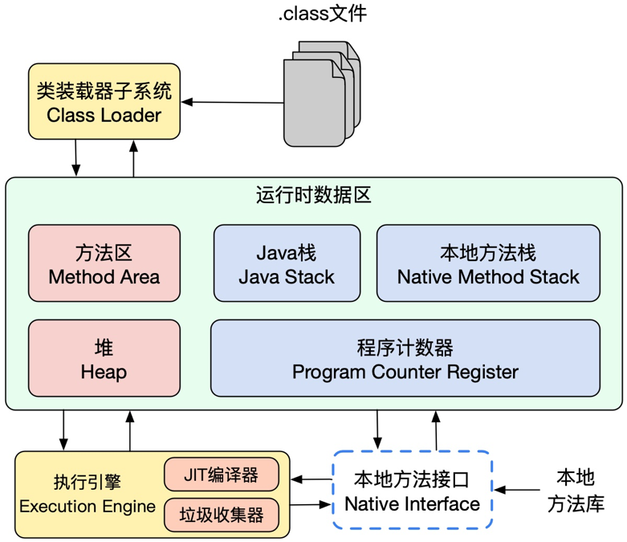
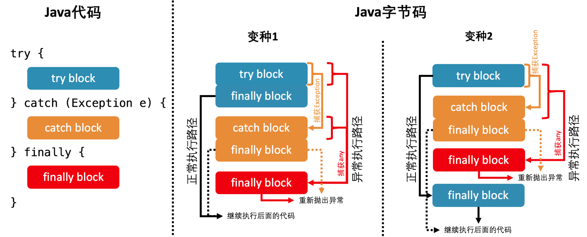
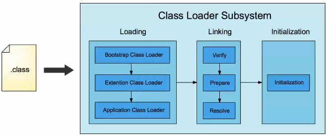
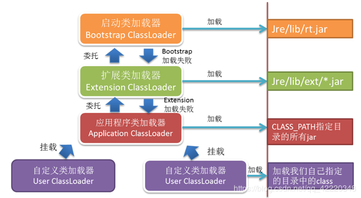
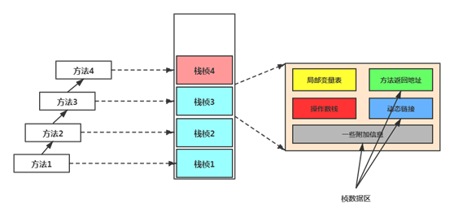
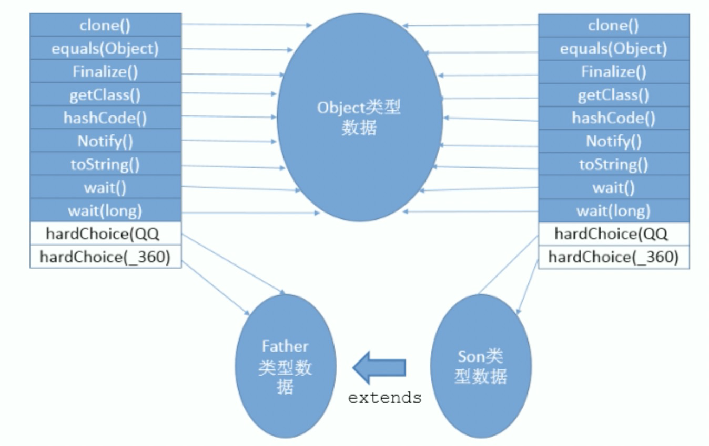

### Java虚拟机执行系统





第一步：代码编译 ==> javac将java将源代码成对应的.class文件。【class文件解析】

第二步：类加载和对象创建 ==> JVM使用类加载器加载class文件，方法区中保存对应的类信息；运行时对象创建保存在堆内存中，对应的引用保存在方法栈中。线程执行代码位置信息保存在程序计数器中。

第三步：执行代码 ==> JVM执行非热点代码使用解释执行，执行热点代码的时候使用JIT分层编译【编译成机器码】。垃圾回收器用于自动内存管理，主要用于清理堆中内存。


#### Class类文件结构

```java
public class Foo {
  private int tryBlock;
  private int catchBlock;
  private int finallyBlock;
  private int methodExit;

  public void test() {
    try {
      tryBlock = 0;
    } catch (Exception e) {
      catchBlock = 1;
    } finally {
      finallyBlock = 2;
    }
    methodExit = 3;
  }
}
// javap -p -v Foo
```

**访问标志**：ACC_PUBLIC, ACC_FINAL, ACC_SUPER（是否允许使用invokespecial指令)）,ACC_INTERFACE, ACC_ABSTRACT, ACC_SYNTHETIC（标识类不是由代码产生,比如桥接方法）, ACC_ANNOTATION, ACC_ENUM

**常量池类型**：utf8（utf8字符串），Integer, Float, Double, Class(类或者接口符号引用), String(字符串字面量), Fieldref（字段符号引用含NameAndType），Methodref（方法符号引用含NameAndType）, NameAndType（字段和方法的名字和类型）

**字段访问标识符**：ACC_PUBLIC, ACC_PRIVATE, ACC_PROTECTED, ACC_STATIC, ACC_FINAL, ACC_VOLATILE,ACC_TRANSIENT, ACC_SYNTHETIC, ACC_ENUM

**方法访问标识符**：ACC_PUBLIC, ACC_PRIVATE, ACC_PROTECTED, ACC_STATIC, ACC_FINAL, ACC_SYNCHRONIZED, ACC_BRIDGE, ACC_VARARGS（是否接受不定参数）, ACC_NATIVE, ACC_ABSTRACT, ACC_STRICTFP（方法是否为strictfp）， ACC_SYNTHETIC

**描述符标识字符含义**：

| 标识字符 |      含义      | 标识字符 |             含义              |
| :------: | :------------: | :------: | :---------------------------: |
|    B     |  基本类型byte  |    J     |         基本类型long          |
|    C     |  基本类型char  |    S     |         基本类型short         |
|    D     | 基本类型double |    Z     |        基本类型boolean        |
|    F     | 基本类型float  |    V     |         特殊类型void          |
|    I     |  基本类型int   |    L     | 对象类型，如Ljava/lang/Object |

数组类型前置"["字符来描述。

---


##### 1. 基础信息

```
Classfile ../Foo.class
  Last modified ..; size 541 bytes
  MD5 checksum 3828cdfbba56fea1da6c8d94fd13b20d
  Compiled from "Foo.java"
public class Foo
  minor version: 0
  major version: 54
  flags: (0x0021) ACC_PUBLIC, ACC_SUPER
  this_class: #7                          // Foo
  super_class: #8                         // java/lang/Object
  interfaces: 0, fields: 4, methods: 2, attributes: 1
```

class 文件的版本号（minor version: 0，major version: 54）【 49 - 52 ==> 1.5 - 1.8】

该类的访问权限（flags: (0x0021) ACC_PUBLIC, ACC_SUPER）

该类（this_class: #7）以及父类（super_class: #8）的名字，

所实现接口（interfaces: 0）、字段（fields: 4）、方法（methods: 2）以及属性（attributes: 1）的数目。


##### 2. 常量池

用来存放各种常量以及符号引用。

```
Constant pool:
   #1 = Methodref          #8.#23         // java/lang/Object."<init>":()V
... 
   #8 = Class              #30            // java/lang/Object
...
  #14 = Utf8               <init>
  #15 = Utf8               ()V
...
  #23 = NameAndType        #14:#15        // "<init>":()V
...
  #30 = Utf8               java/lang/Object
```


##### 3. 字段引用

```
  private int tryBlock;
    descriptor: I
    flags: (0x0002) ACC_PRIVATE

```


##### 4. 方法局域

```
  public void test();
    descriptor: ()V
    flags: (0x0001) ACC_PUBLIC
    Code:
      stack=2, locals=3, args_size=1
         0: aload_0
...
        10: goto          35
...
        34: athrow
        35: aload_0
...
        40: return
      Exception table:
         from    to  target type
             0     5    13   Class java/lang/Exception
             0     5    27   any
            13    19    27   any
      LineNumberTable:
        line 9: 0
...
        line 16: 40
...        
      LocalVariableTable:
        Start  Length  Slot  Name   Signature
           14       5     1     e   Ljava/lang/Exception;
            0      41     0  this   LFoo;

      StackMapTable: number_of_entries = 3
        frame_type = 77 /* same_locals_1_stack_item */
          stack = [ class java/lang/Exception ]
...

```

方法描述：(参数...)返回值   例如：public void test(int a , int b) ==> (II)V     public void test() ==> ()V

代码区域：声明该方法中的操作数栈（stack=2）和局部变量数目（locals=3）的最大值，以及该方法接收参数的个数（args_size=1）。注意这里局部变量指的是字节码中的局部变量，而非 Java 程序中的局部变量。

方法的字节码：每条字节码均标注了对应的偏移量（bytecode index，BCI），这是用来定位字节码的。比如说偏移量为 10 的跳转字节码 10: goto 35，将跳转至偏移量为 35 的字节码 35: aload_0。

异常表（Exception table:）：使用偏移量来定位每个异常处理器所监控的范围（由 from 到 to 的代码区域），以及异常处理器的起始位置（target）。除此之外，它还会声明所捕获的异常类型（type）。其中，any 指代任意异常类型。配合LineNumberTable查看具体代码流程。

> i).  当程序触发异常时，Java 虚拟机会从上至下遍历异常表中的所有条目。当触发异常的字节码的索引值在某个异常表条目的监控范围内，Java 虚拟机会判断所抛出的异常和该条目想要捕获的异常是否匹配。如果匹配，Java 虚拟机会将控制流转移至该条目 target 指针指向的字节码。 
>
> ii). 如果遍历完所有异常表条目，Java 虚拟机仍未匹配到异常处理器，那么它会弹出当前方法对应的 Java 栈帧，并且在调用者（caller）中重复上述操作。在最坏情况下，Java 虚拟机需要遍历当前线程 Java 栈上所有方法的异常表。
>
> iii). finally 代码块的编译比较复杂。当前版本 Java 编译器的做法是复制 finally 代码块的内容，分别放在 try-catch 代码块所有正常执行路径以及异常执行路径的出口中。针对异常执行路径，Java 编译器会生成一个或多个异常表条目，监控整个 try-catch 代码块，并且捕获所有种类的异常（在 javap 中以 any 指代）。这些异常表条目的 target 指针将指向另一份复制的 finally 代码块。并且，在这个 finally 代码块的最后，Java 编译器会重新抛出所捕获的异常。
>
> 

行数表（LineNumberTable:）：Java 源程序行号与字节码偏移量之间的映射。

本地变量表（LocalVariableTable）：Java 程序中每个局部变量的名字、类型以及作用域，length表示有效行数。

栈图（Stack Map Table）：用于字节码校验。


#### 类加载机制

##### 1. 类加载过程




**第一步：**加载阶段，从网络或者文件中加载对应的二进制流，并在java堆中生成对应的Class对象。类的加载需要借助类加载器来完成。

**第二步：**链接阶段

* 验证过程：文件格式验证，元数据验证，字节码验证，符号引用验证.

* 准备过程：为类变量分配内存并且设置默认初始值，即零值；常量直接赋值为ConstantValue；构建虚方法表

* 解析过程：将常量池中的符号引用转化为直接引用的过程。符号引用指向一个未被加载的类，或者未被加载类的字段或方法，那么解析将触发这个类的加载（但未必触发这个类的链接以及初始化。）

  > 直接引用：直接引用是可以指向目标的指针、相对偏移量或者是一个能直接或间接定位到目标的句柄。和虚拟机实现的内存有关，不同的虚拟机直接引用一般不同。

**第三步：**初始化过程 ==> 就是执行类构造器方法【\<clinit\>() ==> 编译器自动生成，其中的内容包括静态代码块和静态属性赋值的代码，如果类定义中不包含这两部分内容，则不会有这个方法】的过程。虚拟机保证一个类的\<clinit>()方法在多线程环境中被正确加锁同步。

说明：Class.forName在进行类加载时候并执行初始化，而ClassLoader.loadClass只会加载类并生成类对象。


##### 2. 类初始化时机

java虚拟机规定有些只有6种情况会对类进行初始化：

* 遇到new, getstatic ,putstatic或者invokestaic这四条指令的时候，如果类没有初始化则初始化对应类。
* 使用反射时候，如果类型没有初始化会对对其进行初始化。
* 初始化类的时候，如果父类没有初始化会先初始化父类【接口除外】
* 虚拟机启动的时候会初始化主类。
* JDK7新加入的动态语言支持，MethodHandle方法句柄对应的类会先进行初始化。
* JDK8中默认方法接口，如果实现该接口类发生初始化，该接口会被先初始化。【保护接口使用前初始化过】


被动使用类：

* 通过子类引用父类的静态字段，不会导致子类初始化
* 通过数组定义类来引用类，不会触发此类的初始化。
* 常量在编译阶段会存入调用类的常量池，使用常量的时候不会触发定义常量类的初始化。


##### 3. 类加载器



在 Java 虚拟机中，类的唯一性是由类加载器实例以及类的全名一同确定的。即便是同一串字节流，经由不同的类加载器加载，也会得到两个不同的类。Java类加载api层次结构如下：

```java
-- ClassLoader抽象类
  核心属性：private final ClassLoader parent;
  核心接口： 
    // 加载类 
    public Class<?> loadClass(String name) throws ClassNotFoundException
    // 解析链接类
    protected final void resolveClass(Class<?> c)
    // 查找和定义类
    protected Class<?> findClass(String name) throws ClassNotFoundException
    protected final Class<?> defineClass(String name, byte[] b, int off, int len) throws ClassFormatError
      
  -- SecureClassLoader类

    -- URLClassLoader类 ==> 指定路径获取类文件定义类
       重写方法：protected Class<?> findClass(final String name) throws ClassNotFoundException

       -- ExtClassLoader
       -- AppClassLoader
```


**双亲委派机制：**每当一个类加载器接收到加载请求时，它会先将请求转发给父类加载器。在父类加载器没有找到所请求的类的情况下，该类加载器才会尝试去加载。

```java
//  ClassLoader类加载器
public Class<?> loadClass(String name) throws ClassNotFoundException {  
    return loadClass(name, false);  
}  
 
protected synchronized Class<?> loadClass(String name, boolean resolve)  
        throws ClassNotFoundException {  
 
    // 首先判断该类型是否已经被加载  
    Class c = findLoadedClass(name);  
    if (c == null) {  
        //如果没有被加载，就委托给父类加载或者委派给启动类加载器加载  
        try {  
            if (parent != null) {  
                //如果存在父类加载器，就委派给父类加载器加载  
                c = parent.loadClass(name, false);  
            } else {    // 递归终止条件
                // 由于启动类加载器无法被Java程序直接引用，因此默认用 null 替代
                // parent == null就意味着由启动类加载器尝试加载该类，  
                // 即通过调用 native方法 findBootstrapClass0(String name)加载  
                c = findBootstrapClass0(name);  
            }  
        } catch (ClassNotFoundException e) {  
            // 如果父类加载器不能完成加载请求时，再调用自身的findClass方法进行类加载，若加载成功，findClass方法返回的是defineClass方法的返回值
            // 注意，若自身也加载不了，会产生ClassNotFoundException异常并向上抛出
            c = findClass(name);  
        }  
    }  
    if (resolve) {  
        resolveClass(c);  
    }  
    return c;  
}  
  
// 自定义类加载器：继承ClassLoader类然后重写findClass[然后返回defineClass] ==> 维护双亲委派机制
```


**线程上下文类加载器--破坏双亲委任机制**：在Java应用中存在着很多服务提供者接口（Service Provider Interface，SPI），这些接口允许第三方为它们提供实现，如常见的 SPI 有 JDBC、JNDI等，这些 SPI 的接口属于 Java 核心库，一般存在rt.jar包中，由Bootstrap类加载器加载，而 SPI 的第三方实现代码则是作为Java应用所依赖的 jar 包被存放在classpath路径下，由于SPI接口中的代码经常需要加载具体的第三方实现类并调用其相关方法，但SPI的核心接口类是由引导类加载器来加载的，而Bootstrap类加载器无法直接加载SPI的实现类。使用线程上下文类加载器可以实现在Java核心库中加载第三方的类库。

```java
// 线程上下文类加载器总能获取到与当前程序执行相同的ClassLoader ==> AppClassLoader
Thread.currentThread().getContextClassLoader();
// 设置线程上下文类加载器
Thread.setContextClassLoader() 
  
// rt.jar中的DriverManager就是使用线程上下文加载器实现
ServiceLoader<Driver> loadedDrivers = ServiceLoader.load(Driver.class);

// ServiceLoader
public static <S> ServiceLoader<S> load(Class<S> service) {
      //通过线程上下文类加载器加载
      ClassLoader cl = Thread.currentThread().getContextClassLoader();
      return ServiceLoader.load(service, cl);
}
```


**SpringBoot类加载器**：spring boot应用通过` mvn package spring-boot:repackage`打包成jar包

```
├── META-INF
│   ├── MANIFEST.MF (Jar.Properties?)
├── BOOT-INF
│   ├── classes 项目源代码 
│   ├── lib  项目jar包
└── org
    └── springframework
        └── boot
            └── loader
                ├── ExecutableArchiveLauncher.class
                ├── JarLauncher.class
                ├── JavaAgentDetector.class
                ├── LaunchedURLClassLoader.class
                ├── Launcher.class
                ├── MainMethodRunner.class
                ├── ... 
```

```
// MANIFEST.MF【指定main-class和对应的类加载器JarLauncher】
Manifest-Version: 1.0
Implementation-Title: javalearn
Implementation-Version: 1.0.0
Start-Class: com.example.java.learn.Application
Spring-Boot-Classes: BOOT-INF/classes/
Spring-Boot-Lib: BOOT-INF/lib/
Build-Jdk-Spec: 1.8
Spring-Boot-Version: 2.2.2.RELEASE
Created-By: Maven Archiver 3.4.0
Main-Class: org.springframework.boot.loader.JarLauncher
```

```java
// JarLauncher继承了ExecutableArchiveLauncher, ExecutableArchiveLauncher继承Launcher
// org.springframework.boot.loader.Launcher启动类
public abstract class Launcher{
  protected void launch(String[] args) throws Exception {
    JarFile.registerUrlProtocolHandler();
    // 创建类加载器LaunchedURLClassLoader
    ClassLoader classLoader = createClassLoader(getClassPathArchives());
    // main-class在MANIFEST.MF中获取到
    launch(args, getMainClass(), classLoader);
  }
  
   protected void launch(String[] args, String mainClass, ClassLoader classLoader) throws Exception {
    // 设置当前线程的类加载器
    Thread.currentThread().setContextClassLoader(classLoader);
    // 通过线程类加载器 加载main-class，并启动main方法
    createMainMethodRunner(mainClass, args, classLoader).run();
  }
}

// LaunchedClassLoader
static final String BOOT_INF_CLASSES = "BOOT-INF/classes/";
static final String BOOT_INF_LIB = "BOOT-INF/lib/";
```


#### 字节码常用指令

##### 1. 加载和存储指令

数值推送至栈顶：bipush,sipush,ldc,ldc_w,ldc2_w,aconst_null,iconst_ml,iconst_,lconst_,fconst_,dconst_
const命令主要负责把简单的数值类型送到栈顶。该系列命令不带参数。
push命令负责把一个整形数字（长度比较小）送到到栈顶。[byte, short]
ldc系令负责把数值常量或String常量值从常量池中推送至栈顶。

```markdown
iconst_0  将int类型常量0压入栈 
iconst_1  将int类型常量1压入栈

bipush    将单字节的常量值(-128~127)推送至栈顶
sipush    将一个短整型常量值(-32768~32767)推送至栈顶

ldc        将int, float或String型常量值从常量池中推送至栈顶
ldc_w      将int, float或String型常量值从常量池中推送至栈顶（宽索引）
ldc2_w     将long或double型常量值从常量池中推送至栈顶（宽索引）
```


本地变量推送至栈顶：iload,iload_,lload,lload_,fload,fload_,dload,dload_,aload,aload_
数组变量推送至栈顶：baload,caload,saload,iaload,laload,faload,daload,aaload

load命令负责把本地变量的送到栈顶。这里的本地变量不仅可以是数值类型，还可以是引用类型。
aload命令负责把数组的某项送到栈顶。

```markdown
iload     将指定的int型本地变量推送至栈顶
lload     将指定的long型本地变量推送至栈顶
aload_0   将第一个引用类型本地变量推送至栈顶

iaload    将int型数组指定索引的值推送至栈顶
laload    将long型数组指定索引的值推送至栈顶
```


store命令负责把栈顶的值存入本地变量。这里的本地变量不仅可以是数值类型，还可以是引用类型。

操作数栈到变量：istore,istore_,lstore,lstore_,fstore,fstore_,dstore,dstor_,astore,astore_
从操作数栈存存储到数组：bastore,castore,sastore,iastore,lastore,fastore,dastore,aastore

```markdown
istore_0    将栈顶int型数值存入第一个本地变量
istore_1    将栈顶int型数值存入第二个本地变量

iastore     将栈顶int型数值存入指定数组的指定索引位置
lastore     将栈顶long型数值存入指定数组的指定索引位置
```

​	

##### 2. 运算指令

加：iadd,ladd,fadd,dadd
减：isub,lsub,fsub,dsub
乘：imul,lmul,fmul,dmul
除：idiv,ldiv,fdiv,ddiv
余数：irem,lrem,frem,drem
取负：ineg,lneg,fneg,dneg
移位：ishl,lshr,iushr,lshl,lshr,lushr
按位或：ior,lor
按位与：iand,land
按位异或：ixor,lxor

```markdown
iadd        将栈顶两int型数值相加并将结果压入栈顶
isub        将栈顶两int型数值相减并将结果压入栈顶
imul        将栈顶两int型数值相乘并将结果压入栈顶
idiv        将栈顶两int型数值相除并将结果压入栈顶
irem        将栈顶两int型数值作取模运算并将结果压入栈顶
ineg        将栈顶int型数值取负并将结果压入栈顶
ishl        将int型数值左移位指定位数并将结果压入栈顶
iand        将栈顶两int型数值作“按位与”并将结果压入栈顶

iinc        将指定int型变量增加指定值（i++, i--, i+=2）
```


##### 3. 类型转换指令

类型转换：i2l,i2f,i2d,l2f,l2d,f2d(放宽数值转换)
i2b,i2c,i2s,l2i,f2i,f2l,d2i,d2l,d2f(缩窄数值转换)

```markdown
i2l        将栈顶int型数值强制转换成long型数值并将结果压入栈顶
i2b        将栈顶int型数值强制转换成byte型数值并将结果压入栈顶
```


##### 4. 对象的创建和访问指令

创建类实例：new  
创建新数组：newarray,anewarray,multianwarray
访问类的域和类实例域：getfield,putfield,getstatic,putstatic
获取数组长度：arraylength 
检验类实例或数组属性：instanceof,checkcast

```markdown
new            创建一个对象，并将其引用值压入栈顶
newarray       创建一个指定原始类型（如int, float, char…）的数组，并将其引用值压入栈顶
anewarray      创建一个引用型（如类，接口，数组）的数组，并将其引用值压入栈
multianewarray 创建指定类型和指定维度的多维数组，并将其引用值压入栈顶
arraylength    获得数组的长度值并压入栈顶

getstatic      获取指定类的静态域，并将其值压入栈顶
putstatic      用栈顶的值为指定的类的静态域赋值
getfield       获取指定类的实例域，并将其值压入栈顶
putfield       用栈顶的值为指定的类的实例域赋值

instanceof     检验对象是否是指定的类的实例，如果是将1压入栈顶，否则将0压入栈顶
checkcast      检验类型转换，检验未通过将抛出ClassCastException
```


##### 5. 操作数栈管理

操作数栈管理：pop,pop2,dup,dup2,dup_xl,dup2_xl,dup_x2,dup2_x2,swap

```markdown
nop           不做任何操作
pop           将栈顶数值弹出 (数值不能是long或double类型的)
pop2          将栈顶的一个（long或double类型的)或两个数值弹出（其它）
dup           复制栈顶数值(数值不能是long或double类型的)并将复制值压入栈顶
dup_x1        复制栈顶数值(数值不能是long或double类型的)并将两个复制值压入栈顶
dup_x2        复制栈顶数值(数值不能是long或double类型的)并将三个（或两个）复制值压入栈顶
dup2          复制栈顶一个（long或double类型的)或两个（其它）数值并将复制值压入栈顶
dup2_x1       复制栈顶数值(long或double类型的)并将两个复制值压入栈顶
dup2_x2       复制栈顶数值(long或double类型的)并将三个（或两个）复制值压入栈顶
swap          将栈最顶端的两个数值互换(数值不能是long或double类型的)
```


##### 6. 控制转移指令

有条件转移：ifeq,iflt,ifle,ifne,ifgt,ifge,ifnull,ifnonnull,if_icmpeq,if_icmpene,
if_icmplt,if_icmpgt,if_icmple,if_icmpge,if_acmpeq,if_acmpne,lcmp,fcmpl
fcmpg,dcmpl,dcmpg
复合条件转移：tableswitch,lookupswitch
无条件转移：goto,goto_w,【jsr,jsr_w,ret已废弃】

```markdown
lcmp       比较栈顶两long型数值大小，并将结果（1，0，-1）压入栈顶
fcmpl      比较栈顶两float型数值大小，并将结果（1，0，-1）压入栈顶；当其中一个数值为NaN时，将-1压入栈顶
fcmpg      比较栈顶两float型数值大小，并将结果（1，0，-1）压入栈顶；当其中一个数值为NaN时，将1压入栈顶

ifeq       当栈顶int型数值等于0时跳转
ifne       当栈顶int型数值不等于0时跳转

if_icmpeq  比较栈顶两int型数值大小，当结果等于0时跳转
if_icmpne  比较栈顶两int型数值大小，当结果不等于0时跳转

ifnull     为null时跳转
ifnonnull  不为null时跳转

# 跳转表存储的空间为32位，所以switch中不能操作long类型。
# 跳转表的原理使用的是二分查找，所以效率比if,else语法高效
# Enum类型是通过ordinal()结果匹配的
# String类型是通过hashcode的结果匹配的
tableswitch   用于switch条件跳转，case值连续（可变长度指令）
lookupswitch  用于switch条件跳转，case值不连续（可变长度指令）

goto       无条件跳转到指定方法行【for,while,continue,】
goto_w     无条件跳转到指定方法行（宽索引）
```


##### 7. 方法调用和返回指令

调用对象的实例方法：invokevirtual
调用由接口实现的方法：invokeinterface
调用需要特殊处理的实例方法：invokespecial
调用命名类中的静态方法：invokestatic
方法返回：ireturn,lreturn,freturn,dreturn,areturn,return

```markdown
invokevirtual      调用实例方法
invokespecial      调用超类构造方法，实例初始化方法，私有方法
invokestatic       调用静态方法
invokeinterface    调用接口方法

lreturn     从当前方法返回long
areturn     从当前方法返回对象引用
return      从当前方法返回void
```


##### 8. 异常处理指令

异常：athrow

```markdown
athrow    将栈顶的异常抛出
try-catch-finally关键字的实现使用异常表实现：jsr,jsr_w,ret对应指令已废弃，
```


##### 9. 同步指令

montiorenter：进入并获取对象监视器
monitorexit：释放并退出对象监视器

```markdown
monitorenter      获得对象的锁，用于同步方法或同步块
monitorexit       释放对象的锁，用于同步方法或同步块
```


一段包含 synchronized 代码块的 Java 代码的字节码中包含一个 monitorenter 指令以及多个 monitorexit 指令。这是因为 Java 虚拟机需要确保所获得的锁在正常执行路径，以及异常执行路径上都能够被解锁。
 monitorenter 和 monitorexit 的作用：每个锁对象拥有一个锁计数器和一个指向持有该锁的线程的指针。当执行 monitorenter 时，如果目标锁对象的计数器为 0，那么说明它没有被其他线程所持有。在这个情况下，Java 虚拟机会将该锁对象的持有线程设置为当前线程，并且将其计数器加 1。在目标锁对象的计数器不为 0 的情况下，如果锁对象的持有线程是当前线程，那么 Java 虚拟机可以将其计数器加 1，否则需要等待，直至持有线程释放该锁。当执行 monitorexit 时，Java 虚拟机则需将锁对象的计数器减 1。当计数器减为 0 时，代表该锁已经被释放掉了。

32位JVMJava对象头里的Mark Word里默认的Mark Word的默认存储结构如下：

|          |     25 bit     |     4bit     | 1bit 是否是偏向锁 | 2bit 锁标志位 |
| :------: | :------------: | :----------: | :---------------: | :-----------: |
| 无锁状态 | 对象的hashCode | 对象分代年龄 |         0         |      01       |

在运行期间Mark Word里存储的数据会随着锁标志位的变化而变化。Mark Word可能变化为存储以下4种数据：


**重量级锁：**是 Java 虚拟机中最为基础的锁实现。在这种状态下，Java 虚拟机会阻塞加锁失败的线程，并且在目标锁被释放的时候，唤醒这些线程。都需要操作系统来实现，需要从从用户态转换到内核态。java1.6增加了自适应自旋锁优化【导致锁不公平】而不是加锁,自旋时间根据前一次同一个锁的自旋时间和锁的拥有者状态决定。

**轻量级锁**：当进行加锁操作时，Java 虚拟机会判断是否已经是重量级锁。如果不是，它会在当前线程的当前栈桢中划出一块空间，作为该锁的锁记录，并且将锁对象的标记字段复制到该锁记录中。然后，Java 虚拟机会尝试用 CAS（compare-and-swap）操作替换锁对象的标记字段。CAS 是一个原子操作，它会比较目标地址的值是否和期望值相等，如果相等，则替换为一个新的值。

**偏向锁**：当没有竞争出现时，默认会使用偏斜锁。JVM 会利用 CAS 操作（偏向锁只会在第一次请求时采用 CAS 操作，在锁对象的标记字段中记录下当前线程的地址。在之后的运行过程中，持有该偏向锁的线程的加锁操作将直接返回。它针对的是锁仅会被同一线程持有的情况。如果有另外的线程试图锁定某个已经被偏斜过的对象，JVM 就需要撤销（revoke）偏斜锁，并切换到轻量级锁实现。轻量级锁依赖 CAS 操作 Mark Word 来试图获取锁，如果重试成功，就使用普通的轻量级锁；否则，进一步升级为重量级锁。


**注意：**锁降级确实会发生，当 JVM 进入安全点时候，会检查是否有闲置的 Monitor，然后试图进行降级。


#### 字节码执行引擎

#####  1. 运行时栈帧结构



**局部变量表**：局部变量表索引位置从0开始。实例方法第0个索引位置的变量默认是该对象实例引用this。一个变量槽可以存放32位以内的数据类型。Java中占用不超过32位存储空间的数据类型有boolean, byte, char, short, int float, reference和return 地址8中类型。long和double两种数据需要使用2个变量槽存储。局部变量表槽可以被复用，会影响垃圾回收行为。

**操作数栈**：它是先进后出栈。在方法执行过程中。根据字节码指令，往栈中写入数据或者提取数据，即出栈/入栈

**动态链接**：指向运行时常量池的方法引用。

**方法返回地址**：存放调用该方法的pc寄存器的值【包含正常退出和异常退出两种情况】


##### 2. 方法调用

invokevirtual  ==>   调用所有的虚方法【实例方法，包含被private修饰的是有方法，包含final修饰的方法】
invokespecial ==>   调用实例构造器方法，私有方法，父类的方法
invokestatic    ==>   调用静态方法
invokeinterface ==>调用接口方法
Invokedynomic ==> 动态调用


**静态绑定**

静态解析调用：编译期间就已经确定。包含所有的invokestatic指令和invokespecial指令，以及final修饰的invokevirtual虚方法调用。在类加载的解析阶段就会把涉及到的方法调用符号引用转化为明确的直接引用【实际引用为目标方法的指针】。Java方法的重载也属于解析调用，参数的类型选择是在编译期间通过**引用类型**来确认的。

重载方法的选取过程：

* 在不考虑对基本类型自动装拆箱，以及可变长参数的情况下选取重载方法；
* 在第 1 个阶段中没有找到适配的方法，那么在允许自动装拆箱，但不允许可变长参数的情况下选取重载方法；
* 在第 2 个阶段中没有找到适配的方法，那么在允许自动装拆箱以及可变长参数的情况下选取重载方法。


**动态绑定**

动态绑定：要在运行过程中根据调用者的动态类型来识别目标方法的情况。实际引用则是一个方法表的索引。【字段永远不参与多态，父子类中同名字段可以同时存在，且子类中的字段会遮蔽父类中的同名字段】

虚方法调用过程：

* i). 通过操作数栈顶元素找到对象实际类型C 

* ii). 在类型C中找到对应的签名方法, 返回该方法直接引用 
* iii). 如果上一步没有找到则通过继承关系从下往上查找
* iv). 没找到就抛出AbstractMethodError

虚方法表：为了提高虚方法调用的效率，虚方法表会在在类加载链接阶段中初始化，准备类变量初始值后，虚拟机会把该类的虚方法表也一同初始化完毕。父子类中相同签名的方法具有相同的索引序号。

内联缓存：Java 虚拟机所采用的单态内联缓存将纪录调用者的动态类型，以及它所对应的目标方法。当碰到新的调用者时，如果其动态类型与缓存中的类型匹配，则直接调用缓存的目标方法。否则，Java 虚拟机将该内联缓存劣化为超多态内联缓存，在今后的执行过程中直接使用方法表进行动态绑定。




**动态调用**

动态语言和静态语言的本质区别：动态语言变量无类型而变量值有类型。

Java语言属于静态语言，方法调用的变量在编译区间就已经确定了的类型。java通过MethodHandler和invokedynomic指令来实现代码和字节码级别的动态方法调用

```
MethodHandle方法句柄：方法句柄是一个强类型的，能够被直接执行的引用。该引用可以指向常规的静态方法或者实例方法，也可以指向构造器或者字段。
MethodType方法句柄的类型：由所指向方法的参数类型以及返回类型组成的。它是用来确认方法句柄是否适配的唯一关键。
MethodType methodType = MethodType.methodType(void.class, String.class);
Horse horse = new Horse();
MethodHandle mh = MethodHandles.lookup().findVirtual(Horse.class, "race", methodType).bindTo(horse);
mh.invokeExact("one");
mh.invoke("two");
ConstantCallSite callSite = new ConstantCallSite(mh.bindTo(horse));

invokedymaic指令抽象出调用点的概念，并且将调用该调用点所链接的方法句柄。在第一次执行invokedynamic指令时，Java 虚拟机将执行它所对应的启动方法，生成并且绑定一个调用点。之后如果再次执行该指令，Java虚拟机则直接调用已经绑定了的调用点所链接的方法。启动方法的返回值是一个ConstantCallSite，其链接对象为一个返回适配器类实例的方法句柄。
```


##### 3. 字节码解释执行引擎

```
// java代码
int a = 1;
int b = 2;
int c = a + b;

// 基于栈的字节码解释执行过程[前面的数字0-8：表示程序计数器]
0: iconst_1  ==>  把常量1推送到操作数栈顶
1: istore_1  ==>  把栈顶整数出栈并存放在第1个局部变量表槽
2: iconst_2  ==>  把常量1推送到操作数栈顶
3: istore_2  ==>  把栈顶整数出栈并存放在第2个局部变量表槽
4: iload_1   ==>  将局部变量表中第1个变量槽中的整数值复制到操作数栈顶
5: iload_2   ==>  将局部变量表中第2个变量槽中的整数值复制到操作数栈顶
6: iadd      ==>  将操作数栈中前面两个元素做整数加法，得到的值重新入栈。
7: istore_3  ==>  把操作数栈顶的整数值出栈存放在第3个局部变量表槽
8: return    ==>  方法执行结束
```


