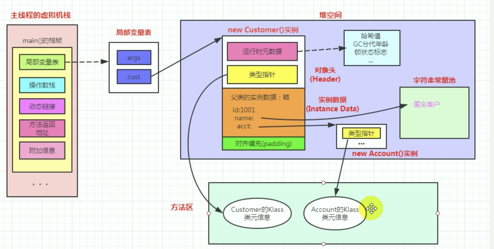
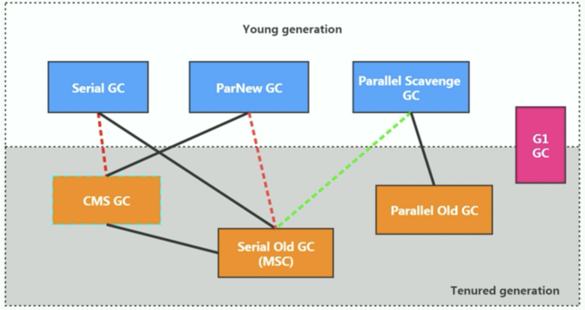
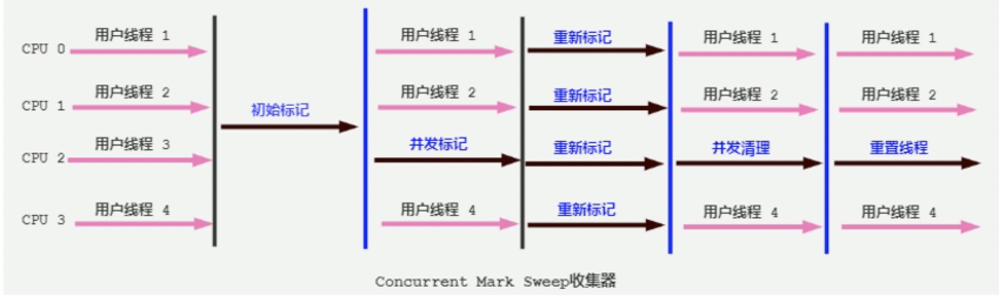
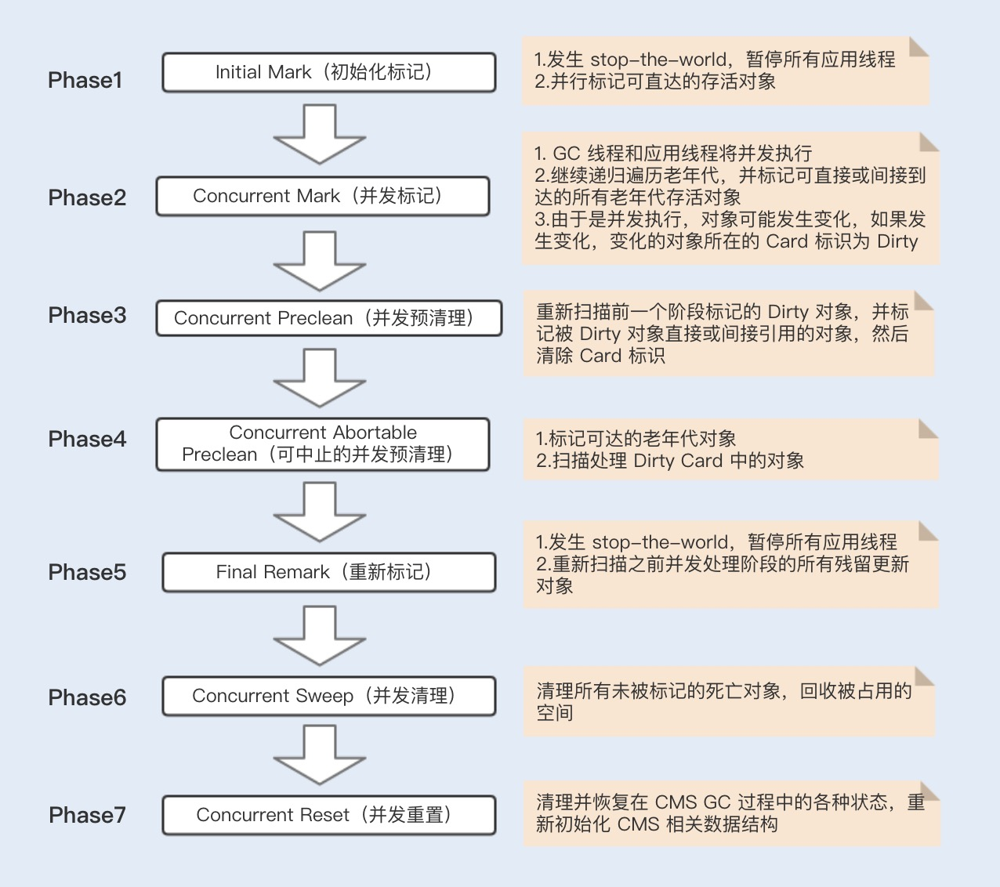
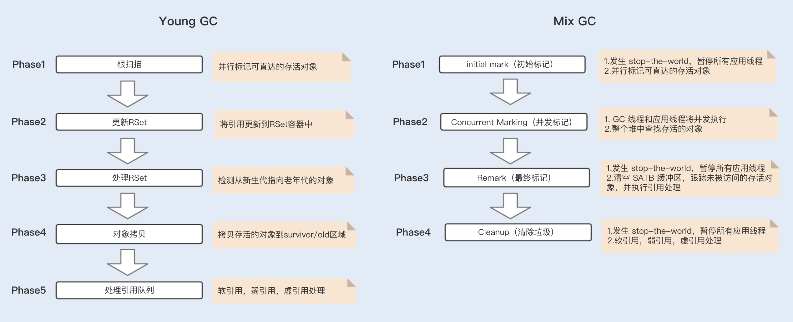

### Java虚拟机内存管理

#### 1. 运行时内存区域

##### 1. 内存划分


**程序计数器**（PC，Program Counter Register）：在 JVM 规范中，每个线程都有它自己的程序计数器，并且任何时间一个线程都只有一个方法在执行，也就是所谓的当前方法。程序计数器会存储当前线程正在执行的 Java 方法的 JVM 指令地址；或者如果是在执行本地方法，则是未指定值（undefined）。

**Java 虚拟机栈**（Java Virtual Machine Stack）：也叫 Java 栈。每个线程在创建时都会创建一个虚拟机栈，其内部保存一个个的栈帧（Stack Frame），对应着一次次的 Java 方法调用。【创建比较耗时】。

在一个时间点，对应的只会有一个活动的栈帧，通常叫作当前帧，方法所在的类叫作当前类。如果在该方法中调用其他方法，对应的新的栈帧会被创建出来，成为新的当前帧，一直到它返回结果或者执行结束。JVM 直接对 Java 栈的操作只有两个，就是对栈帧的压栈和出栈。栈帧中存储着**局部变量表**、**操作数栈**、动态链接、方法正常退出或者异常退出的定义等。

**本地方法栈**（Native Method Stack）：它和 Java 虚拟机栈是非常相似的，支持对本地方法调用，也是每个线程都会创建一个。在 Oracle Hotspot JVM 中，本地方法栈和 Java 虚拟机栈是在同一块儿区域，这完全取决于技术实现的决定，并未在规范中强制。

**Java堆**（Heap）： Java 内存管理的核心区域，用来放置 Java 对象实例.几乎所有创建的 Java 对象实例都是被直接分配在堆上。堆被所有的线程共享，在虚拟机启动时，我们指定的“Xmx”之类参数就是用来指定最大堆空间等指标。堆也是垃圾收集器重点照顾的区域，所以堆内空间还会被不同的垃圾收集器进行进一步的细分，最有名的就是新生代、老年代的划分。

**方法区**（Method Area）：所有线程共享的一块内存区域，用于存储所谓的元（Meta）数据，例如类结构信息，以及对应的运行时常量池、字段、方法代码等。由于早期的 Hotspot JVM 实现，很多人习惯于将方法区称为永久代（Permanent Generation）。Oracle JDK 8 中将永久代移除，同时增加了元数据区（Metaspace）。

**运行时常量池**（Run-Time Constant Pool）：这是方法区的一部分。如果仔细分析过反编译的类文件结构，你能看到版本号、字段、方法、超类、接口等各种信息，还有一项信息就是常量池。Java 的常量池可以存放各种常量信息，不管是编译期生成的各种字面量，还是需要在运行时决定的符号引用，所以它比一般语言的符号表存储信息更加宽泛。

**注意：**java8 中字符串常量池（interned strings）和类的静态变量（引用地址变量）转移到Java heap。


##### 2. 对象创建和内存布局

**对象创建：**Hotspot JVM 有一个概念叫做 Thread Local Allocation Buffer（TLAB）： JVM 为每个线程分配的一个私有缓存区域，否则多线程同时分配内存时，为避免操作同一地址，可能需要使用加锁等机制，进而影响分配速度，它是分配在 Eden 区域内的。其内部结构：start、end 就是起始地址，top（指针）则表示已经分配到哪里。所以我们分配新对象，JVM 就会移动 top，当 top 和 end 相遇时，即表示该缓存已满，JVM 会试图再从 Eden 里分配一块儿。


**内存对象布局**：



* 对象头：HotSpot虚拟机的对象头包括两部分信息，
  
  > 第一部分【**对象自身的运行时数据**】， 如哈希码、GC分代年龄、锁状态标志、线程持有的锁、偏向线程ID、偏向时间戳等等，这部分数据的长度在32位和64位的虚拟机中分别为32个和64个Bits，官方称它为“Mark Word”。未被锁定的对象，Mark Word的32个Bits空间中25Bits用于存储对象哈希码（HashCode），4Bits用于存储对象分代年龄，2Bits用于存储锁标志位，1Bit固定为0。
  >
  > 第二部分【**类型指针**】，对象指向它的类的元数据的指针，虚拟机通过这个指针来确定这个对象是哪个类的实例。（32位虚拟机4B，64位虚拟机8B）,64位虚拟机可以压缩头指针减少一般这部分内存开销。
  >
  > 其他，对于数组对象还会有长度信息等

* 实例数据：相同宽度的字段会被分配到一起，注意子类中比较窄的变量可能会插到父类的变量空隙中。

* 对齐填充：对于64位虚拟机来说，对象大小必须是8Byte的整数倍，不够的话需要占位填充


**压缩指针：**为了尽量较少对象的内存使用，将堆中原本 64 位的 Java 对象指针压缩成 32 位的。压缩指针要求 Java 虚拟机堆中对象的起始地址要对齐至 8 的倍数。按照8个字节为一个单位，分出2^32个地址空间。所以可以使用指针压缩最大内存是  `2^32 * 8 = 32G`。Java 虚拟机还会对每个类的字段进行重排列，使得字段也能够内存对齐。

**指针压缩参数**：（64位默认打开）

* 使用-XX:+UseCompressedOops压缩对象指针：Java堆中对象头会被压缩成32位。

* 使用-XX:+UseCompressedClassPointers选项来压缩类指针： 对象中指向类元数据的指针会被压缩成32位


##### 3. Java内存溢出

**堆内存溢出：**抛出错误信息`java.lang.OutOfMemoryError:Java heap space`。原因：可能存在内存泄漏问题；也很有可能就是堆的大小不合理，比如我们要处理比较可观的数据量，但是没有显式指定 JVM 堆大小或者指定数值偏小；或者出现 JVM 处理引用不及时，导致堆积起来，内存无法释放等。

**虚拟机栈内存溢出：**程序不断的进行递归调用，而且没有退出条件，就会导致不断地进行压栈。类似这种情况，JVM 实际会抛出 StackOverFlowError；当然，如果 JVM 试图去扩展栈空间的的时候失败，则会抛出 OutOfMemoryError。

**永久代内存溢出：**对于老版本的 Oracle JDK，因为永久代的大小是有限的，并且 JVM 对永久代垃圾回收 (常量池回收、卸载不再需要的类型）非常不积极，当我们不断添加新类型永久代会出现 OutOfMemoryError 异常，尤其是在运行时存在大量动态类型生成的场合；类似 Intern 字符串缓存占用太多空间，也会导致 OOM 问题。对应的异常信息，会标记出来和永久代相关：`java.lang.OutOfMemoryError: PermGen space`。

**元数据内存溢出**：java8将原先的永久代改成元空间。OOM异常信息则变成了：`java.lang.OutOfMemoryError: Metaspace`。

**直接内存溢出**：`java.lang.OutOfMemoryError"Direct buffer memeray`

**Java线程数超过操作系统上限：**`java.lang.OutOfMemoryError "unable to create new native thread`


#### 2. 垃圾回收机制

Java 虚拟机中的 Stop-the-world 是通过安全点（safepoint）机制来实现的。当 Java 虚拟机收到 Stop-the-world 请求，它便会等待所有的线程都到达安全点，才允许请求 Stop-the-world 的线程进行独占的工作。

##### 1. 对象收集算法

**引用计数算法**，就是为对象添加一个引用计数，用于记录对象被引用的情况，如果计数为 0，即表示对象可回收。这是很多语言的资源回收选择，Python更是同时支持引用计数和垃圾收集机制。Java 并没有选择引用计数，是因为其存在一个基本的难题，也就是很难处理循环引用关系。

**可达性分析。**将对象及其引用关系看作一个图，选定活动的对象作为 GC Roots，然后跟踪引用链条，如果一个对象和 GC Roots 之间不可达，也就是不存在引用链条，那么即可认为是可回收对象。JVM 会把虚拟机栈和本地方法栈中正在引用的对象、静态属性引用的对象和常量，作为 GC Roots。


不同的对象引用类型， GC会采用不同的方法进行回收，JVM对象的引用分为了四种类型：强引用、软引用、弱引用、幻象引用。

```java
-- Reference抽象类
  属性：T referent, ReferenceQueue<? super T> queue;  ==> 应用对象, 引用队列
  核心接口：
    public T get()
    public void clear()
    public boolean enqueue()

  -- SoftReference类 ==> 软引用

  -- WeakReference类 ==> 弱引用

  -- PhantomReference类 ==> 虚引用
    核心接口：public T get() { return null;}

  -- FinalReference类 ==> 终结器引用
  
-- ReferenceQueue类
  属性：long queueLength, Reference<? extends T> head
  方法：poll, remove

```


**强引用** ：我们平常典型编码Object obj = new Object()中的obj就是强引用。通过关键字new创建的对象所关联的引用就是强引用。 当JVM内存空间不足，JVM宁愿抛出OutOfMemoryError运行时错误（OOM），使程序异常终止，也不会靠随意回收具有强引用的"存活"对象来解决内存不足的问题。对于一个普通的对象，如果没有其他的引用关系，只要超过了引用的作用域或者显式地将相应（强）引用赋值为 null，就是可以被垃圾收集，具体回收时机还是要看垃圾收集策略。

**软引用**：软引用通过SoftReference类实现。 软引用的生命周期比强引用短一些。只有当 JVM 认为内存不足时，才会去试图回收软引用指向的对象：即JVM 会确保在抛出 OutOfMemoryError 之前，清理软引用指向的对象。软引用可以和一个引用队列（ReferenceQueue）联合使用，如果软引用所引用的对象被垃圾回收器回收，Java虚拟机就会把这个软引用加入到与之关联的引用队列中。后续我们可以调用ReferenceQueue的poll()方法来检查是否有它所关心的对象被回收。如果队列为空，将返回一个null,否则该方法返回队列中前面的一个Reference对象。

*应用场景：*软引用通常用来实现内存敏感的缓存。如果还有空闲内存，就可以暂时保留缓存，当内存不足时清理掉，不会耗尽内存。例如：Beanutils#copyProperties / Hibernate validation / Mybatis缓存等

**弱引用**：通过WeakReference类实现。 弱引用的生命周期比软引用短。在垃圾回收器线程扫描它所管辖的内存区域的过程中，一旦发现了具有弱引用的对象，不管当前内存空间足够与否，都会回收它的内存。由于垃圾回收器是一个优先级很低的线程，因此不一定会很快回收弱引用的对象。弱引用可以和一个引用队列（ReferenceQueue）联合使用，如果弱引用所引用的对象被垃圾回收，Java虚拟机就会把这个弱引用加入到与之关联的引用队列中。

*应用场景：*弱应用同样可用于内存敏感的缓存。WeakHashMap实现原理：当WeakHashMap中某个“弱引用的key”由于没有再被引用而被GC收回时，被回收的“该弱引用key”也被会被添加到"ReferenceQueue(queue)"中。

**虚引用**：也叫幻象引用，通过PhantomReference类来实现。无法通过虚引用访问对象的任何属性或函数。幻象引用仅仅是提供了一种确保对象被 finalize 以后，做某些事情的机制。如果一个对象仅持有虚引用，那么它就和没有任何引用一样，在任何时候都可能被垃圾回收器回收。虚引用必须和引用队列 （ReferenceQueue）联合使用。当垃圾回收器准备回收一个对象时，如果发现它还有虚引用，就会在回收对象的内存之前，把这个虚引用加入到与之关联的引用队列中。程序可以通过判断引用队列中是否已经加入了虚引用，来了解被引用的对象是否将要被垃圾回收。如果程序发现某个虚引用已经被加入到引用队列，那么就可以在所引用的对象的内存被回收之前采取一些程序行动。

```java
ReferenceQueue queue = new ReferenceQueue ();
PhantomReference pr = new PhantomReference (object, queue); 
```

*应用场景：*用来跟踪对象被垃圾回收器回收。 


##### 2. 垃圾回收算法

**复制（Copying）算法**，新生代 GC基本都是基于复制算法，过程就如将活着的对象复制到 to 区域，拷贝过程中将对象顺序放置，就可以避免内存碎片化。这么做的代价是，既然要进行复制，既要提前预留内存空间，有一定的浪费；另外，对于 G1 这种分拆成为大量 region 的 GC，复制而不是移动，意味着 GC 需要维护 region 之间对象引用关系，这个开销也不小，不管是内存占用或者时间开销。


**标记 - 清除（Mark-Sweep）**：首先进行标记工作，标识出所有要回收的对象，然后进行清除。这么做除了标记、清除过程效率有限，另外就是不可避免的出现碎片化问题，这就导致其不适合特别大的堆；否则，一旦出现 Full GC，暂停时间可能根本无法接受。

**标记 - 整理（Mark-Compact）**，类似于标记 - 清除，但为避免内存碎片化，它会在清理过程中将对象移动，以确保移动后的对象占用连续的内存空间。


**HotSpot算法实现**：

* 枚举根节点：GC-Root开始枚举。【Stop-The-World】
* 安全点：指定线程进入GC的时机。


**卡表**：将整个堆划分为一个个大小为 512 字节的卡，并且维护一个卡表，用来存储每张卡的一个标识位。这个标识位代表对应的卡是否可能存有指向新生代对象的引用。如果可能存在，那么我们就认为这张卡是脏的。在进行 Minor GC 的时候，我们便可以不用扫描整个老年代，而是在卡表中寻找脏卡，并将脏卡中的对象加入到 Minor GC 的 GC Roots 里。


##### 3. 垃圾回收器

UseSerialGC, UseParallelGC, UseConcMarkSweepGC, UseParNewGC, Use:ParallelOldGC, UseG1GC, 

UseSerialOldGC ==> 已废弃




**年轻代GC回收器:** 

* Serial Copying： UseSerialGC 采用的是复制算法，串行收集，垃圾回收的时候会暂停所有工作线程STW。是Client 模式下 JVM 的默认选项。默认激活老年代回收器UseSerialOldGC

* ParNew ：UseParNewGC采用的是复制算法, 并行收集，垃圾回收的时候会暂停所有工作线程STW。默认激活老年代回收器UseConcMarkSweepGC。

* Parallerl Scavenge：UseParallelGC 采用的复制算法，并行收集，垃圾回收的时候暂停所有工作线程STW，激活老年代回收器UseParallelOldGC 。被称为“吞吐量优先收集器”。可以直接设置暂停时间或吞吐量等目标

  > -XX:MaxGCPauseMillis=value  ==> 最大GC暂停时间，JVM会动态调整堆空间大小。
  >
  > -XX:GCTimeRatio=N  ==>  吞吐量表示，GC时间和用户时间比例 = 1 / (N+1)

**老年代GC回收器：**

* Serial MSC : UseSerialOldGC 使用标记整理算法，串行收集，STW很长，已废弃。

* CMS ==> UseConcMarkSweepGC 使用标记清除算法, 并行收集,【jdk1.5引入 jdk9废弃】。CMS回收器减少了回收的停顿时间，但是降低了堆空间的利用率。

  并发模式失效问题：并发清理阶段用户线程还在跑需要预留内存，当内存不够用的时候就会发生并发模式失效。CMS会退化到串行垃圾回收器。使用-XX:CMSInitiatingOccupancyFraction=75指定老年代使用内存比例激活CMS垃圾回收。

  空闲空间碎片化问题：连续内存不够触发fullGC，可以使用参数+UseCMSCompactAtFullCollction开启内存碎片的合并整理。

  

  

* Parallel Compacting： UseParallelOldGC 使用标记整理算法, 并行收集。被称为“吞吐量优先收集器”可以直接设置暂停时间或吞吐量等目标【1.6引入，1.8默认垃圾回收方式】


**G1垃圾回收器**

G1取消了新生代老年代的物理空间划分。G1算法将堆划分为若干个区域（Region），默认划分成2048个分局，仍然属于分代收集器。新生代的垃圾收集依然采用暂停所有应用线程的方式，将存活对象拷贝到老年代或者Survivor空间。老年代也分成很多区域，G1收集器通过将对象从一个区域复制到另外一个区域，完成了清理工作。不会产生内存碎片问题。

在G1中，还有一种特殊的区域，叫Humongous区域。 如果一个对象占用的空间超过单个region50%以上，G1收集器就认为这是一个巨型对象。这些巨型对象，默认直接会被分配在年老代，但是如果它是一个短期存在的巨型对象，就会对垃圾收集器造成负面影响。为了解决这个问题G1划分了一个Humongous区，它用来专门存放巨型对象。如果一个H区装不下一个巨型对象，那么G1会寻找连续的H分区来存储。


G1引进了RSet的概念。它的全称是Remembered Set，每个 Region 初始化时，都会初始化一个 RSet，RSet 记录了其它 Region 中的对象引用本 Region 对象的关系。

卡表（Card Table）：一个Card Table将一个分区在逻辑上划分为固定大小的连续区域，每个区域称之为卡。卡bi表通常较小，介于128到512字节之间。Card Table通常为字节数组，由Card的索引（即数组下标）来标识每个分区的空间地址。默认情况下，每个卡都未被引用。当一个地址空间被引用时，这个地址空间对应的数组索引的值被标记为”0″，即标记为脏被引用，此外RSet也将这个数组下标记录下来。一般情况下，这个RSet其实是一个Hash Table，Key是别的Region的起始地址，Value是一个集合，里面的元素是Card Table的Index。


**Young GC / Mix GC**

在垃圾回收的时候都是从 Root 开始搜索，这会先经过年轻代再到老年代，也有可能老年代引用到年轻代对象，如果发生 Young GC，除了从年轻代扫描根对象之外，还需要再从老年代扫描根对象，确认引用年轻代对象的情况。这种属于跨代处理，非常消耗性能。为了避免在回收年轻代时跨代扫描整个老年代，CMS 和 G1 都用到了 Card Table 来记录这些引用关系。

Young GC主要是对Eden区进行GC，它在Eden空间耗尽时会被触发。在这种情况下，Eden空间的数据移动到Survivor空间中，如果Survivor空间不够，Eden空间的部分数据会直接晋升到年老代空间。Survivor区的数据移动到新的Survivor区中，也有部分数据晋升到老年代空间中。期间会Stop The World。


Mix GC不仅进行正常的新生代垃圾收集，同时也回收部分后台扫描线程标记的老年代分区。




并发标记中，G1 和 CMS 都是基于三色标记算法来实现的

* 黑色：根对象，或者对象和对象中的子对象都被扫描；
* 灰色：对象本身被扫描，但还没扫描对象中的子对象；
* 白色：不可达对象。

基于这种标记有一个漏标的问题，也就是说，当一个白色标记对象，在垃圾回收被清理掉时，正好有一个对象引用了该白色标记对象，此时由于被回收掉了，就会出现对象丢失的问题。为了避免上述问题，CMS 采用了 Incremental Update 算法，只要在写屏障（write barrier）里发现一个白对象的引用被赋值到一个黑对象的字段里，那就把这个白对象变成灰色的。而在 G1 中，采用的是 SATB 算法，该算法认为开始时所有能遍历到的对象都是需要标记的，即认为都是活的。


**触发Full GC**

* 并发模式失败：G1启动标记周期，但在Mix GC之前，老年代就被填满。

* 晋升失败或者疏散失败：G1在进行GC的时候没有足够的内存供存活对象或晋升对象使用

- 巨型对象分配失败。


**G1参数优化**

```shell
# 设置GC最大暂停时间。
-XX:MaxGCPauseMillis=200：

# 设置G1区域的大小。值是2的幂范围是 1MB 到 32MB之间，默认值2048。
-XX:G1HeapRegionSize=n：

# 设置 STW 工作线程数的值。
-XX:ParallelGCThreads=n

# 设置并行标记的线程数。
-XX:ConcGCThreads=n：

# 设置触发标记周期的 Java 堆占用率阈值。默认 45%。
-XX:InitiatingHeapOccupancyPercent=45
```


##### 4. GC日志说明

GC前年轻代内存占用，GC后年轻代内存占用，新生代总大小

GC前年老代内存占用，GC后年老代内存占用，年老代总大小

GC前堆内存占用，GC后堆内存占用，堆内存总大小

gc用户态cpu时间，gc内核态cpu时间，GC总的cpu时间

[GC (Allocation Failure) [PSYoungGen: 2048K->504K(2560K)] 2048K->937K(9728K), 0.0009036 secs] [Times: user=0.00 sys=0.00, real=0.00 secs] 

[Full GC (Allocation Failure) [PSYoungGen: 504K->0K(2560K)] [ParOldGen: 545K->928K(7168K)] 1049K->928K(9728K), [Metaspace: 3246K->3246K(1056768K)], 0.0109836 secs] [Times: user=0.08 sys=0.00, real=0.01 secs]


说明：可以使用GCView工具查看gc日志文件，[gceasy](https://www.gceasy.io/index.jsp)在线版查看GC日志。


##### 5. 内存分配和回收策略

* 对象优先在Eden区分配，Eden区空间不够就会发生一次Minor GC
* 大对象直接进入老年代。
* 长期存活的对象将进入老年代：达到MaxTenuringThreshold次数的年轻代对象
* 动态对象年龄判定：survivor空间相同年龄的对象大小占用Survivor空间一半的时候，>=相同年龄的对象进入老年代。
* 空间分配担保：yong gc survivor区不够时候会触发空间分配担保，会将Survivor区无法容量的对象直接进入老年代。如果老年代最大可用连续内存不能容纳剩余空间，会触发Full GC。


#### 3. Java虚拟机参数配置

##### 1. 参数类型分类

**参数类型：**

* 标配参数：-version -help -showversion

* -X参数:  -Xint (解释执行)  -Xcomp (编译本地代码执行)  -Xmixed(混合模式)

* -XX参数: Boolean类型 和 KV设置类型

  > Boolean类型 -XX: +/-参数     +/- (表示开启/关闭)   例如：-XX:PrintGCDetails
  >
  > KV设置类型:   -XX: key=value        例如：-XX:MaxMetaSpaceSize=128m
  >
  > 
  >说明：-Xms/-Xmx是一种缩写形式
  > 
  >-Xms1024m ==> -XX:InitialHeapSize=1024m 
  > 
  >-Xmx1024m ==>--XX:MaxHeapSize=1024m
  
  

#####  2. 参数查询命令

```shell
#查询当前某个GC参数：
jinfo -flag PrintGCDetails pid  

#查询当前JVM所有配置，Non-default VM flags系统默认，手动添加Command line
jinfo -flags pid  

#jvm初始化参数查询
java -XX:+PrintFlagsInitial -version   

#jvm根据系统配置确认的最终初始化配置 := 表示被系统修改过
java -XX:+PrintFlagsFinal -version    
```


##### 3. 设置常用参数

```shell
#初始化堆内存大小
-Xmx4G

# 最大化堆内存大小
-Xmx4G

# 单个线程栈空间的大小，一般在512k-1024k。等价于-XX:ThreadStackSize, 如果0表示系统默认
-Xss256k 

# 设置年轻代大小，默认1/3堆内存大小
-Xmn2G

# 设置新生代edan区和s0/s1区比例,默认值是8,8:1:1
-XX:SurvivorRatio=8

# 配置年轻代和年老代的比例。默认-XX:NewRadio=2 ==> 新生代:老年代= 1:2
-XX:NewRatio=2

# 设置年轻代数据移动到老年代，复制阈值。默认15次（范围0-15）
-XX:MaxTenuringThreshold=15

# 元空间大小设置 。
-XX:MetaspaceSize=512M

# 最大元空间大小设置
-XX:MaxMetaspaceSize=512M

# 动态调整堆中各个区域大小和进入老年代年龄。jdk8默认开启
-XX:+UseAdaptiveSizePolicy

# 禁用显示调用GC ==> System.gc()不会触发Full GC
-XX:+DisableExplicitGC

# 开启OOM导出内存dump文件
-XX:+HeapDumpOnOutOfMemoryError

# 内存dump文件存放地址
-XX:HeapDumpPath: /log/oom.hprof


# 设置GC日志
#  输出GC日志, 同-verbose:gc
-XX:+PrintGC

# 输出GC的详细日志（JDK9已经废弃了哦）
-XX:+PrintGCDetails

# 输出GC的时间戳（以基准时间的形式）
-XX:+PrintGCTimeStamps

# 输出GC的时间戳（以日期的形式，如 2013-05-04T21:53:59.234+0800）
-XX:+PrintGCDateStamps

# 在进行GC的前后打印出堆的信息
-XX:+PrintHeapAtGC

# 日志文件的输出路径
-Xloggc:../logs/gc.log 

```


