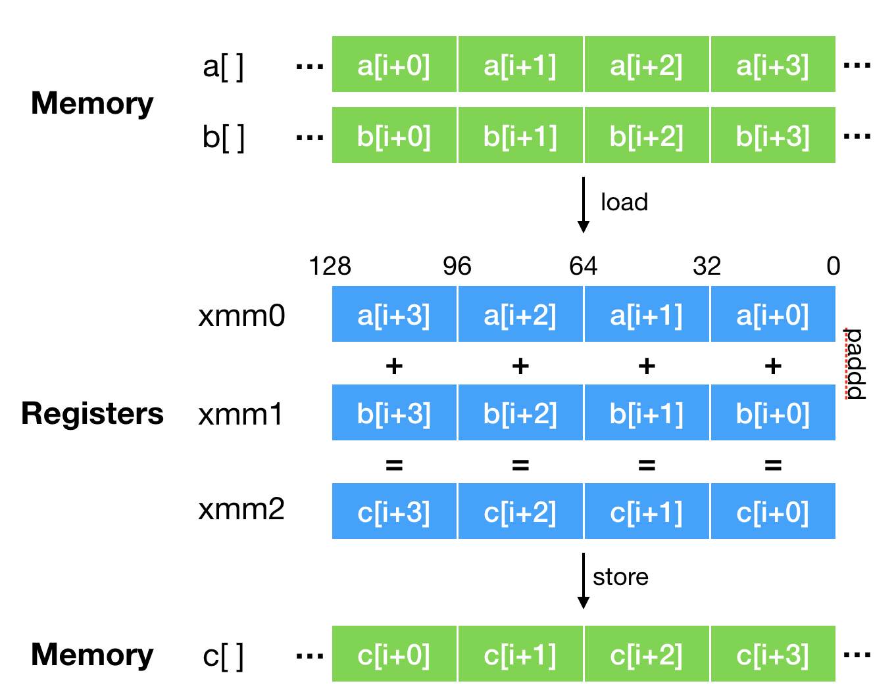

### JVM即时编译原理

#### 即时编译原理

HotSpot 虚拟机包含多个即时编译器 C1、C2 。

* 执行时间较短的，或者对启动性能有要求的程序，采用编译效率较快的 C1，对应参数 -client。
* 执行时间较长的，或者对峰值性能有要求的程序，采用生成代码执行效率较快的 C2，对应参数 -server。

Java 7 引入了分层编译（对应参数 -XX:+TieredCompilation）的概念，综合了 C1 的启动性能优势和 C2 的峰值性能优势。分层编译将 Java 虚拟机的执行状态分为了五个层次。五个层级分别是：

* 第0层：解释执行
* 第1层：执行不带 profiling 的 C1 代码；
* 第2层：执行仅带方法调用次数以及循环回边执行次数 profiling 的 C1 代码；
* 第3层：执行带所有 profiling 的 C1 代码；
* 第4层：执行 C2 代码。

通常情况下，C2 代码的执行效率要比 C1 代码的高出 30% 以上。然而，对于 C1 代码的三种状态，按执行效率从高至低则是 1 层 > 2 层 > 3 层。其中 1 层的性能比 2 层的稍微高一些，而 2 层的性能又比 3 层高出 30%。这是因为 profiling 越多，其额外的性能开销越大。 编译路径见下图：


#### 编译触发条件

虚拟机为每个方法准备了两类计数器：方法调用计数器（Invocation Counter）和回边计数器（Back Edge Counter）。在确定虚拟机运行参数的前提下，这两个计数器都有一个确定的阈值，当计数器超过阈值就会触发 JIT 编译。

**方法调用计数器：**用于统计方法被调用的次数，方法调用计数器的默认阈值在 C1 模式下是 1500 次，在 C2 模式在是 10000 次，可通过 -XX: CompileThreshold 来设定；而在分层编译的情况下，-XX: CompileThreshold 指定的阈值将失效，此时将会根据**当前待编译的方法数以及编译线程数来动态调整**。当方法计数器和回边计数器之和超过方法计数器阈值时，就会触发 JIT 编译器。

**回边计数器：**用于统计一个方法中循环体代码执行的次数，在字节码中遇到控制流向后跳转的指令称为"回边"(Back Edge)，该值用于计算是否触发 C1 编译的阈值，在不开启分层编译的情况下，C1 默认为 13995，C2 默认为 10700，可通过 -XX: OnStackReplacePercentage=N 来设置；而在分层编译的情况下，-XX: OnStackReplacePercentage 指定的阈值同样会失效，此时将根据当前待编译的方法数以及编译线程数来动态调整。建立回边计数器的主要目的是为了触发 OSR（On StackReplacement）编译，即栈上编译。在一些循环周期比较长的代码段中，当循环达到回边计数器阈值时，JVM 会认为这段是热点代码，JIT 编译器就会将这段代码编译成机器语言并缓存，在该循环时间段内，会直接将执行代码替换，执行缓存的机器语言。

OSR 实际上是一种技术，它指的是在程序执行过程中，动态地替换掉 Java 方法栈桢，从而使得程序能够在非方法入口处进行解释执行和编译后的代码之间的切换。事实上，去优化（deoptimization）采用的技术也可以称之为 OSR。OSR 编译可以用来解决单次调用方法包含热循环的性能优化问题。


通常情况下，解释执行过程中仅收集方法的调用次数以及循环回边的执行次数。当方法被 3 层 C1 所编译时，生成的 C1 代码将收集**条件跳转指令的分支 profile**，以及**类型相关指令的类型 profile**。基于分支 profile 的优化以及基于类型 profile 的优化都将对程序今后的执行作出假设。这些假设将精简所要编译的代码的控制流以及数据流。在假设失败的情况下，Java 虚拟机将采取**去优化**，退回至解释执行并重新收集相关的 profile。


####  常见优化技术

##### 1. 方法内联

**方法内联**：在编译过程中，当遇到方法调用时，将目标方法的方法体纳入编译范围之中，并取代原方法调用的优化手段。即时编译器既可以在解析过程中替换方法调用字节码，也可以在 IR 图中替换方法调用 IR 节点。这两者都需要将目标方法的参数以及返回值映射到当前方法来。

```java
private int add1(int x1, int x2, int x3, int x4) {
    return add2(x1, x2) + add2(x3, x4);
}
private int add2(int x1, int x2) {
    return x1 + x2;
}

// 内联优化后
private int add1(int x1, int x2, int x3, int x4) {
    return x1 + x2+ x3 + x4;
}
```

**内联优缺点：**通常情况内联方法越多，生成代码的执行效率越高（去除方法调用的成本+方法内联后可以触发其他优化）。但是方法内联也会大大增加codeCache内存的大小。


对于需要动态绑定的虚方法（invoke interface指令 和 invoke virtual指令）调用来说，即时编译器则需要先对虚方法调用进行去虚化（devirtualize），即转换为一个或多个直接调用，然后才能进行方法内联。即时编译器的去虚化方式可分为：

* 完全去虚化：是通过类型推导或者类层次分析（class hierarchy analysis），识别虚方法调用的唯一目标方法，从而将其转换为直接调用的一种优化手段。它的关键在于证明虚方法调用的目标方法是唯一的。

* 条件去虚化：通过向代码中增添类型比较，将虚方法调用转换为一个个的类型测试以及对应该类型的直接调用。它将借助 Java 虚拟机所收集的类型 Profile。

  > ```java
  >   public static int test(BinaryOp op) {
  >     if (op.getClass() == Sub.class) {
  >       return 2 - 1; // inlined Sub.apply
  >     } else if (op.getClass() == Add.class) {
  >       return 2 + 1; // inlined Add.apply
  >     } else {
  >            
  >       ... // 当匹配不到类型Profile中的类型怎么办？
  >          // 即时编译器压根不会进行条件去虚化，而是直接使用内联缓存或者方法表。
  >     }
  >   }
  > ```


##### 2. 逃逸分析

 Java 虚拟机的即时编译语境下，逃逸分析将判断新建的对象是否会逃逸。即时编译器判断对象逃逸依据有两种：

* 对象是否被存入堆中，一旦对象被存入堆中其他线程便能获得该对象的引用。即时编译器也因此无法追踪所有使用该对象的代码位置。

* 二是看对象是否作为方法调用的调用者或者参数。对于方法中未被内联的方法调用，即时编译器会将其当成未知代码，毕竟它无法确认该方法调用会不会将调用者或所传入的参数存储至堆中。

即时编译器会根据逃逸分析的结果进行优化

* 锁消除
* 标量替换 (将原本连续分配的对象拆散为一个个单独的字段，分布在栈上或者寄存器中。）
* 栈上分配【java 内存分配是在堆上，目前没有采用这种方式来优化】

```java
public void forEach(ArrayList<Object> list, Consumer<Object> f) {
  Iterator<Object> iter = list.iterator();
  while (iter.hasNext()) {
    Object obj = iter.next();
    f.accept(obj);
  }
}

// 内联后代码
public void forEach(ArrayList<Object> list, Consumer<Object> f) {
  Itr iter = new Itr; // 注意这里是new指令
  iter.cursor = 0;
  iter.lastRet = -1;
  iter.expectedModCount = list.modCount;
  while (iter.cursor < list.size) {
    if (list.modCount != iter.expectedModCount)
      throw new ConcurrentModificationException();
    int i = iter.cursor;
    if (i >= list.size)
      throw new NoSuchElementException();
    Object[] elementData = list.elementData;
    if (i >= elementData.length)
      throw new ConcurrentModificationException();
    iter.cursor = i + 1;
    iter.lastRet = i;
    Object obj = elementData[i];
    f.accept(obj);
  }
}

// 这段代码所新建的ArrayList$Itr实例既没有被存入任何字段之中，也没有作为任何方法调用的调用者或者参数。因此，逃逸分析将断定该实例不逃逸。所以jvm会进一步使用标量替换优化
public void forEach(ArrayList<Object> list, Consumer<Object> f) {
  // Itr iter = new Itr; // 经过标量替换后该分配无意义，可以被优化掉
  int cursor = 0;     // 标量替换
  int lastRet = -1;   // 标量替换
  int expectedModCount = list.modCount; // 标量替换
  while (cursor < list.size) {
    if (list.modCount != expectedModCount)
      throw new ConcurrentModificationException();
    int i = cursor;
    if (i >= list.size)
      throw new NoSuchElementException();
    Object[] elementData = list.elementData;
    if (i >= elementData.length)
      throw new ConcurrentModificationException();
    cursor = i + 1;
    lastRet = i;
    Object obj = elementData[i];
    f.accept(obj);
  }
}
```


##### 3.字段访问优化

**字段读取优化**：即时编译器沿着控制流缓存字段存储、读取的值，并在接下来的字段读取操作时直接使用该缓存值。要求生成缓存值的访问以及使用缓存值的读取之间没有方法调用、内存屏障，或者其他可能存储该字段的节点。

```java
static int bar(Foo o, int x) {
  int y = o.a + x;
  return o.a + y;
}

// 优化后
static int bar(Foo o, int x) {
  int t = o.a;
  int y = t + x;
  return t + y;
}
```


**字段存储优化**：如果一个字段的两次存储之间没有对该字段的读取操作、方法调用以及内存屏障，那么即时编译器可以将第一个冗余的存储操作给消除掉。

```java
class Foo {
  int a = 0;
  void bar() {
    a = 1;
    a = 2;
  }
}
// 优化后
void bar() { 
  a = 2; 
}
```


**死代码消除：**

* 第一种是局部变量的死存储消除以及部分死存储消除。它们可以通过转换为 Sea-of-Nodes IR 来完成。
* 第二种则是不可达分支。通过消除不可达分支，即时编译器可以精简数据流，并且减少编译时间以及最终生成机器码的大小。

```java
int bar(int x, int y) {
  int t = x*y;
  t = x+y;
  return t;
}

// 优化后
int bar(int x, int y) {
  return x+y;
}

// 不会被优化，因为x/y有可能产生异常。不是死代码
int bar(int x, int y) {
  int t = x/y;
  t = x+y;
  return t;
}
```


##### 4. 循环优化

**循环无关代码外提**：将循环中值不变的表达式，或者循环无关检测外提至循环之前，以避免在循环中重复进行冗余计算。前者是通过 Sea-of-Nodes IR 以及节点调度来共同完成的，而后者则是通过一个独立优化 —— 循环预测来完成的。循环预测还可以外提循环有关的数组下标范围检测。

```java
int foo(int x, int y, int[] a) {
  int sum = 0;
  for (int i = 0; i < a.length; i++) {
    sum += x * y + a[i];
  }
  return sum;
}
//优化后的代码
int fooManualOpt(int x, int y, int[] a) {
  int sum = 0;
  int t0 = x * y;
  int t1 = a.length;
  for (int i = 0; i < t1; i++) {
    sum += t0 + a[i];
  }
  return sum;
}
```


**循环展开**：是一种在循环中重复多次迭代，并且相应地**减少循环次数**的优化方式。它是一种以空间换时间的优化方式，通过增大循环体来获取更多的优化机会。循环展开的特殊形式是完全展开，将原本的循环转换成若干个循环体的顺序执行。

```java
int foo(int[] a) {
  int sum = 0;
  for (int i = 0; i < 64; i++) {
    sum += (i % 2 == 0) ? a[i] : -a[i];
  }
  return sum;
}

//优化后的代码

int foo(int[] a) {
  int sum = 0;
  for (int i = 0; i < 64; i += 2) { // 注意这里的步数是2
    sum += (i % 2 == 0) ? a[i] : -a[i];
    sum += ((i + 1) % 2 == 0) ? a[i + 1] : -a[i + 1];
  }
  return sum;
}
```

另外两种循环优化方式：循环判断外提以及循环剥离。


##### 5. intrinsic和向量化

向量化优化借助的是 CPU 的 SIMD 指令，即通过单条指令控制多组数据的运算。它被称为 CPU 指令级别的并行。

SIMD 指令：X86_64 体系架构上通用寄存器的大小为 64 位（即 8 个字节），无法暂存这些超长的数据。因此，即时编译器将借助长度足够的 XMM 寄存器，来完成 int 数组与 long 数组的向量化读取和写入操作。

XMM 寄存器，是由 SSE（Streaming SIMD Extensions）指令集所引入的。它们一开始仅为 128 位。自从 X86 平台上的 CPU 开始支持 AVX（Advanced Vector Extensions）指令集后（2011 年），XMM 寄存器便升级为 256 位，并更名为 YMM 寄存器。原本使用 XMM 寄存器的指令，现将使用 YMM 寄存器的低 128 位。

```java
// X86_64 平台不支持内存间的直接移动，上面代码中的dst[i] = src[i]通常会被编译为两条内存访问指令：
// 第一条指令把src[i]的值读取至寄存器中，
// 第二条指令则把寄存器中的值写入至dst[i]中。
// 下面代码：四条内存读取指令，以及四条内存写入指令。
void foo(byte[] dst, byte[] src) {
  for (int i = 0; i < dst.length - 4; i += 4) {
    dst[i] = src[i];
    dst[i+1] = src[i+1];
    dst[i+2] = src[i+2];
    dst[i+3] = src[i+3];
  }
  ... // post-loop
}

// 数组是连续内存，我们可以使用SIMD指令同时操作4*4*8 = 128Byte.实现指令级别并行。提升效率
void foo(byte[] dst, byte[] src) {
  for (int i = 0; i < dst.length - 4; i += 4) {
    dst[i:i+3] = src[i:i+3];
  }
  ... // post-loop
}
```


HotSpot 虚拟机运用向量化优化的方式有两种方式：

第一种是使用 HotSpot intrinsic，在调用特定方法的时候替换为使用了 SIMD 指令的高效实现。Intrinsic 属于点覆盖，只有当应用程序明确需要这些 intrinsic 的语义，才能够获得由它带来的性能提升。HotSpot 虚拟机将对标注了@HotSpotIntrinsicCandidate注解的方法的调用，替换为直接使用基于特定 CPU 指令的高效实现。

HotSpot 虚拟机定义了三百多个 intrinsic。其中比较特殊的有Unsafe类的方法，基本上使用 java.util.concurrent 包便会间接使用到Unsafe类的 intrinsic。除此之外，String类和Arrays类中的 intrinsic 也比较特殊。即时编译器将为之生成非常高效的 SIMD 指令。

```java
@HotSpotIntrinsicCandidate
public static int addExact(int x, int y) {
    int r = x + y;
    // HD 2-12 Overflow iff both arguments have the opposite sign of the result
    if (((x ^ r) & (y ^ r)) < 0) {
        throw new ArithmeticException("integer overflow");
    }
    return r;
}
```


第二种是依赖即时编译器进行自动向量化，在循环展开优化之后将不同迭代的运算合并为向量运算。自动向量化的触发条件较为苛刻，因此也无法覆盖大多数用例。



```java
// 即时编译器的自动向量化将针对能够展开的计数循环，进行向量化优化,
// 即时编译器便能够自动将其展开优化成使用PADDD指令的向量加法。
void foo(int[] a, int[] b, int[] c) {
  for (int i = 0; i < c.length; i++) {
    c[i] = a[i] + b[i];
  }
}
```
> 


