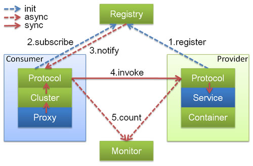
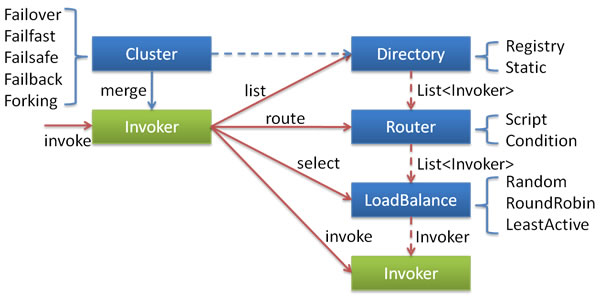
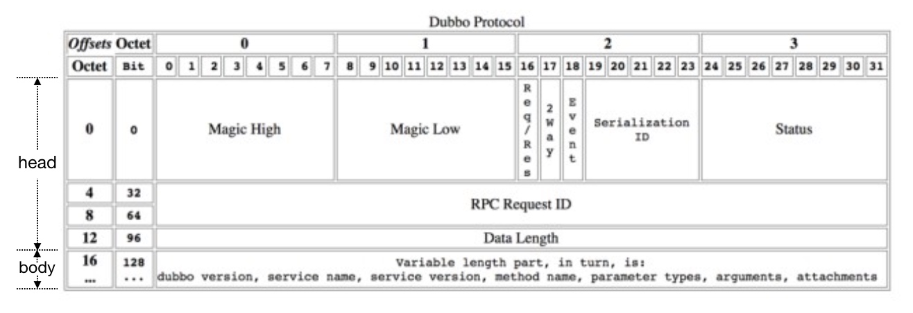

### Dubbo框架原理和使用

#### Dubbo整体架构


- **config 配置层**：对外配置接口，以 `ServiceConfig`, `ReferenceConfig` 为中心，可以直接初始化配置类，也可以通过 spring 解析配置生成配置类
- **proxy 服务代理层**：服务接口透明代理，生成服务的客户端 Stub 和服务器端 Skeleton, 以 `ServiceProxy` 为中心，扩展接口为 `ProxyFactory`
- **registry 注册中心层**：封装服务地址的注册与发现，以服务 URL 为中心，扩展接口为 `RegistryFactory`, `Registry`, `RegistryService`
- **cluster 路由层**：封装多个提供者的路由及负载均衡，并桥接注册中心，以 `Invoker` 为中心，扩展接口为 `Cluster`, `Directory`, `Router`, `LoadBalance`
- **monitor 监控层**：RPC 调用次数和调用时间监控，以 `Statistics` 为中心，扩展接口为 `MonitorFactory`, `Monitor`, `MonitorService`
- **protocol 远程调用层**：封装 RPC 调用，以 `Invocation`, `Result` 为中心，扩展接口为 `Protocol`, `Invoker`, `Exporter`
- **exchange 信息交换层**：封装请求响应模式，同步转异步，以 `Request`, `Response` 为中心，扩展接口为 `Exchanger`, `ExchangeChannel`, `ExchangeClient`, `ExchangeServer`
- **transport 网络传输层**：抽象 mina 和 netty 为统一接口，以 `Message` 为中心，扩展接口为 `Channel`, `Transporter`, `Client`, `Server`, `Codec`
- **serialize 数据序列化层**：可复用的一些工具，扩展接口为 `Serialization`, `ObjectInput`, `ObjectOutput`, `ThreadPool`


#### Dubbo核心接口

##### SPI扩展点机制

Dubbo 的扩展点加载从 JDK 标准的 SPI (Service Provider Interface) 扩展点发现机制加强而来。Dubbo 改进了 JDK 标准的 SPI 的以下问题：

- JDK 标准的 SPI 会一次性实例化扩展点所有实现，如果有扩展实现初始化很耗时，但如果没用上也加载，会很浪费资源。
- 增加了对扩展点 IoC 和 AOP 的支持，一个扩展点可以直接 setter 注入其它扩展点。

参数案例代码：https://dubbo.apache.org/zh/docs/v2.7/dev/spi/


**普通SPI扩展机制**：i). 创建ExtensionLoader<T>对象，并缓存起来  ==> ii). 从类路径META-INFO/services[dubbo/[internal]]下加载扩展类对象, 并缓存 
==> iii). 根据name 查找扩展类，然后通过反射创建该扩展对象。 ==> iv). 向拓展对象中注入依赖，并包装wraper，最后缓存该对象。

源码入口：ExtensionLoader#getAdaptiveExtension

```java
// isWrapperClass
clazz.getConstructor(type);

// 常见的Wrapper ==> ProtocolFilterWrapper
```


**自适应扩展点：**首先Dubbo会为拓展接口生成具有代理功能的代码。主要通过 javassist 或 jdk 编译代码得到 Class 类。最后再通过反射创建代理。代理方法的核心就是根据URL中的参数值，动态获取真实对象方法的调用。使用注解@Adaptive【主要标识在类上面】。Dubbo中大部分的扩展点都是使用这个机制，比如，负载均衡，代理类创建，序列化，通讯框架。

源码入口：ExtensionLoader#getAdaptiveExtension


**自动激活扩展点**：某个扩展点满足条件的多个实现类同时启用，原理是根据@Activate中group + value值进行过滤。Dubbo中的Filter扩展点都是使用这个机制。

源码入口：ExtensionLoader#getAdaptiveExtension


##### 配置接口

```
-- AbstractConfig
  -- ApplicationConfig ==> 应用配置核心属性：name, version, owner
  -- RegistryConfig ==> 注册中心核心属性：protocol, address, user, name
  -- ModuleConfig 
  -- Scan ==> 指定扫描dubbo Service路径
  -- ProtocolConfig ==> 协议核心配置：name, port, heartbeat
  -- ProviderConfig ==> 服务提供端核心配置：group, threads, retries, timeout, cluster, dispatcher, delay
  -- ConsumerConfig ==> 消费端核心配置：check
  -- MonitorConfig ==> 监控核心配置：protocol[registry], username, password
```

**配置优先级：** 配置层级越精确优先级越高，方法级别的配置最高. consumerd端配置优先 ==> provider端。


##### 代理机制

```java
-- ProxyFactory代理类工厂
  核心接口：
    // 创建consumer【XXXAPI】端代理对象，包装Invoker调用
    <T> T getProxy(Invoker<T> invoker) throws RpcException;

    // 创建provider端【XXXAPIImpl ==> ref】代理对象
    <T> Invoker<T> getInvoker(T proxy, Class<T> type, URL url) throws RpcException;

  -- JavassistProxyFactory ==> 字节码技术生成代理对象
    // consumer端：包装生成的invoker,进行方法调用
    return (T) Proxy.getProxy(interfaces).newInstance(new InvokerInvocationHandler(invoker));
    
    // provider端：包装成AbstractProxyInvoker ==> 使用包装ref真实方法的调用
    return new AbstractProxyInvoker<T>(proxy, type, url) {
            @Override
            protected Object doInvoke(T proxy, String methodName,
                                      Class<?>[] parameterTypes,
                                      Object[] arguments) throws Throwable {
                return wrapper.invokeMethod(proxy, methodName, parameterTypes, arguments);
            }
        };   
```


##### 注册中心




功能说明：

* 服务提供者启动时候，会向注册中心写入自己的元数据信息,同时订阅配置元数据信息。
* 服务消费者启动时候，会向注册中心写入自己的元数据信息,同时订阅服务提供者，路由和配置元数据信息。
* 当服务提供者新增或者删除的时候，注册中心提供者目录会发生变化，动态通知给消费者和服务治理中心。
* dubbo调用时候，会异步上报调用和统计信息给dubbo-monitor

Zookeeper注册节点数据格式：

```xml
|- duboo
  |- 接口名称(Service)  
    |- providers  ==> 服务提供者目录
    |- consumers  ==> 服务消费者者目录
    |- routes  ==> 路由配置目录
    |- configurators ==> 动态配置目录
```


注册中心接口设计：

```java
-- Registry
  核心接口：
    void register(URL url);
    void unregister(URL url);
    void subscribe(URL url, NotifyListener listener);
    void unsubscribe(URL url, NotifyListener listener);
    List<URL> lookup(URL url);   
    URL getUrl();

  -- AbstractRegistry
    核心属性：
      // 缓存注册中心获取的服务信息到文件和内存【第一次全量订阅，后续更新修改】
      private final Properties properties = new Properties();
      private File file;
      private final ConcurrentMap<URL, Map<String, List<URL>>> notified = new ConcurrentHashMap<URL, Map<String, List<URL>>>();

    -- FailbackRegistry ==> 增加了重试功能[定时器处理失败的发布和订阅]
      核心接口：
        // 提供了四个模板方法
        protected abstract void doRegister(URL url);
        protected abstract void doUnregister(URL url);
        protected abstract void doSubscribe(URL url, NotifyListener listener);
        protected abstract void doUnsubscribe(URL url, NotifyListener listener);

      -- ZookeeperRegistry
        核心接口实现：
          doRegister/doUnregister ==> 创建和删除zk节点
          doSubscribe ==> 服务暴露会订阅configurators，消费者启动会订阅configurators,providers, routes. 通过Watch事件通知客户端拉取最新数据
          doUnsubscribe ==> 移除zk url对应的监听器
```


##### 集群原理

服务集群cluster包含：服务目录，服务路由，负载均衡等功能



```java
-- Directory接口 ==> 服务目录
  核心接口:
    List<Invoker<T>> list(Invocation invocation) throws RpcException;
    List<Invoker<T>> getAllInvokers();
    URL getConsumerUrl();

  -- AbstractDirectory
    核心属性： 
      // 服务URL
      private final URL url; 
      // 路由链
      protected RouterChain<T> routerChain;

    -- RegistryDirectory ==> 是一个NotifyListener监听器，监听注册中心事件通知。
      
      核心方法：
        subscribe ==> 订阅某个URL的更新信息
        nofify ==> 动态更新本地Invoker列表，路由列表，配置信息逻辑
        doList ==> 返回Invoker列表
```


```java
-- Router接口 ==> Dubbo路由规则
  核心接口：
    <T> List<Invoker<T>> route(List<Invoker<T>> invokers, URL url, Invocation invocation) throws RpcException;
    -- AbstractRouterRule
      -- ConditionRouter ==> 条件路由
      -- TagRouter ==> tag路由
```


```java
-- LoadBalance接口 ==> Dubbo负载均衡
  核心接口： 
    <T> Invoker<T> select(List<Invoker<T>> invokers, URL url, Invocation invocation) throws RpcException;

  -- AbstractLoadBalance
    核心方法： 
      // 根据启动事件进行加权
      int getWeight(Invoker<?> invoker, Invocation invocation)
    
    -- RandomLoadBalance ==> 随机算法
    -- RoundRobinLoadBalance  ==> 加权轮询
    -- LeastActiveLoadBalance ==> 最小活跃调用
    -- ConsistentHashLoadBalance ==> 一致性hash算法
```


```java
-- Cluster接口 ==> 用于生成Cluster Invoker
   核心接口：
     <T> Invoker<T> join(Directory<T> directory) throws RpcException;
   -- FailfastCluster,...
     实现： doJoin ==> new FailfastClusterInvoker<>(directory);


-- Invoker ==> 调用者
  核心接口： Result invoke(Invocation invocation) throws RpcException;

  -- AbstractInvoker
    -- DubboInvoker【客户端Invoker】
      核心属性：
       ExchangeClient[] clients;
       private final Set<Invoker<?>> invokers; // 所有consumer api 对应的invoke	

  -- ClusterInvoker【客户端Invoker】
    核心接口：
      URL getRegistryUrl();
      Directory<T> getDirectory();

    -- AbstractClusterInvoker
      核心属性： protected final Directory<T> directory;
      核心方法： select ==> Directory中经过路由规则过滤后获取所有invokers,根据请求参数获取loadBalance对象，最后获取Invoker

      -- FailoverClusterInvoker ==> 获取invoker进行调用, 如果失败会进行重试【配置中指定的次数】。
      -- FailfastClusterInvoker ==> 获取invoker进行调用, 如果失败直接抛异常。


  -- AbstractProxyInvoker【服务端invoker】
    抽象方法：
      protected abstract Object doInvoke(T proxy, String methodName, Class<?>[] parameterTypes, Object[] arguments);
    -- JavassistProxyFactory动态生成
      属性： Wrapper wapper ==> 动态生成的代码，里面直接委托真实对应ref[对应业务service对象]的方法调用
      方法： doInvoke ==> wrapper.invokeMethod [包装真实类ref的方法调用]
      
```

集群调用过程【AbstractClusterInvoker#invoke】：先从服务目录中找到对应服务url[包装成Invoker] ==> 经过路由器进一步过滤有效的[invoker] ==> 再通过客户端负载均衡算法找到具体的DubboInvoke. ==> 最后通过，nettyClient进行请求和响应。


##### 过滤器

```java
-- Filter接口
  核心方法：
     // invoker表示下一个Filter包装的invoker
     Result invoke(Invoker<?> invoker, Invocation invocation) throws RpcException;
  -- AccessLogFilter, GenericFilter, ActiveLimitFilter, ConsumerContextFilter...

-- ProtocolFilterWrapper 
  核心方法: buildInvokerChain ==> 将所有Filter对象构造成一个Invoker链，最后一个Invoker才是真实的。
```

**过滤器配置：**用户自定义过滤器位置默认在内置过滤器后面, 可以使用 filter=“xxx, default”来修改，剔除过滤器使用 filter=“-xxxFilter”。


#### Dubbo执行流程分析

##### 服务注册和发现过程

```java
-- Exporter接口 ==> 服务暴露对象
  核心接口:
    Invoker<T> getInvoker();
    void unexport();
  -- AbstractExporter
    属性：Invoker<T> invoker;
    -- DubboExporter
      属性： 
        // port + path + version + group ==> 用于客户端查询匹配
        private final String key;
        final Map<String, Exporter<?>> exporterMap;
      核心方法： getInvoker ==> 创建nettyServer,监听指定的url


-- Protocol协议 
  核心接口: 
    // 服务注册和发现
    <T> Exporter<T> export(Invoker<T> invoker) throws RpcException;
    <T> Invoker<T> refer(Class<T> type, URL url) throws RpcException;

  -- AbstractProtocol
    核心属性：
      // 导出服务集合
      protected final Map<String, Exporter<?>> exporterMap = new ConcurrentHashMap<String, Exporter<?>>();

    -- DubboProtocol
      核心属性：
        // 信息交换服务【key = ip:port】
        private final Map<String, ExchangeServer> serverMap = new ConcurrentHashMap<String, ExchangeServer>();
    
        // 处理客户端请求
        private ExchangeHandler requestHandler = new ExchangeHandlerAdapter()
        // 通过请求体信息【端口，路径，分组】,获取服务端暴露的服务【DubboExporter】
        Invoker<?> getInvoker(Channel channel, Invocation inv)

      核心方法：
        exporter ==> 加入DubboExporter，创建nettyServer,监听指定的url,提供服务
        refer  ==> 加入DubboExporter，创建nettyClient,连接指定服务url

    -- ProtocolFilterWrapper
      核心方法：
        exporter ==> 将invoker节点包装成一个Filter链模式
        refer  ==> 将invoker节点包装成一个Filter链模式

    -- RegistryProtocol
      核心方法：
        exporter ==> 将服务节点注册到zk, 就是创建一个node节点。
        refer  ==> 从zk获取可用节点， 封装成对应clustor invoker

 
// 服务端的Handler会被以下三个ChannelHandler再次包装          
// MultiMessageHandler ==> HeartbeatHandler ==> 线程模型ChanelHandler[MessageOnlyChannelHandler]
-- NettyServer ==> handler包装类 【DecodeHandler -> HeaderExchangeHandler -> DubboProtocol#requestHandler】
-- ExchangeServer 
  -- HeaderExchangeServer
    核心属性：
      // 服务端 ==> NettyServer,...
      private final Server server;
      // 心跳处理
      private ScheduledFuture<?> heartbeatTimer;

// 客户端的Handler会被以下三个ChannelHandler再次包装          
// MultiMessageHandler ==> HeartbeatHandler ==> 线程模型ChanelHandler[MessageOnlyChannelHandler]
-- NettyClient ==> handler包装类【DecodeHandler -> HeaderExchangeHandler -> DubboProtocol#requestHandler】
-- ExchangeClient
  -- HeaderExchangeClient
    核心属性：
      // 心跳检测
      private ScheduledFuture<?> heartbeatTimer;
      // chanel处理器 【HeaderExchangeChannel】 ==> 发送请求
      private final ExchangeChannel channel;
      // NettyClient响应处理事件【里面包含处理nio事件】
      private final Client client;

-- HeartBeatTask ==> 心跳超时机制【每分钟发送心跳报文，客户端超时3分钟重新简历连接】
  
```


**服务暴露过程：**Dubbo 服务导出过程始于Spring容器发布刷新事件，Dubbo在接收到事件后，会立即执行服务导出逻辑【所有的ServiceBean】。

代码入口：【ServiceBean#onApplicationEvent】

* 检查参数，根据配置信息组装URL，通过URL来暴露服务。
* 导出服务对象 ==> 将服务Service[ref]通过JavassistProxyFactory包装成invoker, 使用具体协议包装成exporter
* ProtocolFilterWrapper#export ==> 将invoker节点包装成一个Filter链模式
* DubboProtocol#export ==> 启动netty服务，监听对应URL【ip:port】
* RegistryProtocol#export ==> 注册中心注册服务【zk对应创建一个node节点】，用于服务发现。


**服务引用流程：**Dubbo服务引用的入口方法为 ReferenceBean 的 getObject 方法，该方法定义在 Spring 的 FactoryBean 接口中.【ReferenceAnnotationBeanPostProcessor】

* @refefence引用时候，使用ReferenceAnnotationBeanPostProcessor后置处理器注入该依赖 
* ReferenceBean#getObject 获取对应代理类。
* RegisterProtocol#refer ==> 消费方订阅信息注册到注册中心，从注册中心订阅服务端信息，并封装到服务目录。服务目录底层使用DubboProtocol封装具体的Invoker, 最后服务目录Directory封装成AbstractClusterInvoker【根据spi机制获取】返回。
* ProtocolFilterWrapper#export ==> 将invoker节点包装成一个Filter链模式
* DubboProtocol#refer ==>从注册中心获取或者[refer] Invoker对象， 并发封成AbstractClusterInvoker.
* JavassistProxyFactory创建代理类，实现逻辑 ==> 包装真实cluster invoker调用


##### 服务调用过程

**dubbo协议编解码**



```java
-- Response, Request ==> dubbo封装的请求和响应[协议报文]

-- Invocation ==> 调用者请求信息接口
  核心接口：getMethodName, getParameterTypes, getArguments...
  -- RpcInvocation ==> RPC请求体内容【接口，方法名，参数类型，参数值】
    -- DecodeableRpcInvocation
  
-- Result ==> 调用结果信息接口
  -- RpcResult
    -- DecodeableRpcResult
  

dubbo编解码器
-- Codec2 ==> 编解码器
  -- AbstractCodec
    -- TransportCodec
      -- TelnetCodec
        -- ExchangeCodec
          核心接口: 
            // 编码求/响应报文【使用序列化器】
            protected void encodeRequest(Channel channel, ChannelBuffer buffer, Request req)
            protected void encodeResponse(Channel channel, ChannelBuffer buffer, Response res) 

          -- DubboCodec ==> dubbo编解码器
            核心接口: 
              // dubbo请求体/响应体编码
              protected void encodeRequestData(Channel channel, ObjectOutput out, Object data) 
              protected void encodeResponseData(Channel channel, ObjectOutput out, Object data) 
 
              // 解码请求/响应报文【处理粘包问题，通过魔术进行分割】
              protected Object decodeBody(Channel channel, InputStream is, byte[] header)
                
```


**dubbo执行请求流程**：代理类#invoke ==> AbstractClusterInvoker#doInvoke ==> DubboInvoke#doinvoke ==> HeaderExchangeHandler#request

**dubbo响应请求流程**：NettyServerHandler#channelRead【netty 服务获取请求参数进行处理】==> HeaderExchangeHandler#handleRequest ==> DubboProtocol#requestHandler#reply ==>  dubboExporterMap中查找 DubboExport ，获取对应Invoker, 然后调用真实实现ref的指定方法

```java
-- HeaderExchangeHandler ==> Channel处理器，用于处理业务请求和响应
  核心属性：
    // DubboProtocol#requestHandler
    private final ExchangeHandler handler;

  核心方法：

    // 接受完消息【客户端 ==> 接收到响应数据数据， 服务端 ==> 接受到请求参数】
    public void received(Channel channel, Object message) throws RemotingException

    // 服务端获取业务请求参数后，找到对应DubboExporter进行调用，获取响应值，然后把它写入channel
    Response handleRequest(ExchangeChannel channel, Request req)

    // 客户端拿到响应后，调用DefaultFuture.received唤醒等待线程
    static void handleResponse(Channel channel, Response response)


-- DefaultFuture ==> 所有请求调用管理类【异步转同步】
  核心属性：
    // 所有请求的Future对象
    private static final Map<Long, DefaultFuture> FUTURES = new ConcurrentHashMap<Long, DefaultFuture>();
    private final long id; 
    private final Request request;
    private volatile Response response;
  // 定时器处理超时情况
  核心方法：
    // 填充response，唤起get等待的线程 。
    public static void received(Channel channel, Response response)
    // 线程等待，等待服务端返回结果
    public Object get(int timeout) throws RemotingException
    

```


#### SpringBoot整合Dubbo流程

##### 整合过程步骤

1. 引入依赖：

```xml
<dependency>
	  <groupId>org.apache.dubbo</groupId>
    <artifactId>dubbo-spring-boot-starter</artifactId>
		<version>2.7.8</version>
</dependency>

<dependency>
    <groupId>org.apache.curator</groupId>
		<artifactId>curator-recipes</artifactId>
		<version>2.13.0</version>
</dependency>
```

2.配置dubbo

```yaml
dubbo:
  application:
    name: test
    owner: wuji
  registry:
    protocol: zookeeper
    address: 127.0.0.1:2181
  scan:
    base-packages: com.demo.mock.dubbo.service
  protocol:
    name: dubbo
    port: 20880
  provider:
    delay: -1
    timeout: 5000
    retries: 0
    threads: 300
    cluster: failover
    dispatcher: message
  monitor:
    protocol: registry
  consumer:
    check: false
```

3.代码使用

```java
public interface DemoService {
    String sayHello();
}

// provider
@DubboService
public class DemoServiceImpl implements DemoService {
    @Override
    public String sayHello() {
        return "hello world";
    }
}

// consumer
@DubboReference
private DemoService demoService;

```


##### 自动配置过程

```java
@ConditionalOnProperty(prefix = DUBBO_PREFIX, name = "enabled", matchIfMissing = true)
@Configuration
@AutoConfigureAfter(DubboRelaxedBindingAutoConfiguration.class) // 注册扫描包
@EnableConfigurationProperties(DubboConfigurationProperties.class) // dubbo配置解析成配置类对象
@EnableDubboConfig // 引入组件DubboConfigConfiguration，用来配置 dubbo配置类对象到spirng 容器
public class DubboAutoConfiguration implements ApplicationContextAware, BeanDefinitionRegistryPostProcessor {
  
    // ServiceClassPostProcessor ==> BeanDefinitionRegistryPostProcessor[注册duubo @Service,为spring容器中的bean]
    // 通过扫描指定包的形式
    @Bean
    public ServiceClassPostProcessor serviceClassPostProcessor(@Qualifier(BASE_PACKAGES_BEAN_NAME) Set<String> packagesToScan) {
        return new ServiceClassPostProcessor(packagesToScan);
    }
}

// DubboConfigConfiguration.Single.class 
// ConfigurationBeanBindingRegistrar ==> 解析成dubbo配置对象，并加载到内存
// ReferenceAnnotationBeanPostProcessor ==> 处理Dubbo @Reference
```


##### Dubbo高级功能

**启动时检查:** consumer端配置 check=false  ==> 用于处理循环依赖，或者测试环境启动服务不依赖其他服务

**集群容错：**默认failover快速失败，retries = 0 ==> 重试可能使机器压力更大

**负载均衡：**LoadBalance ==> 随机[默认]，轮询，权重轮询，最小活跃调用，一致性hash算法。

**路由规则：**条件路由 ==> https://dubbo.apache.org/zh/docs/v2.7/user/examples/routing-rule/

**只订阅：**本地环境 ==> <dubbo:registry address="10.20.153.10:9090" register="false" />

**直连提供者：** 需要绕过注册中心，只测试指定服务提供者。默认使用本地：${user.home}/dubbo-resolve.properties文件

**泛化调用：**https://dubbo.apache.org/zh/docs/v2.7/user/examples/generic-reference/

```java
// 引用远程服务
// 该实例很重量，里面封装了所有与注册中心及服务提供方连接，请缓存
ReferenceConfig<GenericService> reference = new ReferenceConfig<GenericService>();
reference.setInterface("com.demo.mock.dubbo.service.DemoService");
        
// reference.setVersion("1.0.0");   
// 声明为泛化接口
reference.setGeneric(true);
// 用org.apache.dubbo.rpc.service.GenericService可以替代所有接口引用
GenericService genericService = reference.get();

// 基本类型以及Date,List,Map等不需要转换，直接调用
Object result = genericService.$invoke("sayHello2", new String[] {"java.lang.String"}, new Object[] {"world"});
```


  **RpcContext上下文信息**

```java
// 本端是否为提供端，这里会返回true
RpcContext.getContext().isConsumerSide();
RpcContext.getContext().isProviderSide();
RpcContext.getContext().getRemoteHost();
    
// 获取当前服务配置信息，所有配置信息都将转换为URL的参数RpcContext.getContext().getUrl().getParameter("application");

// 隐试传参：

// 客户端隐式传参，后面的远程调用都会隐式将这些参数发送到服务器端，
RpcContext.getContext().setAttachment("index", "1"); 
// 服务端接受参数
RpcContext.getContext().getAttachment("index"); 
```


**优雅停机：**

* 服务提供方：停止时，先标记为不接收新请求，新请求过来时直接报错，让客户端重试其它机器。然后，检测线程池中的线程是否正在运行，如果有，等待所有线程执行完成，除非超时，则强制关闭。
* 服务消费方：停止时，不再发起新的调用请求，所有新的调用在客户端即报错。然后，检测有没有请求的响应还没有返回，等待响应返回，除非超时则强制关闭。


