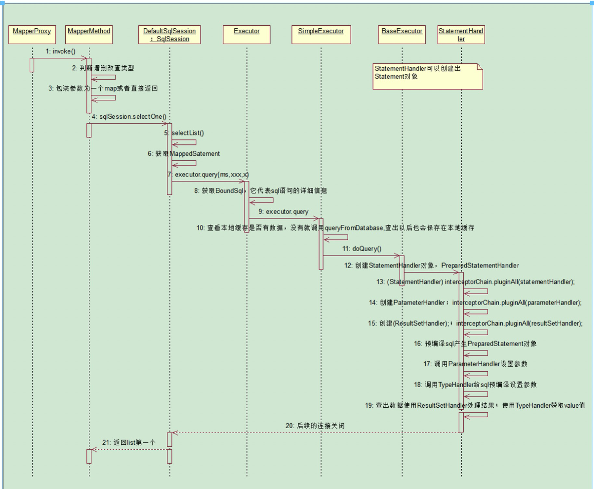
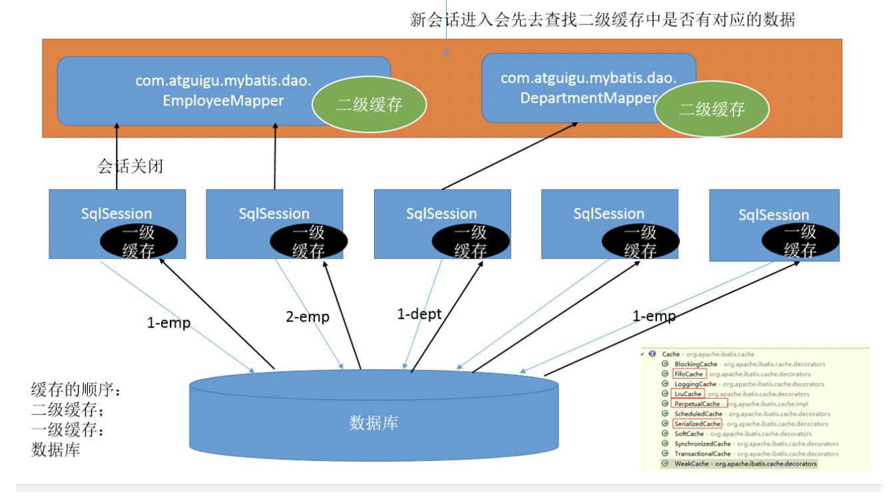

### JavaEE框架-MyBatis详解

**MyBatis **是一个简化和实现了 Java 数据持久化层(persistence layer)的开源框架，它抽象了大量的 JDBC 冗余代码，并提供了一个简单易用的 API 和数据库交互。原是Apache的一个开源项目iBatis, 2010年6月这个项目由
Apache Software Foundation 迁移到了Google Code，随着开发团队转投Google Code旗下， iBatis3.x正式更名为MyBatis ，代码于2013年11月迁移到Github。**Mybatis优点：**

* 消除了大量的 JDBC 冗余代码
* 有低的学习曲线
* 可以接受 SQL 语句
* 提供了与 Spring 和 Guice 框架的集成支持
* 提供了与第三方缓存类库的集成支持
* 引入了更好的性能

官方文档地址：https://mybatis.org/mybatis-3/zh/index.html


#### (一). Mybatis全局配置说明

##### 1. properties配置

```xml
<!-- mybatis可以使用properties来引入外部properties配置文件的内容；
    resource：引入类路径下的资源
	  url：引入网络路径或者磁盘路径下的资源
    注意：通过properties引入文件后，就可以使用占位符访问配置文件中的属性。
-->
<properties resource="dbconfig.properties"></properties>

```


##### 2. settings全局设置

```xml
<!-- 这是 MyBatis 中极为重要的调整设置，它们会改变 MyBatis 的运行时行为。-->
<settings>
  <setting name="cacheEnabled" value="true"/>
  <setting name="lazyLoadingEnabled" value="true"/>
  <setting name="multipleResultSetsEnabled" value="true"/>
  <setting name="useColumnLabel" value="true"/>
  <setting name="useGeneratedKeys" value="false"/>
  <setting name="autoMappingBehavior" value="PARTIAL"/>
  <setting name="autoMappingUnknownColumnBehavior" value="WARNING"/>
  <setting name="defaultExecutorType" value="SIMPLE"/>
  <setting name="defaultStatementTimeout" value="25"/>
  <setting name="defaultFetchSize" value="100"/>
  <setting name="safeRowBoundsEnabled" value="false"/>
  <setting name="mapUnderscoreToCamelCase" value="false"/>
  <setting name="localCacheScope" value="SESSION"/>
  <setting name="jdbcTypeForNull" value="OTHER"/>
  <setting name="lazyLoadTriggerMethods" value="equals,clone,hashCode,toString"/>
</settings>

```


#####3. typeAliases类型处理器

```xml
<!--类型别名是为Jav 类型设置一个短的名字。存在的意义仅在于用来减少类完全限定名的冗余。-->
<typeAliases>
  <typeAlias alias="Tag" type="domain.blog.Tag"/>
  <package name="domain.blog"/>
</typeAliases>

@Alias("author")
public class Author {
    ...
}

注意：别名重复会报错，可以使用注解解决，注解优先生效。另外，我们还可以使用内建的别名：基本类型(下划线_类型名字小写) ,包装,Date和集合类型(类型名字)，例如：_long	long  long	Long  date Date map	Map
```


#####4. typeHandlers类型处理器

MyBatis 在预处理语句（PreparedStatement）中设置一个参数时，还是从结果集中取出一个值时， 都会用类型处理器将获取的值以合适的方式转换成 Java 类型。

```xml
<typeHandlers>
  <typeHandler handler="org.mybatis.example.ExampleTypeHandler"/>
</typeHandlers>
```


##### 5. plugins插件

MyBatis 允许你在已映射语句执行过程中的某一点进行拦截调用。默认情况下，MyBatis 允许使用插件来拦截的方法调用包括：

* Executor (update, query, flushStatements, commit, rollback, getTransaction, close, isClosed)
* ParameterHandler (getParameterObject, setParameters)
* StatementHandler (prepare, parameterize, batch, update, query)

```xml
<plugins>
  <plugin interceptor="org.mybatis.example.ExamplePlugin">
    <property name="someProperty" value="100"/>
  </plugin>
</plugins>
```


##### 6. environments环境配置

```xml
<!-- 
SqlSessionFactory 实例只能选择一种环境。

environments：mybatis可以配置多种环境 ,default指定使用某种环境。可以达到快速切换环境。
environment：配置一个具体的环境信息；必须有两个标签；id代表当前环境的唯一标识
transactionManager：事务管理器；
  type：事务管理器的类型;JDBC(JdbcTransactionFactory)|MANAGED(ManagedTransactionFactory)
	自定义事务管理器：实现TransactionFactory接口.type指定为全类名
	dataSource：数据源: 
		type:数据源类型;UNPOOLED(UnpooledDataSourceFactory)|POOLED(PooledDataSourceFactory)
         |JNDI(JndiDataSourceFactory)
		自定义数据源：实现DataSourceFactory接口，type是全类名

说明：如果正在使用 Spring + MyBatis，则没有必要配置事务管理器，因为 Spring 模块会使用自带的管理器来覆盖前面的配置。
-->
<environments default="development">
  <environment id="development">
    <transactionManager type="JDBC">
      <property name="..." value="..."/>
    </transactionManager>
    <dataSource type="POOLED">
      <property name="driver" value="${driver}"/>
      <property name="url" value="${url}"/>
      <property name="username" value="${username}"/>
      <property name="password" value="${password}"/>
    </dataSource>
  </environment>
</environments>
```


##### 7. databaseIdProvider配置

```xml
<!-- 
databaseIdProvider：支持多数据库厂商的；type="DB_VENDOR"：
VendorDatabaseIdProvider：作用就是得到数据库厂商的标识(驱动getDatabaseProductName())，mybatis就能根据数据库厂商标识来执行不同的sql;
-->
<databaseIdProvider type="DB_VENDOR">
  <property name="SQL Server" value="sqlserver"/>
  <property name="DB2" value="db2"/>        
  <property name="Oracle" value="oracle" />
</databaseIdProvider>

<select id="getEmpById" resultType="com.mooc.domain.Employee" databaseId="mysql">
    select id,last_name,email,gender,emp_status empStatus from employee where id = #{id}
</select>

```


##### 8. mappers映射器

```xml
<!--
resource 属性：用来指定在 classpath 中的 mapper 文件。
url 属性：用来通过完全文件系统路径或者 web URL 地址来指向 mapper 文件
class 属性：用来指向一个 mapper 接口
package 属性：用来指向可以找到 Mapper 接口的包名

注意：通过接口扫描mapper接口，是不能找到xml具体配置路径，所以只能使用接口中注解的方法。如果要使用对应xml中的方法就需要把xml文件和mapper接口放到同一个包下面。
-->
<mappers>
    <mapper resource="com/mybatis3/mappers/StudentMapper.xml" />
    <mapper url="file:///D:/mybatisdemo/app/mappers/TutorMapper.xml" />
    <mapper class="com.mybatis3.mappers.TutorMapper" />
    <package name="com.mybatis3.mappers" />
</mappers>

```


##### 9. objectFactory对象工厂

MyBatis 每次创建结果对象的新实例时，它都会使用一个对象工厂（ObjectFactory）实例来完成。 默认的对象工厂需要做的仅仅是实例化目标类，要么通过默认构造方法，要么在参数映射存在的时候通过参数构造方法来实例化。 如果想覆盖对象工厂的默认行为，则可以通过创建自己的对象工厂来实现。


##### 10. 日志模块

```xml
Mybatis 的内置日志工厂提供日志功能，内置日志工厂将日志交给以下其中一种工具作代理：SLF4J，Apache Commons Logging，Log4j 2，Log4j，JDK logging。MyBatis 内置日志工厂基于运行时自省机制选择合适的日志工具。它会使用第一个查找得到的工具（按上文列举的顺序查找）。如果一个都未找到，日志功能就会被禁用。（如 Tomcat 和 WebShpere）的类路径中已经包含 Commons Logging，所以在这种配置环境下的 MyBatis 会把它作为日志工具，Log4J 配置将被忽略。想使用其它日志工具，你可以通过在 MyBatis 配置文件 mybatis-config.xml 里面添加一项 setting 来选择别的日志工具。
<!-- logImpl 可选的值有：SLF4J, LOG4J, LOG4J2, JDK_LOGGING, COMMONS_LOGGING, STDOUT_LOGGING, NO_LOGGING-->
<configuration>
  <settings>
    <setting name="logImpl" value="LOG4J"/>
    ...
  </settings>
</configuration>

```


#### (二). 配置Mapper映射器

##### 1. 映射语句

```xml 
1. xml方式

<!-- 1.查询语句 -->
<select id="selectPerson" parameterType="int" resultType="hashmap">
  SELECT * FROM PERSON WHERE ID = #{id}
</select>


<!--2. 插入语句：增删改没有resultType,在接口中可以定义类型Boolean,Integer,Long,void-->
<!--2.插入语句：支持自增-->
<insert id="insertStudent" parameterType="Student" useGeneratedKeys="true" keyProperty="studId">
  INSERT INTO STUDENTS(NAME, EMAIL, PHONE) VALUES(#{name},#{email},#{phone})
</insert> 

<!-- 插入语句：不支持自增-->
<insert id="insertStudent" parameterType="Student">
  <selectKey keyProperty="studId" resultType="int" order="BEFORE">
    SELECT ELEARNING.STUD_ID_SEQ.NEXTVAL FROM DUAL
  </selectKey>
  INSERT INTO STUDENTS(STUD_ID,NAME,EMAIL, PHONE) VALUES(#{studId},#{name},#{email},#{phone})
</insert>


<update id="updateAuthor">
  update Author set  username = #{username}, password = #{password} where id = #{id}
</update>

<delete id="deleteAuthor">
  delete from Author where id = #{id}
</delete>

注意：使用select返回集合的时候，我们在配置文件中resultType为集合中元素的类型，对应的mapper接口返回集合类。
另外，我们可以使用sql抽取可重用的sql语句。

```


```java
2. 注解方式

映射语句
@Insert("INSERT INTO STUDENTS(STUD_ID,NAME,EMAIL,ADDR_ID) VALUES(#{studId},#{name},#{email},#{address.addrId})")
@SelectKey(statement="SELECT STUD_ID_SEQ.NEXTVAL FROM DUAL",keyProperty="studId", resultType=int.class, before=true)
int insertStudent(Student student);


@Update("UPDATE STUDENTS SET NAME=#{name}, EMAIL=#{email} WHERE STUD_ID=#{studId}")
int updateStudent(Student student);

@Delete("DELETE FROM STUDENTS WHERE STUD_ID=#{studId}")
int deleteStudent(int studId);


#. 存储过程的使用
第一步： 编写存储过程
DROP PROCEDURE IF EXISTS `countEmployee`;
DELIMITER //
CREATE  PROCEDURE `countEmployee`(IN eName VARCHAR(12),OUT eCount INT)
BEGIN
SELECT COUNT(*) INTO eCount  FROM employee WHERE last_name = eName;
END //
DELIMITER ;


第二步：编写参数对象和调用存储过程
void getEmpCountByName(EmployeeDTO employeeDTO); //dao层
<select id="getEmpCountByName"  statementType="CALLABLE">
    <![CDATA[
    call countEmployee(
      #{name,mode=IN,jdbcType=VARCHAR},
      #{count,mode=OUT,jdbcType=INTEGER});
    ]]>
</select>
```


##### 2. 参数配置

```xml
单个参数：mybatis不会做特殊处理，
	#{参数名/任意名}：取出参数值。
    POJO：如果多个参数正好是我们业务逻辑的数据模型，我们就可以直接传入pojo；
	#{属性名}：取出传入的pojo的属性值	

	
多个参数：mybatis会做特殊处理。
	多个参数会被封装成一个map，
		key：param1...paramN, 或者0 1 ...如果在jdk8的时候可以使用arg0,arg1...
		value：传入的参数值

	如果是Collection（List、Set）类型或者是数组，也会特殊处理。也是把传入的list或者数组封装在map中。
	key：Collection（collection）,如果是List还可以使用list,数组(array),#{}就是从map中获取指定的key的值；

【命名参数】：明确指定封装参数时map的key；@Param("id")
	多个参数会被封装成一个map，
		key：使用@Param注解指定的值
		value：参数值
	#{指定的key}取出对应的参数值

Map：如果多个参数不是业务模型中的数据，没有对应的pojo，不经常使用，为了方便，我们也可以传入map
	#{key}：取出map中对应的值


注意点：#{}和${}的区别
  #{}:是以预编译的形式，将参数设置到sql语句中；PreparedStatement；防止sql注入
  ${}:取出的值直接拼装在sql语句中；会有安全问题；

大多情况下，我们去参数的值都应该去使用#{}；原生jdbc不支持占位符的地方我们就可以使用${}进行取值。比如分表、排序。。。；按照年份分表拆分
	select * from ${year}_salary where xxx;
	select * from tbl_employee order by ${f_name} ${order}


```


##### 3. 映射结果

**ResultMap映射**：

```xml
<resultMap id="StudentResult" type="com.mybatis3.domain.Student">
   <id property="studId" column="stud_id" />
   <result property="name" column="name" />
   <result property="email" column="email" />
   <result property="phone" column="phone" />
</resultMap>

<select id="findAllStudents" resultMap="StudentResult">
  SELECT * FROM STUDENTS
</select>

处理数据库字段和属性对应的方式：
    1) 查询sql时候使用别名
    2) 全局开启驼峰式支持
    3) 配置ResultMap，将属性和字段映射

```


**一对一映射**：

```xml
方式一：级联属性 <result property="address.addrId" column="addr_id" />

方式二：association

<resultMap type="Address" id="AddressResult">
  <id property="addrId" column="addr_id" />
  <result property="street" column="street" />
  <result property="city" column="city" />
  <result property="state" column="state" />
  <result property="zip" column="zip" />
  <result property="country" column="country" />
</resultMap>

<resultMap type="Student" id="StudentWithAddressResult">
  <id property="studId" column="stud_id" />
  <result property="name" column="name" />
  <result property="email" column="email" />
  <association property="address" resultMap="AddressResult" />
</resultMap>

<select id="findStudentWithAddress" parameterType="int"  resultMap="StudentWithAddressResult">

  SELECT STUD_ID, NAME, EMAIL, A.ADDR_ID, STREET, CITY, STATE, ZIP, COUNTRY FROM STUDENTS S 
  LEFT OUTER JOIN ADDRESSES A ON  S.ADDR_ID=A.ADDR_ID
  WHERE STUD_ID=#{studId}
</select>

方式三：嵌套查询实现一对一关系映射（可以配置懒加载）
<!--显示的指定每个我们需要更改的配置的值，即使他是默认的。防止版本更新带来的问题  -->
<setting name="lazyLoadingEnabled" value="true"/>
<setting name="aggressiveLazyLoading" value="false"/>

```


**一对多映射**：

```xml
方式一：collection内嵌结果 ResultMap 实现一对多映射

<resultMap type="Course" id="CourseResult">
  <id column="course_id" property="courseId" />
  <result column="name" property="name" />
  <result column="description" property="description" />
  <result column="start_date" property="startDate" />
  <result column="end_date" property="endDate" />
</resultMap>

<resultMap type="Tutor" id="TutorResult">
  <id column="tutor_id" property="tutorId" />
  <result column="tutor_name" property="name" />
  <result column="email" property="email" />
  <collection property="courses" resultMap="CourseResult" />
</resultMap>

<select id="findTutorById" parameterType="int" resultMap="TutorResult">
  SELECT * FROM TUTORS T LEFT OUTER JOIN ADDRESSES A ON T.ADDR_ID=A.ADDR_ID
  LEFT OUTER JOIN COURSES C ON T.TUTOR_ID=C.TUTOR_ID WHERE T.TUTOR_ID=#{tutorId}
</select>

方式二: collection嵌套 Select 语句实现一对多映射（可以懒加载）
<resultMap type="Course" id="CourseResult">
    ...
</resultMap>

<resultMap type="Tutor" id="TutorResult">
   ...
  <association property="address" resultMap="AddressResult" />
  <collection property="courses" column="tutor_id" select="findCoursesByTutor" />
</resultMap>
<select id="findTutorById" parameterType="int" resultMap="TutorResult">
  SELECT * FROM TUTORS T WHERE T.TUTOR_ID=#{tutorId}
</select>

<select id="findCoursesByTutor" parameterType="int" resultMap="CourseResult">
    SELECT * FROM COURSES WHERE TUTOR_ID=#{tutorId}
</select>

```


##### 4. 动态SQL

```xml
<!-- if语句 --> 
<if test="author != null and author != ''">
    AND author_name like #{author.name}
</if>


<!-- choose (when, otherwise)语句 --> 
<choose>
  <when test="title != null">
    AND title like #{title}
  </when>
  <when test="author != null and author.name != null">
    AND author_name like #{author.name}
  </when>
  <otherwise>
    AND featured = 1
  </otherwise>
</choose>


<!--trim (where, set)语句 : where 元素只会在至少有一个子元素的条件返回 SQL 子句的情况下才去插入“WHERE”子句。而且，若语句的开头为“AND”或“OR”，where 元素也会将它们去除。 -->

SELECT * FROM BLOG 
<where> 
  <if test="state != null">
       state = #{state}
  </if> 
  <if test="title != null">
      AND title like #{title}
  </if>
</where>


<!-- prefixOverrides 属性会忽略通过管道分隔的文本序列（注意此例中的空格也是必要的）。它的作用是移除所有指定在 prefixOverrides 属性中的内容，并且插入 prefix 属性中指定的内容。 -->

<trim prefix="WHERE" prefixOverrides="AND |OR ">
  ... 
</trim>

<!--set功能和where类似-->
<update id="updateAuthorIfNecessary">
  update Author
    <set>
      <if test="username != null">username=#{username},</if>
      <if test="password != null">password=#{password},</if>
      <if test="email != null">email=#{email},</if>
    </set>
  where id=#{id}
</update>


<!-- foreach语句 -->
SELECT * FROM POST P WHERE ID in
<foreach item="item" index="index" collection="list" open="(" separator="," close=")">
    #{item}
</foreach>

注意 ：你可以将任何可迭代对象（如 List、Set 等）、Map 对象或者数组对象传递给 foreach 作为集合参数。当使用可迭代对象或者数组时，index 是当前迭代的次数，item 的值是本次迭代获取的元素。当使用 Map 对象（或者 Map.Entry 对象的集合）时，index 是键，item 是值。


<!-- bind 元素: 可以从 OGNL 表达式中创建一个变量并将其绑定到上下文。-->
<select id="selectBlogsLike" resultType="Blog">
  <bind name="pattern" value="'%' + _parameter.getTitle() + '%'" />
  SELECT * FROM BLOG WHERE title LIKE #{pattern}
</select>

mybatis内置参数：
  _parameter: 代表整个参数
	 	单个参数：_parameter就是这个参数
	 	多个参数：参数会被封装为一个map；_parameter就是代表这个map
  _databaseId :如果配置了databaseIdProvider标签。_databaseId就是代表当前数据库的别名

```


#### (三). SQL语句构建器

##### 1. 构建器API

```java
#1.查询语句

# select查询语句

SELECT(String...)：开始或插入到 SELECT子句。 可以被多次调用，参数也会添加到 SELECT子句。
SELECT_DISTINCT(String)：开始或插入到 SELECT子句， 也可以插入 DISTINCT关键字到生成的查询语句中。

# from语句
FROM(String...)：可以被多次调用，参数也会添加到 FROM子句。 参数通常是表名或别名.多个值会用逗哥隔开

# join语句
JOIN(String...), INNER_JOIN(String...), LEFT_OUTER_JOIN(String...), RIGHT_OUTER_JOIN(String...)：添加新的合适类型的 JOIN子句。 参数可以包含由列命和join on条件组合成标准的join。

# where语句
WHERE(String...)：可以多次被调用，每次都由AND来链接新条件。
#and和or连接(使用OR来分隔当前的 WHERE子句条件，尽量别使用)

# 组合语句
HAVING(String...)：插入新的 HAVING子句条件。 由AND连接。可以被多次调用，每次都由AND来连接新的条件。

# 排序语句
ORDER_BY(String...):插入新的 ORDER BY子句元素， 由逗号连接。可以多次被调用，每次由逗号连接新的条件。

// select实例：
SQL sql = new SQL();
sql.SELECT("P.ID", "D.DEPARTMENT_NAME", "C.COMPANY_NAME")
    .FROM("PERSON P", "ACCOUNT A")
    .INNER_JOIN("DEPARTMENT D on D.ID = P.DEPARTMENT_ID")
    .WHERE("P.ID = A.ID", "P.FULL_NAME like #{name}")
    .ORDER_BY("P.ID", "P.FULL_NAME")
    .toString();


#2. insert语句
new SQL().INSERT_INTO("PERSON").INTO_COLUMNS("ID", "FULL_NAME")
  .INTO_VALUES("#{id}", "#{fullName}").toString();


#3. 更新语句
new SQL().UPDATE("PERSON")
  .SET("FULL_NAME = #{fullName}", "DATE_OF_BIRTH = #{dateOfBirth}")
  .WHERE("ID = #{id}").toString();


#4. 删除语句
new SQL().DELETE_FROM("PERSON").WHERE("ID = #{id}") .toString()
  
```


##### 2. 动态SQL实现

```java
使用步骤：

第一步：在mapper接口口使用注解@SelectProvider
       -- type 指定动态SQL类
       -- method: 指定生成对应动态sql的方法 

@SelectProvider(type=AuthUserDynaSqlProvider.class,method="listAuthUserSql")
List<AuthUserDTO> listAuthUser(AuthUserDTO authUserDTO);

第二步：写动态SQL逻辑
public String listAuthUserSql(AuthUserDTO authUserDTO){

    SQL sql = new SQL().SELECT("au.id,au.username,au.email,au.is_deleted isDeleted,date_format(au.gmt_create,'%Y-%m-%d') createDate, GROUP_CONCAT(ar.role) rolesDesc")
      .FROM("auth_user au").LEFT_OUTER_JOIN("auth_user_role aur ON au.id=aur.auth_user_id")
			.LEFT_OUTER_JOIN("auth_role ar ON ar.id=aur.auth_role_id AND ar.is_deleted=0");

	if(StringUtils.isNotBlank(authUserDTO.getUsername())){
		sql.WHERE("au.username like concat('%',#{username},'%')");
	}

	if(StringUtils.isNotBlank(authUserDTO.getEmail())){
		sql.WHERE("au.email like CONCAT('%',#{email},'%')");
  }

	if(authUserDTO.getRoles()!=null && authUserDTO.getRoles().size()>0){
		authUserDTO.setRolesDesc(StringUtils.join(authUserDTO.getRoles(),","));
		sql.WHERE("ar.role in (#{rolesDesc}) ");
	}
	sql.GROUP_BY("au.username");
	return sql.toString();
}
```


#### (四). 批量SQL语句优化

##### 1. 批量插入

```xml
<insert id="batchInsert">
  INSERT into cart_item(account_id, type, sku_id, shop_id, channel, count, extra)
  VALUES
  <foreach collection="cartItems" item="item" index="index" separator=",">
    (#{item.accountId}, #{item.type}, #{item.skuId}, #{item.shopId}, #{item.channel}, #{item.count}, #{item.checked},)
  </foreach>
</insert>
```

**说明：**foreach批量插入方式是普通迭代插入效率的几十倍，应该优先使用此批量插入。批量插入数据量越大，性能差距更加明显。


##### 2. 批量更新

```xml
<!-- 1. 使用 case-when的方式进行批量更新 -->
<update id="batchUpdateWithCaseWhen">
    update cart_item
    <set>
        <trim prefix="channel=case" suffix="end,">
            <foreach collection="list" item="item" index="index">
                <if test="item.channel !=null">
                    when number=#{item.number} then #{item.channel}
                </if>
            </foreach>
        </trim>
        <trim prefix="extra=case" suffix="end,">
            <foreach collection="list" item="item" index="index">
                when number = #{item.number} then #{item.extra}
            </foreach>
        </trim>
    </set>
    where  account_id = #{accountId} and number in
    <foreach collection="list" item="item" index="index" separator="," open="(" close=")">
        #{item.number}
    </foreach>
</update>

<!-- 2. 使用批量SQL语句更新 -->
<update id="batchUpdate">
    <foreach collection="list" item="item" index="index" separator=";">
       update cart_item set channel = #{item.channel}, extra = #{item.extra}
       where account_id = #{item.accountId} and number = #{item.number}
    </foreach>
</update>

```

说明：批量更新语句的效率是普通循环更新的几十倍。更新语句记录出超过1000条的时候，case-when效率没有批量SQL效率高。


#### (五). Mybatis源码分析

```java
// 接口设计说明
-- SqlSessionFactory接口
  核心接口：openSession, getConfiguration

  -- DefaultSqlSessionFactory接口
    属性：Configuration ==> 包含所有Mybatis全局配置信息和Mapper信息


-- SqlSession接口
  核心方法：selectOne, selectList, selectMap, insert, update, delete, commit, rollback, getMapper[委托给Configuration实现]

  -- DefaultSqlSession类 ==> 通过Executor组件实现数据库操作, 非线程安全
    属性：Executor executor; Configuration configuration;

  -- SqlSessionManager类 ==> 通过ThreadLocal组合本地localSqlSession，避免在同一个线程多次创建SqlSession对象造成的性能损耗

  -- SqlSessionTemplate类 ==> spring中使用的类。线程安全: 也是通过ThreadLocal保证线程共享SqlSession


-- Configuration类
  属性：
    Environment environment ==> 环境信息
    boolean mapUnderscoreToCamelCase; ==> 全局配置信息：map是否支持下划线转驼峰
    boolean cacheEnabled = true; ==>  全局配置信息：是否开启缓存
    Class <? extends VFS> vfsImpl ==> 解析配置类：springBoot默认使用SpringBootVFS
    ExecutorType defaultExecutorType = ExecutorType.SIMPLE; ==> SQL执行器类型

    MapperRegistry mapperRegistry = new MapperRegistry(this); ==> Mapper注册器，用于生产mapper代理类
    InterceptorChain interceptorChain = new InterceptorChain(); ==> 拦截器处理链
    TypeHandlerRegistry typeHandlerRegistry = new TypeHandlerRegistry();  ==> 类型结果处理注册器，默认注册常见Java类型
    TypeAliasRegistry typeAliasRegistry = new TypeAliasRegistry();    ==> 类型别名注册器


    Map<String, MappedStatement> mappedStatements  ==> mapper xml中所有的映射语句信息，每个SQL对应一个MappedStatement封装
    Map<String, ResultMap> resultMaps ==> ResultMap配置信息
    Map<String, Cache> caches  ==> 缓存信息
    Set<String> loadedResources ==> 加载xml资源文件
    Map<String, XNode> sqlFragments  ==> sql片段

-- Environment类
  属性：String id; DataSource dataSource; TransactionFactory transactionFactory;

-- Transaction接口
  核心接口：getConnection, commit, rollback, getTimeout
  -- SpringManagedTransaction ==> spring中使用的事务管理器

-- MapperRegistry类
  属性： Map<Class<?>, MapperProxyFactory<?>> knownMappers  ==> 通过 mapper xml文件的namespace属性记载对应类

-- MapperProxyFactory类 ==> 用于生成mapper代理类
  属性：Class<T> mapperInterface;  Map<Method, MapperMethod> methodCache;
  核心方法：public T newInstance(SqlSession sqlSession)  ==> 生成mapper代理类


-- SqlCommand类
  属性：String name【sql全局命名ID】; SqlCommandType type;

-- MethodSignature类
  属性：returnsMany, returnsMap, returnType, paramNameResolver【用于处理Mapper方法中参数名】

-- MapperMethod类
  属性：	SqlCommand command; MethodSignature method;


-- ResultMap类 ==> resultMap配置类
  属性：String id; Class<?> type; List<ResultMapping> resultMappings;

-- ResultMapping类 ==> <resultMap>中单个id或者result配置。
  属性: String property; String column; Class<?> javaType; JdbcType jdbcType; TypeHandler<?> typeHandler【根据java类型获取类型处理器】;


-- MappedStatement类 ==> 映射语句封装
  属性：
    private Configuration configuration;
    StatementType statementType;  ==> statement类型
    SqlSource sqlSource;  ==> sql语句信息
    List<ResultMap> resultMaps;  ==> resultMap配置信息
    private SqlCommandType sqlCommandType; ==> 语句类型：select, update...


-- SqlSource接口
  核心接口：BoundSql getBoundSql(Object parameterObject)

  -- DynamicSqlSource ==> 动态SQL语句封装
    属性：configuration, rootSqlNode【MixedSqlNode类型】(动态SQL片段)

  -- StaticSqlSource ==> 静态SQL语句封装，根据SQL中#{...}解析出对应parameterMappings
    属性：sql【替换标识符为?】, parameterMappings, configuration

  -- RawSqlSource ==> 内部组合StaticSqlSource


-- BoundSql类【SQL语句封装】
  属性：
    String sql ==> sql语句
    List<ParameterMapping> parameterMappings ==> 参数类型映射, 
    Object parameterObject  ==> sql参数
    Map<String, Object> additionalParameters ==> 附加参数

-- ParameterMapping类【动态参数映射】
  属性：property, mode[in/out], javaType, jdbcType

-- SqlNode ==> 动态sql节点
  核心接口： boolean apply(DynamicContext context);

  -- ChooseSqlNode, IfSqlNode, TextSqlNode, TrimSqlNode, ForEachSqlNode, SetSqlNode, StaticTextSqlNode, MixedSqlNode


-- Executor接口 ==> SQL执行器
  核心接口：update, query, commit, rollback

  -- BaseExecutor抽象类 
    属性：transaction, configuration, PerpetualCache localCache【一级缓存】

    -- SimpleExecutor ==> 普通SQL执行器
    -- BatchExecutor  ==> 批量SQL执行器

 -- StatementHandler接口 ==> SQL语句处理器
   核心接口：prepare, update, query, getBoundSql	

   -- RoutingStatementHandler ==> SQL语句处理路由器
     属性： StatementHandler delegate;

   -- BaseStatementHandler
     属性：executor, mappedStatement, configuration, parameterHandler, resultSetHandler 

     -- SimpleStatementHandler ==> 普通Statement处理器
     -- PreparedStatementHandler ==> 预处理Statement处理器
     -- CallableStatementHandler ==> 存储过程Statement处理器


-- ParameterHandler接口 ==> 参数处理器
  核心接口：void setParameters(PreparedStatement ps)

  -- DefaultParameterHandler
    属性：mappedStatement, typeHandlerRegistry, parameterObject, boundSql


-- ResultSetHandler接口 ==> JDBC ResultSet处理器
  核心接口：<E> List<E> handleResultSets(Statement stmt)

  -- DefaultResultSetHandler
    说明：通过Typehandler处理ResultSet返回值绑定值。


-- TypeHandler接口 ==> 结果类型处理器
  核心接口：
    void setParameter(PreparedStatement ps, int i, T parameter, JdbcType jdbcType)
    T getResult(ResultSet rs, String columnName)
    T getResult(ResultSet rs, int columnIndex)
    T getResult(CallableStatement cs, int columnIndex)

  -- BaseTypeHandler抽象类
    -- BooleanTypeHandler, LongTypeHandler, DoubleTypeHandler, DateTypeHandler, LocalDateTypeHandler, StringTypeHandler

-- JdbcType枚举
  属性：TYPE_CODE ==> java.sql.Type对应关系


Spring统一异常处理接口设计

-- PersistenceExceptionTranslator接口 ==> 持久化异常转换器
  核心接口：DataAccessException translateExceptionIfPossible(RuntimeException ex);

  -- MyBatisExceptionTranslator ==> Mybatis异常转化器，实现spring统一管理异常


-- SQLExceptionTranslator
  核心接口：DataAccessException translate(String task, @Nullable String sql, SQLException ex);

  -- AbstractFallbackSQLExceptionTranslator
    属性：private SQLExceptionTranslator fallbackTranslator;

    -- SQLExceptionSubclassTranslator

    -- SQLErrorCodeSQLExceptionTranslator ==> 通过异常code表sql-error-codes.xml ==> 转换为spring统一异常类 
      属性：SQLExceptionSubclassTranslator，SQLErrorCodes sqlErrorCodes;


```


##### 1. 配置解析

Mybatis解析Configuration入口 ==> SqlSessionFactoryBean#buildSqlSessionFactory

```
第一步：初始化Configuration，解析全局配置并设置给Configuration对象
第二步：XMLConfigBuilder#parse 解析全局配置文件中，包含属性properties, settings, typeAliases...
第三步：XMLMapperBuilder#parse 解析Mapper.xml文件，得到核心MeppedStatement对象。
  XMLMapperBuilder#bindMapperForNamespace ==> 通过namespace找到对应Mapper class, 并注册给   
  mapperRegistry。

```


##### 2. SQL执行过程

Mapper代理类创建：MapperProxyFactory#newInstance(SqlSession sqlSession)

Mybatis执行代理类处理流程：MapperProxy#invoke，具体过程见时序图。




##### 3. 参数绑定过程

ParamNameResolver ==> 用于封装Mapper方法参数信息【参考构造器方法】

第一步：ParamNameResolver解析参数名封装SortedMap<Integer, String> names; key代表位置

 i). 获取param注解的参数的@Param的值，如果注解有直接去注解设置的值 ==> 

 ii). 没有找到注解@Param,就会使用全局配置：useActualParamName：name=参数名(arg0,arg1) ==>

 iii). 如果上一步还没有给name赋值就会，使用元素当前的索引name=map.size()(0,1)

​	

第二步：SQL执行前会使用ParamNameResolver#getNamedParams将参数封装成对应map或者POJO

  i). 参数为null，直接返回

  ii). 如果只有一个元素且没有Param注解。单个参数直接返回该对象 ==> `return args[names.firstKey()];`

  iii). 多个元素或者有Param标注，会遍历SortedMap<Integer, String> names集合。并且会使用使用param Map保存参数值。

```java
  // key ==> 对应变量名称，value ==> 对应位置的参数值
final Map<String, Object> param = new ParamMap<Object>();	
```

  iv). 额外的将每一个参数也保存到map中，使用新的key：param1...paramN

```java
// add generic param names (param1, param2, ...)
final String genericParamName = GENERIC_NAME_PREFIX + String.valueOf(i + 1);
if (!names.containsValue(genericParamName)) {
  param.put(genericParamName, args[entry.getKey()]);
}
```

​       

第三步：如果参数是单个数组或者collection, List对象。参数会被包装成map.  所以在mapper文件中可以直接使用变量list， array的原因

```java
// DefaultSqlSession#selectList
executor.query(ms, wrapCollection(parameter), rowBounds, Executor.NO_RESULT_HANDLER);

// DefaultSqlSession#wrapCollection
private Object wrapCollection(final Object object) {
    if (object instanceof Collection) {
      StrictMap<Object> map = new StrictMap<Object>();
      map.put("collection", object);
      if (object instanceof List) {
        map.put("list", object);
      }
      return map;
    } else if (object != null && object.getClass().isArray()) {
      StrictMap<Object> map = new StrictMap<Object>();
      map.put("array", object);
      return map;
    }
    return object;
  }
```


第四步：ParameterHandler预编译替换参数，使用map或者POJO中的properties进行填充

```java
// DefaultParameterHandler#setParameters ==> 用于将参数中的值设置到占位符中

```

   


##### 4. 缓存原理和使用

**一级缓存**：（本地缓存）：sqlSession级别的缓存。一级缓存是一直开启的；SqlSession级别的一个Map与数据库同一次会话期间查询到的数据会放在本地缓存中。以后如果需要获取相同的数据，直接从缓存中拿，没必要再去查询数据库； 一级缓存失效情况（没有使用到当前一级缓存的情况）：

* sqlSession不同。
* sqlSession相同，查询条件不同.(当前一级缓存中还没有这个数据)
* sqlSession相同，两次查询之间执行了增删改操作(这次增删改可能对当前数据有影响)
* sqlSession相同，手动清除了一级缓存（缓存清空）


**二级缓存：**（全局缓存）：基于namespace级别的缓存：一个namespace对应一个二级缓存：工作机制：

一个会话session，查询一条数据，这个数据就会被放在当前会话的一级缓存中；如果会话关闭，一级缓存中的数据会被保存到二级缓存中；新的会话查询信息，就可以参照二级缓存中的内容；不同namespace查出的数据会放在自己对应的缓存中（map）,效果：数据会从二级缓存中获取查出的数据都会被默认先放在一级缓存中。只有会话提交或者关闭以后，一级缓存中的数据才会转移到二级缓存中

使用方法：

* 开启全局二级缓存配置：<setting name="cacheEnabled" value="true"/>

* mapper.xml中配置使用二级缓存： <cache></cache>

  > eviction:缓存的回收策略：
  >
  >   • LRU – 最近最少使用的：移除最长时间不被使用的对象。
  >
  >   • FIFO – 先出：按对象进入缓存的顺序来移除它们。
  >
  >   • SOFT – 软引用：移除基于垃圾回收器状态和软引用规则的对象。
  >
  >   • WEAK – 弱引用：更积极地移除基于垃圾收集器状态和弱引用规则的对象。
  >
  >   • 默认的是 LRU。
  >
  > ​	       
  >
  > flushInterval：缓存刷新间隔,缓存多长时间清空一次，默认不清空，设置一个毫秒值
  >
  > 
  >
  > readOnly:是否只读：
  >
  > ​    true：只读；mybatis认为所有从缓存中获取数据的操作都是只读操作，不会修改数据。mybatis为了加快获取速度，直接就会将数据在缓存中的引用交给用户。不安全，速度快
  >
  > ​    false：非只读：mybatis觉得获取的数据可能会被修改。mybatis会利用序列化&反序列的技术克隆一份新的数据给你。安全，速度慢
  >
  > 
  >
  > size：缓存存放多少元素；
  >
  > 
  >
  > type=""：指定自定义缓存的全类名；实现Cache接口即可；

​	

一二级缓存原理：

* CachingExecutor类处理的是二级缓存逻辑：query 设置二级缓存，update清理二级缓存。
* BaseExecutor类处理一级缓存逻辑：query 设置一级缓存，update清理一级缓存。




##### 5. 插件原理和使用

插件原理：在四大对象【Excutor, StatementHandler, ResultSetHandler, ParameterHandler】

* 每个创建出来的对象不是直接返回的，而是interceptorChain.pluginAll(parameterHandler);

* 获取到所有的Interceptor（插件需要实现的接口）；调用interceptor.plugin(target);返回target包装后的对象

* 可以使用插件为目标对象创建一个代理对象；插件可以为四大对象创建出代理对象；代理对象就可以拦截到四大对象的每一个执行；多个插件会创建多重动态代理，最外层的拦截方法先执行。

  > ```java
  > // InterceptorChain#pluginAll  ==> 创建对象的时候都会调用该方法生成目标对象的代理对象
  > public Object pluginAll(Object target) {
  >   for (Interceptor interceptor : interceptors) {
  >     target = interceptor.plugin(target);
  >   }
  >   return target;
  > }
  > 
  > // Plugin#wrap  ==> 创建代理对象
  > public static Object wrap(Object target, Interceptor interceptor) {
  >     Map<Class<?>, Set<Method>> signatureMap = getSignatureMap(interceptor);
  >     Class<?> type = target.getClass();
  >     Class<?>[] interfaces = getAllInterfaces(type, signatureMap);
  >     if (interfaces.length > 0) {
  >       return Proxy.newProxyInstance(
  >           type.getClassLoader(),
  >           interfaces,
  >           new Plugin(target, interceptor, signatureMap));
  >     }
  >     return target;
  > }
  > ```


**实现插件：**

第一步：实现Interceptor接口

```java
public interface Interceptor {

  // 拦截目标对象的目标方法的执行；
  Object intercept(Invocation invocation) throws Throwable;

  // 包装目标对象的：包装：为目标对象创建一个代理对象
  Object plugin(Object target);

  // 插件注册时 的property属性设置进来
  void setProperties(Properties properties);

}
```

```java
// 表示拦截的对象和方法
@Intercepts({ @Signature(type = StatementHandler.class, method = "parameterize", args = java.sql.Statement.class) })
public class MyFirstPlugin implements Interceptor {

    @Override
    public Object intercept(Invocation invocation) throws Throwable {
        Object target = invocation.getTarget();

		    // 拿到：StatementHandler==>ParameterHandler===>parameterObject
		    // 拿到target的元数据
		    MetaObject metaObject = SystemMetaObject.forObject(target);
		    Object value = metaObject.getValue("parameterHandler.parameterObject");

		    System.out.println("sql语句用的参数是：" + value);
		    metaObject.setValue("parameterHandler.parameterObject", 11); //修改参数

		    Object proceed = invocation.proceed(); // 执行目标方法		
		    return proceed;  // 返回执行后的返回值
    }

    @Override
    public Object plugin(Object target) {		
	      // 我们可以借助Plugin的wrap方法来使用当前Interceptor包装我们目标对象
        System.out.println("MyFirstPlugin...plugin:mybatis将要包装的对象" + target);
        Object wrap = Plugin.wrap(target, this);

        // 返回为当前target创建的动态代理
        return wrap;
    }

    @Override
    public void setProperties(Properties properties) {
        System.out.println("插件配置的信息：" + properties);
    }

}
```


第二步：插件注册到全局配置文件中

```xml
<plugins>
    <plugin interceptor="com.mooc.interceptor.MyFirstPlugin">
        <property name="username" value="hello"/>
        <property name="good" value="luck"/>
    </plugin>

    <plugin interceptor="com.mooc.interceptor.MySecondPlugin">
    </plugin>
</plugins>

```


 