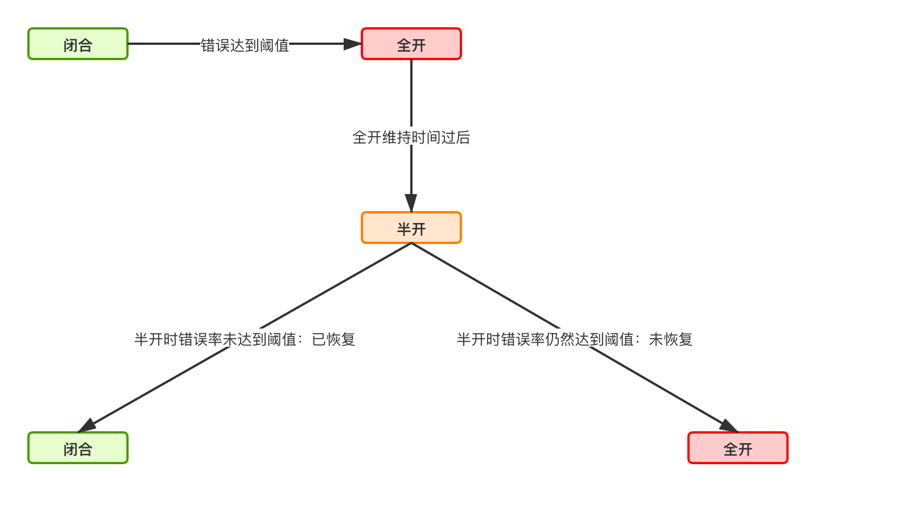

### SpringBoot整合Resilience4j

#### (一). Resilience4j简单介绍

Resilience4j 是受Netflix的Hysrix项目启发，专门为**Java 8 和函数式编程**设计的轻量级**容错框架**。Resilicenes4j 仅使用了一个第三方开源库Vavr，Vavr不依赖其他库。Resilience4j 按模块发布，可以有选择的使用其中某些功能而无需引入全部的Resilience4j 组件，提供了如下几款核心组件：

* resilience4j-circuitbreaker ==> 限流器

- resilience4j-ratelimiter ==> QPS限流器
- resilience4j-bulkhead  ==> 并发限流器
- resilience4j-retry ==> 重试器
- resilience4j-cache ==> 缓存工具类


SpringBoot整合Resilience4j方式很简单，只要引入下面spring-boot依赖即可【原理是自动配置】

```xml
<dependency>
    <groupId>io.github.resilience4j</groupId>
    <artifactId>resilience4j-spring-boot2</artifactId>
    <version>1.5.0</version>
</dependency>
```


#### (二). 熔断器原理和使用

##### 原理说明

```java
-- EventConsumerRegistry接口 ==> 创建EventConsumer事件消费者。
  核心方法：createEventConsumer, getEventConsumer
  -- DefaultEventConsumerRegistry


-- EventConsumer接口 ==> 事件消费者
  核心方法： void consumeEvent(T event);
  -- CircularEventConsumer


-- CircuitBreakerRegistry接口 ==> 熔断器注册器接口,用于创建熔断器
  核心接口：public CircuitBreaker circuitBreaker(...)
  -- InMemoryCircuitBreakerRegistry


-- CircuitBreaker接口 ==> 熔断器
  CircuitBreaker#State: 熔断器状态枚举- DISABLED, METRICS_ONLY, CLOSED, OPEN, FORCED_OPEN, HALF_OPEN
  CircuitBreaker#StateTransition: 熔断器状态转换的所有情况枚举 - CLOSED_TO_OPEN,...

  -- CircuitBreakerStateMachine ==> 熔断器状态机
    核心方法：isCallPermitted, onSuccess, onError


-- CircuitBreakerState接口 ==> 熔断器状态
  核心接口：onError， onSuccess， tryAcquirePermission， 
  -- ClosedState, OpenState, HalfOpenState...


-- CircuitBreaker.Metrics接口 ==> 主要用来计算度量熔断器的各种指标
  -- CircuitBreakerMetrics


-- CircuitBreaker.EventPublisher接口 ==> 发布熔断器事件
  核心接口：onSuccess, onError, onStateTransition
    -- EventProcessor ==> 存储EventConsumer
      -- CircuitBreakerEventProcessor ==> 熔断器事件处理器


-- CircuitBreakerEvent接口 ==> 熔断器事件
  CircuitBreakerEvent#Type枚举：ERROR, IGNORED_ERROR, SUCCESS, NOT_PERMITTED, STATE_TRANSITION, RESET, FORCED_OPEN, DISABLED, FAILURE_RATE_EXCEEDED, SLOW_CALL_RATE_EXCEEDED
  
  -- AbstractCircuitBreakerEvent 
    属性：String circuitBreakerName; ZonedDateTime creationTime;

    -- CircuitBreakerOnSuccessEvent, CircuitBreakerOnErrorEvent, CircuitBreakerOnCallNotPermittedEvent, 


-- CircuitBreakerConfig ==> 熔断器配置类


自动配置说明：CircuitBreakerAutoConfiguration
自动配置的类：
  EventConsumerRegistry ==> new DefaultEventConsumerRegistry<>();
  RegistryEventConsumer ==> new CompositeRegistryEventConsumer
  CircuitBreakerRegistry ==> 【依赖EventConsumerRegistry, RegistryEventConsumer】
  CircuitBreakerAspect ==> 熔断器切面类【拦截@CircuitBreaker注解对应的方法】

CircuitBreakerAspect入口类说明：CircuitBreaker#decorateCheckedSupplier
    static <T> CheckedFunction0<T> decorateCheckedSupplier(CircuitBreaker circuitBreaker,
        CheckedFunction0<T> supplier) {
        return () -> {
            circuitBreaker.acquirePermission();
            long start = System.nanoTime();
            try {
                T returnValue = supplier.apply();

                long durationInNanos = System.nanoTime() - start;
                circuitBreaker.onSuccess(durationInNanos, TimeUnit.NANOSECONDS);
                return returnValue;
            } catch (Exception exception) {
                // Do not handle java.lang.Error
                long durationInNanos = System.nanoTime() - start;
                circuitBreaker.onError(durationInNanos, TimeUnit.NANOSECONDS, exception);
                throw exception;
            }
        };
    }


```


**熔断器核心状态**：

* 闭合状态：请求可以正常执行，执行错误时需要统计错误率来切换状态。

* 半打开状态：部分请求可以执行，另一部分请求直接报错【CallNotPermittedException】。执行成功和失败时需要统计错误率来切换状态。

* 打开状态：请求直接报错【CallNotPermittedException】。

  


**状态的流转过程：**

* 闭合状态 ==> 打开状态：当请求错误率累计达到配置阈值【failureRateThreshold，默认50%】时候，熔断器切换到打开状态。
* 打开状态 ==> 半开状态：自动切换配置，【waitDurationInOpenState】指定打开到半开状态等待的时间。
* 半开状态 ==> 打开状态：半开状态时，错误率仍然达到错误阈值，切换到打开状态。
* 半开状态 ==> 闭合状态：半开状态时，错误率未达到错误阈值，切换到闭合状态。




##### 基本使用

```yml
resilience4j.circuitbreaker:
  configs:
    default: # 基础配置
      slidingWindowSize: 100  # 滑动窗口
      minimumNumberOfCalls: 10 # 最小调用次数，然后之后调用才会统计错误率
      permittedNumberOfCallsInHalfOpenState: 20 # 半闭合状态可以调用的次数
      automaticTransitionFromOpenToHalfOpenEnabled: true # 是否开启自动转换: 打开状态 ==> 半关闭
      waitDurationInOpenState: 1s # 打开状态到半关闭
      failureRateThreshold: 50 # 失败比率阈值
      eventConsumerBufferSize: 10
      ignoreExceptions: # 忽略业务异常，不记录
        - com.future.exception.CartException       
  instances:
    CartAPI:
      baseConfig: default
    UserAPI#:
      baseConfig: default
    ShopAPI#:
      baseConfig: default
    ItemAPI#:
      baseConfig: default
    PromotionAPI#:
      baseConfig: default

```

```java

/*
 * 熔断降级的目的：发生系统异常时候【例如超时】，防止加大对上游业务的调用，需要配置沉默调用。
 * 熔断器需要忽略业务异常的情况，只针对系统异常进行熔断处理。
 * 对于可降级业务，可以配置fallbackMethod指定返回默认对象。
 *
 * 写接口：转转换业务异常并只配置熔断器，防止加大上游系统压力。【不可降级】
 * 读接口：
 *    可降级：使用fallback方法统一处理异常情况返回结果
 *    不可降级：转换业务异常并只配置熔断器，防止加大上游系统压力。
 */
@Service
public class XXXService {
  
    @Autowired
    private CircuitBreakerRegistry circuitBreakerRegistry;

    
    // 调用目标方法失败，会转到调用fallbackTest()方法
    @CircuitBreaker(name = "CartAPI", fallbackMethod = "fallbackTest")
    public String test02(int i) {
        log.info("Calc:{}", 100 / i);
        return "good";
    }

    public String fallbackTest(int i, Throwable throwable) {    
      
        // 获取对应的限流器【使用了缓存】
        CircuitBreaker circuitBreaker = circuitBreakerRegistry.circuitBreaker(name);
      
        // 触发熔断调用失败
        if (throwable instanceof CallNotPermittedException) {
          ...
        }

        return "fallback";
    }
}
```


#### (三). 限流器原理和使用

##### 原理说明

```java
-- RateLimiterRegistry接口 ==> 限流器注册器用于创建限流器
  -- InMemoryRateLimiterRegistry

-- RateLimiter接口 ==> 限流器接口
  核心方法：
    default <T> T executeCheckedSupplier(CheckedFunction0<T> checkedSupplier) throws Throwable 
    public boolean acquirePermission(final int permits)

  -- AtomicRateLimiter ==> 令牌桶算法【默认使用】
    属性说明：
      private static final long nanoTimeStart = nanoTime(); // 限流器启动时系统时间(纳秒)
      private final String name; // 限流器名称
      private final AtomicInteger waitingThreads; // 等待线程数
      private final AtomicReference<State> state; // 限流器状态
      private final RateLimiterEventProcessor eventProcessor; // 事件处理器

  -- SemaphoreBasedRateLimiter ==> 信号量机制


自动配置说明：RateLimiterAutoConfiguration  ==> RateLimiterAspect

RateLimiterAspect#rateLimiterAroundAdvice切面类入口说明：  
// RateLimiter#decorateCheckedSupplier
static <T> CheckedFunction0<T> decorateCheckedSupplier(RateLimiter rateLimiter, int permits, CheckedFunction0<T> supplier) {
    return () -> {
        waitForPermission(rateLimiter, permits);
        return supplier.apply();
    };
}

AtomicRateLimiter#acquirePermission实现原理说明：
  每个limitRefreshPeriod间断会生成limitForPeriod个请求票据, 每次请求都会查看当前周期中的票据是否够用，如果够用直接跟新票据数量，并返回获取票据成功；如果当前周期是最新周期，会根据上个票据周期生成最新票据，并执行票据更新操作，返回获取票据成功；如果票据当前周期票据不足，和根据timeoutDuration超时时间来判断，超时时间内是否可以获取票据，如果不能获取等待对应超时时间并返回获取票据失败，如果可以获取，等待对应时间，然后返回获取票据成功

```


##### 基本使用

```yml
resilience4j.ratelimiter:
  configs:
    default:
      limitForPeriod: 50 # 周期内允许通过的请求数量
      limitRefreshPeriod: 20ms # 限流周期时长
      timeoutDuration: 0 # 超时时间
  instances:
    cart:
      baseConfig: default

```

```java
@GetMapping("cart")
@RateLimiter(name = "cart")
public String getCart(){
    return "success";
}
```


