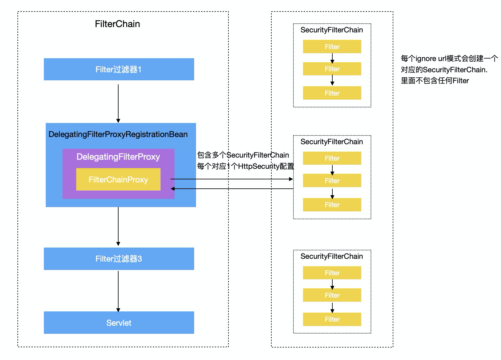

### SpringBoot整合Security

Spring Security是一个提供身份验证，授权和保护以防止常见攻击的框架。凭借对命令式和响应式应用程序的一流支持，它是用于保护基于Spring的应用程序的事实上的标准。

官方网站地址：https://docs.spring.io/spring-security/site/docs/5.4.1/reference/html5/#introduction


#### (一). Security自动配置原理

##### 自动配置原理

```JAVA
SecurityAutoConfiguration:
  i). 自动配置认证事件发布器: DefaultAuthenticationEventPublisher
  ii). 引入3个配置类：
    SpringBootWebSecurityConfiguration：如果没有配置SpringSecurity对应的配置类WebSecurityConfigurerAdapter对应的Bean, 则使用默认配置【DefaultConfigurerAdapter】
    WebSecurityEnablerConfiguration: servlet环境引入注解@EnableWebSecurity
    SecurityDataConfiguration: spring data支持配置

@EnableWebSecurity注解说明：
  引入相关配置：WebSecurityConfiguration, SpringWebMvcImportSelector, OAuth2ImportSelector
    * WebSecurityConfiguration配置说明：
       setFilterChainProxySecurityConfigurer() ==> 通过配置类SecurityConfigurer创建WebSecurity
       springSecurityFilterChain() ==> 通过WebSecurity创建FilterChainProxy
    * SpringWebMvcImportSelector：注入配置WebMvcSecurityConfiguration 主要在mvc中加入对参数标有@AuthenticationPrincipal注解的支持
    * OAuth2ImportSelector: OAuth2配置支持

@EnableGlobalAuthentication注解说明: 【引入认证配置AuthenticationConfiguration】
localConfigureAuthenticationBldr【AuthenticationManagerBuilder】 ==> 首先配置configure设置SecurityConfigurerAdapter【用于生成AuthenticationProvider, 如DaoAuthenticationConfigurer】 然后通过AuthenticationManagerBuilder.build()，生成AuthenticationManager，并将配置中生成的AuthenticationProvider对象设置进去


SecurityFilterAutoConfiguration自动配置类：
  自动配置bean: DelegatingFilterProxyRegistrationBean在容器启动时候创建对应的DelegatingFilterProxy【内部代理目标beanname[springSecurityFilter] 和webApplicationConxtext】 
  
-- DelegatingFilterProxyRegistrationBean类
  核心方法：//
    public DelegatingFilterProxy getFilter();

-- DelegatingFilterProxy类【实现Filter接口】
  核心属性:
	  private WebApplicationContext webApplicationContext;
	  private String targetBeanName;
  核心方法:
    // 使用容器获取对应目标targetBean【springSecurityFilterChain】，
    // 在执行代理过滤器链【FilterChainProxy】
    public void doFilter(ServletRequest request, ServletResponse response, FilterChain filterChain)
    
    
-- SecurityFilterChain接口 ==> spring Security过滤器链接口
  核心接口: 
    boolean matches(HttpServletRequest request);
    List<Filter> getFilters();
   -- DefaultSecurityFilterChain ==> 默认实现
 
-- WebSecurity ==> FilterChainProxy [springSecurityFilterChain]
  核心属性：
    // 忽略认证的URL请求
    private final List<RequestMatcher> ignoredRequests = new ArrayList<>();

    // 配置对象
    private final LinkedHashMap<Class<? extends SecurityConfigurer<O, B>>, List<SecurityConfigurer<O, B>>> configurers = new LinkedHashMap<>();

    // HttpSecurity配置类
    private final List<SecurityBuilder<? extends SecurityFilterChain>> securityFilterChainBuilders = new ArrayList<>();

  核心方法：
    // springSecurityFilterChain【FilterChainProxy】 
    // 配置入口： init() ==> configure() ==> performBuild
    public final O build(); 

   创建大致流程
     i). init() ==> getHttp(): 初始化HttpSecurity，配置各种Configurer
     ii). configure ==> 空方法
     iii).performBuild() ==> 把所有过滤的url封装成多个SecurityFilterChain，然后每个HttpSecurity【执行build()方法】封装成一个SecurityFilterChain【里面包含filter】,最后把这些SecurityFilterChain封装到FilterChainProxy中.

   

-- HttpSecurity配置类
  核心属性：
    // 原生SevletFilter【每个Configurer 在执行build()方法的时候回创建对应的Filter】
    private List<Filter> filters = new ArrayList<>();

    // 配置对象：CorsConfigurer, ExceptionHandlingConfigurer, LogoutConfigurer...
    LinkedHashMap<Class<? extends SecurityConfigurer<O, B>>, List<SecurityConfigurer<O, B>>> configurers = new LinkedHashMap<>();

  核心方法：
    build(): 将Configurer配置的对象转换为对应的Filter
    
    
@EnableGlobalMethodSecurity注解说明： 
注入GlobalMethodSecuritySelector ==> GlobalMethodSecurityAspectJAutoProxyRegistrar
最终会创建方法拦截处理器：MethodSecurityInterceptor，用于拦截认证请求
       
```


##### 拦截器原理



核心SecurityFilter说明：

* UsernamePasswordAuthenticationFilter：用于用户登录认证过滤
* BasicAuthenticationFilter：用户认证过滤器，判断token是否有效。
* ExceptionTranslationFilter：用于处理AccessDeniedException和AuthenticationException异常，并可以配置执行对应回调方法AuthenticationEntryPoint和AccessDeniedHandler方法。固定倒数第二个过滤器位置
* FilterSecurityInterceptor：用于处理配置的请求认证url是否包含指定权限。如果认证失败，会被ExceptionTranslationFilter捕获异常进行处理。处于最后一个拦截器


#### (二). SpringSecurity登录认证

##### 认证流程

核心类：UsernamePasswordAuthenticationFilter

```
第一步：获取请参数参数，username, password
第二步：执行attemptAuthentication方法进行尝试认证，并返回认证实体或者抛出异常
  1). 使用AuthenticationManager【含多个AuthenticationProvider】进行认证过程
  ii).然后依次调用AuthenticationProvider进行流程校验，校验成功返回认证实体Authentication，否则抛出异常
第三步：如果认证失败异常，则执行unsuccessfulAuthentication方法处理异常。如果认证成功则执行successfulAuthentication方法
```


##### 认证相关API

```java
-- AuthenticationManager ==> 认证管理器
  核心接口：
    Authentication authenticate(Authentication authentication);
  
  -- ProviderManager实现类
    核心属性：private List<AuthenticationProvider> providers = Collections.emptyList();


-- AuthenticationProvider ==> 认证提供者
  核心方法：
    Authentication authenticate(Authentication authentication); // 认证过程
    boolean supports(Class<?> authentication); // 策略适配

    -- AbstractUserDetailsAuthenticationProvider抽象类
        // 通过retrieveUser抽象方法获取用户信息，并执行用户校验【是否过期，是否锁定，使用有效】
        // 校验通过的用户对象会封装成对应的认证信息UsernamePasswordAuthenticationToken
      	Authentication authenticate(Authentication authentication)

      -- DaoAuthenticationProvider实现类
        核心属性：
          UserDetailsService userDetailsService;
          private PasswordEncoder passwordEncoder;
        
        核心方法： 
          // 通过userDetailsService获取对应的用户信息
          UserDetails retrieveUser(String username,UsernamePasswordAuthenticationToken xxx)


-- UserDetailsService接口 ==> 加载用户信息
  核心接口: 
    UserDetails loadUserByUsername(String username) throws UsernameNotFoundException;


-- UserDetails接口 ==> 认证用户信息
  核心接口: 
    Collection<? extends GrantedAuthority> getAuthorities();
    String getPassword();
    String getUsername();
    boolean isAccountNonExpired();
    boolean isAccountNonLocked();
    boolean isCredentialsNonExpired();
    boolean isEnabled();


-- Authentication接口 ==> 认证实体
  核心方法: 
    Object getPrincipal(); // 认证主体-User
    Object getCredentials(); // 认证凭据-密码
    Collection<? extends GrantedAuthority> getAuthorities(); // 认证权限
    Object getDetails();
    boolean isAuthenticated();
    void setAuthenticated(boolean isAuthenticated); 

    -- AbstractAuthenticationToken 
      属性：
       private final Collection<GrantedAuthority> authorities;
	   private Object details;
	   private boolean authenticated = false;

	  -- UsernamePasswordAuthenticationToken
	    属性：
	      private final Object principal; // 凭证
	      private Object credentials;  // 密码

```


#### (三). SpringSecurity 方法授权流程

##### 内置表达式使用

* hasRole(String role)：  返回`true`当前委托人是否具有指定角色。
* hasAnyRole(String… roles)：返回`true`当前委托人是否具有提供的任何角色（以逗号分隔的字符串列表形式）。
* hasAuthority(String authority)：如果当前主体具有指定的权限，则返回true
* hasAnyAuthority(String… authorities)： 返回`true`当前委托人是否具有任何提供的授权（以逗号分隔的字符串列表形式）
* principal： 允许直接访问代表当前用户的主体对象
* authentication：允许直接访问`Authentication`从`SecurityContext`
* permitAll：总可以访问
* denyAll：总不可以访问
* isAnonymous()：返回`true`当前委托人是否为匿名用户
* isAuthenticated()：如果用户不是匿名的，则返回true


##### 方法安全性表达式

```java
// 1.开启注解功能
@EnableGlobalMethodSecurity(prePostEnabled = true)
public class SecurityConfig extends WebSecurityConfigurerAdapter {
    // ...
}


// 2.方法使用
@RestController
@Api("权限菜单管理模块")
@RequestMapping("permission")
public class PermissionController {
   
    @ApiOperation("更新权限项")
    @PreAuthorize("hasAuthority('permission@update')")
    @RequestMapping(value = "/update", method = RequestMethod.POST)
    public APIResult<String> updatePermission(@RequestBody PermissionUpdateRequest request) {

        return APIResult.success();
    }
}

// 3.原理说明：注入GlobalMethodSecuritySelector ==> GlobalMethodSecurityAspectJAutoProxyRegistrar
// GlobalMethodSecurityAspectJAutoProxyRegistrar会创建方法拦截处理器：MethodSecurityInterceptor，用于拦截认证请求
class MethodSecurityInterceptor {
    public Object invoke(MethodInvocation mi) throws Throwable {
		
        // 前置拦截
        InterceptorStatusToken token = super.beforeInvocation(mi);
		    Object result;
		    try {
          // 目标方法执行
			    result = mi.proceed();
		    }
		    finally {
			    super.finallyInvocation(token);
		    } 
    
        // 后置拦截
		    return super.afterInvocation(token, result);
	    }
}

```


