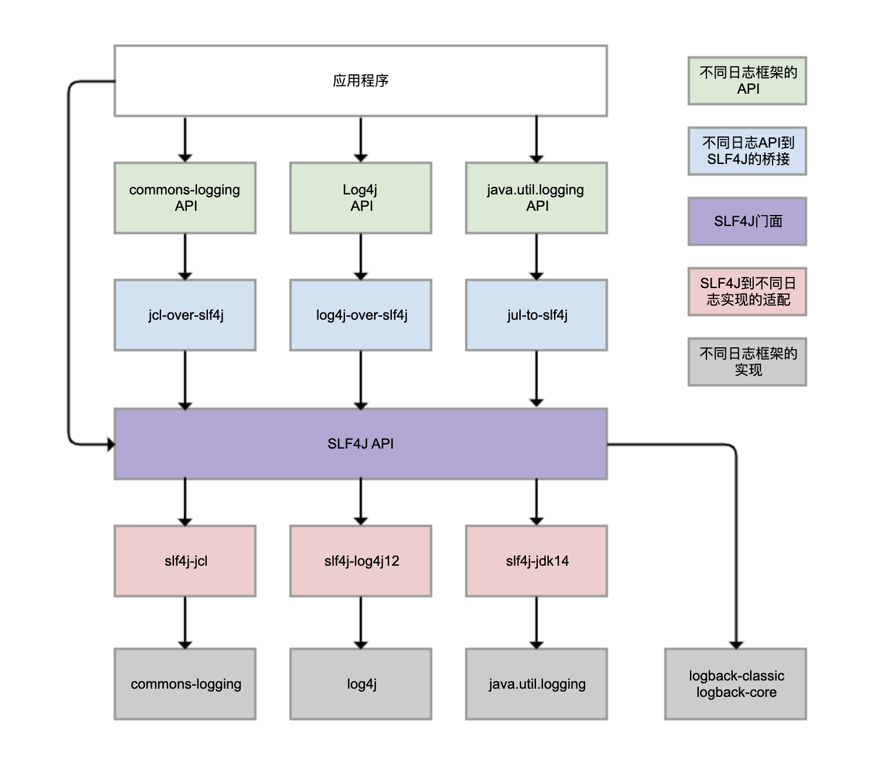
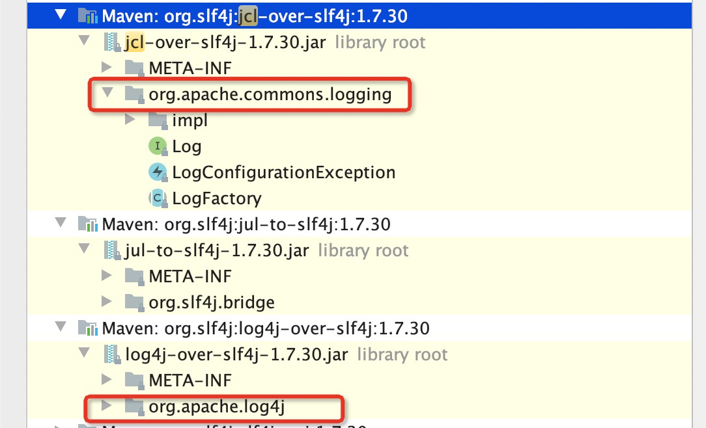
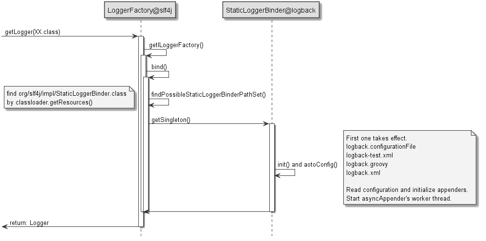
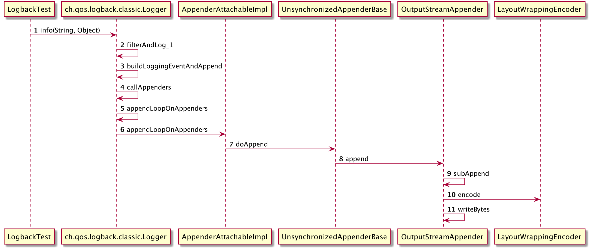
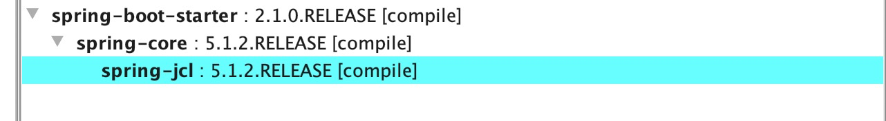
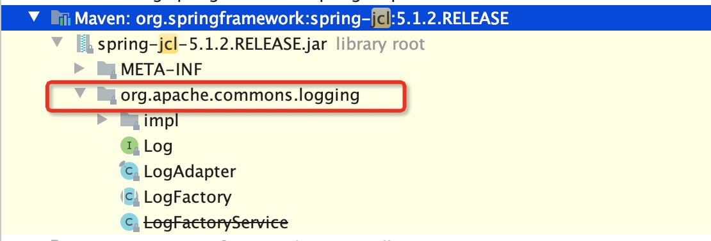

### Java日志框架详解

我们知道Java日志体系很多,  JDK自带一个实现java.util.logging；apache提供的有commons-longging, log4j, log4j2等；jboss提供有Jboss-logging包；Mybatis使用自定义日志实现等。对于应用来说，我们使用的jar包很多，里面的依赖的日志包也是各式各样。比如spring5之前使用的日志框架就是apache-commons-logging接口，hibernate使用的是jboss-logging等，做日志的统一管理就变得非常困难。所以大神Michael Glauche为了统一Java日志规范，定义一套SLF4J【日志门面】和其标准实现Logback。


#### (一). SLF4J统一日志



SLF4J 实现了三种功能：

* 一是提供了统一的日志门面 API，即图中紫色部分，实现了中立的日志记录 API。
* 二是桥接功能，即图中蓝色部分，用来把各种日志框架的 API（图中绿色部分）桥接到 SLF4J API。这样一来，即便你的程序中使用了各种日志 API 记录日志，最终都可以桥接到 SLF4J 门面 API。
* 三是适配功能，即图中红色部分，可以实现 SLF4J API 和实际日志框架（图中灰色部分）的绑定。SLF4J 只是日志标准，我们还是需要一个实际的日志框架。日志框架本身没有实现 SLF4J API，所以需要有一个前置转换。Logback 就是按照 SLF4J API 标准实现的，因此不需要绑定模块做转换。


##### 统一日志门面API

```java
-- LoggerFactory类
  核心方法：
  // 1.如果存在org.slf4j.impl.StaticLoggerBinder类,就会使用LoggerFactoryBinder#getSingleton()#getLoggerFactory();获取日志工厂类
  // 2.如果没有StaticLoggerBinder，就会使用NOPLoggerFactory生产logger【所有方法实现都是空的】
  // 3.如果存在多个StaticLoggerBinder类【类路径包含多个slf4j的实现类】，会打印告警信息，这个时候生效的日志实现不确定，取决于类加载顺序。
  public static ILoggerFactory getILoggerFactory()
  

-- ILoggerFactory接口
  核心方法：public Logger getLogger(String name);
  -- ch.qos.logback.classic.LoggerContext ==> LogBack日志工厂实现【logback-classic.xxx.jar】
  -- org.slf4j.impl.Log4jLoggerFactory ==> log4j日志工厂实现【slf4j-log4j12.xxx.jar】
    

-- Logger接口  
  // 判断日志级别
  public boolean isDebugEnabled/isInfoEnabled/isWarnEnabled/isErrorEnabled();

  // 打印日志
  public void trace/debug/info/warn/error(String format, Object... arguments);

```


#####日志桥接到SLF4J

日志桥接的目的：用来把各种日志框架的 API桥接到 SLF4J API。

桥接作用：应用包含很多日志实现，Log4j, JUL,JCL都有自己的Logger API。如果想要实现日志输出功能就必须配置几套不同日志配置文件。如果把这些日志API都桥接到SLF4J的Logger那么就可以统一管理日志。

日志桥接做法：其实就是定义一套新的Logger API覆盖老的API。然后在新API包，对Logger接口实现使用Slf4j的Logger实现包装，底层使用slf4J的Logger进行日志操作。




```java
// apache commons longging ==> 日志桥接方式
// 举例：Log log = LogFactory.getLog(xxx.Class);
public abstract class LogFactory {
    // 指定LogFActory的日志工厂实现为SLF4JLogFactory
    static LogFactory logFactory = new SLF4JLogFactory();
  
    public static LogFactory getFactory() throws LogConfigurationException {
        return logFactory;
    }
}

// 创建Logger对象，实际上就是SLF4JLog类包装Slf4J包中的Logger对象。这样其他日志都有对应Slf4j Logger对象
public class SLF4JLogFactory extends LogFactory {
  
  public Log getInstance(String name) throws LogConfigurationException {
        Log instance = loggerMap.get(name);
        if (instance != null) {
            return instance;
        } else {
            Log newInstance;
            // 使用SLF4j的LoggerFactory.getLogger
            Logger slf4jLogger = LoggerFactory.getLogger(name);
            if (slf4jLogger instanceof LocationAwareLogger) {
                newInstance = new SLF4JLocationAwareLog((LocationAwareLogger) slf4jLogger);
            } else {
                newInstance = new SLF4JLog(slf4jLogger);
            }
            Log oldInstance = loggerMap.putIfAbsent(name, newInstance);
            return oldInstance == null ? newInstance : oldInstance;
        }
    }
}

// SLF4JLog ==> 包装了Slf4J中的Logger对象
public class SLF4JLog implements Log, Serializable {
    // used to store this logger's name to recreate it after serialization
    protected String name;

    // Slf4j对应的日志API
    private transient Logger logger;
}

```


#####日志实现适配

日志适配用于解决：SLF4J API 和实际日志框架的绑定。SLF4J只提供日志接口规范，具体实现可以使用log4J, log4j2, JUL, Logback【默认实现】。对于log4j，我们内部没有Logger对应的API， 我们需要使用适配层，内部使用log4jAPI进行日志实现。


```java

public class Log4jLoggerFactory implements ILoggerFactory {
  
  // 创建slf4j的Logger适配实现，底层委托log4j
  public Logger getLogger(String name) {
        Logger slf4jLogger = loggerMap.get(name);
        if (slf4jLogger != null) {
            return slf4jLogger;
        } else {
            org.apache.log4j.Logger log4jLogger;
            if (name.equalsIgnoreCase(Logger.ROOT_LOGGER_NAME))
                log4jLogger = LogManager.getRootLogger();
            else
                log4jLogger = LogManager.getLogger(name);

            Logger newInstance = new Log4jLoggerAdapter(log4jLogger);
            Logger oldInstance = loggerMap.putIfAbsent(name, newInstance);
            return oldInstance == null ? newInstance : oldInstance;
        }
    }
}

// Logger适配器层，实现Slf4j的LocationAwareLogger接口
// 底层所有实现都是委托1og4j的Logger对象进行操作
public final class Log4jLoggerAdapter extends MarkerIgnoringBase implements LocationAwareLogger, Serializable {
    
    final transient org.apache.log4j.Logger logger;
  
    // 委托给log4j的Logger进行处理
    public boolean isTraceEnabled() {
        if (traceCapable) {
            return logger.isTraceEnabled();
        } else {
            return logger.isDebugEnabled();
        }
    }
  
   ...  
}
```


#### (二). Logback源码分析

#####Logback API相关设计

**日志等级**

```java
-- Logback@Level类 ==> 日志等级，优先级 TRACE < DEBUG < INFO < WARN < ERROR。
    public static final int OFF_INT = Integer.MAX_VALUE;
    public static final int ERROR_INT = 40000;
    public static final int WARN_INT = 30000;
    public static final int INFO_INT = 20000;
    public static final int DEBUG_INT = 10000;
    public static final int TRACE_INT = 5000;
    public static final int ALL_INT = Integer.MIN_VALUE;

```


**日志工厂**

Logback@LoggerContext：日志工厂类，用来创建Logger对象。构造器中创建了ROOT根日志对象，并指定默认日志级别为DEBUG。

```java
public LoggerContext() {
    ...
    // 创建ROOT根对象并指定根日志级别
    this.root = new Logger(Logger.ROOT_LOGGER_NAME, null, this);
    this.root.setLevel(Level.DEBUG);     
}
```


**Logger日志**

Logback@Logger：Logger是日志对象，用来记录日志的。日志对象是一个树结构，所有Logger的根对象都是

```java
-- ch.qos.logback.classic.Logger类 ==> Slf4j的Logger实现类
  核心属性: 
    Logger parent; ==> 每个Logger都有对应的父Logger,顶层的是ROOT Logger对象
    int effectiveLevelInt;==> Logger配置打印级别，没有继承父Logger
    private List<Logger> childrenList; ==> 所有的子Logger
    private AppenderAttachableImpl<ILoggingEvent> aai; ==> 配合的Appender追加器
```


**Filter日志过滤器**

Logback@Filter：Filter是logback的日志过滤器，用来决定是否输出日志。

Logback有两种类型的Filter，分别叫做Turbo filters 和 Regular Filters。其主要区别在于作用范围不同， Turbo filters是作用于全局的，而Regular Filters是需要和具体的Appender绑定在一起的。

```java
-- FilterReply枚举 ==> 日志过滤结果枚举
   DENY ==> 拒绝; NEUTRAL ==> 中立; ACCEPT==> 通过

-- ch.qos.logback.core.filter.Filter抽象类 ==> 作用域跟绑定它的Appender的作用域一致
  抽象接口：public abstract FilterReply decide(E event);
  -- LevelFilter类 ==> // 只有日志level精确匹配LevelFilter配置的Level值才打印日志
    @Override
    public FilterReply decide(ILoggingEvent event) {
        if (!isStarted()) {
            return FilterReply.NEUTRAL;
        }

        if (event.getLevel().equals(level)) {
            return onMatch;
        } else {
            return onMismatch;
        }
    }


  -- ThresholdFilter类  ==>  //当日志记录Level值>=hresholdFilter配置的Level值才打印日志
    @Override
    public FilterReply decide(ILoggingEvent event) {
        if (!isStarted()) {
            return FilterReply.NEUTRAL;
        }
        if (event.getLevel().isGreaterOrEqual(level)) {
            return FilterReply.NEUTRAL;
        } else {
            return FilterReply.DENY;
        }
    }

	
-- ch.qos.logback.classic.turbo.TurboFilter抽象类 ==> 
  抽象接口：abstract FilterReply decide(...);

  -- DuplicateMessageFilter类(去除重复日志)	
   @Override
   public FilterReply decide(Marker marker, Logger logger, Level level, String format, Object[] params, Throwable t) {
       int count = msgCache.getMessageCountAndThenIncrement(format);
       if (count <= allowedRepetitions) {//配置允许重复次数
           return FilterReply.NEUTRAL;
       } else {
           return FilterReply.DENY;
       }
   }

```


**Appender追加器**

Appender追加器作用是控制日志输出的目的地。你可以把日志输出到console、file、remote socket server、MySQL或者其它的存储中间件中，每个Logger日志可以具有多个Appender追加器。

```java
-- Appender接口 ==> 日志追加器
  核心接口：void doAppend(E event) throws LogbackException;

  -- UnsynchronizedAppenderBase抽象类
    抽象方法：abstract protected void append(E eventObject);
    public void doAppend(E eventObject) {
       ...
       // getFilterChainDecision ==> Filter集合中只要有一个满足DENY或者ACCEPT，就返回对应结果。
       // 如果filter结果是拒接，则直接return,不打印日志
       if (getFilterChainDecision(eventObject) == FilterReply.DENY) {
                return;
       }
       // ok, we now invoke derived class' implementation of append
       this.append(eventObject);
    }

	  -- OutputStreamAppender类
       核心属性：private OutputStream outputStream; protected Encoder<E> encoder;
      
      -- ConsoleAppender类
        OutputStream outputStream = System.out;

	    -- FileAppender类
        // 是一种BufferedOutputStream
        OutputStream outputStream = = new ResilientFileOutputStream 
        
	      -- RollingFileAppender类 ==> 增加日志滚动功能
        
    -- AsyncAppenderBase类  ==> 异步追加器
        核心属性：
          BlockingQueue<E> blockingQueue;
          int queueSize 
          int discardingThreshold = UNDEFINED;
          boolean neverBlock = false;

	    -- AsyncAppender ==> 包装器，包装其他追加器，然后增加异步打印功能
        属性：boolean includeCallerData = false;        
```


**Layouts/Encoder格式化和编码器**

每个Appender追加器中都有对应的Encoder编码器，使用它对日志进行字符到字节的转换。字符处理过程中又需要使用Layout编排器对日志字符串进行处理，例如将指定模式的日志转换成指定值：`"[%d{yyyy-MM-dd HH:mm:ss}] [%p] [%X{sentryTraceId}] [%thread] [%X{loginname}] %logger{50} - %msg%n"`      ==>`[2020-08-14 23:07:47] [INFO] [QEq6XuYf00] [http-nio-8080-exec-127] [c.g.s.aspect.ValidateParamsAspect] Line:[96] - 用户请求日志`。


```java
-- Encoder接口 ==> 日志编码
  核心接口方法：byte[] encode(E event);
  -- EncoderBase抽象类
    -- LayoutWrappingEncoder类
	    核心属性：Layout<E> layout，Charset	
    
      public byte[] encode(E event) {
        String txt = layout.doLayout(event);
        return convertToBytes(txt);
      }

     private byte[] convertToBytes(String s) {
        if (charset == null) {
            return s.getBytes();
        } else {
            return s.getBytes(charset);
        }
      }
      
	    -- PatternLayoutEncoderBase抽象类 
	      核心属性：String pattern;

		    -- PatternLayoutEncoder类 ==> 作用就是生成patternLayout进行日志格式化布局
          
		 

-- Layout接口 ==> 日志格式化布局
  核心接口：String doLayout(E event);
  -- LayoutBase抽象类
    -- PatternLayoutBase抽象类
	    -- PatternLayout类 ==> 模式格式化日志字符
        属性：包含各种converter用于解析%xxx
       
    
```


##### Logback配置文件

```xml
<?xml version="1.0" encoding="UTF-8"?>
<configuration>
    <!--spring boot console配置-->
    <include resource="org/springframework/boot/logging/logback/defaults.xml" />
    <include resource="org/springframework/boot/logging/logback/console-appender.xml" />

    <property name="LOG_HOME" value="/logs/trade-service-consign"/>
    <property name="pattern" value="[%d{yyyy-MM-dd HH:mm:ss}] [%level] [%-22thread] [%logger{35}] Line:[%L] - %msg %n"/>
    <property name="trace_pattern" value="[%d{yyyy-MM-dd HH:mm:ss}] [%level] [%X{sentryTraceId}] [%-22thread] [%logger{35}] Line:[%L] - %msg %n"/>


    <!-- INFO日志APPENDER  -->
    <appender name="InfoLogAppender" class="ch.qos.logback.core.rolling.RollingFileAppender">
        <File>${LOG_HOME}/info.log</File>
        <rollingPolicy class="ch.qos.logback.core.rolling.TimeBasedRollingPolicy">
            <FileNamePattern>${LOG_HOME}/archive/info.%d{yyyy-MM-dd}.log</FileNamePattern>
            <maxHistory>10</maxHistory>
        </rollingPolicy>
        <encoder>
            <Pattern>${pattern}</Pattern>
        </encoder>
        <filter class="ch.qos.logback.classic.filter.LevelFilter"><!-- 只打印INFO日志 -->
            <level>INFO</level>
            <onMatch>ACCEPT</onMatch>
            <onMismatch>DENY</onMismatch>
        </filter>
    </appender>
    <appender name="AsyncInfoLogAppender" class="ch.qos.logback.classic.AsyncAppender">
        <discardingThreshold>0</discardingThreshold>
        <queueSize>512</queueSize>
        <appender-ref ref="InfoLogAppender"/>
        <includeCallerData>true</includeCallerData>
    </appender>


    <!-- WARN日志APPENDER  -->
    <appender name="WarnLogAppender" class="ch.qos.logback.core.rolling.RollingFileAppender">
        <File>${LOG_HOME}/warn.log</File>
        <rollingPolicy class="ch.qos.logback.core.rolling.TimeBasedRollingPolicy">
            <FileNamePattern>${LOG_HOME}/archive/warn.%d{yyyy-MM-dd}.log</FileNamePattern>
            <maxHistory>10</maxHistory>
        </rollingPolicy>
        <encoder>
            <Pattern>${pattern}</Pattern>
        </encoder>
        <filter class="ch.qos.logback.classic.filter.LevelFilter"><!-- 只打印WARN日志 -->
            <level>WARN</level>
            <onMatch>ACCEPT</onMatch>
            <onMismatch>DENY</onMismatch>
        </filter>
    </appender>
    <appender name="AsyncWarnLogAppender" class="ch.qos.logback.classic.AsyncAppender">
        <discardingThreshold>0</discardingThreshold>
        <queueSize>512</queueSize>
        <appender-ref ref="WarnLogAppender"/>
        <includeCallerData>true</includeCallerData>
    </appender>

    <!-- ERROR日志 APPENDER  -->
    <appender name="ErrorLogAppender" class="ch.qos.logback.core.rolling.RollingFileAppender">
        <File>${LOG_HOME}/error.log</File>
        <rollingPolicy class="ch.qos.logback.core.rolling.TimeBasedRollingPolicy">
            <FileNamePattern>${LOG_HOME}/archive/error.%d{yyyy-MM-dd}.log</FileNamePattern>
            <maxHistory>10</maxHistory>
        </rollingPolicy>
        <encoder>
            <Pattern>${pattern}</Pattern>
        </encoder>
        <filter class="ch.qos.logback.classic.filter.LevelFilter"><!-- 只打印ERROR日志 -->
            <level>ERROR</level>
            <onMatch>ACCEPT</onMatch>
            <onMismatch>DENY</onMismatch>
        </filter>
    </appender>


    <!-- ACCESS 日志 APPENDER  -->
    <appender name="AccessLogAppender" class="ch.qos.logback.core.rolling.RollingFileAppender">
        <File>${LOG_HOME}/access.log</File>
        <rollingPolicy class="ch.qos.logback.core.rolling.TimeBasedRollingPolicy">
            <FileNamePattern>${LOG_HOME}/archive/access.%d{yyyy-MM-dd}.log</FileNamePattern>
            <maxHistory>10</maxHistory>
        </rollingPolicy>
        <encoder>
            <Pattern>${trace_pattern}</Pattern>
        </encoder>
    </appender>

    <appender name="AsyncAccessLogAppender" class="ch.qos.logback.classic.AsyncAppender">
        <discardingThreshold>0</discardingThreshold>
        <queueSize>512</queueSize>
        <appender-ref ref="AccessLogAppender"/>
        <includeCallerData>true</includeCallerData>
    </appender>

    <!-- SLOW_SQL 日志 APPENDER  -->
    <appender name="SlowLogAppender" class="ch.qos.logback.core.rolling.RollingFileAppender">
        <File>${LOG_HOME}/slow.log</File>
        <rollingPolicy class="ch.qos.logback.core.rolling.TimeBasedRollingPolicy">
            <FileNamePattern>${LOG_HOME}/archive/slow.%d{yyyy-MM-dd}.log</FileNamePattern>
            <maxHistory>10</maxHistory>
        </rollingPolicy>
        <encoder>
            <Pattern>${pattern}</Pattern>
        </encoder>
        <filter class="ch.qos.logback.classic.filter.LevelFilter">
            <level>ERROR</level>
            <onMatch>ACCEPT</onMatch>
            <onMismatch>DENY</onMismatch>
        </filter>
    </appender>


    <!-- listener消息日志Appender-->
    <appender name="MessageLogAppender" class="ch.qos.logback.core.rolling.RollingFileAppender">
        <File>${LOG_HOME}/message.log</File>
        <rollingPolicy class="ch.qos.logback.core.rolling.TimeBasedRollingPolicy">
            <FileNamePattern>${LOG_HOME}/archive/message.%d{yyyy-MM-dd}.log</FileNamePattern>
            <maxHistory>10</maxHistory>
        </rollingPolicy>
        <encoder>
            <Pattern>${pattern}</Pattern>
        </encoder>
    </appender>
    <appender name="MessageLogAsyncAppender" class="ch.qos.logback.classic.AsyncAppender">
        <discardingThreshold>0</discardingThreshold>
        <queueSize>512</queueSize>
        <appender-ref ref="MessageLogAppender"/>
        <includeCallerData>true</includeCallerData>
    </appender>

    <!-- logger -->
    <logger name="com.ggj.trade.consign.config.aspect.DubboServiceFilter" additivity="false" level="debug">
        <appender-ref ref="AsyncAccessLogAppender"/>
        <springProfile name="dev">
            <appender-ref ref="CONSOLE"/>
        </springProfile>
    </logger>


    <logger name="com.alibaba.druid.filter.stat.StatFilter" additivity="false" level="error">
        <appender-ref ref="SlowLogAppender"/>
    </logger>

    <logger name="com.ggj.trade.consign.ons" additivity="false" level="info">
        <springProfile name="dev">
            <appender-ref ref="CONSOLE"/>
        </springProfile>
        <appender-ref ref="MessageLogAsyncAppender"/>
    </logger>


    <!-- INFO日志过多的第三方依赖,可以配置只打印ERROR日志-->
    <logger name="com.ggj.platform.xconf" level="ERROR"/>
    <logger name="com.alibaba.dubbo" level="ERROR"/>
    <logger name="com.ggj.platform.sentry.guarder" level="ERROR"/>

    <!-- 开发环境打印SQL语句 -->
    <springProfile name="dev">
        <logger name="com.ggj.trade.consign.mapper" level="DEBUG" />
    </springProfile>

    <root level="INFO">
        <springProfile name="dev">
            <appender-ref ref="CONSOLE"/>
        </springProfile>
        <appender-ref ref="AsyncInfoLogAppender"/>
        <appender-ref ref="AsyncWarnLogAppender"/>
        <appender-ref ref="ErrorLogAppender"/>
    </root>
</configuration>

```


#####  Logback初始化过程

代码入口：`LoggerFactory#getILoggerFactory`





```java
-- LoggerFactoryBinder接口
    核心接口：public ILoggerFactory getLoggerFactory();

  -- LogBack-StaticLoggerBinder实现类
    // ILoggerFactory实现类
    属性：private LoggerContext defaultLoggerContext = new LoggerContext(); 
    
    // 类静态初始化的时候会进行Logback初始化逻辑。
    StaticLoggerBinder#init() 
      
     第一步：logback从指定位置获取logback配置文件。依次是：
       i).系统配置“logback.configurationFile” 
       ii).logback.groovy资源文件
       iii).资源文件logback-test.xml资源文件 ==> 
       iv).logback.xml资源文件
      
     第二步：如果资源还没有，创建一个基础配置。打印日志到控制台配置 ==> BasicConfigurator       
```


##### Logback创建Logger对象

```java
// ch.qos.logback.classic#getLogger
public final Logger getLogger(final String name) {     
    //1.如果是name是root直接返回root Logger
    if (Logger.ROOT_LOGGER_NAME.equalsIgnoreCase(name)) {
        return root;
    }

    //2.从缓存中获取name对应的Logger,如果有直接返回
    Logger childLogger = (Logger) loggerCache.get(name);
    if (childLogger != null) {
        return childLogger;
    }

    //3.根据.号分隔name，并以此创建Logger，假如name为com.ggj.center
		// 会依次创建Logger : com, com.ggj, com.ggj.center, 后者是前者的parent
    // com对应的父Logger是Root
    String childName;
    while (true) {
        int h = LoggerNameUtil.getSeparatorIndexOf(name, i);
        if (h == -1) {
            childName = name;
        } else {
            childName = name.substring(0, h);
        }

        // move i left of the last point
        i = h + 1;
        synchronized (logger) {
            childLogger = logger.getChildByName(childName);
            if (childLogger == null) {
				        //4.创建Logger，并设置缓存
                childLogger = logger.createChildByName(childName);
                loggerCache.put(childName, childLogger);
                incSize();
            }
        }

        logger = childLogger;
        if (h == -1) {
            return childLogger;
        }
    }
}
```


##### Logback打印日志过程

```java
logger.info(" {} is best player in world", "Greizmann");
```



```java
ch.qos.logback.classic.Logger实现类
public final class Logger implements org.slf4j.Logger...{
  

	private void filterAndLog_0_Or3Plus(final String localFQCN, final Marker marker, final Level level, final String msg, final Object[] params,final Throwable t){

		//1. 获取全局filter过滤结果
		final FilterReply decision = loggerContext.getTurboFilterChainDecision_0_3OrMore(marker, this, level, msg, params, t);

		//2. 如果全局过滤结果为中立且日志级别大于配置的日志级别或者过滤结果为拒绝直接不记录日志
		//过滤器返回accept,或者中立状态，日志级别满足条件才记录日志。
        if (decision == FilterReply.NEUTRAL) {
            if (effectiveLevelInt > level.levelInt) {
                return;
            }
        } else if (decision == FilterReply.DENY) {
            return;
        }

		    //3.记录日志
        buildLoggingEventAndAppend(localFQCN, marker, level, msg, params, t);	    		
    }

	

	private void buildLoggingEventAndAppend(final String localFQCN, final Marker marker, final Level level, final String msg, final Object[] params, final Throwable t) {    

		//4.构建LoggingEvent
		LoggingEvent le = new LoggingEvent(localFQCN, this, level, msg, t, params);
		le.setMarker(marker);

		callAppenders(le);
	}

	
  // 调用所有的Appdender
	public void callAppenders(ILoggingEvent event) {
        int writes = 0;
		    //5.通过每个logger对象的parent属性依次向上游历所有的相关logger，直到root logger。
		    //遍历执行所有Appender的doAppend的方法
		    //如果配置additivity的属性(默认为true),false阻止日志向上层输出
        for (Logger l = this; l != null; l = l.parent) {
            writes += l.appendLoopOnAppenders(event);

            if (!l.additive) {
                break;
            }
        }
        ...
    }


	public int appendLoopOnAppenders(E e) {
        int size = 0;
        final Appender<E>[] appenderArray = appenderList.asTypedArray();
        final int len = appenderArray.length;

		    // 获取Logger下面所有的Appender并执行doAppend的方法
        for (int i = 0; i < len; i++) {
            appenderArray[i].doAppend(e);
            size++;
        }
        return size;
  }
 
}
```


#### (三). Logback常见问题

##### 日志重复问题

* 没有给Logger设置additivity 属性为 false。导致其父Logger重复打印。

* 错误配置 LevelFilter 造成日志重复记录。

```java
public class LevelFilter extends AbstractMatcherFilter<ILoggingEvent> {
  public FilterReply decide(ILoggingEvent event) {
      if (!isStarted()) {
          return FilterReply.NEUTRAL;
      }

      // 日志等级完全匹配才返回onMatch
      if (event.getLevel().equals(level)) {
          return onMatch;
      } else {
          return onMismatch;
      }
  }
}

public abstract class AbstractMatcherFilter<E> extends Filter<E> {
    protected FilterReply onMatch = FilterReply.NEUTRAL;
    protected FilterReply onMismatch = FilterReply.NEUTRAL;
}

```


##### 同步日志问题

* 使用FileAppender进行日志记录，实际上底层是使用同步的方式记录日志【很重的IO操作】。

```java
// 在追加日志的时候，是直接把日志写入 OutputStream 中，属于同步记录日志
public class OutputStreamAppender<E> extends UnsynchronizedAppenderBase<E> {
  private OutputStream outputStream;
  boolean immediateFlush = true;
  @Override
    protected void append(E eventObject) {
        if (!isStarted()) {
            return;
        }
        subAppend(eventObject);
    }

    protected void subAppend(E event) {
        if (!isStarted()) {
            return;
        }
        try {
            //编码LoggingEvent, 调用encoder格式化输出日志字节数组
            byte[] byteArray = this.encoder.encode(event);
            //写字节流
            writeBytes(byteArray);
        } catch (IOException ioe) {
            ...
        }
    }

    private void writeBytes(byte[] byteArray) throws IOException {
        if(byteArray == null || byteArray.length == 0)
            return;
        
        lock.lock();
        try {
            //这个OutputStream其实是一个ResilientFileOutputStream，其内部使用的是带缓冲的BufferedOutputStream
            this.outputStream.write(byteArray);
            if (immediateFlush) {
                this.outputStream.flush();//刷入OS
            }
        } finally {
            lock.unlock();
        }
    }
}
```


##### 异步日志问题

* 没有配置includeCallerData属性，日志中方法行号、方法名等信息将不能显示。

* 异步日志配置过大的阻塞队列长度，导致撑爆内存；使用的 ArrayBlockingQueue 阻塞队列，默认大小是 256，即内存中最多保存 256 条日志。
* 记录异步日志出现日志丢失；discardingThreshold 是控制丢弃日志的阈值，主要是防止队列满后阻塞。默认情况下，队列剩余量低于队列长度的 20%，就会丢弃 TRACE、DEBUG 和 INFO 级别的日志。
* 记录异步日志出现阻塞。neverBlock 用于控制队列满的时候，加入的数据是否直接丢弃，不会阻塞等待，默认是 false。当队列满候 offer 方法不阻塞，而 put 方法会阻塞；neverBlock 为 true 时，使用 offer 方法。

```java
public class AsyncAppender extends AsyncAppenderBase<ILoggingEvent> {
    //是否收集调用方数据
    boolean includeCallerData = false;
  
    protected boolean isDiscardable(ILoggingEvent event) {
        Level level = event.getLevel();
      
        // 丢弃<=INFO级别的日志
        return level.toInt() <= Level.INFO_INT;
    }
    protected void preprocess(ILoggingEvent eventObject) {
        eventObject.prepareForDeferredProcessing();
        if (includeCallerData)
            eventObject.getCallerData();
    }
}


public class AsyncAppenderBase<E> extends UnsynchronizedAppenderBase<E> implements AppenderAttachable<E> {
    // 异步日志的关键，阻塞队列
    BlockingQueue<E> blockingQueue;
    
    // 默认队列大小
    public static final int DEFAULT_QUEUE_SIZE = 256;
    int queueSize = DEFAULT_QUEUE_SIZE;
    static final int UNDEFINED = -1;
    int discardingThreshold = UNDEFINED;
  
    //控制队列满的时候加入数据时是否直接丢弃，不会阻塞等待
    boolean neverBlock = false;

    @Override
    public void start() {
         ...
        blockingQueue = new ArrayBlockingQueue<E>(queueSize);
        if (discardingThreshold == UNDEFINED)
            discardingThreshold = queueSize / 5;//默认丢弃阈值是队列剩余量低于队列长度的20%，参见isQueueBelowDiscardingThreshold方法
        ...
    }

    @Override
    protected void append(E eventObject) {
        if (isQueueBelowDiscardingThreshold() && isDiscardable(eventObject)) { //判断是否可以丢数据
            return;
        }
        preprocess(eventObject);
        put(eventObject);
    }

    private boolean isQueueBelowDiscardingThreshold() {
        return (blockingQueue.remainingCapacity() < discardingThreshold);
    }

    private void put(E eventObject) {
        if (neverBlock) { //根据neverBlock决定使用不阻塞的offer还是阻塞的put方法
              blockingQueue.offer(eventObject); //
        } else {
            putUninterruptibly(eventObject);
        }
    }
    // 以阻塞方式添加数据到队列
    private void putUninterruptibly(E eventObject) {
        boolean interrupted = false;
        try {
            while (true) {
                try {
                    blockingQueue.put(eventObject);
                    break;
                } catch (InterruptedException e) {
                    interrupted = true;
                }
            }
        } finally {
            if (interrupted) {
                Thread.currentThread().interrupt();
            }
        }
    }
}  
```

建议：如果希望兼顾性能和不丢数据。可以丢弃不重要的日志，把 queueSize 设置大一点，再设置一个合理的 discardingThreshold。


##### 日志占位符问题

使用日志占位符的时候，如果获取占位符是一个比较耗时的操作，我们就应该使用进行日志级别判断。

```java
StopWatch stopWatch = new StopWatch();

stopWatch.start("debug1");
log.debug("debug1:{}", slowString("debug1"));
stopWatch.stop();

stopWatch.start("debug3");
if (log.isDebugEnabled())
    log.debug("debug3:{}", slowString("debug3"));
stopWatch.stop();

// 如图所示：
private String slowString(String s) {
    System.out.println("slowString called via " + s);
    try {
        TimeUnit.SECONDS.sleep(1);
    } catch (InterruptedException e) {
    }
    return "OK";
}
```


#### (四). SpringBoot整合日志

SpringBoot能自动适配所有的日志，而且底层使用slf4j+logback的方式记录日志，引入其他框架的时候，只需要把这个框架依赖的日志框架排除掉即可。


##### Spring5日志实现

Spring5之前的版本默认依赖apache的commons-logging包。Spring5通过覆盖apache的commons-logging包来实现内置的日志工厂提供日志功能。内置日志工厂将会把日志工作委托给：SLF4J ==> Log4j2  ==> JDK logging，Spring5内置日志工厂`Spring5@LogAdapter`会基于运行时检测信息选择日志委托实现。





```java
// Spring5@LogFactory
public abstract class LogFactory {
  // 日志工厂通过日志适配器LogAdapter类获取
	public static Log getLog(String name) {
		return LogAdapter.createLog(name);
	}
  
  ...
}

// 底层根据类加载，创建对应适配器类。
final class LogAdapter {
  
  private static final String SLF4J_SPI = "org.slf4j.spi.LocationAwareLogger";
	private static final String SLF4J_API = "org.slf4j.Logger";
  
  private static final LogApi logApi;
  
  static {
		if (isPresent(LOG4J_SPI)) {
			if (isPresent(LOG4J_SLF4J_PROVIDER) && isPresent(SLF4J_SPI)){
				logApi = LogApi.SLF4J_LAL;
			}
			else {	
				logApi = LogApi.LOG4J;
			}
      ...
		}
  
   public static Log createLog(String name) {
		switch (logApi) {
			case LOG4J:
				return Log4jAdapter.createLog(name);
			case SLF4J_LAL:
				return Slf4jAdapter.createLocationAwareLog(name);
			case SLF4J:
				return Slf4jAdapter.createLog(name);
			default:
				return JavaUtilAdapter.createLog(name);
		}
	}
   
  ...  
}

```

说明：类似的Mybatis和Druid的日志模块也是使用自定义日志实现，会在类运行时通过加载类信息包装具体日志Logger对象。有兴趣可以去参考其中代码，里面的思想是一样的。


##### SpringBoot指定日志配置

SpringBoot无需使用其他默认配置，只要在类路径下放上每个日志框架自己的配置文件，Springboot应用能自动读取对应的配置文件；

| Logging System          | Customization                                                |
| ----------------------- | ------------------------------------------------------------ |
| Logback                 | logback-spring.xml , logback-spring.groovy , logback.xml or logback.groovy |
| Log4j2                  | log4j2-spring.xml or log4j2.xml                              |
| JDK (Java Util Logging) | logging.properties                                           |

logback-spring.xml：日志框架不直接加载日志的配置项，而是通过SpringBoot解析日志配置。这样可以使用SpringBoot 的高级Profile功能。

```xml
<springProfile name="dev">
    <appender-ref ref="CONSOLE"/>
</springProfile>

```

如果在logback.xml日志配置文件中使用profile功能会报错`no applicable action for [springProfile]`


##### SpringBoot切换日志框架

切换日志到log4j2， 其性能要优于logback，底层使用无锁算法【Disruptor】。

```xml
<!-- 排除logback, 然后引入log4j2 -->
<dependency>
    <groupId>org.springframework.boot</groupId> 
    <artifactId>spring‐boot‐starter‐web</artifactId> 
    <exclusions> 
      <exclusion> 
        <artifactId>spring‐boot‐starter‐logging</artifactId> 
        <groupId>org.springframework.boot</groupId> 
       </exclusion> 
      </exclusions> 
</dependency>

<dependency> 
  <groupId>org.springframework.boot</groupId> 
  <artifactId>spring‐boot‐starter‐log4j2</artifactId> 
</dependency>
```

