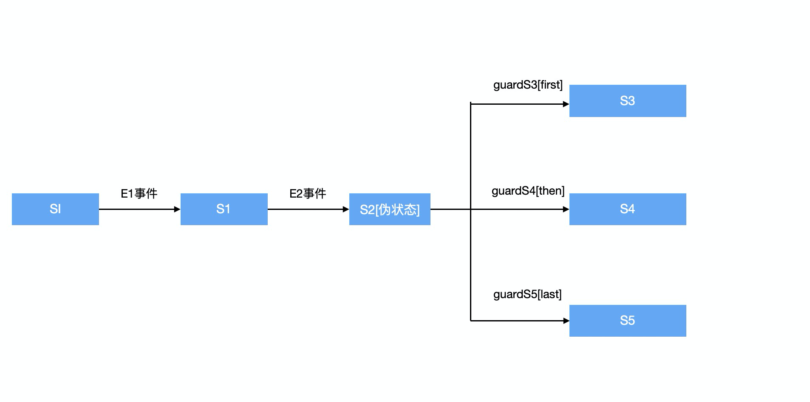
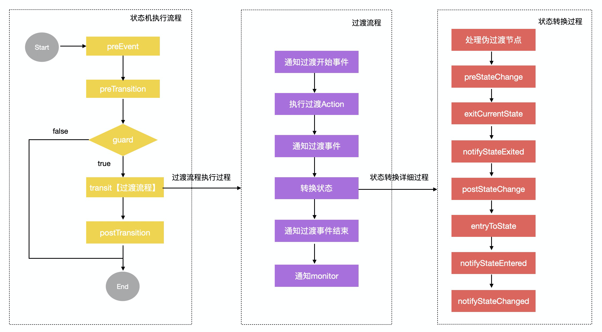

### SpringBoot状态机StateMachine

#### (一). 状态机介绍

有限状态机是一种用来进行对象行为建模的工具，其作用主要是描述对象在它的生命周期内所经历的状态序列，以及如何响应来自外界的各种事件。在电商场景（订单、物流、售后）、社交（IM消息投递）、分布式集群管理（分布式计算平台任务编排）等场景都有大规模的使用。相对于传统if/else实现，状态机更加优雅。

**状态机的要素**
状态机可归纳为4个要素，即现态、条件、动作、次态。“现态”和“条件”是因，“动作”和“次态”是果。

* ①现态：是指当前所处的状态。
* ②条件：又称为“事件”。当一个条件被满足，将会触发一个动作，或者执行一次状态的迁移。
* ③动作：条件满足后执行的动作。动作执行完毕后，可以迁移到新的状态，也可以仍旧保持原状态。动作不是必需的，当条件满足后，也可以不执行任何动作，直接迁移到新状态。
* ④次态：条件满足后要迁往的新状态。“次态”是相对于“现态”而言的。

 

**状态机动作类型**

* 进入动作（entry action）：在进入状态时进行
* 退出动作：在退出状态时进行
* 输入动作：依赖于当前状态和输入条件进行
* 转移动作：在进行特定转移时进行


SpringBoot整合StateMachine方式很简单，只要引入下面依赖即可

```xml
<dependency>
    <groupId>org.springframework.statemachine</groupId>
    <artifactId>spring-statemachine-core</artifactId>
    <version>2.2.0.RELEASE</version>
</dependency>
```

Spring StateMachine官方文档： [spring statemachine文档](https://docs.spring.io/spring-statemachine/docs/2.2.0.RELEASE/reference/#sm-interceptor)


#### (二). Spring状态机原理

##### 状态机类结构

```java
-- Message接口
  核心接口
    T getPayload(); ==> 一般为Event对象
    MessageHeaders getHeaders(); 

-- MessageHeaders类 ==> Map存放消息头信息
  属性：private final Map<String, Object> headers;


-- State接口 ==> 状态接口
  核心接口：
    boolean sendEvent(Message<E> event);
    boolean shouldDefer(Message<E> event);
    PseudoState<S, E> getPseudoState(); // 伪装态
    void entry(StateContext<S, E> context);
    void exit(StateContext<S, E> context);
    Collection<? extends Action<S, E>> getEntryActions();
    Collection<? extends Action<S, E>> getStateActions();
    Collection<? extends Action<S, E>> getExitActions();
    void add/removeStateListener(StateListener<S, E> listener);

   -- AbstractState抽象类
     属性：id, deferred, entryActions, exitActions, stateActions, submachine, stateListener

     -- AbstractSimpleState 抽象类
       -- ObjectState ==> 每个定义的状态都是一个对应的ObjectState对象


-- Action接口 ==> 动作组件：过渡过程中
  核心接口： 
    void execute(StateContext<S, E> context);


-- Guard接口 ==> 卫兵组件：用于过渡条件判断
  核心接口：
    boolean evaluate(StateContext<S, E> context);


-- Transition接口 ==> 状态过渡组件
  核心接口：
	  boolean transit(StateContext<S, E> context);
	  void executeTransitionActions(StateContext<S, E> context);
	  State<S,E> getSource();
	  State<S,E> getTarget();
	  Guard<S, E> getGuard();


-- ExtendedState接口  ==> 扩展状态
  核心方法：
    Map<Object, Object> getVariables(); 
    <T> T get(Object key, Class<T> type);
    void setExtendedStateChangeListener(ExtendedStateChangeListener listener);
  
  -- DefaultExtendedState
    属性：Map<Object, Object> variables, ExtendedStateChangeListener listener;


-- StateContext接口 ==> 状态机上下文接口
  核心接口：
	  Stage getStage();
	  Message<E> getMessage();
	  E getEvent();
	  MessageHeaders getMessageHeaders();
	  Object getMessageHeader(Object header);
	  ExtendedState getExtendedState();
	  Transition<S, E> getTransition();
	  StateMachine<S, E> getStateMachine();
	  State<S, E> getTarget();
	  Exception getException();
  
  -- DefaultStateContext类【状态机上下文默认实现类】


-- Region接口
  核心接口：getUuid(); start(); stop(); 
    boolean sendEvent(Message<E> event);  // 发送事件
    Collection<State<S, E>> getStates();
	  Collection<Transition<S,E>> getTransitions(); // 
	  void addStateListener(StateMachineListener<S, E> listener)
	  void removeStateListener(StateMachineListener<S, E> listener);

    -- StateMachine接口 ==> 状态机能力接口
      核心接口：
    	  State<S,E> getInitialState();
    	  ExtendedState getExtendedState();
    	  StateMachineAccessor<S, E> getStateMachineAccessor();
    	  void setStateMachineError(Exception exception);
    	  boolean hasStateMachineError();
    
    	-- AbstractStateMachine抽象类
    	  核心属性：
          states, transitions, initialState, extendedState, currentState, 
          lastState, currentError, stateMachineExecutor, parentMachine
    	    stateListener = new CompositeStateMachineListener<S, E>();     // 监听器
	        stateMachineMonitor = new CompositeStateMachineMonitor<S, E>(); // monitor
	        StateMachineEventPublisher stateMachineEventPublisher; // 事件发布器
          // 处理@WithStateMachine
	        stateMachineHandlerCallHelper = new StateMachineHandlerCallHelper<S, E>(); 
 
          -- ObjectStateMachine ==> 状态机具体实现
              

-- StateMachineFactory接口 ==> 状态机工厂接口
  核心接口：StateMachine<S, E> getStateMachine();
  -- AbstractStateMachineFactory 抽象类
    核心属性：StateMachineModel【ConfigurationData, StatesData, TransitionsData】
    -- ObjectStateMachineFactory ==> 状态机工厂实现类
    

    
-- StateMachineListener接口 ==> 状态机监听器
  -- StateMachineListenerAdapter ==> 适配器， 自定义监听器可以继承该类【通常使用@WithStateMachine注解处理，可以省去创建拦截器】
    核心事件：
      状态机生命周期事件：stateMachineStarted, stateMachineStopped, stateMachineError,
      状态类型事件：stateChanged, stateEntered, stateExited
      状态过渡事件：transition, transitionStarted, transitionEnded
      其他事件：eventNotAccepted, extendedStateChanged


-- StateMachineInterceptor接口 ==> 状态机拦截器
  核心接口：
    Message<E> preEvent(Message<E> message, StateMachine<S, E> stateMachine);
    void preStateChange(State<S, E> state, Message<E> message, Transition<S, E> transition, StateMachine<S, E> stateMachine);
    void preStateChange(State<S, E> state, Message<E> message, Transition<S, E> transition, StateMachine<S, E> stateMachine, StateMachine<S, E> rootStateMachine);

    void postStateChange(State<S, E> state, Message<E> message, Transition<S, E> transition, StateMachine<S, E> stateMachine);
    void postStateChange(State<S, E> state, Message<E> message, Transition<S, E> transition, StateMachine<S, E> stateMachine, StateMachine<S, E> rootStateMachine);

    StateContext<S, E> preTransition(StateContext<S, E> stateContext);
    StateContext<S, E> postTransition(StateContext<S, E> stateContext);
    Exception stateMachineError(StateMachine<S, E> stateMachine, Exception exception);

```


##### 状态机配置原理

```java
@Slf4j
@Configuration
@EnableStateMachineFactory
public class StateMachineConfig extends EnumStateMachineConfigurerAdapter<States, Events> {

    @Override
    public void configure(StateMachineConfigurationConfigurer<States, Events> config)
            throws Exception {
        config
                .withConfiguration()
                .autoStartup(true)
                .listener(listener())
        ;
    }

    @Override
    public void configure(StateMachineStateConfigurer<States, Events> states)
            throws Exception {
        states
                .withStates()
                .initial(States.SI)
                .choice(States.S2)
                .states(EnumSet.allOf(States.class));
    }

    @Override
    public void configure(StateMachineTransitionConfigurer<States, Events> transitions)
            throws Exception {
        transitions
                .withExternal()
                .source(States.SI).target(States.S1).event(Events.E1)
                .guard(guardE1())
                .action(actionE1(),errorAction())
                .and()
                .withExternal()
                .source(States.S1).target(States.S2).event(Events.E2)
                .and()
                .withChoice()
                .source(States.S2)
                .first(States.S3, guardS3())
                .then(States.S4, guardS4())
                .last(States.S5);
    }


    @Bean
    public Guard<States, Events> guardE1() {
        return new Guard<States, Events>() {
            @Override
            public boolean evaluate(StateContext<States, Events> context) {
                log.info("guardE1...");

                return true;
            }
        };
    }


    @Bean
    public Guard<States, Events> guardS3() {
        return new Guard<States, Events>() {
            @Override
            public boolean evaluate(StateContext<States, Events> context) {
                return true;
            }
        };
    }

    @Bean
    public Guard<States, Events> guardS4() {
        return new Guard<States, Events>() {
            @Override
            public boolean evaluate(StateContext<States, Events> context) {
                return true;
            }
        };
    }

    @Bean
    public Action<States, Events> actionE1() {
        return new Action<States, Events>() {
            @Override
            public void execute(StateContext<States, Events> context) {
                log.info("actionE1...");
            }
        };
    }

    @Bean
    public Action<States, Events> errorAction() {
        return new Action<States, Events>() {
            @Override
            public void execute(StateContext<States, Events> context) {
                log.info("errorAction...");
            }
        };
    }

    @Bean
    public StateMachineListener<States, Events> listener() {
        return new StateMachineListenerAdapter<States, Events>() {
            @Override
            public void stateChanged(State<States, Events> from, State<States, Events> to) {
                log.info("State change from:{} to:{} ", from == null ? null : from.getId(), to.getId());
            }
        };
    }
}

```


```java
@EnableWithStateMachine
@Import({ StateMachineConfigurationImportSelector.class, StateMachineCommonConfiguration.class, StateMachineFactoryConfiguration.class,
		ObjectPostProcessorConfiguration.class })
public @interface EnableStateMachineFactory {
}


StateMachineCommonConfiguration：自动配置StateMachineHandlerApplicationListener事件监听器，TaskExecutor【同步的异步执行器】
StateMachineFactoryConfiguration：	会使用配置StateMachineConfig创建对应StateMachineFactory


// 导入WithStateMachine注解后置处理器
@Import(StateMachineAnnotationPostProcessorConfiguration.class)
public @interface EnableWithStateMachine {
    ...
}

class StateMachineAnnotationPostProcessorConfiguration{
  @Bean(name = POST_PROCESSOR_BEAN_ID)
	public StateMachineAnnotationPostProcessor springStateMachineAnnotationPostProcessor() {
		return new StateMachineAnnotationPostProcessor();
	}
}

StateMachineActivatorAnnotationPostProcessor后置处理器：为每一个事件【@OnXxx】生成对应的处理器类 StateMachineHandler。在创建StateMachine对象的时候，会把所有StateMachineHandler单例的Bean注入到【StateMachineHandlerCallHelper】中；然后在执行事件触发的过程会执行触发监听器逻辑  ==>
StateMachineHandlerCallHelper#callOnxxx, 最终会调用注解【@OnXxx】对应你的方法。

```


##### 状态机执行流程




执行流程：核心就是向状态机发送事件，状态机会按照指定步骤执行对应触发的代码。程序入口：
`AbstractStateMachine#sendEvent(Message<E> event);`执行过程如下：

* **状态机主流程【DefaultStateMachineExecutor#handleTriggerTrans】：**preEvent  ==> preTransition  ==>  transit【过渡guard检查】==>  transit【过渡主流程】  ==> postTransition
* **过渡执行流程【AbstractStateMachine$StateMachineExecutorTransit】：** notifyTransitionStart  ==> executeTransitionActions【Action执行】 ==> notifyTransition  ==>  switchToState【状态转换流程】==> notifyTransitionEnd ==> notifyTransitionMonitor
* **状态转换流程**【AbstractStateMachine#switchToState】：followLinkedPseudoStates【处理伪过渡节点，通过guard找到真实跳转状态toState】==> preStateChange ==>  exitCurrentState[notifyStateExited]  ==> entryToState[postStateChange ==> notifyStateEntered]  ==> notifyStateChanged




#### (三). Spring状态机使用

##### 创建状态机

```java
// 创建状态机
@Resource
private StateMachineFactory<States, Events> stateMachineFactory;
StateMachine<States, Events> stateMachine = stateMachineFactory.getStateMachine(machine);

```


##### 重置状态机

```java
// 重置状态机
String id = stateMachine.getId();
stateMachine.getStateMachineAccessor().withAllRegions().forEach(stateMachineAccess -> {
    stateMachineAccess.resetStateMachine(
      new DefaultStateMachineContext<>(States.S1, null, null, null, null, id));
});
```


##### 设置拦截器

```java
// 设置拦截器
stateMachine.getStateMachineAccessor().doWithAllRegions(
  new StateMachineFunction<StateMachineAccess<States, Events>>() {
    @Override
    public void apply(StateMachineAccess<States, Events> function) {
        function.addStateMachineInterceptor(interceptor);
    }
});
```


##### 配置监听器

```java
@Slf4j
@WithStateMachine
public class StateMachineEventConfig {

    @OnStateMachineStart
    public void start(StateContext<States, Events> stateContext){
        log.info("StateMachine:{} start...", stateContext.getStateMachine().getId());
    }
 
    @OnStateChanged(source = "SI", target = "S1")
    public void stateChange(StateContext<States, Events> stateContext){
        log.info("stateChange. SI -> S1");
    }

    @OnTransition(source = "SI", target = "S1")
    public void transition(StateContext<States, Events> stateContext) {
        log.info("SI -> S1转换...");
    }
}
```