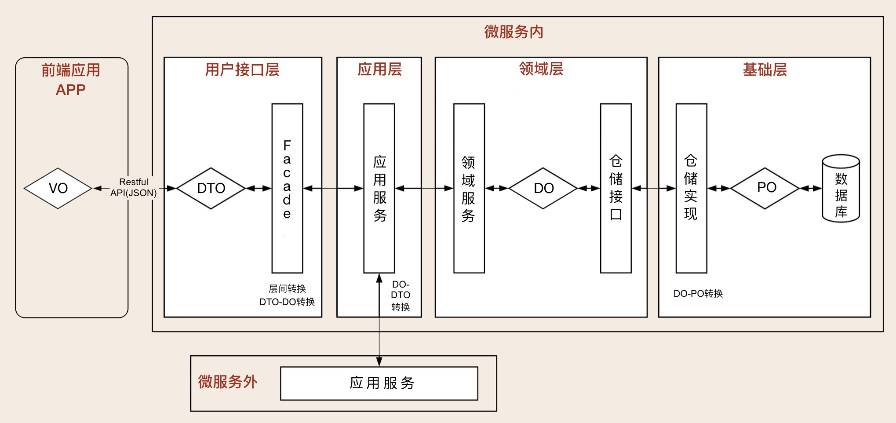

### DDD领域驱动设计

DDD是Eric Evans在2003年出版的《领域驱动设计：软件核心复杂性应对之道》（*Domain-Driven Design: Tackling Complexity in the Heart of Software*）一书中提出的具有划时代意义的重要概念，是指通过统一语言、业务抽象、领域划分和领域建模等一系列手段来控制软件复杂度的方法论。

#### (一). DDD核心知识体系

##### 通用语言

团队统一的语言，不管你在团队中承担什么角色，在同一个领域的软件生命周期里都使用统一的语言进行交流。

##### 领域和子域

DDD 的领域就是这个边界内要解决的业务问题域。领域可以进一步划分为子领域。我们把划分出来的多个子领域称为子域，每个子域对应一个更小的问题域或更小的业务范围。

* 核心域：决定产品和公司核心竞争力的子域
* 通用域：没有太多个性化的诉求，同时被多个子域使用的通用功能子域
* 支撑域：既不包含决定产品和公司核心竞争力的功能，也不包含通用功能的子域。

##### 限界上下文

上下文边界【Bounded Context】：用来封装通用语言和领域对象，提供上下文环境，保证在领域之内的一些术语、业务相关对象等（通用语言）有一个确切的含义，没有二义性。这个边界定义了模型的适用范围，使团队所有成员能够明确地知道什么应该在模型中实现，什么不应该在模型中实现。`领域边界就是通过限界上下文来定义的。`

##### 实体和值对象

*实体【Entity】：*它们拥有唯一标识符，且标识符在历经各种状态变更后仍能保持一致。对这些对象而言，重要的不是其属性，而是其延续性和标识，对象的延续性和标识会跨越甚至超出软件的生命周期。

*值对象【Value Object】：*通过对象属性值来识别的对象，它将多个相关属性组合为一个概念整体。在 DDD 中用来描述领域的特定方面，并且是一个没有标识符的对象。

在领域建模时，我们可以将部分对象设计为值对象，保留对象的业务涵义，同时又减少了实体的数量；在数据建模时，我们可以将值对象嵌入实体，减少实体表的数量，简化数据库设计。

##### 聚合和聚合根

*聚合【Aggregate】*：由业务和逻辑紧密关联的实体和值对象组合而成的，聚合是数据修改和持久化的基本单元，每一个聚合对应一个仓储，实现数据的持久化。聚合有一个聚合根和上下文边界，这个边界根据业务单一职责和高内聚原则，定义了聚合内部应该包含哪些实体和值对象，而聚合之间的边界是松耦合的。

*聚合根【AggregateRoot】*：聚合根是实体，有实体的特点，具有全局唯一标识，有独立的生命周期。一个聚合只有一个聚合根，聚合根在聚合内对实体和值对象采用直接对象引用的方式进行组织和协调，聚合根与聚合根之间通过 ID 关联的方式实现聚合之间的协同。

##### 工厂和仓库

*工厂【Factory】*：完成聚合内对象和值对象数据的初始化。

仓储【Repository】：每一个聚合都有一个仓储，仓储主要用来完成数据查询和持久化操作。

##### 领域事件

*领域事件【Domain Event】*：表示领域中发生的事件。一个领域事件将导致进一步的业务操作，在实现业务解耦的同时，还有助于形成完整的业务闭环。用领域事件来驱动业务的流转，尽量采用基于事件的最终一致，降低微服务之间直接访问的压力，实现微服务之间的解耦，维护领域模型的独立性和数据一致性。

#### (二). DDD分层架构

##### DDD 分层架构

DDD 分层架构有一个重要的原则：每层只能与位于其下方的层发生耦合。架构根据耦合的紧密程度又可以分为两种：严格分层架构和松散分层架构。在严格分层架构中，领域服务只能被应用服务调用，而应用服务只能被用户接口层调用，服务是逐层对外封装或组合的，依赖关系清晰。而在松散分层架构中，领域服务可以同时被应用层或用户接口层调用，服务的依赖关系比较复杂且难管理。

*用户接口层：*负责向用户显示信息和解释用户指令。这里的用户可能是：用户、程序、自动化测试等等。

*应用层：*可以协调多个聚合的服务和领域对象完成服务编排和组合，协作完成业务操作。还可以进行安全认证、权限校验、事务控制、发送或订阅领域事件等。

*领域层*：包含聚合根、实体、值对象、领域服务等领域模型中的领域对象。领域层的作用是实现企业核心业务逻辑，通过各种校验手段保证业务的正确性。

*基础层：*贯穿所有层的，它的作用就是为其它各层提供通用的技术和基础服务，包括第三方工具、驱动、消息中间件、网关、文件、缓存以及数据库等。

#####微服务架构模型

**整洁架构：**【洋葱架构】它定义了各层的依赖关系，越往里依赖越低，代码级别越高，越是核心能力。外圆代码依赖只能指向内圆，内圆不需要知道外圆的任何情况。

在洋葱架构中，各层的职能是这样划分的：

* 领域模型实现领域内核心业务逻辑，它封装了企业级的业务规则。领域模型的主体是实体，一个实体可以是一个带方法的对象，也可以是一个数据结构和方法集合。
* 领域服务实现涉及多个实体的复杂业务逻辑。
* 应用服务实现与用户操作相关的服务组合与编排，它包含了应用特有的业务流程规则，封装和实现了系统所有用例。
* 最外层主要提供适配的能力，适配能力分为主动适配和被动适配。主动适配主要实现外部用户、网页、批处理和自动化测试等对内层业务逻辑访问适配。被动适配主要是实现核心业务逻辑对基础资源访问的适配，比如数据库、缓存、文件系统和消息中间件等。
* 红圈内的领域模型、领域服务和应用服务一起组成软件核心业务能力。

**六边形架构**：应用是通过端口与外部进行交互的。【api网关】

六边形架构将系统分为内六边形和外六边形两层，这两层的职能划分如下：

* 红圈内的六边形实现应用的核心业务逻辑；
* 外六边形完成外部应用、驱动和基础资源等的交互和访问，对前端应用以 API 主动适配的方式提供服务，对基础资源以依赖倒置被动适配的方式实现资源访问。

#### (三). DDD和中台微服务实现

中台体现的是一种企业级的能力，它提供的是一套企业级的整体解决方案，解决小到企业、集团，大到生态圈的能力共享、联通和融合问题，支持业务和商业模式创新。通过平台联通和数据融合为用户提供一致的体验，更敏捷地支撑前台一线业务。

DDD 是一种处理高度复杂领域的设计思想，它试图分离技术实现的复杂性，并围绕业务概念构建领域模型来控制业务的复杂性，以解决软件难以理解，难以演进的问题。DDD 不是架构，而是一种架构设计方法论，它通过边界划分将复杂业务领域简单化，帮我们设计出清晰的领域和应用边界，可以很容易地实现架构演进。DDD 主要关注从业务领域视角划分领域边界，构建通用语言进行高效沟通，通过业务抽象，建立领域模型，维持业务和代码的逻辑一致性。微服务主要关注：运行时的进程间通信、容错和故障隔离，实现去中心化数据管理和去中心化服务治理，关注微服务的独立开发、测试、构建和部署。DDD为微服务拆分提供理论基础。

##### DDD微服务拆分

微服务拆分过程：

* 头脑风暴：场景分析，确认出实体对象，值对象，命令，聚合和领域事件。
* 领域建模：分析实体之间的依赖关系组成聚合，为聚合划定限界上下文，建立领域模型以及模型之间的依赖。
* 微服务拆分：不能简单地将领域模型作为拆分微服务的唯一标准，它只能作为微服务拆分的一个重要依据。

#####微服务调用视图

##### 数据对象视图

微服务内部数据对象的转换和协作：

* 数据持久化对象 PO(Persistent Object)：与数据库结构一一映射，是数据持久化过程中的数据载体。我们业务模型通常使用【xxxEntity或者xxxDO】代表数据库持久对象
* 领域对象 DO（Domain Object），微服务运行时的实体，是核心业务的载体。我们业务模型使用【xxxBO】标识业务逻辑的对象。
* 数据传输对象 DTO（Data Transfer Object），用于前端与应用层或者微服务之间的数据组装和传输，是应用之间数据传输的载体。Service 或 Manager 向外传输的对象。
* 视图对象 VO（View Object）：用于封装展示层指定页面或组件的数据。

