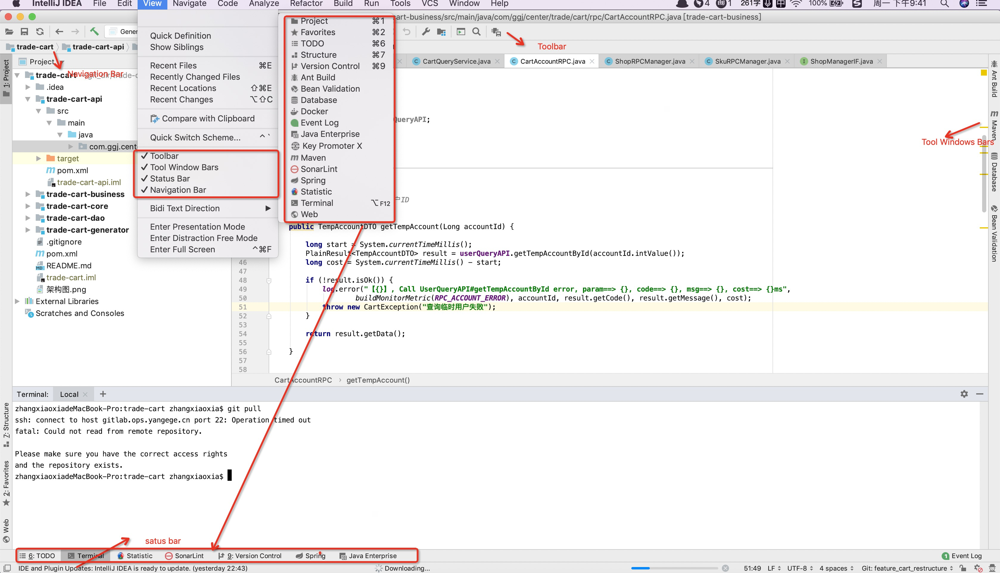
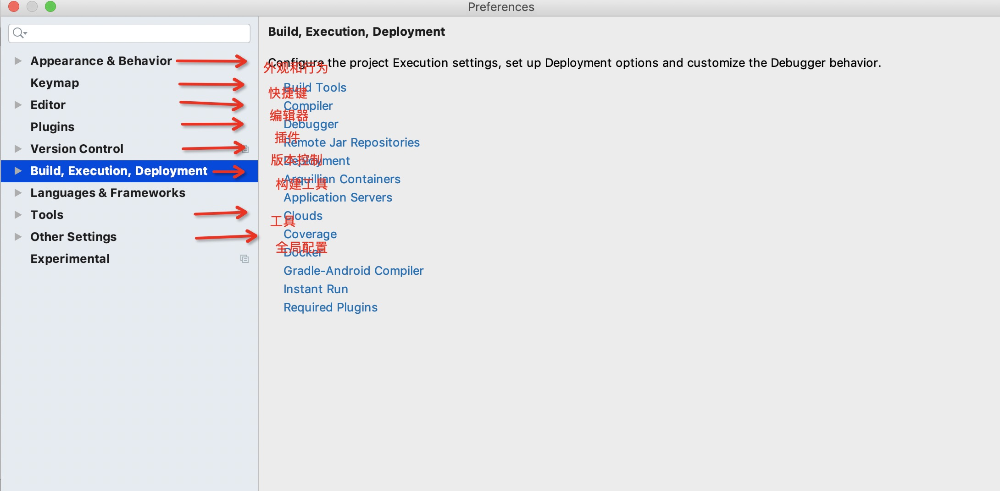
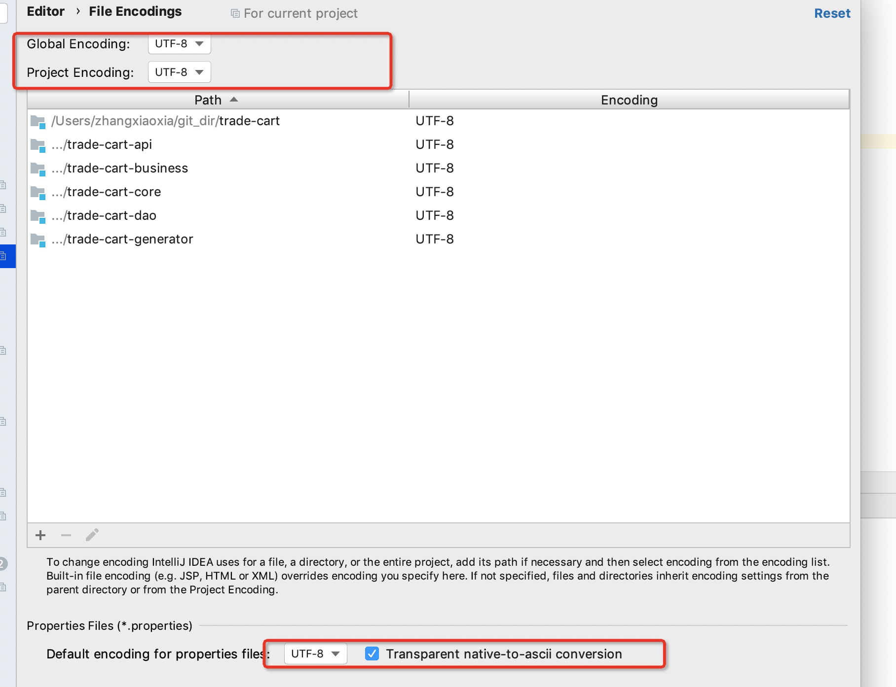
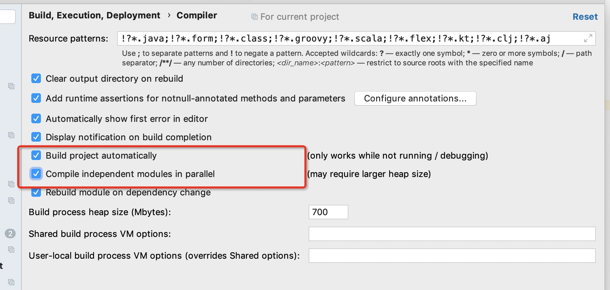
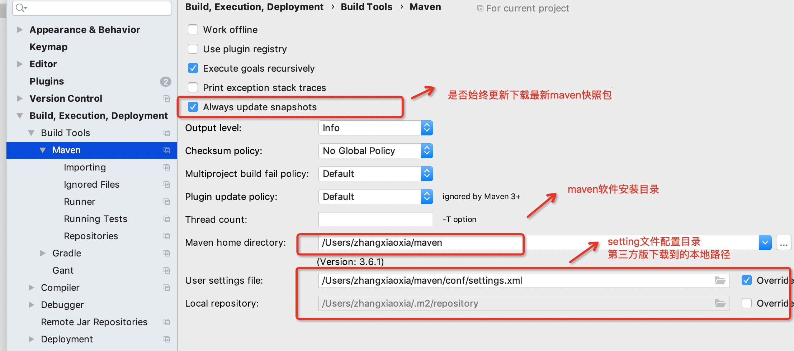

### IntelliJ IDEA配置与使用

官网提供的详细使用文档：https://www.jetbrains.com/help/idea/meet-intellij-idea.html


#### IDEA安装和配置

IDEA 分为两个版本：旗舰版(Ultimate)和社区版(Community)

IDEA的下载地址：https://www.jetbrains.com/idea/download/#section=windows 

IDEA激活码获取：淘宝哦【你懂得，15元可以用一年】


**IDEA安装文件**：

* bin：容器，执行文件和启动参数等【idea.vmoptions ==> 设置JVM 参数】
* help：快捷键文档和其他帮助文档
* jre64：64 位java 运行环境
* lib：idea 依赖的类库
* license：各个插件许可
* plugin：插件


**IDEA全局配置文件**：

* MAC系统：~/Library/Preferences/IntelliJIdea2019.1
* Windows系统：~/IntelliJIdea2019.1


#### IDEA基本操作

**常见视图**【view】




**项目模块操作**：【项目对应一个工程，mudule对应类似maven的模块】

* 创建项目【file ==> new ==> project指定目录 】
* 创建模块【file ==> new ==> module 指定模块名】
* 删除模块【remove module ==> delete】

* 项目配置【file ==> Project Structure】 JDK等配置

* 类，接口，package，枚举创建【file ==> new ==> xxx】


**IDEA断点调试**：

* step over：进入下一步，如果当前行断点是一个方法，则不进入当前方法体内

* step into：进入下一步，如果当前行断点是一个方法，则进入当前方法体内

* force step into：进入下一步，如果当前行断点是一个方法，则进入当前方法体内

* step out：跳出

* resume program：恢复程序运行，但如果该断点下面代码还有断点则停在下一个断点上

* stop：停止

* mute breakpoints：点中，使得所有的断点失效

* view breakpoints：查看所有断点

条件断点：调试的时候，在循环里增加条件判断，可以极大的提高效率，心情也能愉悦。

具体操作：在断点处右击调出条件断点。可以在满足某个条件下，实施断点。

查看表达式的值：⌥F8 计算表达式（可以更改变量值使其生效）


**生成javadoc**：【tool ==> Generate JavaDoc】

Locale：输入语言类型：zh_CN

Other command line arguments：-encoding UTF-8 -charset UTF-8


**缓存和索引的清理**

 	IntelliJ IDEA 首次加载项目的时候，都会创建索引，而创建索引的时间跟项目的 文件多少成正比。在 IntelliJ IDEA 创建索引过程中即使你编辑了代码也是编译 不了、运行不起来的，所以还是安安静静等 IntelliJ IDEA 创建索引完成。**IntelliJ IDEA 的缓存和索引主要是用来加快文件查询，从而加快各种查找、代码提示等操作的速度**。
	在某些特殊条件下，IntelliJ IDEA 的缓存和索引文件也是会损坏的，比如：断电、 蓝屏引起的强制关机，当你重新打开 IntelliJ IDEA，很可能 IntelliJ IDEA 会报 各种莫名其妙错误，甚至项目打不开，IntelliJ IDEA 主题还原成默认状态。即使 没有断电、蓝屏，也会有莫名奇怪的问题的时候，也很有可能是 IntelliJ IDEA 缓 存和索引出现了问题，这种情况还不少。清理缓存【file ==> invalidate cache / restart】


#### IDEA基本配置

File ==> Setting【Other Setting是全局配置设置】




##### 外观和行为

* 设置主题：Appearance ==> Theme【IntelliJ，Darcula，Windows 还可以下载对应插件】
* 设置字体大小：Appearance ==> Size

* 取消更新：Appearance ==> System Setting ==> Updates【去掉自动检查更新复选框】


##### 编辑器

* 设置自动导包功能：Auto import  【选中】

  > Add unambiguous imports on the fly：自动导入不明确的结构
  >
  > Optimize imports on the fly：自动帮我们优化导入的包

* 设置显示行号和方法间的分隔符：Appearance【选中】

  > show line number
  >
  > show method separators

* 忽略大小写提示：code completion

  > IntelliJ IDEA的代码提示和补充功能有一个特性：区分大小写。默认就是First letter区分大小写的。
  >
  > 如果想不区分大小写的话，去掉match case复选框。
  >

* 设置取消单行显示tabs的操作：Editor Tabs

  > Show tab in single/one row：去掉对应复选框

* Editor ==> Font： 用于修改字体大小

* Editor ==> Color Scheme：用于修改颜色和主题


* Editor ==> Code Style：代码风格

* Editor ==> Code Inspectins：代码检查【编辑器报警和异常检测规则】

  > 根据检测提示找到对应警告项目，然后进行级别修改

* Editor ==> File and Code Templates

  > 内置变量：
  >
  > * ${PACKAGE_NAME} 
  >
  > * ${PROJECT_NAME}
  >
  > * ${FILE_NAME} 
  >
  > * ${NAME} 
  >
  > * ${USER} 
  >
  > *  \${DATE} / ${TIME}/\${YEAR} /\${MONTH}/\${DAY} /\${HOUR} /\${MINUTE} 
  >
  > * ${PRODUCT_NAME}
  >
  > * ${MONTH_NAME_SHORT} 

  > **修改类头的文档注释信息 File Header**
  >
  > ```sql
  > /**
  >  * 
  >  *
  >  * @author wuji
  >  * @Motto  我的貂蝉在哪里
  >  * @since  1.x.x
  >  */
  > ```
  >
  > 

* Editor ==> File Encodings：设置项目文件编码

  > 
  >
  > **说明：**Transparent native-to-ascii conversion 主要用于转换 ascii，一般都要勾选， 不然 Properties 文件中的注释显示的都不会是中文。


#####版本控制[CVS]

* 关联Git：Version Control ==> Git 【配置Path to git executable为本地安装的git目录】
* 关联GitHub：填写用户名和密码。
* Git常用操作【右键 ==> git】。有的时候命令行比图形化界面更好用。


##### 编译构建和部署

* 设置自动编译：compiler

  >  


* maven设置

  > 
  >
  > 


#### IDEA模板使用

**后缀代码填充**：Editor ==> General ==> Postfix Completion【.xxx + tab键】

* 条件分支：if, else, switch
* 迭代语句：for, fori, forr, while, iter
* 判空语句：null, nn
* 异常语句：try, throw
* 输出语句：sout, soutv
* 对象创建：new
* 字符串模板：format


**代码模板**：Editor ==> Live Templates

* 声明常量：prsf, psf, psfi, psfs
* 抛出异常：thr
* 条件语句：ifn, inn
* 迭代：fori, itar
* 输出语句：sout, soutp, souf

* Mybatis转义：CD
* 其他：psvm(main), geti(getInstance)


#### IDEA常用快捷键

| 符号 | 苹果的键盘 | 普通的键盘 |
| ---- | ---------- | ---------- |
| ⌘    | command    | window     |
| ⌥    | option     | alt        |
| ⇧    | shift      | shift      |
| ⇪    | caps lock  | caps lock  |
| ⌃    | control    | control    |
| ↩    | return     | return     |
| ⌅    | enter      | enter      |


**Editing(编辑)**

* 基本编辑

  > 全选：⌘ + A
  > 复制代码：⌘ + C
  > 剪切：⌘ + X
  > 粘贴：⌘ +  V
  > 撤销：⌘  + Z
  > 反撤销：⌘  + ⇧ +  Z

* 查看继承关系(type hierarchy)：⌃ + H

* 查看当前类结构：⌘ + F12

* 查看显示参数信息：⌘ + P

* 查看源代码：⌘ + 【⌥】+ 鼠标指定类结构

* 查看代码回退/前进：⌘ + ⌥ + 【左右箭头】

* 查看方法哪里被调用(Call Hierarchy)：⌃ + ⌥ + H

* 快速跳到指定行：⌘ + L

* 大小写转化：⌘ + ⇧ + U

* 可以把代码包在一个块内：⌘ + ⌥ + T

* 注释 (//) ：⌘ + /

* 注释 (/**/)：⌘ + ⇧ + /

* 格式化代码：⌘ + ⌥ + L

* 优化导入的类和包：⌃ + ⌥ + O

* 向上/下移动语句：⌘ + ⇧ + Up/Down

* 移动光标到前/后单词：⌥ + Left/Right

* 向下插入新行：⇧ + Enter
* 上插一行：⌘ + Enter

* 复制行：⌘ + D
* 删除行：⌘ + Y/X
* 快速生成getter/setter等代码：⌃ + ↩
* 快速修复：⌥ + Enter


**Search/Replace(查找和替换)**

* 查询任何东西：Double ⇧
* 文件内查找：⌘ + F 
* 查找模式(向下查找)：⌘ + G 
* 查找模式(向上查找)：⌘ + ⇧ + G 
* 文件内替换：⌘ + R 
* 全局查找（根据路径）：⌘ + ⇧ + F 
* 全局替换（根据路径）：⌘ + ⇧ + R 


**Debugging(调试)**：

* F8 ：下一步(step over)。
* F7：进入方法体(step into)。
* ⇧ + F7：进入方法体(force step into)。
* ⇧ + F8：跳出方法体(step out)。
* ⌥ + F9： 运行到光标处，如果光标前有其他断点会进入到该断点
* ⌘ + ⌥ + R：恢复程序运行，如果该断点下面代码还有断点则停在下一个断点上
* ⌥ + F8：计算表达式（可以更改变量值使其生效）
* ⌘ + F8：切换断点（若光标当前行有断点则取消断点，没有则加上断点）
* ⌘ + ⇧ + F8：查看断点信息


**Refactoring(重构)**

* 重命名：⇧ + F6	
* 提取变量：⌘ + ⌥ + V	

* 提取方法：⌘ + ⌥ + M 


#### IDEA常用插件

| 插件名称                 | 插件介绍                | 使用方式                                   |
| ------------------------ | ----------------------- | ------------------------------------------ |
| Key promoter X           | 快捷键提示              | 自动【ui 触发对应快捷键提示】              |
| Rainbow Brackets         | 彩虹颜色的括号          | 自动区分括号颜色                           |
| Statistic                | 代码统计                | Statistic窗口 ==> refresh                  |
| A8Translate              | 翻译工具                | alt/option + t                             |
| SonarLint                | 代码检测工具            | 自动扫描 或者 选中文件右键【sonar检测】    |
| GenerateSerialVersionUID | 生成serialVersionUID    | 实现Serializable【Inspection配置自动提示】 |
| JUnitGenerator V2.0      | 生成单元测试代码        | option/alt + enter ==> create test         |
| Lombok                   | 生成通用代码【set/get】 | 使用对应注解                               |
| MyBatisX                 | Mybatis工具类           | option/alt + enter                         |
| Maven Helper             | Maven工具               | pom文件有对应tab管理页面                   |
| GsonFormat               | json字符串转实体类      | option/alt + s                             |
| CamelCase                | 将变量快速转成驼峰格式  | shift + option/alt + U                     |
| PlainUML                 | 画uml, 用例, 时序图     | New ==> PlainUML                           |
