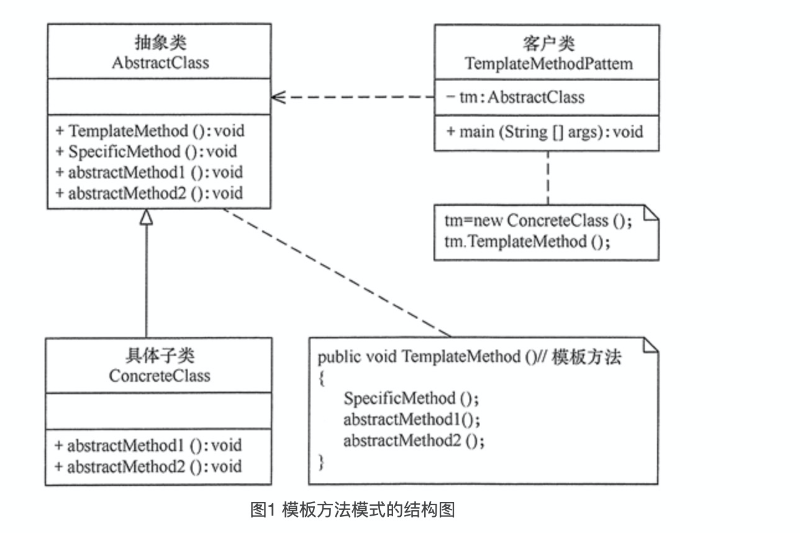

## Java设计模式详解

### 第1章. 设计模式基础

#### 设计模式目的

【高内聚】：软件元素密切相关的功能职责封装到一个模块中。
【低耦合】：减少不同功能模块间的联系。

代码重用性：相同功能的代码，不用多次编写。

代码可读性：编程规范性, 便于阅读和理解。

代码可扩展性： 可以快速新增和修改功能。

代码可靠性：新增功能，不影响老的功能。

设计模式包含了面向对象的精髓：“懂了设计模式，你就懂了面向对象分析和设计(OOA/D)的精要”

 

#### 设计模式原则

**单一职责原则（Single Responsibility Principle，SRP）**：职责指类变化的原因，单一职责原则规定一个类应该有且仅有一个引起它变化的原因，否则类应该被拆分。单一职责的优点：

* 降低类的复杂度，一个类只负责一项职责。
*  提高类的可读性，可维护性。
* 通常情况下，我们应当遵守单一职责原则，只有逻辑足够简单，才可以在代码级违反单一职责原则；只有类中方法数量足够少，可以在方法级别保持单一职责原则。


**开闭原则（Open Closed Principle，OCP）**：软件实体应当对扩展开放，对修改关闭。当软件需要变化时，尽量通过扩展软件实体【类】的行为来实现变化，而不是通过修改已有的代码来实现变化。开闭原则的优点：

* 软件测试时只需要对扩展的代码进行测试就可以了，因为原有的测试代码仍然能够正常运行。
* 可以提高软件的可维护性,稳定性高和延续性强，从而易于扩展和维护。


**里氏替换原则（Liskov Substitution Principle，LSP）**：继承必须确保超类所拥有的性质在子类中仍然成立。所有引用基类的地方必须能透明地使用其子类的对象。里氏替换原则通俗来讲就是：子类可以扩展父类的功能，但不能改变父类原有接口定义【功能实现，异常声明，输入输出约定-参数和返回值】。里氏替换原则的优点：

- 里氏替换原则是实现开闭原则的重要方式之一。
- 它克服了继承中重写父类造成的可复用性变差的缺点。
- 它是动作正确性的保证。即类的扩展不会给已有的系统引入新的错误，降低了代码出错的可能性。


**接口隔离原则（Interface Segregation Principle，ISP）：**客户端不应该被迫依赖于它不使用的方法，一个类对另一个类的依赖应该建立在最小的接口上；接口中的方法应该功能单一，不要包含非方法名指定的其他功能。接口隔离的优点：

* 将臃肿庞大的接口分解为多个粒度小的接口，提高系统的灵活性和可维护性。
* 能减少项目工程中的代码冗余。过大的大接口里面通常放置许多不用的方法，当实现这个接口的时候，被迫设计冗余的代码。
* 如果接口的粒度大小定义合理，能够保证系统的稳定性；如果定义过小，则会造成接口数量过多，使设计复杂化；如果定义太大，灵活性降低，无法提供定制服务，给整体项目带来无法预料的风险。


**依赖倒置原则（Dependence Inversion Principle，DIP）：**高层模块不应该依赖低层模块，两者都应该依赖其抽象；抽象不应该依赖细节，细节应该依赖抽象。其核心思想是：`要面向接口编程，不要面向实现编程 `。可以使用接口依赖传递，使用构造器实现依赖传递，使用setter方法实现依赖传递。依赖倒置的优点：

* 可以降低类间的耦合性。
* 可以提高代码扩展性和可维护性。

> **控制反转**：是一个比较笼统的设计思想，一般用来指导框架层面的设计。这里所说的“控制”指的是对程序执行流程的控制，而“反转”指的是在没有使用框架之前，程序员自己控制整个程序的执行。在使用框架之后，整个程序的执行流程通过框架来控制。流程的控制权从程序员“反转”给了框架。通过外部配置或者手动传递具体实现类来控制程序运行。例如：模板设计模式，依赖注入等


**迪米特法则（Law of Demeter，LoD）又叫作最少知识原则（Least Knowledge Principle，LKP)**：只与你的直接朋友交谈，不跟“陌生人”说话。其含义是：如果两个软件实体无须直接通信，那么就不应当发生直接的相互调用，可以通过第三方转发该调用。其目的是降低类之间的耦合度，提高模块的相对独立性。

> 迪米特法则中的“朋友”是指：当前对象本身、当前对象的成员对象、当前对象所创建的对象、当前对象的方法参数，返回值等，这些对象同当前对象存在关联、聚合或组合关系，可以直接访问这些对象的方法。
>
> ps：如果是局部变量不是直接朋友，需要把这部分逻辑放到直接朋友类中。

* 降低了类之间的耦合度，提高了模块的相对独立性。
* 由于亲合度降低，从而提高了类的可复用率和系统的扩展性。


**合成复用原则（Composite Reuse Principle，CRP）**：要尽量先使用组合或者聚合等关联关系来实现，其次才考虑使用继承关系来实现。如果要使用继承关系，则必须严格遵循里氏替换原则。


**KISS原则（Keep it Simple and Stupid）**：KISS 原则是保持代码可读和可维护的重要手段。KISS 原则中的“简单”并不是以代码行数来考量的。代码行数越少并不代表代码越简单，我们还要考虑逻辑复杂度、实现难度、代码的可读性等。而且，本身就复杂的问题，用复杂的方法解决，并不违背 KISS 原则。指导原则：

* 不要过度优化。

* 不要使用同事可能不懂的技术来实现代码；
* 不要重复造轮子，要善于使用已经有的工具类库；


**DRY原则（Don't Repeat Yourself）：**通用功能封装成复用方法，减少代码重复性。代码重复可能会导致修改不完全而导致不必要的bug。常见代码重复情况：

* 实现逻辑重复，但功能语义不重复的代码，不违反 DRY 原则。【不同字段相同校验逻辑】
* 实现逻辑不重复，但功能语义重复的代码，违反 DRY 原则。
* 代码执行重复违反 DRY 原则。


#### 设计模式分类

**创建型模式：**用于描述“怎样创建对象”，它的主要特点是“将对象的创建与使用分离”。GoF 中提供了单例(Singleton), 原型(Prototype), 工厂方法(Factory Method), 抽象工厂(AbstractFactory), 建造者 (Builder) 5 种创建型模式。

* 【单例模式】：生成单个实例，该类提供了一个全局访问点供外部获取该实例，其拓展是有限多例模式。
* 【原型模式】：将一个对象作为原型，通过对其进行复制而克隆出多个和原型类似的新实例。
* 【工厂方法模式】：定义一个用于创建产品的接口，由子类决定生产什么产品。
* 【抽象工厂模式】：提供一个创建产品族的接口，其每个子类可以生产一系列相关的产品。
* 【建造者模式】：将一个复杂对象分解成多个相对简单部分，然后根据不同需要分别创建它们，最后构建成该复杂对象。


**结构型模式：**用于描述将类或对象按某种布局组成更大的结构，GoF 中提供了代理(Proxy)、适配器(Adapter)、桥接(Bridge)、装饰(Decorator)、外观(Facade)、享元(Flyweight)、组合(Composite)等 7 种结构型模式。

* 【代理模式】：为某对象提供一种代理以控制对该对象的访问。即客户端通过代理间接地访问该对象，从而限制、增强或修改该对象的一些特性。
* 【适配器模式】：将一个类的接口转换成客户希望的另外一个接口，使得原本由于接口不兼容而不能一起工作的那些类能一起工作。
* 【桥接模式】：将抽象与实现分离，使它们可以独立变化。它是用组合关系代替继承关系来实现，从而降低了抽象和实现这两个可变维度的耦合度。
* 【装饰模式】：动态的给对象增加一些职责，即增加其额外的功能。
* 【外观模式】：为多个复杂的子系统提供一个一致的接口，使这些子系统更加容易被访问。
* 【享元模式】：运用共享技术来有效地支持大量细粒度对象的复用。
* 【组合模式】：将对象组合成树状层次结构，使用户对单个对象和组合对象具有一致的访问性。


**行为型模式：**用于描述类或对象之间怎样相互协作共同完成单个对象都无法单独完成的任务，以及怎样分配职责。GoF 中提供了模板方法(TemplateMethod)、策略(Strategy)、命令(Command)、职责链(Chain of Responsibility)、状态(State)、观察者(Observer)、中介者(Mediator)、迭代器(Iterator)、访问者(Visitor)、备忘录(Memento)、解释器(Interpreter)等 11 种行为型模式。

* 【模板方法模式】：定义操作的算法骨架，而将算法的一些步骤延迟到子类中，使得子类可以不改变该算法结构的情况下重定义该算法的某些特定步骤。
* 【策略模式】：定义一系列算法，并将每个算法封装起来，使它们可以相互替换，且算法的改变不会影响使用算法的客户。
* 【命令模式】：将一个请求封装为一个对象，使发出请求的责任和执行请求的责任分割开。
* 【职责链模式】：把请求从链中的一个对象传到下一个对象，直到请求被响应为止。去除对象之间的耦合。
* 【状态模式】：允许一个对象在其内部状态发生改变时改变其行为能力。
* 【观察者模式】：多个对象间存在一对多关系，当一个对象发生改变时，把这种改变通知给其他多个对象，从而影响其他对象的行为。
* 【中介者模式】：定义一个中介对象来简化原有对象之间的交互关系，降低系统中对象间的耦合度。
* 【迭代器模式】：提供一种方法来顺序访问聚合对象中的一系列数据，而不暴露聚合对象的内部表示。
* 【访问者模式】：不改变集合元素的前提下，为一个集合中的每个元素提供多种访问方式，即每个元素有多个访问者对象访问。
* 【备忘录模式】：不破坏封装性的前提下，获取并保存一个对象的内部状态，以便以后恢复它。
* 【解释器模式】：提供如何定义语言的文法，以及对语言句子的解释方法，即解释器。


### 第2章. UML图设计

画 UML 图就是把自己的思想描述给别人看，关键在于思路和条理，UML 图分类：

* 静态结构图：**类图**、对象图、包图、组件图、部署图
* 动态行为图：交互图（时序图与协作图）、状态图、活动图


#### 面向对象编程【OOP】

**面向对象特性：**

* **封装特性**：也叫作信息隐藏或者数据访问保护。类通过暴露有限的访问接口，授权外部仅能通过类提供的方式来访问内部信息或者数据。它需要编程语言提供权限访问控制语法来支持，例如 Java 中的 private、protected、public 关键字。封装特性存在的意义，一方面是保护数据不被随意修改，提高代码的可维护性；另一方面是仅暴露有限的必要接口，提高类的易用性。
* **抽象特性**：主要讲如何隐藏信息、保护数据，那抽象就是讲如何隐藏方法的具体实现，让使用者只需要关心方法提供了哪些功能，不需要知道这些功能是如何实现的。抽象可以通过接口类或者抽象类来实现，但也并不需要特殊的语法机制来支持。抽象存在的意义，一方面是提高代码的可扩展性、维护性，修改实现不需要改变定义，减少代码的改动范围；另一方面，它也是处理复杂系统的有效手段，能有效地过滤掉不必要关注的信息。
* **继承特性**：是用来表示类之间的 is-a 关系，分为两种模式：单继承和多继承。单继承表示一个子类只继承一个父类，多继承表示一个子类可以继承多个父类。为了实现继承这个特性，编程语言需要提供特殊的语法机制来支持。继承主要是用来解决代码复用的问题。 
* **多态特性**：是指子类可以替换父类，在实际的代码运行过程中，调用子类的方法实现。多态这种特性也需要编程语言提供特殊的语法机制来实现，比如继承、接口类、duck-typing。多态可以提高代码的扩展性和复用性，是很多设计模式、设计原则、编程技巧的代码实现基础。

**面向对象分析**：

1. 划分职责进而识别出有哪些类根据需求描述，我们把其中涉及的功能点，一个一个罗列出来，然后再去看哪些功能点职责相近，操作同样的属性，可否归为同一个类。
2. 定义类及其属性和方法我们识别出需求描述中的动词，作为候选的方法，再进一步过滤筛选出真正的方法，把功能点中涉及的名词，作为候选属性，然后同样再进行过滤筛选。
3. 定义类与类之间的交互关系UML 统一建模语言中定义了六种类之间的关系。它们分别是：泛化、实现、关联、聚合、组合、依赖。我们从更加贴近编程的角度，对类与类之间的关系做了调整，保留四个关系：泛化、实现、组合、依赖。
4. 将类组装起来并提供执行入口我们要将所有的类组装在一起，提供一个执行入口。这个入口可能是一个 main() 函数，也可能是一组给外部用的 API 接口。通过这个入口，我们能触发整个代码跑起来。

业务开发过程：需求分析 ==> 业务模型【支持的功能】 ==> 数据模型 ==> 接口设计 ==> 领域边界，交互模型


#### UML类图

用于描述系统中的类(对象)本身的组成和类(对象)之间的各种静态关系。

类之间的关系：依赖、泛化（继承）、实现、关联、聚合与组合。

**依赖关系（Dependence）**：只要是在类中用到了对方，那么他们之间就存在依赖关系。【方法参数，返回值，局部变量，成员属性，继承类，实现接口】

* PlainUML语法格式：..> PersonService ..>  PersonCard 

```uml
@startuml
class PersonService {
   -PersonDAO personDao
   
   +save(Person person)
   +IdCard getIdCard(long personId)
}

class IdCard
class Person
class PersonDAO
class Department

PersonService ..> IdCard
PersonService ..> Person
PersonService ..> PersonDAO
PersonService ..> Department
@enduml
```


**泛化关系(generalization）**：泛化关系实际上就是继承关系，他是依赖关系的特例。【继承关系】

* PlainUML语法格式：<|--

```uml
@startuml
interface PersonService
class PersonServiceImpl {
   -PersonDAO personDao

   +save(Person person)
   +IdCard getIdCard(long personId)
}

PersonService <|-- PersonServiceImpl
@enduml
```


**实现关系（Implementation）**：实现关系实际上就是 A 类实现 B 接口，他是依赖关系的特例

* PlainUML语法格式：<|--


**聚合关系（Aggregation）**：表示的是整体和部分的关系，整体与部分可以分开。【关联关系的特例】

* PlainUML语法格式：A --o B  ==> A聚合B

**组合关系（Composition）**也是整体与部分的关系，但是整体与部分不可以分开。【一个类创建的同时另一个类也同时创建，则类之间的关系为组合关系】

* PlainUML语法格式：A --* B   ==>  A 组合 B


**关联关系（Association）**：关联关系就是类与类之间的关系【单向一对一，双向一对一】


#### 时序图

通过描述对象之间发送消息的时间顺序显示多个对象之间的动态协作。它可以表示用例的行为顺序，当执行一个用例行为时，其中的每条消息对应一个类操作或状态机中引起转换的触发事件。时序图中包括如下元素：角色，对象，生命线，控制焦点和消息。

* 角色（Actor）：系统角色，可以是人或者其他系统，子系统。

* 对象(Object)：对象代表时序图中的对象在交互中所扮演的角色，位于时序图顶部和对象代表类角色。

  > 对象一般包含以下三种命名方式：
  >
  > i). 对象名和类名；
  >
  > ii). 只显示类名不显示对象名，即为一个匿名对象；
  >
  > iii). 只显示对象名不显示类名。

* 生命线(Lifeline)：

  > 生命线代表时序图中的对象在一段时期内的存在。时序图中每个对象和底部中心都有一条垂直的虚线，这就是对象的生命线，对象间的消息存在于两条虚线间。

* 控制焦点(Activation)：

  > 代表时序图中的对象执行一项操作的时期，在时序图中每条生命线上的窄的矩形代表活动期。它可以被理解成C语言语义中一对花括号“{}”中的内容。

* 消息(Message)

  > 消息是定义交互和协作中交换信息的类，用于对实体间的通信内容建模，信息用于在实体间传递信息。允许实体请求其他的服务，类角色通过发送和接受信息进行通信。


### 第3章. 单例模式

单例（Singleton）模式的定义：指一个类只有一个实例，且该类能自行创建这个实例的一种模式。
单例模式有 3 个特点：

* 单例类只有一个实例对象；
* 该单例对象必须由单例类自行创建；
* 单例类对外提供一个访问该单例的全局访问点；

#### 单例原理类图


#### 单例模式使用

**饿汉式(静态常量)**：

```java
class Singleton{
    private static Singleton instance = new Singleton();
    private Singleton() {}
    public static Singleton getInstance() {
        return instance;
    }
}
```


**饿汉式(静态代码块)**：

```java
class Singleton{
    private static Singleton instance;
    private Singleton() {}
    static{
        instance = new Singleton();
    }

    public static Singleton getInstance() {
        return instance;
    }
}
```


**懒汉式(线程不安全)**：

```java
class Singleton {
    private static Singleton instance;
    private Singleton() {}
    public static Singleton getInstance() {
        if (instance == null) {
            instance = new Singleton();
        }
        return instance;
    }
}
```


**懒汉式(线程安全, 同步方法)**：

```java
class Singleton {
    private static Singleton instance;
    private Singleton() {}
    public static synchronized Singleton getInstance() {
        if (instance == null) {
            instance = new Singleton();
        }
        return instance;
    }
}
```


**懒汉式(双重检查)**：

```java
class Singleton{
    private static volatile Singleton instance;
    private Singleton(){}
    public static Singleton getInstance() {
        if(instance == null){
            synchronized (Singleton.class){
                if(instance == null){
                    instance = new Singleton();
                }
            }
        }
        return instance;
    }
}

```


**静态内部类**：

```java
class Singleton {
    private Singleton(){}

    public static Singleton getInstance() {
        return SingletonInstance.INSTANCE;
    }
  
    private static class SingletonInstance{
        private static final Singleton INSTANCE = new Singleton();
    }
}
```


**枚举方式**：不仅能避免多线程同步问题，而且还能防止反序列化重新创建 新的对象。

```java
enum Singleton{
    INSTANCE;
}
```


#### 使用场景

单例模式适用于以下场景：需要频繁的进行创建和销毁的对象、创建对象时耗时过多或耗费资源过多(即：重量级

对象)，但又经常用到的对象、工具类对象、频繁访问数据库或文件的对象(比如数据源、session 工厂等)

源码使用：Runtime + Spring Bean单实例  创建


### 第4章. 工厂模式

#### 简单工厂模式

简单工厂模式（Simple Factory Pattern）是指由一个工厂对象决定创建出哪一种产品类的实例。属于创建型模式，但它不属于 GOF，23 种设计模式。简单工厂模式适用于的场景：

* 适用于工厂类负责创建的对象较少的场景，
* 客户端只需要传入工厂类的参数，对于如何创建对象的逻辑不需要关心。

简单工厂模式缺点：

* 工厂类的职责相对过重，增加新的产品时需要修改工厂类的判断逻辑，违背开闭原则
* 不易于扩展过于复杂的产品结构

```java
public class SimpleFactoryPattern {
    public static void main(String[] args) {
        Pizza pizza = PizzaFactory.newPizza("A");
        System.out.println(pizza.getName());
    }
}
class SimplePizzaFactory {
    public static Pizza newPizza(String type){
        if("A".equals(type)){
            return new PizzaA();
        }else if("B".equals(type)){
            return new PizzaB();
        }
        return null;
    }
  
  public static PizzaA newPizzaA(){
        return new PizzaA();
    }
    
    public static PizzaB newPizzaB(){
        return new PizzaB();
    }
}

interface Pizza {
    String getName();
}

class PizzaA implements Pizza {
    @Override
    public String getName() {
        return "A";
    }
}
class PizzaB implements Pizza {
    @Override
    public String getName() {
        return "B";
    }
}
```


#### 工厂方法模式

工厂方法模式（Fatory Method Pattern）：指定义一个创建对象的接口，但让实现这个接口的类来决定实例化哪个类，工厂方法让类的实例化推迟到子类中进行。在工厂方法 模式中用户只需要关心所需产品对应的工厂，无须关心创建细节，而且加入新的产品符合开闭原则。

工厂方法模式的适用场景：

* 创建对象需要大量重复的代码
* 客户端（应用层）不依赖于产品类实例如何被创建、实现等细节，一个类通过其子类来指定创建哪个对象。

工厂方法模式的优点：

* 用户只关系所需产品对应的工厂，无须关心创建细节。
* 加入新产品符合开闭原则，提高了系统的可扩展性。

工厂方法模式的缺点：

* 类的个数容易过多，增加了代码结构的复杂度。
* 增加了系统的抽象性和理解难度。


```java
public class MethodFactoryPattern {
    public static void main(String[] args) {
        PizzaFactory pizzaFactory = new PizzaAFactory();
        Pizza pizza = pizzaFactory.create();
        System.out.println(pizza.getName());
    }
}

interface Pizza {
    String getName();
}

class PizzaA implements Pizza {
    @Override
    public String getName() {
        return "A";
    }
}

class PizzaB implements Pizza {
    @Override
    public String getName() {
        return "B";
    }
}

// 工厂方法抽象
interface PizzaFactory{
    Pizza create();
}

class PizzaAFactory implements PizzaFactory{
    @Override
    public Pizza create() {
        return new PizzaA();
    }
}

class PizzaBFactory implements PizzaFactory{
    @Override
    public Pizza create() {
        return new PizzaB();
    }
}
```

说明：工厂方法模式适用于产品按照按某个维度分类。多个分类【PizzaAFactory，PizzaBFactory】看做是具体工厂方法实现，分别创建对应分类产品。


####抽象工厂模式

抽象工厂模式使用场景：

* 客户端（应用层）不依赖于产品类实例如何被创建，实现等细节。
* 强调一系列相关的产品对象（属于同一产品族）一起使用创建对象需要大量重复的代码。
* 提供一个产品类的库，所有的产品以同样的接口出现，从而使客户端不依赖于具体的实现。

抽象工厂模式优点：

* 具体产品在应用层代码隔离，无须关系创建细节。
* 将一个系列的产品族统一到一起创建。

抽象工厂模式缺点：

* 规定了所有可能被创建的产品集合，产品族中扩展新的产品困难，需要修改抽象工厂的接口。
* 增加了系统的抽象性和理解难度。


```java
public class AbstractFactoryPattern {
    public static void main(String[] args) {
        Store store = new BeiJingStore();
        Drink drink = store.createDrink();
        System.out.println(drink.getName());
    }
}
// 具体工厂类
class  BeiJingStore implements Store{
    @Override
    public Pizza createPizza() {
        return new PizzaA();
    }
    @Override
    public Drink createDrink() {
        return new Drink2();
    }
}
// 具体工厂类
class ShaiHaiStore implements Store{
    @Override
    public Pizza createPizza() {
        return new PizzaB();
    }
    @Override
    public Drink createDrink() {
        return new Drink1();
    }
}
// 抽象工厂接口[定义创建产品簇]
interface Store {
    Pizza createPizza();
    Drink createDrink();
}
// 抽象产品Pizza
interface Pizza {
    String getName();
}
// 具体产品pizzaA
class PizzaA implements Pizza{
    @Override
    public String getName() {
        return "Pizza-A";
    }
}
// 具体产品pizzaB
class PizzaB implements Pizza{
    @Override
    public String getName() {
        return "Pizza-B";
    }
}
// 抽象产品Drink
interface Drink {
    String getName();
}
// 具体产品Drink1
class Drink1 implements Drink{
    @Override
    public String getName() {
        return "Drink-1";
    }
}
// 具体产品Drink2
class Drink2 implements Drink{
    @Override
    public String getName() {
        return "Drink-2";
    }
}
```


#### 使用场景

使用场景：统一对象的创建。new是面向实现编程，通过工厂方法可以将创建对象和使用对象分开。

源码使用：Spring BeanFactory工厂模式


### 第5章. 原型模式【不常用】

原型模式是指：用原型实例指定创建对象的种类，并且通过拷贝这些原型，创建新的对象。

原型模式是一种创建型设计模式，允许一个对象再创建另外一个可定制的对象，无需知道如何创建的细节。

**工作原理：**通过将一个原型对象传给那个要发动创建的对象，这个要发动创建的对象通过请求原型对象拷贝它们自己来实施创建，即 对象.clone()。

####原型模式原理结构图


原理结构图说明：

* Prototype：原型类，声明一个克隆自己的接口。
* ConcretePrototype：具体的原型类, 实现一个克隆自己的操作
* Client：让一个原型对象克隆自己，从而创建一个新的对象(属性一样）


#### 原型模式使用

**浅拷贝基本介绍**：

* 对于数据类型是基本数据类型的成员变量，浅拷贝会直接进行值传递，就是将该属性值复制一份给新的对象。

* 对于数据类型是引用数据类型的成员变量，比如说成员变量是某个数组、某个类的对象等，那么浅拷贝会进行 引用传递，也就是只是将该成员变量的引用值（内存地址）复制一份给新的对象。因为实际上两个对象的该成 员变量都指向同一个实例。

* 浅拷贝是使用默认的 clone()方法来实现 ：` super.clone();`。能够实现克隆的Java类必须实现一个标识接口Cloneable，表示这个Java类支持复制。如果一个类没有实现这个接口但是调用了clone()方法，Java编译器将抛出一个CloneNotSupportedException异常。

  

**深拷贝基本介绍** ：

* 复制对象的所有基本数据类型的成员变量值

* 为所有引用数据类型的成员变量申请存储空间，并复制每个引用数据类型成员变量所引用的对象，直到该对象 可达的所有对象。也就是说，对象进行深拷贝要对整个对象(包括对象的引用类型)进行拷贝


**深拷贝实现方式**：

* 重写 clone 方法来实现深拷贝【所有的引用对象也需要进行单独拷贝】

  > ```java
  > public class Sheep implements Cloneable { 
  >   
  >     private String name;
  >     private Integer age;
  >     private Sheep friend; // 引用对象
  >   
  >     @Override
  >     protected Object clone() {
  > 
  >         Sheep sheep = null;
  >         try {
  >             sheep = (Sheep) super.clone();
  > 
  >             if(friend != null){
  >                 sheep.friend = (Sheep) friend.clone();
  >             }
  > 
  >         } catch (CloneNotSupportedException e) {
  >             log.error("clone Sheep error",e);
  >         }
  > 
  >         return sheep;
  >     }
  >    // ...
  > }
  > ```
  >
  > 

* 通过对象序列化实现深拷贝

  > ```java
  > public Sheep deepClone() {
  >     try (ByteArrayOutputStream outputStream = new ByteArrayOutputStream();
  >          ObjectOutputStream objectOutputStream = new ObjectOutputStream(outputStream);) {
  > 
  >         objectOutputStream.writeObject(this);
  >         try (ByteArrayInputStream inputStream = new ByteArrayInputStream(outputStream.toByteArray());
  >              ObjectInputStream objectInputStream = new ObjectInputStream(inputStream);) {
  >             return (Sheep) objectInputStream.readObject();
  > 
  >         }
  >     } catch (IOException | ClassNotFoundException e) {
  >         throw new IllegalStateException("deep clone xxx error", e);
  >     }
  > }
  > ```


### 第6章. 建造者模式

建造者模式（Builder Pattern） 又叫生成器模式，是一种对象构建模式。它可以将复杂对象的建造过程抽象出来，使这个抽象过程的不同实现方法可以构造出不同表现（属性）的对象。

建造者模式是一步一步创建一个复杂的对象，它允许用户只通过指定复杂对象的类型和内容就可以构建它们，用户不需要知道内部的具体构建细节。

#### 建造者原理类图


**原理结构图说明：**

* Product： 产品角色，一个具体的产品对象。
* Builder： 抽象建造者，创建一个 Product 对象的各个部件指定的 接口/抽象类。
* ConcreteBuilder： 具体建造者；实现接口，构建和装配各个部件。
* Director：指挥者构建一个使用 Builder 接口的对象。它主要是用于创建一个复杂的对象。它主要有两个作 用，一是：隔离了客户与对象的生产过程，二是：负责控制产品对象的生产过程。


#### 建造者模式使用

```java
public class BuildPattern {
    public static void main(String[] args) {
        Builder builder = new ConcreteBuilder();
        Director director = new Director(builder);
        Product construct = director.construct();
    }
}

class Product {
    private String partA;
    private String partB;
    private String partC;

    public void setPartA(String partA) {
        this.partA = partA;
    }

    public void setPartB(String partB) {
        this.partB = partB;
    }

    public void setPartC(String partC) {
        this.partC = partC;
    }
}

abstract class Builder {
    //创建产品对象
    protected Product product = new Product();

    public abstract void buildPartA();

    public abstract void buildPartB();

    public abstract void buildPartC();

    //返回产品对象
    public Product getResult() {
        return product;
    }
}

class ConcreteBuilder extends Builder {
    public void buildPartA() {
        product.setPartA("建造 PartA");
    }

    public void buildPartB() {
        product.setPartA("建造 PartB");
    }

    public void buildPartC() {
        product.setPartA("建造 PartC");
    }
}

class Director {
    private Builder builder;
    public Director(Builder builder) {
        this.builder = builder;
    }
    //产品构建与组装方法
    public Product construct() {
        builder.buildPartA();
        builder.buildPartB();
        builder.buildPartC();
        return builder.getResult();
    }
}
```


```java 
// java 中builder创建模式使用
public class Person {
    private String name;
    private Integer age;

    public Person(String name, Integer age) {
        this.name = name;
        this.age = age;
    }

    public String getName() {
        return name;
    }

    public Integer getAge() {
        return age;
    }

    public static class Builder {
        private String name;
        private Integer age;

        public Builder setName(String name){
            this.name = name;
            return this;
        }
        public Builder setAge(Integer age){
            this.age = age ;
            return this;
        }

        public Person build(){
            Assert.hasText(name, "Name must not be null");
            Assert.notNull(age , "Age must not be null");

            return new Person(name,age);
        }
    }
}
```


#### 使用场景

为了避免构造函数的参数列表过长，影响代码的可读性和易用性，我们可以通过构造函数配合 set() 方法来解决。如果存在下面情况中我们就要考虑使用建造者模式：

* 希望创建不可变对象。不能暴露set方法

* 必填的属性有很多，导致参数列表过长，影响代码的可读性和易用性。
* 类的属性之间有一定的依赖关系或者约束条件。

源码使用：Apache HttpClientBuilder【复杂对象的创建】


### 第7章. 代理模式

代理模式：为一个对象提供一个替身，**控制对象的访问**。即通过代理对象访问目标对象.这样做的好处：可以在目标对象实现的基础上,增强额外的功能操作,即扩展目标对象的功能。被代理的对象可以是远程对象、创建开销大的对象或需要安全控制的对象.代理模式有不同的形式, 主要有三种

* 静态代理【一旦接口增加方法,目标对象与代理对象都要维护】
* 动态代理 【JDK 代理、接口代理】
* Cglib代理 (可以在内存 动态的创建对象，而不需要实现接口,他是属于动态代理的范畴) 。

#### 代理模式原理类图


代理模式角色说明：

* Subject：抽象主题，通过接口或抽象类声明真实主题和代理对象实现的业务方法。
* Real Subject：真实主题，实现了抽象主题中具体业务，是代理对象所代表的真实对象。
* Proxy：代理提供了与真实主题相同的接口，其内部含有对真实主题的引用，可以访问扩展真实主题的功能。


#### JDK 动态代理使用

```java
public class JDKDynamicProxyPattern {
    public static void main(String[] args) {
        StudentService studentService = new StudentServiceImpl();
        ProxyFactory proxyFactory = new ProxyFactory(studentService);
        StudentService studentServiceProxy =(StudentService) proxyFactory.getProxyInstance();

        System.out.println("代理类：" + studentServiceProxy.getClass());
        studentServiceProxy.study();
        studentServiceProxy.toString();        
    }
}

interface StudentService {
    void study();
}


class StudentServiceImpl implements StudentService {
    @Override
    public void study() {
        System.out.println("study ...");
    }    
}

class ProxyFactory {
    private Object target;
    public ProxyFactory(Object object) {
        this.target = object;
    }

    // 给目标对象 生成一个代理对象
    // InvocationHandler 引用了目标对象target
    public Object getProxyInstance() {
        return Proxy.newProxyInstance(target.getClass().getClassLoader(),
                target.getClass().getInterfaces(),
                (proxy, method, args) -> {
                    System.out.println("JDK 代理开始~~");
                    //反射机制调用目标对象的方法
                    Object returnVal = method.invoke(target, args);
                    System.out.println("JDK 代理提交");
                    return returnVal;
                });
    }
}
```


**JDK动态代理源码实现**

```java
public class Proxy implements java.io.Serializable {
  
    // 代理类缓存
    private static final WeakCache<ClassLoader, Class<?>[], Class<?>>
        proxyClassCache = new WeakCache<>(new KeyFactory(), new ProxyClassFactory());
  
    // 调用处理器
    protected InvocationHandler h;
  
  
    public static Object newProxyInstance(ClassLoader loader,
                                          Class<?>[] interfaces,
                                          InvocationHandler h)
        throws IllegalArgumentException{
        ...

        // 生成字节码对象
        Class<?> cl = getProxyClass0(loader, intfs);

        // 根据字节码对象创建对应代理类对象【入参是调用处理器】
        final Constructor<?> cons = cl.getConstructor(constructorParams);
        // 假如代理类的构造函数是private的，就使用反射来set accessible
        if (!Modifier.isPublic(cl.getModifiers())) {
            AccessController.doPrivileged(new PrivilegedAction<Void>() {
                public Void run() {
                    cons.setAccessible(true);
                    return null;
                }
            });
        }
        return cons.newInstance(new Object[]{h});
       
    }
  
  
    private static Class<?> getProxyClass0(ClassLoader loader,
                                           Class<?>... interfaces) {
        // 如果在缓存中有对应的代理类，那么直接返回
        // 否则代理类将有 ProxyClassFactory 来创建
        return proxyClassCache.get(loader, interfaces);
    }
  
}


// 生产代理类具体逻辑 
private static final class ProxyClassFactory
        implements BiFunction<ClassLoader, Class<?>[], Class<?>>{
   // 代理类前缀
   private static final String proxyClassNamePrefix = "$Proxy";
   // 代理类后缀数字
   private static final AtomicLong nextUniqueNumber = new AtomicLong();
   
   @Override
   public Class<?> apply(ClassLoader loader, Class<?>[] interfaces) {
       // ...
       long num = nextUniqueNumber.getAndIncrement(); //类自增数字
       String proxyName = proxyPkg + proxyClassNamePrefix + num;
       byte[] proxyClassFile = ProxyGenerator.generateProxyClass( proxyName, 
           interfaces, accessFlags);
       return defineClass0(loader, proxyName, proxyClassFile, 0, proxyClassFile.length);
 }

// 动态代理生成的字节码，代理类实现了代理接口
public final class $Proxy0 extends Proxy implements StudentService {
    private static Method m1;
    private static Method m3;
    private static Method m2;
    private static Method m0;

    public $Proxy0(InvocationHandler var1) throws  {
        super(var1);
    }
 
    //目标方法equals、hashCode、toString也会被代理类增强
    public final boolean equals(Object var1) throws  {
        try {
            return (Boolean)super.h.invoke(this, m1, new Object[]{var1});
        } catch (RuntimeException | Error var3) {
            throw var3;
        } catch (Throwable var4) {
            throw new UndeclaredThrowableException(var4);
        }
    }

    // InvocationHandler传递调用的代理对象，目标方法，参数对象
    public final void study() throws  {
        try {
            super.h.invoke(this, m3, (Object[])null);
        } catch (RuntimeException | Error var2) {
            throw var2;
        } catch (Throwable var3) {
            throw new UndeclaredThrowableException(var3);
        }
    }

    public final String toString() throws  {
        try {
            return (String)super.h.invoke(this, m2, (Object[])null);
        } catch (RuntimeException | Error var2) {
            throw var2;
        } catch (Throwable var3) {
            throw new UndeclaredThrowableException(var3);
        }
    }

    public final int hashCode() throws  {
        try {
            return (Integer)super.h.invoke(this, m0, (Object[])null);
        } catch (RuntimeException | Error var2) {
            throw var2;
        } catch (Throwable var3) {
            throw new UndeclaredThrowableException(var3);
        }
    }

    // 初始化接口中方法的Method对象，以及Object类的equals、hashCode、toString方法。
    static {
        try {
            m1 = Class.forName("java.lang.Object").getMethod("equals", Class.forName("java.lang.Object"));
            m3 = Class.forName("com.mooc.learn.pattern.proxy.StudentService").getMethod("study");
            m2 = Class.forName("java.lang.Object").getMethod("toString");
            m0 = Class.forName("java.lang.Object").getMethod("hashCode");
        } catch (NoSuchMethodException var2) {
            throw new NoSuchMethodError(var2.getMessage());
        } catch (ClassNotFoundException var3) {
            throw new NoClassDefFoundError(var3.getMessage());
        }
    }
}
```


#### Cglib动态代理使用

静态代理和 JDK 代理模式都要求目标对象是实现一个接口,但是有时候目标对象只是一个单独的对象,并没有实现任何的接口,这个时候可使用目标对象子类来实现代理-这就是 Cglib 代理。Cglib代理也叫作子类代理,它是在内存中构建一个子类对象从而实现对目标对象功能扩展, 有些书也将Cglib代理归属到动态代理。

Cglib 是一个强大的高性能的代码生成包,它可以在运行期扩展 java 类与实现 java 接口.Cglib 包的底层是通过使用字节码处理框架 ASM 来转换字节码并生成新的类。它广泛的被许多 AOP 的 框架使用,例如 Spring AOP， 实现方法拦截。在 AOP 编程中如何选择代理模式：

* 目标对象需要实现接口，用 JDK 代理
* 目标对象不需要实现接口，用 Cglib 代理

说明：spring 3.2以后已经把Cglib包放在了spring core中。不需要额外引入cglib的包了

```java

public class CglibDynamicProxyPattern {
    public static void main(String[] args) {   
       System.setProperty(DebuggingClassWriter.DEBUG_LOCATION_PROPERTY, "/Users/zhangxiaoxia/tmp");
        // 创建UserService代理对象,Callback中指定方法增强的拦截器
        Enhancer enhancer = new Enhancer();
        enhancer.setSuperclass(UserService.class);
        enhancer.setCallback(new UserServiceInterceptor());
        UserService userService = (UserService) enhancer.create();

        // 触发拦截器调用
        userService.sayHello("kitty");
    }
}


class UserService{
    public void sayHello(String name){
        System.out.println(name);
    }
}

class UserServiceInterceptor implements MethodInterceptor {   
    @Override
    public Object intercept(Object o, Method method, Object[] args, MethodProxy methodProxy) throws Throwable {
        System.out.println("cglib start ...");
        Object returnVal = methodProxy.invokeSuper(o, args);
        System.out.println("cglib end ...");
        return returnVal;
    }
}
```


**Cglib动态代理源码实现**

```java
// cglib生成的代码
public class UserService$$EnhancerByCGLIB$$55da5a58 extends UserService implements Factory {
  private boolean CGLIB$BOUND;
  public static Object CGLIB$FACTORY_DATA;
  private static final ThreadLocal CGLIB$THREAD_CALLBACKS;
  
  private static final Callback[] CGLIB$STATIC_CALLBACKS; 
  private MethodInterceptor CGLIB$CALLBACK_0; // 拦截器
  
  private static Object CGLIB$CALLBACK_FILTER;
  
  private static final Method CGLIB$sayHello$0$Method; // 被代理方法
  private static final MethodProxy CGLIB$sayHello$0$Proxy; // 代理方法
  
  private static final Object[] CGLIB$emptyArgs;
 
  private static final Method CGLIB$equals$1$Method; // 被代理方法
  private static final MethodProxy CGLIB$equals$1$Proxy; // 代理方法
  ...
    
  static void CGLIB$STATICHOOK1() {
    CGLIB$THREAD_CALLBACKS = new ThreadLocal();
    CGLIB$emptyArgs = new Object[0];
    
    // 加载代理类
    Class clazz1 = Class.forName("com.mooc.learn.pattern.proxy.UserService$$EnhancerByCGLIB$$55da5a58");
    Class clazz2;
    
    ... 
    // 代理方法和被代理方法创建
   CGLIB$sayHello$0$Method = ReflectUtils.findMethods(new String[] { "sayHello", "(Ljava/lang/String;)V" }, (clazz2 = Class.forName("com.mooc.learn.pattern.proxy.UserService")).getDeclaredMethods())[0];
    CGLIB$sayHello$0$Proxy = MethodProxy.create(clazz2, clazz1, "(Ljava/lang/String;)V", "sayHello", "CGLIB$sayHello$0");
    ReflectUtils.findMethods(new String[] { "sayHello", "(Ljava/lang/String;)V" }, (clazz2 = Class.forName("com.mooc.learn.pattern.proxy.UserService")).getDeclaredMethods());
    
  }
  
  // ...
}
```


#### 使用场景

Spring AOP：通用业务逻辑可以使用代理增强 ==> 权限校验，日志切面，事务管理，缓存管理

远程代理 ==> dubbo远程调用，虚拟代理 ==> 图片加载 

源码使用：Spring AOP切面 【事务管理等】，Mybatis代理类


### 第8章. 适配器模式

适配器模式(Adapter Pattern)：将某个类的接口转换成客户端期望的另一个接口表示，主的目的是兼容性，让原本因接口不匹配不能一起工作的两个类可以协同工作。其别名为包装器(Wrapper)。主要分为三类：

* 类适配器模式【通过继承原始类实现】

* 对象适配器模式【通过聚合原始类实现】

* 接口适配器模式【当不需要全部实现接口提供的方法时，可先设计一个抽象类实现接口，并为该接口中每个方法提供 一个默认实现（空方法），那么该抽象类的子类可有选择地覆盖父类的某些方法来实现需求】

  

#### 适配器原理类图


原理结构图说明：

* 目标接口 (Target)：需要适配成的目标接口或者抽象类。
* 适配者 (Adaptee)：适配的现存组件库中的组件接口。
* 适配器（Adapter）类：它是一个转换器，通过继承或引用适配者的对象，把适配者接口转换成目标接口，让客户能够按目标接口访问适配者。


####适配器模式使用

```java
public class AdapterPattern {
    public static void main(String[] args) {
        Phone phone = new Phone();
        phone.charging(new VoltageAdapter());
        System.out.println("===================");
        phone.charging(new VoltageAdapter2(new Voltage220V()));
    }
}


class Voltage220V {
    public int output220() {
        System.out.println("输出220V电压");
        return 220;
    }
}

interface Voltage5V {
    int output5V();
}

// 类适配器模式
class VoltageAdapter extends Voltage220V implements Voltage5V {
    @Override
    public int output5V() {
        int output = output220();
        return output / 44;
    }
}

// 对象适配器模式
class VoltageAdapter2 implements Voltage5V {
    private Voltage220V voltage220V;

    public VoltageAdapter2(Voltage220V voltage220V) {
        this.voltage220V = voltage220V;
    }

    @Override
    public int output5V() {
        return voltage220V.output220() / 44;
    }
}

class Phone {
    public void charging(Voltage5V voltage5V) {
        int v = voltage5V.output5V();
        System.out.println("充电打压" + v + "V");
    }
}
```


#### 使用场景

适配器模式（Adapter）通常适用于以下场景:

- 以前开发的系统存在满足新系统功能需求的类，但其接口同新系统的接口不一致。
- 使用第三方提供的组件，但组件接口定义和自己要求的接口定义不同。

源码使用：ThreadPoolExecutor#submit(Callable c)，最终调用的是execute(Runnable r) 。


### 第9章. 桥接模式

桥接模式(Bridge 模式)是指：将实现与抽象放在两个不同的类层次中，使两个层次可以独立改变。Bridge 模式基于类的最小设计原则，通过使用封装、聚合及继承等行为让不同的类承担不同的职责。它的主要特点是把抽象A与行为实现分离开来，从而可以保持各部分的独立性以及应对他们的功能扩展。

抽象：指的并非是抽象接口和抽象类，而是指一套抽象的类库。

实现：指的并非是实现类，而是一套独立的实现类库。

#### 桥接模式原理类图


**类图说明**：

* Abstraction：抽象类，维护了 Implementor / 即它的实现类 ConcreteImplementorA..， 二者是聚合关系, Abstraction充当桥接类。通过实现类方法调用来完成接口实现。
* RefinedAbstraction：具体抽象类【Abstraction子类】。
* Implementor：行为类接口，用于实现抽象类的操作逻辑。
* ConcreteImplementorA /B：具体行为实现类。
* Client：桥接模式的调用者


#### 桥接模式使用

例如，手机的样式：折叠式，直立式，旋转式；手机的品牌：小米，华为，vivo，苹果等。按照传统的扩展方式，将样式和品牌进行排列组合的话，将产生3X4个类，如果以后要增加一种品牌那么对应的类也会增加3个。这就产生扩展性问题 ==>【类爆炸】.

使用桥接模式：将实现和抽象分离。 实现 ==> 按照品牌抽象不同实现；抽象==> 按照手机样式继承扩展。这样我们能够将实现类缩小到3 + 4 = 7. 通过在Client中组合具体实现 【3 * 4】。

```java
public class BridgePattern {
    public static void main(String[] args) {
        Phone phone = new FoldedPhone(new Xiaomi());
        phone.operate();
    }
}

// 实现化接口【按品牌分类】
interface Brand{
    void operate();
}

// 具体实现化类【小米】
class Xiaomi implements Brand{
  
    @Override
    public void operate() {
        System.out.println("小米手机操作");
    }
}

// 具体实现化类【vivo】
class Vivo implements Brand{

    @Override
    public void operate() {
        System.out.println("vivo手机操作");
    }

}

// 抽象化类【手机】
abstract class Phone{
    private Brand brand;

    public Phone(Brand brand) {
        this.brand = brand;
    }

    protected void operate() {
        brand.operate();
    }
}

// 按抽象化【折叠式手机】
class FoldedPhone extends Phone{
    public FoldedPhone(Brand brand) {
        super(brand);
    }

    public void operate() {
        super.operate();
        System.out.println("折叠手机");
    }
}

class UpRightPhone extends Phone{
    public UpRightPhone(Brand brand) {
        super(brand);
    }

    public void operate() {
        super.operate();
        System.out.println("直立手机");
    }
}
```


#### 应用场景

一个类存在两个（或多个）独立变化的维度，我们通过组合的方式，让这两个（或多个）维度可以独立进行扩展。”通过组合关系来替代继承关系，避免继承层次的指数级爆炸。这种模式比较少应用，一般可以通过组合接口，实现多种多样扩展行为。


### 第10章. 装饰模式

装饰者模式：在不改变现有对象结构的情况下，动态地给该对象增加一些职责（即增加其额外功能）的模式。在对象功能扩展方面，它比继承更有弹性，装饰者模式也体现了开闭原则(ocp)。

#### 装饰模式原理类图


原理结构图说明：

* Component：抽象主体组件，定义一个抽象接口以规范准备接收附加责任的对象。
* Concrete  Component：具体主体组件，实现抽象构件，通过装饰角色为其添加一些职责。
* Decorator：抽象装饰类，继承抽象构件，包含具体构件实例，可以通过其子类扩展具体构件的功能。
* ConcreteDecorator：具体装饰类，实现抽象装饰的相关方法，并给具体构件对象添加附加的责任。


#### 装饰模式使用

```java
public class DecoratorPattern {
    public static void main(String[] args) {
        Component component = new ConcreteDecorator(new ConcreteComponent());
        component.operation();
    }
}

interface Component {
    void operation();
}

// 基础组件类
class ConcreteComponent implements Component {
    public void operation() {
        System.out.println("基础组件 - 常规行为...");
    }
}

// 抽象装饰类
class Decorator implements Component {
    private Component component;
    public Decorator(Component component) {
        this.component = component;
    }
    public void operation() {
        component.operation();
    }
}

// 具体装饰类
class ConcreteDecorator extends Decorator {
    public ConcreteDecorator(Component component) {
        super(component);
    }
    public void operation() {
        super.operation();
        addedFunction();
    }
    public void addedFunction() {
        System.out.println("装饰组件 - 修饰行为...");
    }
}
```


#### 使用场景

装饰（Decorator）模式的主要优点有：

- 采用装饰模式扩展对象的功能比采用继承方式更加灵活。
- 可以设计出多个不同的具体装饰类，创造出多个不同行为的组合。

主要缺点：装饰模式增加了许多子类，如果过度使用会使程序变得很复杂。

源码使用案例：

* Java BIO：InputStream / FileInputStream / FilterInputStream / DataInputStream, BufferedInputStream  

* Collections#unmodifiableCollection  ==> UnmodifiableCollection

  


### 第11章. 外观模式

外观模式（Facade），也叫`过程模式`：外观模式为子系统中的一组接口提供一个一致的界面，此模式定义了 一个高层接口，这个接口使得这一子系统更加容易使用。且屏蔽内部子系统的细节，使得调用端只需跟这个接口发生调用，而无需关心这个子系统的内部细节【最少知识原则】。


#### 外观模式原理类图


外观模式的角色说明：

* Client (调用者)：外观接口的调用者。

* Facade(外观类)：为调用端提供统一的调用接口, 外观类通过子系统调用实现请求调用。
* 子系统的集合：指模块或者子系统，处理 Facade 对象指派的任务，是功能的实际提供者。


#### 外观模式使用

```java
public class FacadePattern {
    public static void main(String[] args) {
        Facade facade = new Facade();
        facade.execute();
    }
}

class Facade{
    private SubSystemA subSystemA = new SubSystemA();
    private SubSystemB subSystemB = new SubSystemB();
    private SubSystemC subSystemC = new SubSystemC();

    public void execute(){
        subSystemA.method();
        subSystemB.method();
        subSystemC.method();
    }
}

//子系统角色
class SubSystemA {
    public void method() {
        System.out.println("子系统A的method()被调用！");
    }
}

//子系统角色
class SubSystemB {
    public void method() {
        System.out.println("子系统B的method()被调用！");
    }
}

//子系统角色
class SubSystemC {
    public void method() {
        System.out.println("子系统C的method()被调用！");
    }
}
```


#### 应用场景

外观模式对外屏蔽了子系统的细节，因此外观模式降低了客户端对子系统使用的复杂性；对客户端与子系统的耦合关系 - 解耦，让子系统内部的模块更易维护和扩展。通过合理的使用外观模式，可以帮我们更好划分访问的层次。

注意：不能过多的或者不合理的使用外观模式，使用外观模式好，还是直接调用模块好。要以让系统有层次，利于维护为目的。facade模式可以理解为一种中介者模式【减少子系统之间的依赖】


### 第12章. 享元模式【不常用】

享元模式(Flyweight Pattern) 也叫 蝇量模式：运用共享技术有效地支持大量细粒度的对象。常用于系统底层开发，解决系统的性能问题。像数据库连接池，在这些连接对象中有我们需要的则直接拿来用，避免重新创建。

享元模式能够解决重复对象的内存浪费的问题，当系统中有大量相似对象，需要缓冲池时。不需总是创建新对象，可以从缓冲池里拿。这样可以降低系统内存，同时提高效率。

#### 享元模式原理类图


**对类图的说明：**

* FlyWeight ：抽象享元角色, 产品的抽象类, 同时定义出对象的外部状态和内部状态的接口或实现
* ConcreteFlyWeight ：具体的享元角色，是具体的产品类，实现抽象角色定义相关业务。
* UnSharedConcreteFlyWeight：是不可共享的角色，一般不会出现在享元工厂。
* FlyWeightFactory：享元工厂类，用于创建和缓存享元对象， 同时提供从获取享元对象方法。


#### 享元模式使用

享元模式提出了两个要求：细粒度和共享对象。将对象的信息分为两个部分。内部状态和外部状态：

* 内部状态：指对象共享出来的信息，存储在享元对象内部且不能被修改【属性形式，且无set方法】
* 外部状态：指对象得以依赖的一个标记，是随环境改变而改变的、不可共享的状态。【入参形式】

```java
// 抽象享元类
interface Flyweight {
    // 对外状态对象
    void operation(String name);
    // 对内对象
    String getType();
}

// 具体享元类
class ConcreteFlyweight implements Flyweight {
    private String type;

    public ConcreteFlyweight(String type) {
        this.type = type;
    }

    // name属于外部状态
    @Override
    public void operation(String name) {
        System.out.printf("[类型 (内在状态)] - [%s] - [名字 (外在状态)] - [%s]\n", type, name);
    }

    @Override
    public String getType() {
        return type;
    }
}

// 享元工厂类
class FlyweightFactory {
    private static final Map<String, Flyweight> FLYWEIGHT_MAP = new HashMap<>();// 享元池，用来存储享元对象

    public static Flyweight getFlyweight(String type) {
        if (FLYWEIGHT_MAP.containsKey(type)) {// 如果在享元池中存在对象，则直接获取
            return FLYWEIGHT_MAP.get(type);
        } else {// 在响应池不存在，则新创建对象，并放入到享元池
            ConcreteFlyweight flyweight = new ConcreteFlyweight(type);
            FLYWEIGHT_MAP.put(type, flyweight);
            return flyweight;
        }
    }
}

public class Client {
    public static void main(String[] args) {
        Flyweight fw0 = FlyweightFactory.getFlyweight("a");
        Flyweight fw1 = FlyweightFactory.getFlyweight("b");
        Flyweight fw2 = FlyweightFactory.getFlyweight("a");
        Flyweight fw3 = FlyweightFactory.getFlyweight("b");
        fw1.operation("abc");
        System.out.printf("[结果 (对象对比)] - [%s]\n", fw0 == fw2);
        System.out.printf("[结果 (内在状态)] - [%s]\n", fw1.getType());
    }
}
```


#### 使用场景

享元模式大大减少了对象的创建，降低了程序内存的占用，提高效率【共享对象】

享元模式提高了系统的复杂度。需要分离出内部状态和外部状态，而外部状态具有固化特性，不应该随着内部状态的改变而改变，这是我们使用享元模式需要注意的地方.

源码使用场景：要String 常量池、Integer/Long cache【缓冲池的场景】、枚举

```java
private static class LongCache {
    private LongCache(){}
    
    static final Long cache[] = new Long[-(-128) + 127 + 1];
    
    static {
        for(int i = 0; i < cache.length; i++)
            cache[i] = new Long(i - 128);
    }
}

// 
public static Long valueOf(long l) {
    final int offset = 128;
    if (l >= -128 && l <= 127) { // will cache
        return LongCache.cache[(int)l + offset];
    }
    return new Long(l);
}
```


### 第13章. 组合模式

组合模式（Composite Pattern），又叫部分整体模式，它创建了对象组的树形结构，将对象组合成树状结构以表示“整体-部分”的层次关系。组合模式依据树形结构来组合对象，用来表示部分以及整体层次。组合模式使得用户对单个对象和组合对象的访问具有一致性，即：**组合能让客户以一致的方式处理个别对象以及组合对象**。

#### 组合模式原理类图


组合模式类图说明：

* Component：组合中组件接口， 在适当情况下实现所有类共有接口默认行为，用于访问和管理 Component 子部件，Component 可以是抽象类或者接口。
* Leaf：表示叶子节点，叶子节点没有子节点。
* Composite：表示组合节点对象【非叶子节点】， 用于存储叶子节点。 


#### 组合模式使用

```java
public class CompositePattern {
    public static void main(String[] args) {
        Component leaf1 = new Leaf("leaf1");
        Component leaf2 = new Leaf("leaf2");
        Component leaf3 = new Leaf("leaf3");
        Component root = new Composite();
        root.add(leaf1);
        root.add(leaf2);
        root.add(leaf3);

        root.operation();
    }
}

interface Component {
    default void add(Component c) {
    }

    default void remove(Component c) {
    }

    default Component getChild(int i) {
        return null;
    }

    void operation();
}

class Leaf implements Component {
    private String name;

    public Leaf(String name) {
        this.name = name;
    }

    @Override
    public void operation() {
        System.out.println("leaf:" + name);
    }
}

class Composite implements Component{
    private List<Component> children = new ArrayList<>();
    @Override
    public void add(Component c) {
        children.add(c);
    }

    @Override
    public void remove(Component c) {
        children.remove(c);
    }

    @Override
    public Component getChild(int i) {
        return children.get(i);
    }

    @Override
    public void operation() {
        for (Component child : children) {
            child.operation();
        }
    }
}
```


#### 应用场景

适用组合模式：需要表示一个对象整体与部分的层次结构的场合。当我们要更改组合对象时，我们只需要调整内部的层次关系，客户端不用做出任何改动。

不适用组合模式：如果节点和叶子有很多差异性的话，比如很多方法和属性都不一样，


### 第14章. 模板方法模式

模板方法模式（Template Method Pattern），又叫模板模式(Template Pattern)，模板方法模式定义一个操作中的算法的骨架，而将一些步骤延迟到子类中，使得子类可以不改变一个算法的结构，就可以重定义该算法的某些特定步骤。

#### 模板方法原理类图



原理类图说明：

* 抽象类（Abstract Class）：负责给出一个算法的轮廓和骨架。它由一个模板方法和若干个基本方法构成。这些方法的定义如下：

  > 模板方法：定义了算法的骨架，按某种顺序调用其包含的基本方法。声明为final
  >
  > 抽象方法：在抽象类中申明，由具体子类实现。
  >
  > 具体方法：在抽象类中已经实现，在具体子类中可以继承或重写它。
  >
  > 钩子方法：在抽象类中已经实现，包括用于判断的逻辑方法和需要子类重写的空方法两种

* 具体子类（Concrete Class）：实现抽象类中所定义的抽象方法和钩子方法。


#### 模板方法使用

```java
public class TemplatePattern {
    public static void main(String[] args) {
        AbstractClass abstractClass = new ConcreteClass();
        abstractClass.templateMethod();
    }
}

abstract class AbstractClass {
    void templateMethod() {
        specificMethod();
        abstractMethod1();
        abstractMethod2();
    }

    void specificMethod() {
        System.out.println("抽象类中的具体方法被调用...");
    }

    abstract void abstractMethod1();

    abstract void abstractMethod2();
}

class ConcreteClass extends AbstractClass {

    @Override
    public void abstractMethod1() {
        System.out.println("抽象方法1的实现被调用...");
    }

    @Override
    public void abstractMethod2() {
        System.out.println("抽象方法2的实现被调用...");
    }
}
```


#### 应用场景

算法的整体步骤很固定，但其中个别部分易变时，使用模板方法模式，将容易变的部分抽象出来，供子类实现。

当需要控制子类的扩展时，模板方法只在特定点调用钩子操作，这样就只允许在这些点进行扩展。

源码使用案例：Spring ==> AbstractApplicationContext#refresh，Mybatis ==> TypeHandler


#### 回调机制与模板模式

回调是一种双向调用关系。A 类事先注册某个函数 F 到 B 类，A 类在调用 B 类的 P 函数的时候，B 类反过来调用 A 类注册给它的 F 函数。这里的 F 函数就是“回调函数”。A 调用 B，B 反过来又调用 A，这种调用机制就叫作“回调”。

回调可以细分为同步回调和异步回调。从应用场景上来看，同步回调看起来更像模板模式，异步回调看起来更像观察者模式。回调跟模板模式的区别，更多的是在代码实现上。回调基于**组合关系来实现**，模板模式**基于继承关系来实现**。

源码使用案例：Spring JdbcTemplate#execute

> StatementCallback接口
>   -- QueryStatementCallback
>   -- UpdateStatementCallback
>
> JdbcTemplate#execute(StatementCallback<T> action) ： 通过StatementCallback接口实现多态模板实现


### 第15章. 策略模式

策略模式（Strategy Pattern）， 定义算法族（策略组），分别封装起来，让他们之间可以互相替换，此模式让算法的变化独立于使用算法的客户。

#### 策略模式原理类图


原理类图说明：

* 抽象策略类 (Strategy)：定义了一个公共接口，各种不同的算法以不同的方式实现这个接口，环境角色使用这个接口调用不同的算法，一般使用接口或抽象类实现。【可以定义supports方法，用于具体策略支持】
* 具体策略类 (Concrete Strategy)：实现了抽象策略定义的接口，提供具体的算法实现。
* 环境上下类 (Context)：持有一个策略类的引用，最终给客户端调用。


#### 策略模式使用

```java
public class StrategyPattern {
    public static void main(String[] args) {
        Context c = new Context();
        c.setStrategy( new ConcreteStrategyA());
        c.strategyMethod();

        c.setStrategy( new ConcreteStrategyB());
        c.strategyMethod();
    }
}

interface Strategy {
    void strategyMethod();
}

class ConcreteStrategyA implements Strategy {
    public void strategyMethod() {
        System.out.println("策略A方法...");
    }
}

//具体策略类B
class ConcreteStrategyB implements Strategy {
    public void strategyMethod() {
        System.out.println("策略B方法...");
    }
}

class Context {
    private Strategy strategy;

    public Strategy getStrategy() {
        return strategy;
    }
    public void setStrategy(Strategy strategy) {
        this.strategy = strategy;
    }
    public void strategyMethod() {
        strategy.strategyMethod();
    }
}
```


#### 应用场景

一个系统需要动态地在几种算法【实现】中选择一种时，可将每个算法封装到策略类中。

策略模式缺点：每添加一个策略就要增加一个类，当策略过多是会导致类数目庞大

源码使用案例：Compator接口 ==> 多种比较策略实现;  ons消息处理器接口 ==> 不同topic + tag有不同策略


### 第16章. 命令模式【不常用】

命令模式（Command Pattern）：在软件设计中，我们经常需要向某些对象发送请求，但是并不知道请求的接收 者是谁，也不知道被请求的操作是哪个， 我们只需在程序运行时指定具体的请求接收者即可，此时，可以使用命令模式来进行设计。使得请求发送者与请求接收者消除彼此之间的耦合，让对象之间的调用关系更加灵活。

#### 命令模式原理类图


原理类图说明：

* Invoker：调用者角色
* Command：命令角色，需要执行的所有命令都在这里，可以是接口或抽象类。
* ConcreteCommand：将一个接受者对象与一个动作绑定，调用接受者实现 execute。
* Receiver：接受者角色，具体实施和执行一个请求相关操作。


#### 命令模式使用

```java
public class CommandPattern {
    public static void main(String[] args) {
        Invoker invoker = new Invoker(new ConcreteCommand());
        invoker.call();
    }
}

class Invoker {
    private Command command;
    public Invoker(Command command) {
        this.command = command;
    }
    public void setCommand(Command command) {
        this.command = command;
    }
    public void call() {
        System.out.println("调用者执行命令...");
        command.execute();
    }
}

// 命令
interface Command {
    void execute();
}

class ConcreteCommand implements Command {
    private Receiver receiver;

    public ConcreteCommand() {
        this.receiver = new Receiver();
    }
    @Override
    public void execute() {
        receiver.action();
    }
}

//接收者
class Receiver {
    public void action() {
        System.out.println("接收者action...");
    }
}
```


#### 应用场景

将发起请求的对象与执行请求的对象解耦。发起请求的对象是调用者，调用者只要调用命令对象的 execute()方法就可以让接收者工作，而不必知道具体的接收者对象是谁、是如何实现的，命令对象会负责让接收者执行请求的动作，也就是说：”请求发起者”和“请求执行者”之间的解耦是通过命令对象实现的，命令对象起到了纽带桥梁的用。

命令模式不足：可能导致过多的具体命令类，增加了系统的复杂度。【每增加一个命令就要增加对应命令实现类】

命令模式应用场景：界面的一个按钮都是一条命令、模拟 CMD（DOS 命令


### 第17章. 职责链模式

职责链模式（Chain of Responsibility Pattern）, 又叫责任链模式，为请求创建了一个接收者对象的链。这种模式对请求的发送者和接收者进行解耦。职责链模式通常每个接收者都包含对另一个接收者的引用。如果一个对象不能处理该请求，那么它会把相同的请求传给下一个接收者，依此类推。

#### 责任链模式类图


原理类图说明：

* Handler：抽象的处理者, 定义了一个处理请求的接口,。同时包含下一个Handler。
* ConcreteHandlerA , B：具体的处理者, 处理它自己负责的请求。可以访问它的后继者(即下一个处理者), 如果可以处理当前请求，则处理，否则就将该请求交个后继者去处理，从而形成一个职责链。
* Request：含义很多属性，表示一个请求。


#### 责任链模式使用

```java
public class ResponsibilityChainPattern {
    public static void main(String[] args) {
        Handler handle1 = new ConcreteHandler1();
        Handler handle2 = new ConcreteHandler2();
        handle1.setNext(handle2);

        handle1.handleRequest("two");
    }
}

abstract class Handler {
    private Handler next;

    public void setNext(Handler next) {
        this.next = next;
    }

    public Handler getNext() {
        return next;
    }

    public abstract void handleRequest(String request);
}

class ConcreteHandler1 extends Handler {
    @Override
    public void handleRequest(String request) {
        if (request.equals("one")) {
            System.out.println("处理器2-action...");
            return;
        }
        if (getNext() != null) {
            getNext().handleRequest(request);
        }else {
            System.out.println("没有人处理该请求！");
        }
    }
}

class ConcreteHandler2 extends Handler {
    @Override
    public void handleRequest(String request) {
        if (request.equals("two")) {
            System.out.println("处理器2-action...");
            return;
        }
        if (getNext() != null) {
            getNext().handleRequest(request);
        } else {
            System.out.println("没有人处理该请求！");
        }
    }
}
```


#### 应用场景

适用于复杂业务操作场景【定义业务拓展点】。将核心业务的处理拆分到各个链路，每个节点负责一类事情。

责任链缺点：逻辑分散在各个链路，可读性一般且比较难调试。

源码使用案例：Dubbo ==> filter机制; Tomcat ==> Filter机制；SpringMVC 拦截器 ==> HandlerExecutionChain。

常用的使用套路：

* Filter【doFilter用于过滤行为】，FilterChain【addFilter, doFilter】
* Interceptor【preHandle， postHandle】，HandlerExecutionChain【addInterceptor, applyPre/PostHandle】 


### 第18章. 状态模式

状态（State）模式的定义：对有状态的对象，把复杂的“判断逻辑”提取到不同的状态对象中，允许状态对象在其内部状态发生改变时改变其行为。【类图同策略模式】

#### 状态模式原理类图


原理类图说明：

* State：抽象状态角色,定义一个接口封装（状态流转方法）
* ConcreteState：具体的状态角色，每个子类实现一个与 Context 的一个状态相关行为。
* Context ：环境角色, 用于维护 State 实例,这个实例定义当前状态。


#### 状态模式使用

```java
public class StatePattern {
    public static void main(String[] args) {
        Context context = new Context();
        context.setState(new ConcreteStateA());
        context.handle();
    }
}

class Context {
    private State state;

    public State getState() {
        return state;
    }
    public void setState(State state) {
        this.state = state;
    }
    public void handle() {
        state.handle(this);
    }
}

abstract class State {
    abstract void handle(Context context);
}

class ConcreteStateA extends State {
    @Override
    void handle(Context context) {
        System.out.println("A状态action...");
    }
}

class ConcreteStateB extends State {
    @Override
    void handle(Context context) {
        System.out.println("B状态action...");
    }
}
```


#### 应用场景

状态模式优点：

* 状态模式将与特定状态相关的行为局部化到一个状态中，将不同状态的行为分割开来，满足“单一职责原则”。
* 有利于程序的扩展。通过定义新的子类很容易地增加新的状态和转换。

状态模式缺点：

* 状态模式的使用会增加系统的类与对象的个数。
* 状态模式子类需要实现非必要的空方法，可以增加一个包含默认方法的抽象类【抛出UnsupportedOperationException】

使用场景：交易订单状态流转


### 第19章. 观察者模式

观察者模式的定义：指多个对象间存在一对多的依赖关系，当一个对象的状态发生改变时，所有依赖于它的对象都得到通知并被自动更新。又称作发布-订阅模式。

#### 观察者模式类图


原理类图说明：

* 抽象主题（Subject）：抽象目标类，它提供了一个用于保存观察者对象的增加、删除，以及通知所有观察者的抽象方法。
* 具体主题（Concrete  Subject）：具体目标类，它实现抽象目标中的通知方法，当具体主题的内部状态发生改变时，通知所有注册过的观察者对象。
* 抽象观察者 (Observer)：它是一个抽象类或接口，它包含了一个更新自己的抽象方法，当接到具体主题的更改通知时被调用。
* 具体观察者 (Concrete Observer)：实现抽象观察者中定义的抽象方法，以便在得到目标的更改通知时更新自身的状态。


#### 观察者模式使用

```java
public class ObserverPattern {
    public static void main(String[] args) {
        Subject subject = new ConcreteSubject();
        subject.add(new ConcreteObserver1());
        subject.add(new ConcreteObserver2());

        subject.notifyObserver();
    }
}

abstract class Subject {
    protected List<Observer> observers = new ArrayList<>();

    //增加观察者方法
    public void add(Observer observer) {
        observers.add(observer);
    }

    //删除观察者方法
    public void remove(Observer observer) {
        observers.remove(observer);
    }

    public abstract void notifyObserver(); //通知观察者方法
}

class ConcreteSubject extends Subject {
    @Override
    public void notifyObserver() {
        for (Observer observer : observers) {
            observer.response();
        }
    }
}

//抽象观察者
interface Observer {
    void response();
}

//具体观察者1
class ConcreteObserver1 implements Observer {
    public void response() {
        System.out.println("观察者1-action...");
    }
}

//具体观察者2
class ConcreteObserver2 implements Observer {
    public void response() {
        System.out.println("观察者2-action...");
    }
}
```


#### 使用场景

源码使用案例：Spring事件机制 和 guava中的EventBus

> **Spring事件机制**：
>
> * **事件（ApplicationEvent）**：ContextRefreshedEvent, ContextStartedEvent, ContextStoppedEvent, ContextClosedEvent等内置事件；用于定义事件类型。
>
> *  **事件监听（ApplicationListener）**：事件监听器【观察者】,事件发生后触发onApplicationEvent方法
>
> * **事件发布（ApplicationContext）**：是一种事件发布器【ApplicationEventPublisher】，通过ApplicationEventMulticaster事件多播器完成事件的发布。
>
> * **事件管理（ApplicationEventMulticaster）**：ApplicationEventMulticaster 用于事件监听器的注册和事件的广播，具体实现类SimpleApplicationEventMulticaster【主题Subject】


### 第20章. 中介者模式【不常用】

中介者模式（Mediator Pattern），用一个中介对象来封装一系列的对象交互。中介者使各个对象不需要显式地 相互引用，从而使其耦合松散，而且可以独立地改变它们之间的交互。比如 MVC 模式，C（Controller 控制器）是 M（Model 模型）和 V（View 视图）的中介者，在前后端交互时起到了中间人的作用。

#### 中介者原理类图


中介者模式的角色及职责

* Mediator 就是抽象中介者,定义了同事对象到中介者对象的接口
* Colleague 是抽象同事类
* ConcreteMediator 具体的中介者对象, 实现抽象方法, 他需要知道所有的具体的同事类,即以一个集合来管理 HashMap,并接受某个同事对象消息，完成相应的任务
*  ConcreteColleague 具体的同事类，会有很多, 每个同事只知道自己的行为， 而不了解其他同事类的行为(方法)， 但是他们都依赖中介者对象


#### 中介者模式使用

```java
public class MediaPattern {
    public static void main(String[] args) {
        Colleague simpleColleagueA = new SimpleColleagueA();
        SimpleColleagueB simpleColleagueB = new SimpleColleagueB();

        simpleColleagueA.send();
        simpleColleagueB.send();
    }
}

class SimpleMediator{
    private static SimpleMediator simpleMediator = new SimpleMediator();

    private List<Colleague> colleagueList = new ArrayList<>();

    private SimpleMediator(){}

    public static SimpleMediator getSimpleMediator(){
        return simpleMediator;
    }

    public void register(Colleague colleague){
        colleagueList.add(colleague);
    }


    // 处理各个同事类共同处理逻辑
    public void relay(Colleague colleague){
        for (Colleague c : colleagueList) {
            if(c == colleague){
                c.receive();
            }
        }
    }
}

interface Colleague {
    void receive();
    void send();
}


class SimpleColleagueA implements Colleague {
    public SimpleColleagueA() {
        SimpleMediator simpleMediator = SimpleMediator.getSimpleMediator();
        simpleMediator.register(this);
    }

    @Override
    public void receive() {
        System.out.println("A 接收消息");
    }

    @Override
    public void send() {
        SimpleMediator simpleMediator = SimpleMediator.getSimpleMediator();
        System.out.println("A 发出请求");
        simpleMediator.relay(this);
    }

}


class SimpleColleagueB implements Colleague {
    public SimpleColleagueB() {
        SimpleMediator simpleMediator = SimpleMediator.getSimpleMediator();
        simpleMediator.register(this);

    }

    @Override
    public void receive() {
        System.out.println("B 接收消息");
    }

    @Override
    public void send() {
        SimpleMediator simpleMediator = SimpleMediator.getSimpleMediator();
        System.out.println("B 发出请求");
        simpleMediator.relay(this);
    }

}
```


#### 应用场景

多个类相互耦合，会形成网状结构, 使用中介者模式将网状结构分离为星型结构，进行解耦。减少类间依赖，降低了耦合，符合迪米特原则。中介者承担了较多的责任，一旦中介者出现了问题，整个系统就会受到影响。如果设计不当，中介者对象本身变得过于复杂。具体使用场景：

* 当对象之间存在复杂的网状结构关系而导致依赖关系混乱且难以复用时。
* 当想创建一个运行于多个类之间的对象，又不想生成新的子类时。

真实项目使用了中介者模式的例子：

* Spring MVC：controller层实现model层和view的解耦。
* 消息解耦：实现具体调用方和被调用方的解耦，把依赖转移到消息中间件。


### 第21章. 迭代器模式

如果我们的集合元素是用不同的方式实现的，有数组，还有 java 的集合类，或者还有其他方式，当客户端要遍历这些集合元素的时候就要使用多种遍历方式，而且还会暴露元素的内部结构，可以考虑使用迭代器模式解决。

迭代器模式，提供一种遍历集合元素的统一接口，用一致的方法遍历集合元素，不需要知道集合对象的底层表 示，即：不暴露其内部的结构。

#### 迭代器模式类图


原理类图说明：

* Iterator：迭代器接口，包含接口hasNext, next, remove
* ConcreteIterator：具体的迭代器实现类，可以已聚合内部类的形式实现。
* Aggregate：一个统一的聚合接口， 将客户端和具体聚合解耦
* ConcreteAggreage：具体的聚合持有对象集合， 并提供一个返回一个迭代器的方法，可以正确遍历集合。
* Client：客户端， 通过 Iterator 和 Aggregate 依赖子类


#### 迭代器模式使用

```java
public class IteratorPattern {
    public static void main(String[] args) {
        Aggregate aggregate = new ConcreteAggregate();
        aggregate.add(new Object());
        aggregate.add(new Object());

        Iterator iterator = aggregate.getIterator();
        while (iterator.hasNext()) {
            System.out.println(iterator.next().hashCode());
        }
    }
}

interface Aggregate {
    void add(Object obj);
    void remove(Object obj);
    Iterator getIterator();
}

class ConcreteAggregate implements Aggregate {
    private List<Object> list = new ArrayList<Object>();

    @Override
    public void add(Object obj) {
        list.add(obj);
    }

    @Override
    public void remove(Object obj) {
        list.remove(obj);
    }

    @Override
    public Iterator getIterator() {
        return new ConcreteIterator(list);
    }
}

interface Iterator {
    boolean hasNext();
    Object next();
}

class ConcreteIterator implements Iterator {
    private List<Object> list;

    private int cursor = 0;

    public ConcreteIterator(List<Object> list) {
        this.list = list;
    }

    @Override
    public boolean hasNext() {
        return list.size() > cursor;
    }

    @Override
    public Object next() {
        return list.get(cursor++);
    }
}
```


#### 应用场景

适用场景：访问一个聚合对象的内容而无须暴露其内部细节；遍历不同的聚合结构提供统一接口。

迭代器缺点：每个聚合对象都要一个迭代器，会生成多个迭代器类。

源码使用案例：JDK集合类的迭代器Iterator【内部类的形式，隐藏内部细节】

迭代器遍历中添加和删除元素问题：数组集合中添加和删除元素会引起数组位置移动，从而导致遍历的时候重复遍历或者某些元素没法被遍历到等未决行为。所以，在Java迭代器中静止直接使用集合进行添加和删除【通过modCount来判断】。另外，迭代器中提供了对应add/remove方法，在当前指针位置进行添加和删除操作。


### 第22章. 访问者模式【不常用】

访问者模式（Visitor Pattern），封装一些作用于某种数据结构的各元素的操作，它可以在不改变数据结构的前提下定义作用于这些元素的新的操作。主要将数据结构与数据操作分离，解决数据结构和操作耦合性问题。

访问者模式的基本工作原理是：被访问者定义访问接口access，Vistitor访问函数接口定义所有被访问者对应的操作接口【方法个数对应被访问者实现类个数】，访问者实现所有被访问者对应的visit方法。【同类数据操作的行为，封装一个接口里面】

#### 访问者原理类图


原理类图说明：

* Element：定义一个 accept 方法，接收一个访问者对象
* ConcreteElement：具体元素，实现了 accept 方法

* Visitor 是抽象访问者，为该对象结构中的 ConcreteElement 的每一个类声明一个 visit 操】
* ConcreteVisitor ：具体的访问值。实现为每个Element添加一种操作行为。
* ObjectStructure 能枚举它的元素， 可以提供一个高层的接口，用来允许访问者访问元素。


#### 访问者模式使用

```java
public class VisitorPattern {
    public static void main(String[] args) {
        ObjectStructure objectStructure = new ObjectStructure();
        objectStructure.attach(new Manager("经理-A"));
        objectStructure.attach(new Manager("经理-B"));
        objectStructure.attach(new Engineer("工程师-A"));
        objectStructure.attach(new Engineer("工程师-B"));

        objectStructure.showReport(new CTOVisitor());
    }
}

@Data
abstract class Staff {
    private String name;
    private int kpi;
    public Staff(String name) {
        this.name = name;
        kpi = new Random().nextInt(10);
    }
    public abstract void accept(Visitor visitor);
}

class Engineer extends Staff {
    public Engineer(String name) {
        super(name);
    }
    @Override
    public void accept(Visitor visitor) {
        visitor.visit(this);
    }
    public int getCodeLines() {
        return new Random().nextInt(10 * 10000);
    }
}

class Manager extends Staff {
    public Manager(String name) {
        super(name);
    }
    @Override
    public void accept(Visitor visitor) {
        visitor.visit(this);
      
    }
    public int getProducts() {
        return new Random().nextInt(10);
    }
}

interface Visitor {
    void visit(Engineer engineer); // 访问工程师类型
    void visit(Manager manager);   // 访问经理类型
}

class CEOVisitor implements Visitor {
    @Override
    public void visit(Engineer engineer) {
        System.out.println("工程师: " + engineer.getName() + ", KPI: " + engineer.getKpi());
    }
    @Override
    public void visit(Manager manager) {
        System.out.println("经理: " + manager.getName() + ", KPI: " + manager.getKpi() +
                ", 新产品数量: " + manager.getProducts());
    }
}

class CTOVisitor implements Visitor {
    @Override
    public void visit(Engineer engineer) {
        System.out.println("工程师: " + engineer.getName() + ", 代码行数: " + engineer.getCodeLines());
    }
    @Override
    public void visit(Manager manager) {
        System.out.println("经理: " + manager.getName() + ", 产品数量: " + manager.getProducts());
    }
}

class ObjectStructure {
    private List<Staff> staffs = new LinkedList<>();
    public void attach(Staff staff){
        staffs.add(staff);
    }
    public void detach(Staff staff) {
        staffs.remove(staff);
    }
    public void showReport(Visitor visitor) {
        for (Staff staff : staffs) {
            staff.accept(visitor);
        }
    }
}
```


#### 应用场景

访问者模式优点

* 访问者模式符合单一职责原则、让程序具有优秀的扩展性、灵活性非常高
* 访问者模式可以对功能进行统一，可以做报表、UI、拦截器与过滤器，适用于数据结构相对稳定的系统 

访问者模式缺点

* 具体元素对访问者公布细节，访问者关注了其他类的内部细节，这是迪米特法则所不建议的, 这样造成了具体元素变更比较困难
* 违背了依赖倒转原则。访问者依赖的是具体元素，而不是抽象元素

**说明：**如果一个系统有比较稳定的数据结构，又有经常变化的功能需求，那么访问者模式就是比较合适的。每个访问者实现都是对稳定的数据结构增加一个方法。


### 第23章. 备忘录模式【不常用】

备忘录模式（Memento Pattern）在不破坏封装性的前提下，捕获一个对象的内部状态，并在该对象之外保存这 个状态。这样以后就可将该对象恢复到原先保存的状态。

现实生活中备忘录是用来记录某些要去做的事情，或者是记录已经达成的共同意见的事情，以防忘记。而在软件层面，备忘录模式有着相同的含义，备忘录对象主要用来记录一个对象的某种状态，或者某些数据，当要做回退时，可以从备忘录对象里获取原来的数据进行恢复操作。

#### 备忘录原理类图


备忘录模式的角色及职责：

* originator原始对象 : 需要保存状态的对象。
* Memento备忘录对象 ： 负责保存好记录，即 Originator 内部状态【需要创建新的状态对象】
* Caretaker守护者对象：负责保存多个备忘录对象， 使用集合管理，提高效率

说明：如果希望保存多个 originator 对象的不同时间的状态，也可以只需要要 HashMap <String, 集合>


#### 备忘录模式使用

```java
public class MementoPattern {
    public static void main(String[] args) {
        Originator or = new Originator();
        or.setState("S0");
        System.out.println("初始状态:" + or.getState());
      
        Caretaker cr = new Caretaker();
        cr.setMemento(or.createMemento()); //保存状态
        or.setState("S1");
        System.out.println("新的状态:" + or.getState());
        or.restoreMemento(cr.getMemento()); //恢复状态
        System.out.println("恢复状态:" + or.getState());
    }
}

//发起人
class Originator {
    private String state;

    public void setState(String state) {
        this.state = state;
    }
    public String getState() {
        return state;
    }
    public Memento createMemento() {
        return new Memento(state);
    }
    public void restoreMemento(Memento m) {
        this.setState(m.getState());
    }
}

//备忘录
class Memento {
    private String state;

    public Memento(String state) {
        this.state = state;
    }
    public void setState(String state) {
        this.state = state;
    }
    public String getState() {
        return state;
    }
}

//管理者
class Caretaker {
    private Memento memento;

    public void setMemento(Memento m) {
        memento = m;
    }
    public Memento getMemento() {
        return memento;
    }
}
```


#### 应用场景

适用的应用场景： 打游戏时的存档；软件后退功能

备忘录给用户提供了一种可以恢复状态的机制，可以使用户能够比较方便地回到某个历史的状态实现了信息的封装，使得用户不需要关心状态的保存细节。

如果类的成员变量过多，势必会占用比较大的资源，而且每一次保存都会消耗一定的内存。为了节约内存，备忘录模式可以和原型模式配合使用。


### 第24章. 解释器模式【不常用】

在编译原理中，一个算术表达式通过词法分析器形成词法单元，而后这些词法单元再通过语法分析器构建语法分析树，最终形成一颗抽象的语法分析树。这里的词法分析器和语法分析器都可以看做是解释器。

解释器模式（Interpreter Pattern）：是指给定一个语言(表达式)，定义它的文法的一种表示，并定义一个解释器， 使用该解释器来解释语言中的句子(表达式)。

#### 解释器原理类图


编译原理概念：

* 文法：用于描述语言的语法结构的形式规则。
* 句子：语言的基本单位，是语言集中的一个元素，它由终结符构成，能由“文法”推导出。
* 语法树：是句子结构的一种树型表示，它代表了句子的推导结果，它有利于理解句子语法结构的层次。


对原理类图的说明(解释器模式的角色及职责)：

* Context: 是环境角色,含有解释器之外的全局信息.
* AbstractExpression：抽象表达式， 声明一个抽象的解释操作,这个方法为抽象语法树中所有的节点所共享

* TerminalExpression：终结符表达式, 实现与文法中的终结符相关的解释操作.【细粒度表达式实现】
* NonTermialExpression：非终结符表达式，为文法中的非终结符实现解释操作.

说明： 输入 Context 和 TerminalExpression 信息通过 Client 输入即可


#### 解释器模式使用

```java
package interpreterPattern;
import java.util.*;
/*文法规则
  <expression> ::= <city>的<person>
  <city> ::= 韶关|广州
  <person> ::= 老人|妇女|儿童
*/
public class InterpreterPatternDemo{
    public static void main(String[] args){
        Context bus=new Context();
        bus.freeRide("韶关的老人");
        bus.freeRide("广州的妇女");
        bus.freeRide("山东的儿童");
    }
}
//抽象表达式类
interface Expression{
    public boolean interpret(String info);
}
//终结符表达式类
class TerminalExpression implements Expression{
    private Set<String> set= new HashSet<String>();
    public TerminalExpression(String[] data){
        for(int i=0;i<data.length;i++)set.add(data[i]);
    }
    public boolean interpret(String info){
        if(set.contains(info)){
            return true;
        }
        return false;
    }
}
//非终结符表达式类
class AndExpression implements Expression{
    private Expression city=null;    
    private Expression person=null;
    public AndExpression(Expression city,Expression person){
        this.city=city;
        this.person=person;
    }
    public boolean interpret(String info){
        String s[]=info.split("的");       
        return city.interpret(s[0])&&person.interpret(s[1]);
    }
}
//环境类
class Context{
    private String[] citys={"韶关","广州"};
    private String[] persons={"老人","妇女","儿童"};
    private Expression cityPerson;
    public Context(){
        Expression city=new TerminalExpression(citys);
        Expression person=new TerminalExpression(persons);
        cityPerson=new AndExpression(city,person);
    }
    public void freeRide(String info){
        boolean ok=cityPerson.interpret(info);
        if(ok) System.out.println("您是"+info+"，您本次乘车免费！");
        else System.out.println(info+"，您不是免费人员，本次乘车扣费2元！");   
    }
}
```


#### 应用场景

用用场景：需要解释执行的语言中的句子表示为一个抽象语法树。比如：编译器、运算表达式计算、正则表达式、机器人等场景。

**注意：**解释器模式会引起类膨胀、解释器模式采用递归调用方法，将会导致调试非常复杂、效率可能降低。

源码使用：

* Spring的spEL表达式解释器SpelExpressionParser

```java
SpelExpressionParser parser = new SpelExpressionParser();
Expression expression = parser.parseExpression("10 * (2+3)");
Object value = expression.getValue();
```

* 促销分组规则解析

需求：满足平台#0，店铺#1，类目#2，商品#3，通过【& | !】组合成表达式。通过|进行1级分组，一级分组最多三个；然后每个分组通过&,! 聚合，范围大的在前面。

例如：#1&!#2|#3  ==> 包含店铺但是不包含类目  或者  只包含商品

终结符表达式：#0，#1，#2，#3【值表达式】

非终结符表达式：!【包含右终结表达式】，& |【包含左右终结表达式】


