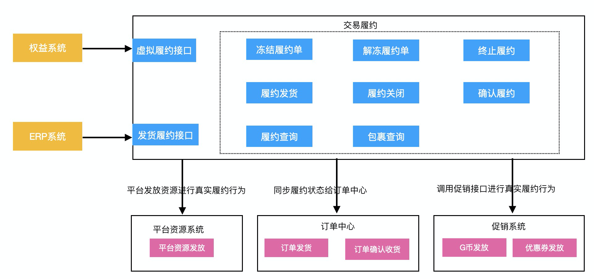

##交易履约业务

### 一、项目背景

目前履约系统只支持真实商品维度。不能支持平台类虚拟商品，不如电子卡券, G币, 优惠券等虚拟商品的履约。这部分履约行为目前拆分在其他各个系统，不易管理。另外，随着公司后期业务不断扩大，每新增一种虚拟类型商品就需要建立独立履约流程，这部分代码大部分都是重复，唯一的区别就是履约行为不同。所以需要一套能够承载虚拟履约和真实履约的系统，把通用履约部分抽取出并且把变化点抽象出来。


### 二、总体方案

##### 1. 系统交互图



**实物商品履约过程**：需要发货给买家的物品 ==> 履约行为就是发货

**平台类虚拟商品履约过程**：电子卡券购买, 捕手G币充值, 虚拟履约。 ==> 接受支付消息然后平台履约

**第三方商品履约过程**：保险, 机票, 火车票, 酒店, 油卡充值, 电影票, 视频会员充值, 景区门票, 打车, 生活缴费, 日历价商品, 手机话费充值, 手机流量充值。==>  第三方系统对我们的买家进行真实履约【生成火车票，生成电影票等】，然后通过异步方式通知我们的权益中心。权益中心通过【事件或者调用履约接口的形式】同步履约状态，最后履约系统再同步订单状态为已发货或者确认收货。


#####2. 履约状态流转图


**状态说明：**

* **待发货：**买家支付订单，拆分成多个独立履约单。==>【待履约】

* **待发货冻结：**待发货的履约单中，买家发起退款。==>【冻结履约】

* **无需发货：**待发货的履约单，所有商品全部退款成功。==>【无需履约】

* **已发货：**卖家进行履约行为【可以是发货，发码等】==> 【卖家开始履约】

* **已关闭：**买家在商家履约发起后，未确认履约完毕。进行商品全部退款  ==> 【买家终止履约流程】

* **已收货：**买家确认商家履约行为【手动确认 或者 超时自动确认 】 ==> 【买家确认已履约】


**状态流转动作：**

* 拆分履约单：确定单个履约职责，买卖家确认合同。
* 冻结履约单：买家通过发起退款方式来暂停合同。卖家不确定是否还需要履行合同
* 解冻履约：买卖家退款协商成功，重新拟定履约合同。
* 终止履约：买卖家在发货前通过全部退款的形式，来终止合同。
* 关闭履约：买家在卖家单方面履约后，已退款形式来结束合同。
* 买家确认履约：买家主动确认合同履行完毕，履约结束。
* 平台履约：无需买家确认是否履约完成。


### 三、具体设计

#### 1. 数据模型设计

**ER图设计**：


**履约单表(consign_order)**：相当于1个履约合同。店铺级订单根据一定逻辑拆分。[已存在]

**履约单sku表(consign_order_sku)**：每个履约合同里面的对应的sku。[已存在]

**履约包裹表(consign_package)**：实物订单履约发货产生对应的物流。[已存在]

**虚拟履约表(virtual_consign_record)**：虚拟商品履约产生对应的记录。

* businessNo字段：虚拟履约唯一标识，用于幂等校验和关联三方业务。
* type字段：虚拟履约类型
* consign_time：履约时间
* extra：特性字段-json，包含各虚拟履约特有属性。

```sql
CREATE TABLE `virtual_consign_record` (
  `id` bigint(20) NOT NULL AUTO_INCREMENT BY GROUP,
  `business_no` varchar(32) NOT NULL COMMENT '虚拟履约唯一标识',
  `seller_shop_id` bigint(19) NOT NULL COMMENT '店铺id',
  `consign_code` varchar(32) NOT NULL DEFAULT '' COMMENT '履约单号',
  `type` tinyint(3) unsigned NOT NULL DEFAULT '0' COMMENT '是否手工单：0:否 1:是',
  `consign_time` datetime DEFAULT NULL COMMENT '履约时间',
  `environment` varchar(8) NOT NULL COMMENT '订单所属环境',
  `extra` varchar(1024) DEFAULT NULL COMMENT '扩展信息字段',
  `version` int(11) DEFAULT '0' COMMENT 'sync version lock',
  `create_time` datetime NOT NULL DEFAULT CURRENT_TIMESTAMP COMMENT '创建时间',
  `update_time` datetime NOT NULL DEFAULT CURRENT_TIMESTAMP ON UPDATE CURRENT_TIMESTAMP COMMENT '更新时间',
  PRIMARY KEY (`id`),
  KEY `idx_create_time` (`create_time`),
  KEY `idx_shop_consign` (`seller_shop_id`,`consign_code`),
  KEY `idx_create_time` (`create_time`),
  KEY `idx_update_time` (`update_time`),
  UNIQUE `uq_business` (`business_no`)
) ENGINE=InnoDB  DEFAULT CHARSET=utf8mb4  dbpartition by hash(`seller_shop_id`) tbpartition by hash(`seller_shop_id`) tbpartitions 128
```


#### 2. 接口设计


#### 3. 功能点实现

**履约核心【稳定点】：**冻结履约单；解冻履约单；终止履约单；关闭履约

**履约变化点【扩展点】：**

* 抽象拆单行为：实物订单根据发货地拆单，虚拟商品一般是1个店铺级订单对应一个履约单；
* 抽象履约行为：实物订单的履约行为是发货，电影票是出票等。
* 抽象确认履约行为：可以更新履约单状态；也可以是空操作。


#### 4. 与外部系统的交互

**权益系统：**第三方履约后需要调用系统进行同步状态。

**平台类虚拟资源服务**：调用coin-center，promotion-platform, 卡券等服务，完成对应履约。


### 四、大概排期计划

| 内容                                                         | 工时     | 日期                    |
| :----------------------------------------------------------- | :------- | :---------------------- |
| 技术方案设计<br /> i). 技术方案详细设计和评审 <br /> ii). 补充接口设计文档 | 3人/日   | 2020.03.11- 2020.03.13  |
| 代码实现<br />1. 实现虚拟履约模型<br />2. 重构实物履约代码，整理逻辑到现有虚拟履约模型中<br />3. 历史虚拟订单履约代码，需要收拢履约系统中。 | 12人/日  | 2020.03.xx - 2020.04.xx |
| 提交测试                                                     | 3人/日   | 2020.04.xx - 2020.03.xx |
| 发布上线                                                     | 0.5人/日 | 2020.04.xx - 2020.03.xx |


### 五、风险点

**可能存在的问题**：虚拟履约的功能是在现有系统之上进行扩展的，所以下游系统可能需要感知虚拟商品履约单。因为目前默认的履约行为是发送包裹，对于虚拟履约行为的单子没有通过类型过滤。

**存在的难点**：目前平台类虚拟商品履约行为在订单中心做了，还有很多已经上线的第三方商品【保险, 机票,等】履约行为在权益内部做了。这部分逻辑进行收拢可能需要整理很长时间，还得权益业务方配合。

