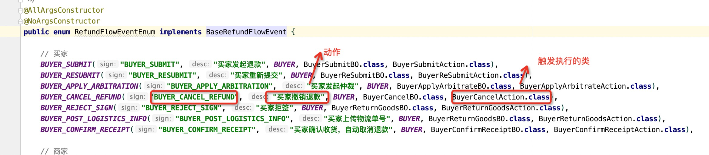

### 交易逆向文档

#### 业务流程逻辑

##### 退款类型

* 代发货仅退款：
* 已发货仅退款：
* 退货退款：

说明：全退逻辑：退款数量【默认策略】 + 退款金额【权益类业务在使用】

##### 退款状态

* 退款状态说明：主状态【RefundStatusEnum】 + 子状态【RefundStatusExtEnum】 ==> 使用spring 状态机来维护状态流转

* 退款状态流转配置：RefundFlowConfig【买家状态，卖家状态，系统状态】

  

##### 退款消息/超时域： 

* 退款流程中很多节点都有自动超时时间【具体见RefundFlowTagEnum，每个流程的超时时间】  。可以使用超时消息触发超时默认逻辑
* 消费确认收货消息：发送消息reverse_end处理消息【逆向完结时间，这个时间后不能进行退款】，默认10天，可配置【@闹闹】
* 退款创建/ 取消 / 成功消息：标识主订单是否进行退款状态 ，如果全部退款需要更新订单关闭状态。修改逆向完结状态
* 逆向完结消息：更新订单逆向完结状态。订单处于退款流程中，对应商品级订单不会进入逆向完结状态，退款成功或者取消时候，修改逆向完结状态。【逆向完结状态作为结算时间节点】

##### 退款金额明细

* 退款金额 = 买家实付 + 运费 + 平台出资优惠（优惠券 + 会员优惠 + G币）= 商家实收

* 资金明细计算逻辑：45 = 20 + 10 + 10 + 5 + 10

  > 申请金额：10
  > 
  >
  > G币返还：(10 / 35) * 10
  >
  > 平台回收优惠券优惠：(10 / 35) * 5
  >
  > 平台回收会员优惠：(10 / 35) * 10
  >
  > 退还现金：10 -G币返还 - 平台回收优惠券优惠 - 平台回收会员优惠

运费退款：未发货全部退款，最后一笔商品级订单退款成功时，需要退运费。

平台优惠券退款：当用户支付级订单整单退款之后返还平台优惠券，否则不返还。

#### 数据库模型设计

refund ==> 退款主表，商品级订单维度

refund_detail ==> 退款资金明细，退款金额中包含的具体资金成分。【退还现金，退还G币，退还平台优惠】

refund_flow_instance ==> 退款状态机实例，保存每个退款单号目前处于状态。【spring状态机通过这个记录来恢复状态】

refund_flow_log ==> 退款状态机变更日志。记录每一个流程变化。

transaction_compensate_log ==> 日志补偿日志表。商家同意退款后插入日志表，后置处理器进行真实退款，退款成功后会删除对应日志表。如果退款资源失败，有定时器会扫描这张表进行兜底。

#### 业务模型设计

##### spring状态机原理

**状态机创建入口**：StateEngineService#createStateEngine / StateEngineService#getStateEngine ==> 通过refund_flow_instance 中的记录来恢复退还状态。因为状态机是单机内存状态，所以需要在数据库中保存全局状态。

**事件发送入口：**RefundFlowBusiness#triggerInFlowEvent  ==> StateEngine#sendEvent

**状态机拦截器【PersistingStateChangeInterceptor】**

* preEvent ==> EventMsg 设置到StateEngineContext状态机上下文中

* ... 中间执行内存中的转移。【跑StateEngine#sendEvent方法】

* postStateChange ==> 内存中的状态跑完，真正进入核心业务逻辑执行。

  > 1. 执行事件过渡的action方法：FlowActionAdapter#process 【具体Action由事件过渡配置决定， 如BuyerCancelAction.class】
  >    具体见：RefundFlowEventEnum
  >
  > 
  >
  > 
  >
  > 2. 事件执行器执行完成后，记录退款事件日志和 创建或者更新状态机实例状态。
  >
  > 
  >
  > 3. 执行事件后置操作，如发送push和短信：FlowActionAdapter#postProcess 。
  >
  >    可以重写进行增强。如：AgreeRefundOnlyApplyAction【除了发短信，还需要进行退款操作】
  >
  >    消息模板：message.xml【退款状态变更，触发对应短信的具体配置】

##### 买家端业务

买家端创建并执行订单退款功能：http://wiki.ops.yangege.cn/pages/viewpage.action?pageId=12233169

- 预提交：透出退款支持的退款方式，最大退款金额，退款金额是否可以修改，退款数量，退款数量是否可修改，退款商品信息等
- 提交退款：创建一笔待处理退款【计算资金明细】
- 重新提交退款：重新预览，并提交一笔待处理退款。【重置资金明细】
- 撤销退款：撤销一笔待处理退款
- 物流选择：退货的时候，需要提交物流信息，会提供给用户一个常用的物流渠道待选列表
- 退货，提交物流：提交退货的物流信息，买家退货需要自己发一个快递到商家发货地
- 退货，拒签：买家可以在收到物流快递时，拒绝签收，由物流系统自己将包裹退会到发货地
- 退款列表：分页展示买家历史有所退款（平台化以后数据）
- 退款详情：展示处理各个退款流程的退款详情，详情核心包括：退款流程进度条、退款可操作按钮、商品信息、当前状态等

接口文档：https://apigwtest.myzebravip.com/refund/api/doc.html

##### 商家端

商家端可以检索、处理买家提交退款：http://wiki.ops.yangege.cn/pages/viewpage.action?pageId=12233169

- 退款搜索 & 列表：提供常用纬度的搜索，提供常用字段的列表分页展示
- 退款详情：展示一次退款的详细信息，包括商品信息、各方协商日志、流程进度条、退款操作按钮
- 退款操作，审核：审核是否同意买家提交退款
- 退款操作，退货确认收货：审核是否确认收到买家退货的包裹，并确认无误，同意退款

接口文档：SellerRefundWebApi

##### 运营客服端

客服端可以检索退款、创建退款、仲裁介入

- 订单详情：提供对商品级订单进行退款预览、创建退款
- 订单退款记录，提供对退款记录介入仲裁

接口文档：AdminRefundWebApi

