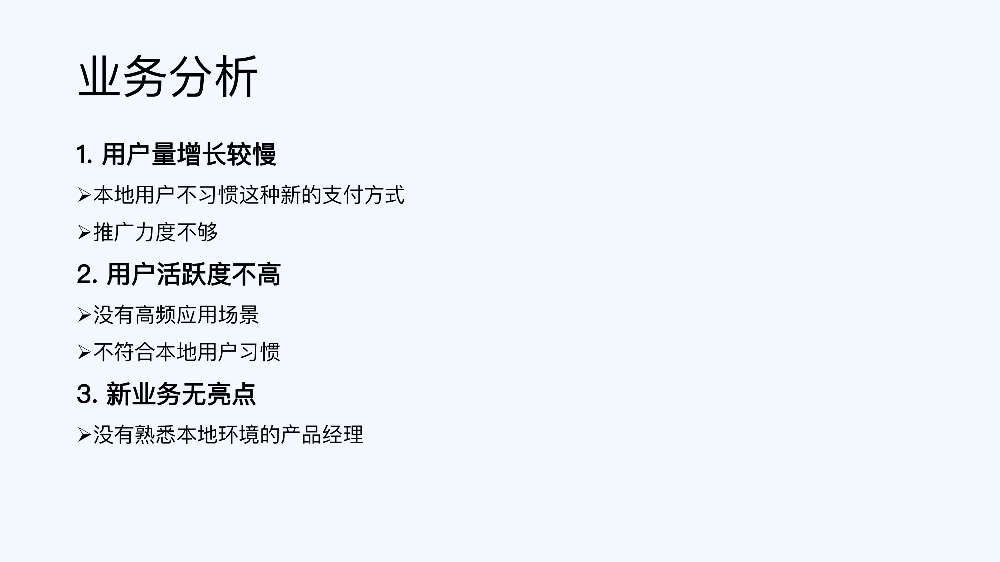

### 工作指南

#### 学习方法

原则：10000小时定律

学习时间：海绵学习法【分散时间 + 系统学习 】 ==> 通勤 + 周末 + 睡前半小时

学习哪些内容：精通团队相关技术

1. 提升技术深度：what  ==> why ==> which
2. 拒绝生搬硬套大厂技术，盲目追求新技术【不成熟】

学习技巧：熟练使用 + 源码学习 + 教授给别人 + 写技术文档

#### 做事方法

**事前规划**

* **OKR 规划法**：英特尔提出、谷歌发扬光大的方法，通过合理地设定目标和分解关键成果来弥补 KPI 的缺陷，用于制定工作规划。OKR 规划不同于传统 KPI 规划，更加注重聚焦和逻辑，你可以理解为“OKR 方法教你如何制定牛逼的 KPI”。

  > 程序员的工作怎么量化？怎么体现工作贡献？ ==> 解决问题，优化性能，引入新技术
  >
  > O [Objectives]：目标 ==> 我要做成什么事情。
  >
  > KR [key result]：关键成果 ==>包含 kpi指标【量化-2021年新增用户5000W】；里程碑【xxxx时间开发出撒，xxx业务上线】
  >
  > 说明：通过数据指标来实现业务目标，业务目标是一系列指标达成而期待实现的结果。
  >
  > 
  >
  >
  > 阶段一：业务规划：聚焦业务目标  ===  分解关键结果（KR）
  >
  > 阶段二：团队规划：对齐业务 OKR  ===  补充专业 OKR 
  >
  > 举例：
  > O：总用户数达到行业第一
  >
  > KR1：新增用户数 2000 万
  >
  > KR2：投入资金不超过 1 亿
  >
  > KR3：新用户月留存率不低于 40%
  >
  > 
  >
  > O1：优化技术指标，提升用户体验
  >
  > O2：保证关键业务和功能上线

**事中执行**

* **3C 方案设计法：**通过制定多个备选方案来系统地分析事情相关的方方面面，避免思维狭隘，用于设计合理的落地方案。

* **PDCA 执行法：**通过四个环节的循环来把控执行过程，保证具体事项高效高质地落地，用于推进事情的执行。

  > 计划（Plan）：确定具体任务、阶段目标、时间节点和具体责任人。【技术方案产出，工作内容拆解】
  >
  > 执行（Do）：按照计划落地各项具体的活动，比如技术人员完成方案设计、编码和测试等工作
  >
  > 检查（Check）：对照计划来检查实际执行结果，明确哪些符合预期、哪些不达预期、哪些超出预期以及存在什么问题等
  >
  > 行动（Act）：基于检查的结果，总结经验和教训，明确下一步需要采取的措施。

* **5W 根因分析法：**丰田集团提出的方法，又叫“丰田五问法”，通过五个为什么来深挖问题本质，用于分析根本原因。

**事后总结**

* **4D 总结法：**通过四个维度来整理做事的收获，能够帮助你在完成任务后进一步全方位地提升自己的能力，用于事后总结。

  > D1结果：业务结果【日活，月活，增长率】，技术优化价值，管理质量效率【业务支撑】	
  >
  > D2数据：用数据展示结果，例如用户活跃从90%-95%，开发效率提升5%
  >
  > D3技术：说清楚问题，和技术解决问题过程
  >
  > D4成长：业务理解能力，项目组织能力，团队管理能力，沟通能力，做事方法

* **金字塔汇报法：**参考麦肯锡的金字塔原理所提出的方法，通过遵循四个原则来展示工作成果，从而更容易获得高级别管理人员的认可，用于事后汇报。

  

  > 1. 总体结论：团队  + 业务
  >
  > 
  >
  > 
  >
  > 
  >
  > 具体分析：对结论提供数据和证据
  >
  > 
  >
  > 
  >
  > 
  >
  > 
  >
  > 关键事项：全局大图  +  演进路径  + 时间轴
  >
  > 
  >
  > 
  >
  > 
  >
  > 总结改进：团队 + 业务 + 技术 
  >
  > 
  >
  > 

* **四线复盘法：**通过四个角度来复盘重大问题，达到公平公正的处理效果，避免背锅和甩锅，用于重大问题发生后的复盘改进。

  > 第一条线：时间线 ==> 问题发生的经过，包括问题发现、问题处理过程中采取的各种关键措施、问题恢复的时间和问题影响的结果
  >
  > 
  >
  > 
  > 
  >
  > 第二条线：问题链 ==> 问题的传导路径。【业务流程和项目流程】
  >
  > 
  >
  > 
  > 
  >
  > 第三条线：责任链 ==> 明确责任链，也就是问题责任人之间的关系：违反公司规章 / 制度 / 流程的承担主责；出现重大纰漏的承担主责；问题源头承担主责；问题放大者承担主责
  >
  > 
  >
  > 
  > 
  >
  > 第四条线：改进线 ==> 改进责任人是指负责落实改进措施的人.
  >
  > 

#### 业务技巧

##### 关注业务整体

* 用户特征：我们的用户是谁？按照属性和场景进行划分。  ==>  知道行业用户规模，我们的用户规模，用户特征分布

* 用户价值：用户为什么用我们的产品？【淘宝？大而全，京东？ 物流快，拼多多？价格便宜】==> 知道行业竞品，排名以及竞品之间的差异和对比等内容

* 获客方式：怎样让用户来用我们的产品【广告？社交？营销？SEO? 线下地推？ 红包返利？】==> 常见获客手段和效果指标【ROI，转换率，留存率】

* 获利方式：我们怎么赚钱？广告费？会员费？增值服务？服务费？销售产品？ ==> 知道常见的3-5个获利来源和效果指标（数值和比例）

##### 5W1H8C1D分析法

* 第一个 W 是 When，代表和时间相关的信息：季节信息，日期信息，作息信息
* 第 2 个 W 是 Where，代表和地点相关的信息：国家，室内室外，交通工具
* 第 3 个 W 是 Who，代表和参与者相关的信息：投资者，使用者，监督者，交互者
* 第 4 个 W 是 What，代表客户想要的输出结果，们看到的最原始的需求。
* 第 5 个 W 是 Why，代表客户遇到的问题。
* H 代表 How，也就是如何，How 不是指设计方案，而是指业务需求的处理逻辑
* 8C 关注的是需求的质量属性：性能，成本，时间，客户指定技术，可靠性，安全性，合规性，兼容性
* D 代表 Data，也就是数据，反映了业务上线之后的效果（Result）：业务效果【DAU、MAU、活动参与人数、订单数、成交量、成交额和运营效率】，系统效果【峰值 TPS、接口性能、响应时间】

##### AARRR漏斗模型

AARRR 这 5 个字母分别代表 Acquisition、Activation、Retention、Revenue 和 Refer 五个英文单词，它们分别对应用户生命周期中的 5 个重要环节：获取（Acquisition）、激活（Activation）、留存（Retention）、收益（Revenue）和推荐（Refer）。AARRR 模型的核心就是以用户为中心，以完整的用户生命周期为指导思想，分析用户在各个环节的行为和数据，以此来发现用户需求以及产品需要改进的地方。

* 获取（Acquisition）：触达用户【广告，推荐，主播，社交推广】，吸引用户进入产品
* 激活（Activation）：把用户转化为产品的真实用户【新人优惠】
* 留存（Retention）：把激活用户转换为产品的长期用户【解决用户痛点，送优惠】
* 收益（Revenue）：将留存用户转换为收益【会员，广告，购买商品】
* 推荐（Refer）：通过以老带新的方式来实现用户增长

#### 管理方法

管理：整合团队的力量，突破单个个体的上限。

管理避免走极端：事必躬亲或者甩手掌柜

找好管理和技术的平衡点：三七比例法 ==> 30%用于管理，70%用于技术工作。

##### 管理四象限

管理的核心原则：要事优先

**团队构建：**如何打造符合业务发展需要的团队。

**团队运作：**过制定团队的标准流程和奖惩机制等，让团队成员做事更加规范、更有效率。

**团队考核：**确定每个团队成员的绩效。

**团队规划：**制定团队一定周期内的目标和主要事项【OKR】

**团队执行：**将团队规划的事项落地，包括人力安排、时间安排、进度跟踪和问题处理等。【PACD】

**团队汇报：**归纳总结团队的工作情况，将信息反馈给上级。【金字塔汇报】

**团队建设：**通过举行各种形式的活动来增强团队成员的团队意识和协作精神，让团队成员相互之间更加了解和信任，同时释放工作压力。

**团队培养：**团队培养是指，通过各种手段提升团队成员的能力，让团队成员既能够更好的完成工作任务，也能够逐步晋升到更高的级别。

**团队鼓励：**激发团队成员的潜能和战斗力，让团队更有激情和效率。

**风险管理：**提前识别可能出现的问题，并采取预防措施。【项目进度】

**问题处理：**解决团队已经发生的各种问题，比如人员变动、团队成员之间有矛盾、项目延迟和线上出现严重事故等。

**资源协调：**申请各种团队需要的资源。

##### 管理五模式

**独裁式：**管理者直接指定下属或团队的具体工作，包括做什么事、怎么做、什么时候做和输出什么结果等，全都一一明确，团队成员不能提出不同意见和方案。使用于紧急场景。

**明主式：**管理者组织团队成员针对某项工作进行讨论，然后和团队成员一起选出最终的方案。管理者的意见并不是优先级最高的，团队通常采用集体投票的方式来做决策。使用于不紧急，但是团队成员息息相关。

**专家式：**管理者作为某方面的专家，组织团队成员针对某项工作进行讨论，并由团队成员来做决策，选出最终的方案；管理者不参与决策，只是在讨论的过程中提供专业指导。领域相关的专业工作

**教练式：**管理者作为某方面的专家，组织团队成员针对某项工作进行讨论，然后自己做决策，选出最终的方案；团队成员不参与决策。

**授权式：**管理者把某项工作全权授权给指定人员，由被授权者来做决策，管理者在任务执行过程中的关键节点进行监督。适用培养核心人员

#### 晋升指导

#####晋升流程

* 提名阶段：主管决定要不要提名你去参加晋升。[绩效条件, 年限条件, 红线条件,]
* 预审阶段：部门对提名的名单进行预审，如果你跟其他竞争者 PK 失败，就失去了晋升机会。
* 评审阶段：评委团对你进行评审，考察你的能力有没有满足要求。[准备材料, 晋升自诉, 晋升答辩, 评委判定]
* 复审阶段：部门对评审结果进行复审，确认你的晋升结果。
* 审批阶段：复审的结果上报高层审批，审批通过之后，你的晋升结果就最终确定了。
* 沟通阶段：主管或 HR 跟你沟通晋升结果。

##### 面评技巧

**晋升PPT框架**

* 自我介绍1~2页：基本信息 [姓名、所在团队和业务、当前级别] + 当前职责[项目负责人、系统 owner] + 工作经历
* 自诉材料10-15页：金字塔汇报法。1 个中心主题【我达到xxx级别】，设计 3～5 个核心论据【star法则】
* 辅助内容1~3页：自我总结，发展规划

**PPT写作技巧**

* 技巧一：把 PPT 当成提词器，而不是讲话稿。

* 技巧二：围绕能力要求提炼论据

* 技巧三：用 STAR 方法来描述论据：背景(提炼关键词) +  任务【我做了什么？系统架构图】 + 行动【架构图、流程图、类图和思维导图】+ 结果【效率、效果、质量和成本】 ==> 先有基数后有比例，绝对值而不是相对值，将数值转换为“钱"

  

  

**PPT讲解技巧**

* 经验一：做一个演讲者，而不是一台复读机
* 经验二：有效页 1～3 分钟，总时间 20～30 分钟
* 经验三：自述讲 What，答辩讲 Why。也就是事实部分，我们做了什么；
* 经验四：无论多忙都要安排模拟面评

**晋升答辩技巧**

* 明确问题类型，回答关键内容  what类问题 ==> 【做了什么事情 + 拿到什么结果】；How 类问题 ==> 【做事情的方法 + 实施的步骤】

  Why 类问题==> 【技术原理 + 思考过程】

* 答不上来就想办法回到熟悉的领域
* 发生争执就及时终止话题

