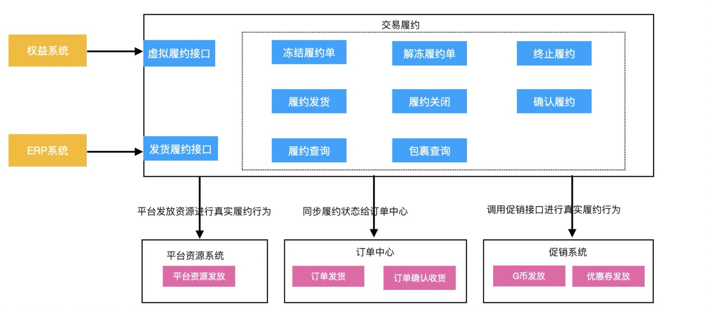

###  [技术方案模板2 （偏需求型）]

#### 一、需求或者项目背景简介

##### 1、需求介绍

这里需要根据自己的理解，从技术的角度把产品或者运营的需求总结下。可以附上原始的需求文档地址

##### 2、用例分析

分析项目或者需求的使用场景，主要是使用人员、或者与其他系统的交互情况，最好以用例图的形式来展示

#### 二、总体方案

给出项目或者需求的总体方案，包括但不限于涉及到的系统、影响的业务链路、技术难点等，可以通过文字来介绍，最好配上架构图、流程图等，便于理解和交流【流程图 + 系统架构图】

**流程图**：梳理业务流程，可以拷贝产品画的图


**系统架构图**



**实物商品履约过程**：需要发货给买家的物品 ==> 履约行为就是发货

**平台类虚拟商品履约过程**：电子卡券购买, 捕手G币充值, 虚拟履约。 ==> 接受支付消息然后平台履约

**第三方商品履约过程**：保险, 机票, 火车票, 酒店, 油卡充值, 电影票, 视频会员充值, 景区门票, 打车, 生活缴费, 日历价商品, 手机话费充值, 手机流量充值。==> 第三方系统对我们的买家进行真实履约【生成火车票，生成电影票等】，然后通过异步方式通知我们的权益中心。权益中心通过【事件或者调用履约接口的形式】同步履约状态，最后履约系统再同步订单状态为已发货或者确认收货。

​	

#### 三、具体设计

##### 1、数据模型设计（表结构设计）

如果涉及到新增领域模型，或者需要新增一些关联关系，这部分很关键。需要体现出领域模型之间的关系，比如使用E-R图等


```sql
CREATE TABLE `virtual_consign_record` (
 `id` bigint(20) NOT NULL AUTO_INCREMENT BY GROUP,
 `business_no` varchar(32) NOT NULL COMMENT '虚拟履约唯一标识',
 `seller_shop_id` bigint NOT NULL COMMENT '店铺id',
 `consign_code` varchar(32) NOT NULL DEFAULT '' COMMENT '履约单号',
 `type` int unsigned NOT NULL DEFAULT '0' COMMENT '虚拟履约单类型',
 `environment` varchar(8) NOT NULL COMMENT '订单所属环境',
 `extra` varchar(1024) DEFAULT NULL COMMENT '扩展信息字段',
 `version` int(11) DEFAULT '0' COMMENT 'sync version lock',
 `create_time` datetime NOT NULL DEFAULT CURRENT_TIMESTAMP COMMENT '创建时间',
 `update_time` datetime NOT NULL DEFAULT CURRENT_TIMESTAMP ON UPDATE CURRENT_TIMESTAMP COMMENT '更新时间',
 PRIMARY KEY (`id`),
 KEY `idx_shop_consign` (`seller_shop_id`,`consign_code`),
 KEY `idx_create_time` (`create_time`),
 KEY `idx_update_time` (`update_time`),
 UNIQUE `uk_business` (`business_no`)
) ENGINE=InnoDB COMMENT='虚拟履约表' DEFAULT CHARSET=utf8mb4 dbpartition by hash(`seller_shop_id`) tbpartition by hash(`seller_shop_id`) tbpartitions 128
```


##### 2、接口设计

如果要新增RPC服务接口或者http接口，或者修改原有接口等，需要这部分内容，可以链接到具体的接口文档

dubbo接口：指定dubbo 接口GAV坐标；核心读写接口功能进行说明 ==> 细节见java api doc

http接口：指定测试环境swagger地址 ==> 核心controller进行说明


##### 3、功能点实现

涉及到业务逻辑代码改动的，需要明确改动点，务必确保改动点和影响范围心中有数。如果可以的话，建议配上流程图或者类图、时序图、状态图等UML图


**状态流程图**


**状态说明：**

- **待发货：**买家支付订单，拆分成多个独立履约单。==>【待履约】
- **待发货冻结：**待发货的履约单中，买家发起退款。==>【冻结履约】
- **无需发货：**待发货的履约单，所有商品全部退款成功。==>【无需履约】
- **已发货：**卖家进行履约行为【可以是发货，发码等】==> 【卖家开始履约】
- **已关闭：**买家在商家履约发起后，未确认履约完毕。进行商品全部退款 ==> 【买家终止履约流程】
- **已收货：**买家确认商家履约行为【手动确认 或者 超时自动确认 】 ==> 【买家确认已履约】


**状态流转动作：**

- 拆分履约单：确定单个履约职责，买卖家确认合同。
- 冻结履约单：买家通过发起退款方式来暂停合同。卖家不确定是否还需要履行合同
- 解冻履约：买卖家退款协商成功，重新拟定履约合同。
- 终止履约：买卖家在发货前通过全部退款的形式，来终止合同。
- 关闭履约：买家在卖家单方面履约后，已退款形式来结束合同。
- 买家确认履约：买家主动确认合同履行完毕，履约结束。
- 平台履约：无需买家确认是否履约完成。


##### 4、与外部系统的交互

1、如果涉及到和外部系统交互方面的修改，比如交互方式、数据格式等，也需要说明

2、需要其他系统提供接口的，也需要在此说明


**1、权益业务（@焱非）**

- 监听消息变更：由原来监听订单支付消息改成监听履约单待履约消息。
- ...

**2、交易订单中心（@无尘）**

- 订单履约状态修改：去除履约单修改逻辑，由履约系统负责状态变更。
- ...

**3、交易消息系统 （@无忌）**

- 增加虚拟履约单消息 - 供下游业务方消费

- ...

  


#### 四、大概排期计划


 

#### 五、风险点（如果有的话）


